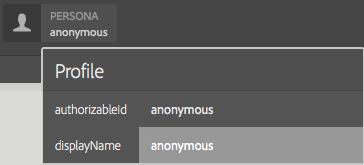

# Tipi di modulo dell’interfaccia utente di ContextHub di esempio {#sample-contexthub-ui-module-types}

ContextHub fornisce diversi moduli di interfaccia utente di esempio che puoi utilizzare nelle soluzioni. Vengono fornite le seguenti informazioni:

* Le funzioni principali del modulo dell’interfaccia utente.
* Dove trovare il codice sorgente in modo da poterlo aprire a scopo di apprendimento.
* Come configurare il modulo UI.

Per informazioni sull&#39;aggiunta di moduli UI a ContextHub, vedere [Aggiunta di un modulo UI](configuring-contexthub.md#adding-a-ui-module). Per informazioni sullo sviluppo di moduli di interfaccia utente, vedere [Creazione di tipi di moduli di interfaccia utente ContextHub](extending-contexthub.md#creating-contexthub-ui-module-types).

## Tipo di modulo dell’interfaccia utente contexthub.base {#contexthub-base-ui-module-type}

Il tipo di modulo dell’interfaccia utente contexthub.base è il tipo di base per tutti gli altri tipi di modulo dell’interfaccia utente. Fornisce funzioni generiche per il rendering dei dati dell&#39;archivio.

Sono disponibili le seguenti funzioni:

* **Titolo e icona:** Specifica un titolo per il modulo dell&#39;interfaccia utente e un&#39;icona. È possibile fare riferimento all’icona utilizzando un URL o dalla libreria delle icone dell’interfaccia utente Coral.
* **Archivia dati:** Identifica uno o più archivi da cui recuperare i dati.
* **Contenuto:** Specifica il contenuto visualizzato nel modulo dell&#39;interfaccia utente così come viene visualizzato nella barra degli strumenti di ContextHub.
* **Contenuto popover:** Specifica il contenuto visualizzato in un popover quando si fa clic o si tocca il modulo dell&#39;interfaccia utente.
* **Modalità a schermo intero:** Controlla se è consentita la modalità a schermo intero.

Codice sorgente in `/libs/granite/contexthub/code/ui/container/js/ContextHub.UI.BaseModuleRenderer.js`.

### Configurazione {#configuration}

Configura il modulo dell’interfaccia utente contexthub.base utilizzando un oggetto JavaScript in formato JSON. Includi una delle seguenti proprietà per configurare le funzioni del modulo dell’interfaccia utente:

* **immagine:** URL di un&#39;immagine da visualizzare come icona.
* **icon:** il nome di una classe di [Icona interfaccia utente Coral](https://opensource.adobe.com/coral-spectrum/examples/#icon). Se specificate un valore sia per la proprietà icona che per quella immagine, viene utilizzata l&#39;immagine.
* **titolo:** Titolo per il modulo dell&#39;interfaccia utente. Il titolo viene visualizzato quando si posiziona il puntatore sull&#39;icona del modulo dell&#39;interfaccia utente.
* **a schermo intero:** valore booleano che indica se il modulo dell&#39;interfaccia utente supporta la modalità a schermo intero. Utilizza `true` per supportare la modalità a schermo intero e `false` per impedire la modalità a schermo intero.
* **modello:** modello [Handlebars](https://handlebarsjs.com/) che specifica il contenuto da riprodurre nella barra degli strumenti di ContextHub. Utilizzare al massimo due tag `<p>`.
* **storeMapping:** Mapping chiave/archivio. Utilizza la chiave nei modelli Handlebar per accedere ai dati store ContextHub associati.
* **elenco:** array di elementi da visualizzare come elenco in un popover quando si fa clic sul modulo dell&#39;interfaccia utente. Se si include questo elemento, non includere popoverTemplate. Il valore è un array di oggetti con le seguenti chiavi:
   * Titolo: testo da visualizzare per questo elemento
   * image: (facoltativo) URL di un’immagine che deve essere visualizzata a sinistra
   * icon: (facoltativo) classe di icone CUI da visualizzare a sinistra; ignorata se è specificata un&#39;immagine
   * selected: (facoltativo) valore booleano che specifica se l&#39;elemento deve essere visualizzato come selezionato (true=selected). Per impostazione predefinita, gli elementi selezionati vengono visualizzati in grassetto. Utilizzare una proprietà `listType` per configurare altri aspetti (vedere di seguito).
* **listType:** stile da utilizzare per gli elementi dell&#39;elenco popover. Utilizza uno dei seguenti valori:
   * segno di spunta
   * checkbox
   * radio
* **popoverTemplate:** modello Handlebars che specifica il contenuto da riprodurre nel popover quando si fa clic sul modulo dell&#39;interfaccia utente. Se si include questo elemento, non includere l&#39;elemento `list`.

### Esempio {#example}

Nell&#39;esempio seguente viene configurato un modulo dell&#39;interfaccia utente c`ontexthub.base` per visualizzare informazioni da un archivio [contexthub.emulators](sample-stores.md#granite-emulators-sample-store-candidate). L&#39;elemento `template` illustra come ottenere dati dall&#39;archivio utilizzando la chiave stabilita dall&#39;elemento `storeMapping`.

```javascript
{
   "icon": "coral-Icon--move",
    "title": "Screen Resolution",
    "storeMapping": {
      "emulator": "emulators"
    },
    "template": "<p>{{{ i18n \"Resolution\"}}}</p><p>{{{emulator.currentDevice.width}}} x {{{emulator.currentDevice.height}}}</p>"
}
```


## Tipo di modulo interfaccia utente contexthub.browserinfo {#contexthub-browserinfo-ui-module-type}

Il modulo dell&#39;interfaccia utente `contexthub.browserinfo` visualizza informazioni sul browser Web client e sul sistema operativo. Le informazioni vengono ottenute dall&#39;archivio surferinfo in base al candidato dell&#39;archivio [contexthub.surferinfo](sample-stores.md#contexthub-surferinfo-sample-store-candidate).


Il codice sorgente del modulo dell&#39;interfaccia utente si trova in `/libs/granite/contexthub/components/modules/browserinfo`. Anche se `contexthub.browserinfo` estende il modulo dell&#39;interfaccia utente `contexthub.base`, non esegue l&#39;override né fornisce funzioni aggiuntive. L’implementazione fornisce una configurazione predefinita per il rendering delle informazioni del browser.

### Configurazione {#configuration-1}

Le istanze del modulo dell’interfaccia utente contexthub.browserinfo non richiedono un valore per Configurazione dettagli. Il seguente testo JSON rappresenta la configurazione predefinita del modulo.

```javascript
{
   "icon":"coral-Icon--globe",
   "title":"Browser/OS Information",
   "storeMapping":{"surferinfo":"surferinfo"},
   "template":"<p>{{surferinfo.browser.family}} {{surferinfo.browser.version}}</p><p>{{surferinfo.os.name}} {{surferinfo.os.version}}</p>"
}
```

## Tipo di modulo dell’interfaccia utente contexthub.datetime {#contexthub-datetime-ui-module-type}

Il modulo dell&#39;interfaccia utente `contexthub.datetime` visualizza la data e l&#39;ora memorizzate in un archivio denominato datetime basato sul candidato dell&#39;archivio `contexthub.datetime`.


Il modulo fornisce un modulo a comparsa che consente di modificare la data e l’ora nell’archivio.

L&#39;origine del modulo interfaccia utente `contexthub.datetime` si trova in `/libs/granite/contexthub/components/modules/datetime`.

### Configurazione {#configuration-2}

Le istanze del modulo dell’interfaccia utente contexthub.datetime non richiedono un valore per Configurazione dettagli. Il seguente testo JSON rappresenta la configurazione predefinita del modulo.

```javascript
{
   "icon":"coral-Icon--clock",
   "title":"DATE&TIME",
   "clickable":true,
   "storeMapping":{"d":"datetime"},
   "template":"<p class=\"contexthub-module-line1\">{{i18n \"Date&Time\"}}</p><p class=\"contexthub-module-line2\">{{d.formatted.locale.date}} {{d.formatted.locale.time}}</p>",
   "popoverTemplate":"<div class=\"datetime center\"><div class=\"coral-DatePicker-calendar\" data-init=\"datepicker\"><input class=\"coral-Textfield\" type=\"datetime\" value=\"{{d.formatted.iso}}\"><button class=\"coral-Button coral-Button--secondary coral-Button--square\" title=\"{{i18n \"Datetime picker\"}}\"><i class=\"coral-Icon coral-Icon--calendar coral-Icon--sizeS\"></i></button></div></div>"
}
```

## Tipo di modulo dell’interfaccia utente contexthub.location {#contexthub-location-ui-module-type}

Il modulo dell&#39;interfaccia utente `contexthub.location` visualizza la longitudine e la latitudine del client. Il modulo fornisce un elemento a comparsa che visualizza una mappa di Google su cui è possibile fare clic per modificare la posizione corrente. Il modulo ottiene informazioni da un archivio ContextHub denominato geolocation basato sul candidato dell&#39;archivio [contexthub.geolocation](sample-stores.md#contexthub-geolocation-sample-store-candidate).


L&#39;origine del modulo dell&#39;interfaccia utente si trova in `/etc/cloudsettings/default/contexthub/geolocation`.

### Configurazione {#configuration-4}

Le istanze del modulo dell’interfaccia utente contexthub.location non richiedono un valore per Configurazione dettagli. Il seguente testo JSON rappresenta la configurazione predefinita del modulo.

```javascript
{
 "icon":"coral-Icon--compass",
 "title":"Location",
 "clickable":true,
 "editable":{"key":"/geolocation","disabled":[],"hidden":["/geolocation/generatedThumbnail","/geolocation/city","/geolocation/country"]},
 "fullscreen":true,
 "storeMapping":{"g":"geolocation"},
 "template":"<p>{{i18n \"Location\"}}</p><p>{{g.address.postalCode}} {{g.address.city}}{{#if g.address.city}}{{#if g.address.region}},{{/if}}{{/if}} {{g.address.region}}</p>",
 "list":[
  {"title":"Basel, Switzerland",
  "data":{"longitude":7.58929,"latitude":47.554746,"city":"Basel","country":"Switzerland"}},
  {"title":"Melbourne, Australia",
  "data":{"longitude":144.96328,"latitude":-37.814107,"city":"Melbourne","country":"Australia"}},
  {"title":"Beijing, China",
  "data":{"longitude":116.407526,"latitude":39.90403,"city":"Beijing","country":"China"}},
  {"title":"New York, NY, USA",
  "data":{"longitude":-74.005973,"latitude":40.714353,"city":"New York","country":"United States"}},
  {"title":"Paris, France",
  "data":{"longitude":2.352222,"latitude":48.856614,"city":"Paris","country":"France"}},
  {"title":"Rio de Janeiro, Brazil",
  "data":{"longitude":-43.20071,"latitude":-22.913395,"city":"Rio","country":"Brazil"}},
  {"title":"San Jose, CA, USA",
  "data":{"longitude":-121.894955,"latitude":37.339386,"city":"San Jose","country":"United States"}},
  {"title":"Tokyo, Japan",
  "data":{"longitude":139.691706,"latitude":35.689487,"city":"Shinjuku","country":"Japan"}}
 ],
 "listType":"checkmark"
}
```

## Tipo di modulo dell’interfaccia utente orientato a contexthub.screen {#contexthub-screen-orientation-ui-module-type}

Il modulo dell&#39;interfaccia utente `contexthub.screen-orientation` visualizza l&#39;orientamento corrente dello schermo del client. Sebbene sia disattivato per impostazione predefinita, il modulo fornisce un elemento a comparsa che consente di selezionare un orientamento. Il modulo ottiene informazioni da un archivio ContextHub denominato emulatori basato sul candidato dell&#39;archivio [granite.emulators](sample-stores.md#granite-emulators-sample-store-candidate).


L&#39;origine del modulo dell&#39;interfaccia utente si trova in `/libs/granite/contexthub/components/modules/screen-orientation`.

### Configurazione {#configuration-5}

Le istanze del modulo dell&#39;interfaccia utente `contexthub.screen-orientation` non richiedono un valore per Configurazione dettagli. Il seguente testo JSON rappresenta la configurazione predefinita del modulo. La proprietà `clickable` è `false` per impostazione predefinita. Se si esegue l&#39;override della configurazione predefinita per impostare `clickable` su `true`, facendo clic sul modulo viene visualizzata una finestra popup in cui è possibile selezionare l&#39;orientamento.

```javascript
{
   "icon":"coral-Icon--rotateRight",
   "title":"Screen Orientation",
   "clickable":false,
   "storeMapping":{"emulator":"emulators"},
   "template":"<p>{{{ i18n \"Screen Orientation\" }}}</p><p>{{{ emulator.currentDevice.orientation }}}",
   "listReference":"/emulators/orientations",
   "listType":"checkmark"
}
```

## Tipo di modulo dell’interfaccia utente contexthub.tagcloud {#contexthub-tagcloud-ui-module-type}

Il modulo dell&#39;interfaccia utente `contexthub.tagcloud` visualizza informazioni sui tag. Sulla barra degli strumenti il modulo UI mostra il numero di tag. Il pop-up mostra un tagcloud e una casella di testo per aggiungere nuovi tag. Il modulo dell&#39;interfaccia utente ottiene informazioni da un archivio ContextHub denominato tagcloud basate sul candidato dell&#39;archivio `contexthub.tagcloud`.


L&#39;origine del modulo dell&#39;interfaccia utente si trova in `/libs/granite/contexthub/components/modules/tagcloud`.

### Configurazione {#configuration-6}

Le istanze del modulo dell&#39;interfaccia utente `contexthub.tagcloud` non richiedono un valore per Configurazione dettagli. Il seguente testo JSON rappresenta la configurazione predefinita del modulo.

```javascript
{
   "icon":"coral-Icon--tag",
   "title":"TagCloud",
   "clickable":true,
   "storeMapping":{"t":"tagcloud"},
   "maxTags":20,
   "template":"<p class=\"contexthub-module-line1\">{{i18n \"TagCloud\"}}</p><p class=\"contexthub-module-line2\">{{stats.total}} {{i18n \"Tags\"}}</p>",
   "popoverTemplate":"<div class=\"contexthub-popover-content center\"><p class=\"stats\">{{stats.total}} {{i18n \"Tags\"}} | {{stats.hits}} {{i18n \"Hits\"}} | {{i18n \"Last tag\"}}: {{#if stats.recent}}{{stats.recent}}{{else}}{{i18n \"Unknown\"}}{{/if}}</p><p class=\"tagcloud\">{{#each tags}}<span class=\"tag{{this.weight}}\">{{this.name}}</span> {{/each}}</p><div class=\"coral-InputGroup\"><input type=\"text\" class=\"coral-InputGroup-input coral-Textfield tag-name\" placeholder=\"{{i18n \"Add a namespace:my/tag\"}}\" pattern=\"^[A-Za-z0-9_\\-]+(:[A-Za-z0-9_\\-\\/]+)?$\" title=\"{{i18n \"namespace:my/tag\"}}\"><span class=\"coral-InputGroup-button\"><button class=\"coral-Button coral-Button--secondary coral-Button--square contexthub-new-tag\" type=\"button\" title=\"{{i18n \"increment\"}}\"><i class=\"coral-Icon coral-Icon--sizeS coral-Icon--add\"></i></button></span></div></div>"
}
```

## Tipo di modulo dell’interfaccia utente granite.profile {#granite-profile-ui-module-type}

Il modulo dell&#39;interfaccia utente ContextHub `granite.profile` visualizza il nome visualizzato dell&#39;utente corrente. Il pop-up mostra il nome di accesso dell&#39;utente e consente di modificare il valore del nome visualizzato. Il modulo di interfaccia utente ottiene informazioni da un archivio ContextHub denominato profile basato sul candidato dell&#39;archivio [granite.profile](sample-stores.md#granite-profile-sample-store-candidate).



L&#39;origine del modulo dell&#39;interfaccia utente è `/libs/granite/contexthub/components/modules/profile`.

### Configurazione {#configuration-7}

Le istanze del modulo dell&#39;interfaccia utente `granite.profile` non richiedono un valore per Configurazione dettagli. Il seguente testo JSON rappresenta la configurazione predefinita del modulo.

```javascript
{
   "icon":"coral-Icon--user",
   "title":"Profile",
   "clickable":true,
   "editable":{
      "key":"/profile",
      "disabled":["/profile/authorizableId"],
      "hidden":["/profile/avatar","/profile/path"]},
   "storeMapping":{"p":"profile"},
   "template":"<p class=\"contexthub-module-line1\">{{i18n \"Persona\"}}</p><p class=\"contexthub-module-line2\">{{p.displayName}}</p>",
   "listType":"checkmark"
}
```
