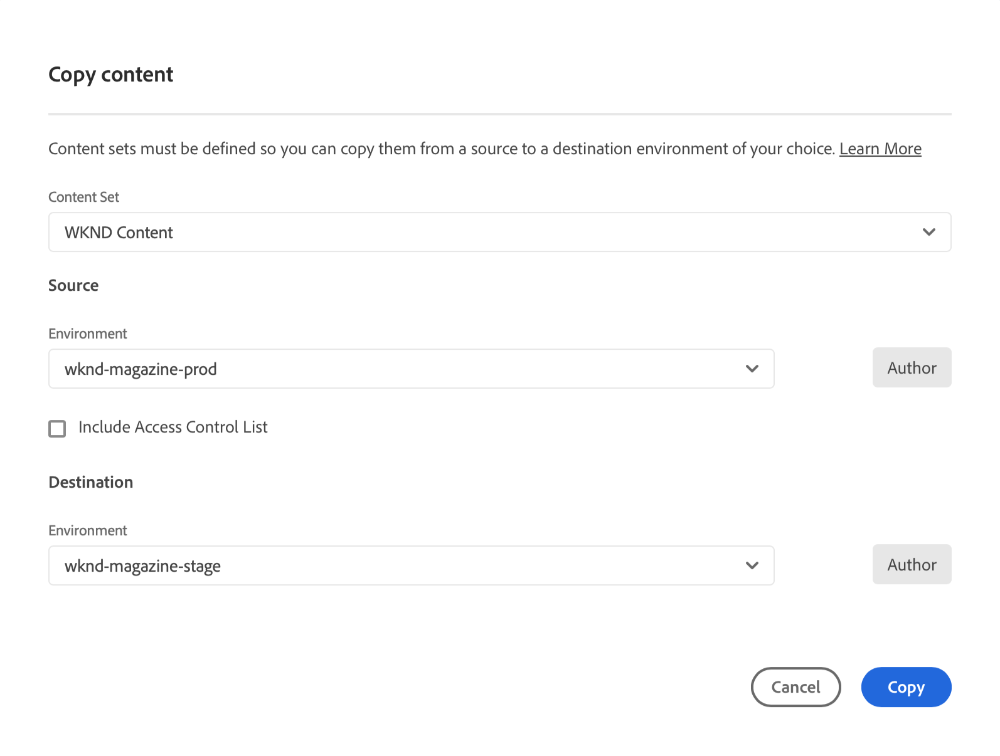

# Strumento Copia contenuto {#content-copy}

Lo strumento di copia dei contenuti consente agli utenti di copiare contenuti mutabili on-demand dai loro ambienti di produzione su AEM as a Cloud Service in ambienti più bassi a scopo di test.

## Introduzione {#introduction}

I dati attuali e reali sono utili a scopo di test, convalida e accettazione da parte degli utenti. Lo strumento di copia del contenuto consente di copiare il contenuto da un ambiente AEM as a Cloud Service di produzione a un ambiente di staging, sviluppo o [ambiente di sviluppo rapido (RDE)](/help/implementing/developing/introduction/rapid-development-environments.md) per tale test.

Il contenuto da copiare è definito da un set di contenuti. Un set di contenuti è costituito da un elenco di percorsi JCR che contengono il contenuto mutabile da copiare da un ambiente del servizio di authoring sorgente a un ambiente del servizio di authoring di destinazione all’interno dello stesso programma Cloud Manager. I percorsi seguenti sono consentiti in un set di contenuti.

```text
/content
/conf/**/settings/wcm
/conf/**/settings/dam/cfm/models
/conf/**/settings/graphql/persistentQueries
/etc/clientlibs/fd/themes
```

Durante la copia del contenuto, l’ambiente sorgente è l’origine di riferimento.

* Se il contenuto è stato modificato nell’ambiente di destinazione, viene sovrascritto dal contenuto nell’origine, se i percorsi sono gli stessi.
* Se i percorsi sono diversi, il contenuto dell’origine viene unito al contenuto della destinazione.

## Autorizzazioni {#permissions}

Per utilizzare lo strumento di copia del contenuto, sono necessarie determinate autorizzazioni sia nell’ambiente di origine che in quello di destinazione.

| Funzione Copia contenuto | Gruppo di amministratori di AEM | Ruolo Responsabile della distribuzione |
|---|---|---|
| Creare e modificare il [set di contenuti](#create-content-set) | Non obbligatorio | Obbligatorio |
| Avviare o annullare il [processo di copia del contenuto](#copy-content) | Obbligatorio | Obbligatorio |

Per ulteriori dettagli sulle autorizzazioni e su come impostarle, vedi [Profili team e prodotto di AEM as a Cloud Service](/help/onboarding/aem-cs-team-product-profiles.md).

## Creazione di un set di contenuti {#create-content-set}

Prima di poter copiare qualsiasi contenuto, è necessario definire un set di contenuti. Una volta definiti, i set di contenuti possono essere riutilizzati per copiare il contenuto. Per creare un set di contenuti, segui la procedura riportata di seguito.

1. Accedi a Cloud Manager all’indirizzo [my.cloudmanager.adobe.com](https://my.cloudmanager.adobe.com/) e seleziona l’organizzazione e il programma appropriati.

1. Utilizzando il pannello di navigazione laterale, passa alla scheda **Set di contenuti** dalla pagina **Panoramica**.

1. In alto a destra nella schermata, fai clic su **Aggiungi set di contenuti**.

   

1. Nella scheda **Dettagli** della procedura guidata, fornisci un nome e una descrizione per il set di contenuti e seleziona **Continua**.

   

1. Nella scheda **Percorsi del contenuto** della procedura guidata, specifica i percorsi del contenuto modificabile da includere nel set di contenuti.

   1. Immetti il percorso nel campo **Aggiungi percorso di inclusione**.
   1. Fai clic su **Aggiungi percorso** per aggiungere il percorso al set di contenuti.
   1. Se necessario, fai di nuovo clic su **Aggiungi percorso**.
      * Sono consentiti fino a 50 percorsi.

   

1. Se devi perfezionare o limitare il set di contenuti, i percorsi secondari possono essere esclusi.

   1. Nell&#39;elenco dei percorsi inclusi fare clic su **Aggiungi percorsi secondari di esclusione** accanto al percorso che si desidera limitare.
   1. Immettere il percorso secondario da escludere sotto il percorso selezionato.
   1. Selezionare **Escludi percorso**.
   1. Selezionare di nuovo **Aggiungi percorsi secondari di esclusione** per aggiungere percorsi aggiuntivi da escludere in base alle esigenze.
      * I percorsi esclusi devono essere relativi al percorso incluso.
      * Non esiste alcun limite al numero di percorsi esclusi.

   

1. Se necessario, puoi modificare i percorsi specificati.

   1. Fai clic sulla X accanto ai percorsi secondari esclusi per eliminarli.
   1. Fai clic sul pulsante con i puntini di sospensione accanto ai percorsi per visualizzare le opzioni **Modifica** e **Elimina**.

   

1. Seleziona **Crea** per creare il set di contenuti.

Il set di contenuti può ora essere utilizzato per copiare il contenuto tra ambienti diversi.

## Modifica di un set di contenuti {#edit-content-set}

Segui passaggi simili a quelli impiegati per la creazione del contenuto. Invece di fare clic su **Aggiungi set di contenuti**, selezionare un set esistente dalla console e selezionare **Modifica** dal menu con i puntini di sospensione.


Quando modifichi il set di contenuti, puoi espandere i percorsi configurati per visualizzare i percorsi secondari esclusi.

## Copia del contenuto {#copy-content}

Dopo aver creato un set di contenuti, puoi utilizzarlo per copiare il contenuto. Segui questi passaggi per copiare il contenuto.

>[!NOTE]
> Non utilizzare la copia contenuto in un ambiente mentre è in esecuzione un&#39;operazione di [trasferimento contenuto](/help/journey-migration/content-transfer-tool/using-content-transfer-tool/overview-content-transfer-tool.md) in tale ambiente.

1. Accedi a Cloud Manager all’indirizzo [my.cloudmanager.adobe.com](https://my.cloudmanager.adobe.com/) e seleziona l’organizzazione e il programma appropriati.

1. Dalla pagina **Panoramica**, accedi alla schermata **Ambienti**.

1. Dalla schermata **Ambienti**, passa alla pagina **Set di contenuti**.

1. Seleziona un set di contenuti dalla console e seleziona **Copia contenuto** dal menu con i puntini di sospensione.

   

   >[!NOTE]
   >
   >Un ambiente può non essere selezionabile se:
   >
   >* L’utente non dispone delle autorizzazioni appropriate.
   >* L’ambiente dispone di una pipeline in esecuzione o di un’operazione di copia del contenuto in corso.
   >* L’ambiente è in stato di sospensione o in fase di avvio.

1. Nella finestra di dialogo **Copia contenuto**, specifica l’origine e la destinazione dell’azione di copia del contenuto.

   

   * Il contenuto può essere copiato solo da un ambiente superiore a un ambiente inferiore o tra ambienti di sviluppo/RDE in cui la gerarchia degli ambienti è la seguente (dal livello più alto a quello più basso):
      * Produzione
      * Staging
      * Sviluppo/RDE
   * Per impostazione predefinita, la funzione Copia contenuto tra programmi è disabilitata. Tuttavia, su richiesta del cliente, può essere abilitato, rendendo disponibile un ulteriore campo di input **Programma di destinazione**.

1. Se necessario, puoi anche scegliere di **Includere gli elenchi di controllo di accesso** nel processo di copia.

1. Seleziona **Copia**.

Viene avviato il processo di copia. Lo stato del processo di copia si riflette nella console del set di contenuti selezionato.

## Attività copia contenuto {#copy-activity}

Puoi monitorare lo stato dei processi di copia nella pagina **Attività copia contenuto**.

1. Accedi a Cloud Manager all’indirizzo [my.cloudmanager.adobe.com](https://my.cloudmanager.adobe.com/) e seleziona l’organizzazione e il programma appropriati.

1. Dalla pagina **Panoramica**, accedi alla schermata **Ambienti**.

1. Dalla schermata **Ambienti**, passa alla pagina **Attività copia contenuto**.


### Stati della copia del contenuto {#statuses}

Una volta iniziata la copia del contenuto, il processo può trovarsi in uno dei seguenti stati.

| Stato | Descrizione |
|---|---|
| In corso | Operazione di copia del contenuto in corso |
| Non riuscito | Operazione di copia del contenuto non riuscita |
| Completato | Operazione di copia del contenuto completata |
| Annullato | L’utente annulla un’operazione di copia del contenuto dopo averlo avviato |

### Annullamento di un processo di copia {#canceling}

Se è necessario interrompere un&#39;operazione di copia del contenuto dopo averla avviata, è possibile annullarla.

A tale scopo, nella pagina **Attività copia contenuto** selezionare l&#39;azione **Annulla** dal menu con i puntini di sospensione del processo di copia avviato in precedenza.


>[!NOTE]
>
>Quando annulli un’operazione di copia del contenuto, questa può tradursi in una copia parziale del contenuto nell’ambiente di destinazione. Questa situazione può lasciare l’ambiente di destinazione inutilizzabile.
>
>Se l’ambiente si trova in questo stato a causa di una cancellazione, contatta l’Assistenza clienti Adobe.

### Accesso ai registri {#accessing-logs}

Puoi controllare i registri sia per l’ambiente di origine che per quello di destinazione per qualsiasi processo di copia del contenuto completato.

A questo scopo, nella pagina **Attività copia contenuto**, seleziona l&#39;azione **Registri** dal menu con i puntini di sospensione del processo di copia per il quale desideri rivedere i registri e quindi scegliere l&#39;ambiente desiderato.


I registri vengono scaricati nel computer locale. Se il download non inizia, controllare le impostazioni del blocco dei popup.

## Limitazioni {#limitations}

Lo strumento Copia contenuto presenta le seguenti limitazioni.

* Il contenuto non può essere copiato da un ambiente inferiore a un ambiente superiore.
* Il contenuto può essere copiato solo da e verso i servizi di authoring.
* Non è possibile eseguire operazioni simultanee di copia del contenuto nello stesso ambiente.
* È possibile specificare fino a 50 percorsi per set di contenuti. Non ci sono limitazioni per i percorsi esclusi.
* Non utilizzare lo strumento di copia del contenuto come strumento di duplicazione o mirroring perché non è in grado di tenere traccia del contenuto spostato o eliminato nell&#39;origine.
* Lo strumento di copia del contenuto non dispone di funzionalità di controllo delle versioni e non è in grado di rilevare automaticamente il contenuto modificato o creato nell&#39;ambiente di origine di un set di contenuti dall&#39;ultima operazione di copia del contenuto.
   * Se desideri aggiornare l’ambiente di destinazione solo con le modifiche apportate al contenuto, dall’ultima operazione di copia del contenuto devi creare un set di contenuti. Quindi, specifica i percorsi nell’istanza sorgente in cui sono state apportate le modifiche dall’ultima operazione di copia del contenuto.
* Le informazioni sulla versione non sono incluse in una copia del contenuto.
* [I modelli per frammenti di contenuto](/help/sites-cloud/administering/content-fragments/content-fragment-models.md#data-types) possono specificare campi di riferimento basati su ID universalmente univoci (UUID). Tali UUID sono specifici dell’archivio, pertanto lo strumento di copia del contenuto ricalcola questi UUID nell’ambiente di destinazione durante la copia dei frammenti di contenuto.
