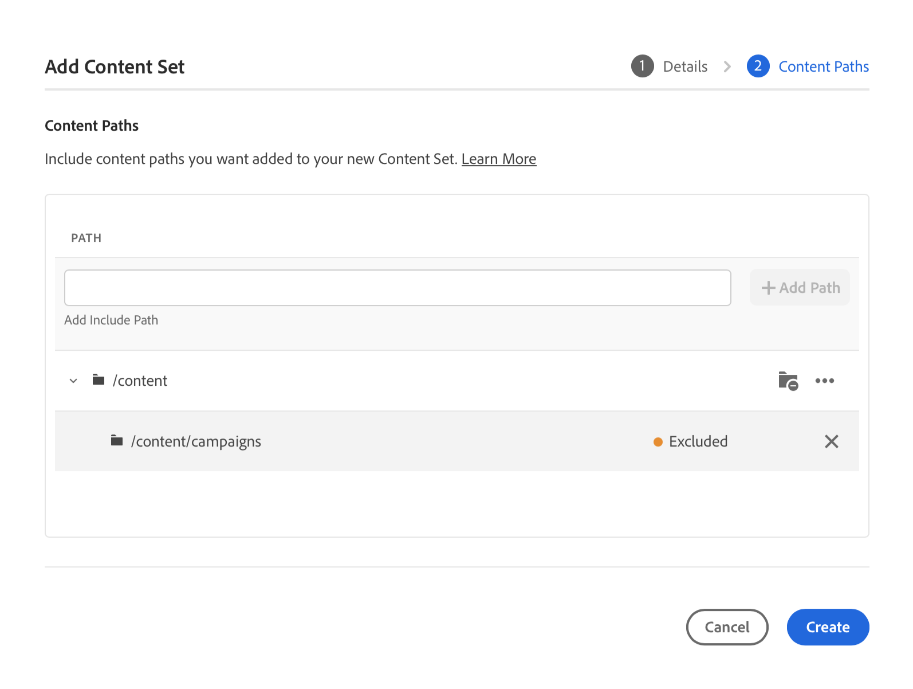

# Lo strumento Copia contenuto {#content-copy}

Lo strumento di copia dei contenuti consente agli utenti di copiare contenuti mutabili on-demand dai propri ambienti di produzione as a Cloud Service per l’AEM in ambienti più bassi a scopo di test.

## Introduzione {#introduction}

I dati attuali e reali sono utili a scopo di test, convalida e accettazione da parte degli utenti. Lo strumento Content Copy consente di copiare il contenuto da un ambiente AEM di produzione a uno di staging, sviluppo o [Ambiente di sviluppo rapido (RDE)](/help/implementing/developing/introduction/rapid-development-environments.md) ambiente per tali test.

Il contenuto da copiare è definito da un set di contenuti. Un set di contenuti è costituito da un elenco di percorsi JCR che contengono il contenuto mutabile da copiare da un ambiente del servizio di authoring sorgente a un ambiente del servizio di authoring di destinazione all’interno dello stesso programma Cloud Manager. I percorsi seguenti sono consentiti in un set di contenuti.

```text
/content
/conf/**/settings/wcm
/conf/**/settings/dam/cfm/models
/conf/**/settings/graphql/persistentQueries
/etc/clientlibs/fd/themes
```

Durante la copia del contenuto, l’ambiente sorgente è l’origine di riferimento.

* Se il contenuto è stato modificato nell’ambiente di destinazione e i percorsi sono gli stessi, verrà sovrascritto dal contenuto nell’origine.
* Se i percorsi sono diversi, il contenuto dell’origine verrà unito al contenuto della destinazione.

## Autorizzazioni {#permissions}

Per utilizzare lo strumento Copia contenuto, sono necessarie alcune autorizzazioni sia nell’ambiente sorgente che in quello di destinazione.

| Funzione Copia contenuto | Gruppo di amministratori AEM | Ruolo Responsabile della distribuzione |
|---|---|---|
| Creare e modificare il [set di contenuti](#create-content-set) | Obbligatorio | Non obbligatorio |
| Avviare o annullare il [processo di copia del contenuto](#copy-content) | Obbligatorio | Obbligatorio |

## Creazione di un set di contenuti {#create-content-set}

Prima di poter copiare un contenuto, è necessario definire un set di contenuti. Una volta definiti, i set di contenuti possono essere riutilizzati per copiare il contenuto. Per creare un set di contenuti, effettua le seguenti operazioni.

1. Accedi a Cloud Manager all’indirizzo [my.cloudmanager.adobe.com](https://my.cloudmanager.adobe.com/) e seleziona l’organizzazione e il programma appropriati.

1. Dalla pagina **Panoramica**, accedi alla schermata **Ambienti**.

1. Dalla schermata **Ambienti**, passa alla pagina **Set di contenuti**.

1. Tocca o fai clic sul pulsante **Aggiungi set di contenuti** in alto a destra dello schermo.

   

1. Nella scheda **Dettagli** della procedura guidata, assegna un nome e una descrizione per il set di contenuti e tocca o fai clic su **Continua**.

   

1. Nella scheda **Percorsi del contenuto** della procedura guidata, specifica i percorsi del contenuto modificabile da includere nel set di contenuti.

   1. Immetti il percorso nel campo **Aggiungi percorso di inclusione**.
   1. Tocca o fai clic sul pulsante **Aggiungi percorso** per aggiungere il percorso al set di contenuti.
   1. Se necessario, tocca o fai clic di nuovo sul pulsante **Aggiungi percorso**.
      * Sono consentiti fino a cinquanta percorsi.

   

1. Se devi perfezionare o limitare il set di contenuti, è possibile escludere i percorsi secondari.

   1. Nell’elenco dei percorsi inclusi, tocca o fai clic sull’icona **Aggiungi percorsi secondari di esclusione** accanto al percorso da limitare.
   1. Inserisci il percorso secondario da escludere sotto il percorso selezionato.
   1. Tocca o fai clic su **Escludi percorso**.
   1. Tocca o fai clic di nuovo su **Aggiungi percorsi secondari di esclusione** per aggiungere altri percorsi da escludere, se necessario.
      * I percorsi esclusi devono essere relativi al percorso incluso.
      * Non esiste alcun limite al numero di percorsi esclusi.

   

1. Se necessario, è possibile modificare i percorsi specificati.

   1. Tocca o fai clic sulla X accanto ai percorsi secondari esclusi per eliminarli.
   1. Tocca o fai clic sul pulsante con i puntini di sospensione accanto ai percorsi per visualizzare le opzioni **Modifica** ed **Elimina**.

   

1. Tocca o fai clic su **Crea** per creare il set di contenuti.

Il set di contenuti può ora essere utilizzato per copiare il contenuto tra ambienti diversi.

## Modifica di un set di contenuti {#edit-content-set}

Segui passaggi simili a quelli impiegati per la creazione del contenuto. Invece di toccare o fare clic su **Aggiungi set di contenuti**, seleziona un set esistente dalla console e quindi **Modifica** dal menu con i puntini di sospensione.


Tieni presente che quando modifichi il set di contenuti, potrebbe essere necessario espandere i percorsi configurati per visualizzare i percorsi secondari esclusi.

## Copia del contenuto {#copy-content}

Una volta creato un set di contenuti, puoi utilizzarlo per copiare il contenuto. Per copiare il contenuto, effettua le seguenti operazioni.

>[!NOTE]
> La copia del contenuto non deve essere avviata in un ambiente mentre un [trasferimento dei contenuti](/help/journey-migration/content-transfer-tool/using-content-transfer-tool/overview-content-transfer-tool.md) è in esecuzione in tale ambiente.

1. Accedi a Cloud Manager all’indirizzo [my.cloudmanager.adobe.com](https://my.cloudmanager.adobe.com/) e seleziona l’organizzazione e il programma appropriati.

1. Dalla pagina **Panoramica**, accedi alla schermata **Ambienti**.

1. Dalla schermata **Ambienti**, passa alla pagina **Set di contenuti**.

1. Seleziona un set di contenuti dalla console e seleziona **Copia contenuto** dal menu con i puntini di sospensione.

   

   >[!NOTE]
   >
   >Un ambiente può non essere selezionabile se:
   >
   >* L’utente non dispone delle autorizzazioni appropriate.
   >* L’ambiente dispone di una pipeline in esecuzione o di un’operazione di copia del contenuto in corso.
   >* L’ambiente è in stato di sospensione o in fase di avvio.


1. Nella finestra di dialogo **Copia contenuto**, specifica l’origine e la destinazione dell’azione di copia del contenuto.

   

   * Il contenuto può essere copiato solo da un ambiente superiore a un ambiente inferiore o tra ambienti di sviluppo/RDE in cui la gerarchia degli ambienti è la seguente (dal livello più alto a quello più basso):
      * Produzione
      * Staging
      * Sviluppo/RDE

1. Se necessario, puoi anche scegliere di **Includi elenchi di controllo di accesso** nel processo di copia.

1. Tocca o fai clic su **Copia**.

Viene avviato il processo di copia. Lo stato del processo di copia si riflette nella console del set di contenuti selezionato.

## Attività copia contenuto {#copy-activity}

Puoi monitorare lo stato dei processi di copia nella pagina **Attività copia contenuto**.

1. Accedi a Cloud Manager all’indirizzo [my.cloudmanager.adobe.com](https://my.cloudmanager.adobe.com/) e seleziona l’organizzazione e il programma appropriati.

1. Dalla pagina **Panoramica**, accedi alla schermata **Ambienti**.

1. Dalla schermata **Ambienti**, passa alla pagina **Attività copia contenuto**.


### Stati della copia del contenuto {#statuses}

Una volta iniziata la copia del contenuto, il processo può trovarsi in uno dei seguenti stati.

| Stato | Descrizione |
|---|---|
| In corso | Operazione di copia del contenuto in corso |
| Non riuscito | Operazione di copia del contenuto non riuscita |
| Completato | Operazione di copia del contenuto completata |
| Annullato | L’utente annulla un’operazione di copia del contenuto dopo averlo avviato |

### Annullamento di un processo di copia {#canceling}

Se è necessario interrompere un&#39;operazione di copia del contenuto dopo averla avviata, è possibile annullarla.

A tale scopo, il **Attività copia contenuto** , seleziona la **Annulla** dal menu con i puntini di sospensione del processo di copia avviato in precedenza.


>[!NOTE]
>
>Quando annulli un’operazione di copia del contenuto, questa può tradursi in una copia parziale del contenuto nell’ambiente di destinazione. Questo può lasciare l’ambiente di destinazione inutilizzabile.
>
>Se l’ambiente è in tale stato a causa della cancellazione, contatta l’Assistenza clienti di Adobe.

## Limitazioni {#limitations}

Lo strumento Copia contenuto presenta le seguenti limitazioni.

* Il contenuto non può essere copiato da un ambiente inferiore a un ambiente superiore.
* Il contenuto può essere copiato solo da e verso i servizi di authoring.
* Non è possibile copiare il contenuto tra più programmi.
* Non è possibile eseguire operazioni simultanee di copia del contenuto nello stesso ambiente.
* È possibile specificare fino a cinquanta percorsi per set di contenuti. Non ci sono limitazioni per i percorsi esclusi.
* Lo strumento di copia del contenuto non deve essere utilizzato come strumento di duplicazione o mirroring perché non può tenere traccia del contenuto spostato o eliminato nell’origine.
* Lo strumento di copia del contenuto non dispone di funzionalità di controllo delle versioni e non è in grado di rilevare automaticamente il contenuto modificato o appena creato nell&#39;ambiente di origine di un set di contenuti dall&#39;ultima operazione di copia del contenuto.
   * Se desideri aggiornare l’ambiente di destinazione con le modifiche apportate al contenuto solo dall’ultima operazione di copia del contenuto, devi creare un set di contenuti e specificare i percorsi nell’istanza di origine in cui sono state apportate le modifiche dall’ultima operazione di copia del contenuto.
* Le informazioni sulla versione non sono incluse in una copia del contenuto.
