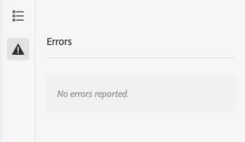

# Modalità Sviluppatore {#developer-mode}

Durante la modifica delle pagine in AEM, sono disponibili diverse [modalità](/help/sites-cloud/authoring/sites-console/introduction.md#page-modes), inclusa la modalità Sviluppatore. La modalità Sviluppatore apre un pannello laterale con diverse schede che forniscono a uno sviluppatore informazioni tecniche sulla pagina corrente.

Sono disponibili due schede:

* **[Componenti](#components)** per la visualizzazione di informazioni sulla struttura e sulle prestazioni.
* **[Errori](#errors)** per visualizzare eventuali problemi che si verificano.

Questi aiutano uno sviluppatore a:

* **Scopri** come sono composte le pagine.
* **Debug:** cosa accade dove e quando, il che a sua volta aiuta a risolvere i problemi.

>[!NOTE]
>
>Modalità sviluppatore:
>
>* Non è disponibile su dispositivi mobili o piccole finestre sul desktop (a causa di limitazioni di spazio). Ciò si verifica quando la larghezza è inferiore a 1024 px.
>* È disponibile solo per gli utenti membri del gruppo `administrators`.

## Apertura modalità sviluppatore {#opening-developer-mode}

La modalità Sviluppatore viene implementata come pannello laterale nell’editor di pagine. Per aprire il pannello, seleziona **Sviluppatore** dal selettore di modalità nella barra degli strumenti dell&#39;editor di pagine:

Il pannello è diviso in due schede:

* **[Componenti](#components)** - Viene visualizzata una struttura ad albero componente simile alla [struttura contenuto](/help/sites-cloud/authoring/page-editor/editor-side-panel.md#content-tree) per gli autori
* **[Errori](#errors)** - Quando si verificano problemi, vengono visualizzati i dettagli per ciascun componente.

### Scheda Componenti {#components}

Viene mostrata una struttura ad albero componente che:

* Consente di definire la catena di componenti e modelli di cui è stato eseguito il rendering sulla pagina. La struttura può essere espansa per mostrare il contesto all’interno della gerarchia.
* Mostra il tempo di calcolo lato server necessario per eseguire il rendering del componente.
* Consente di espandere la struttura e selezionare componenti specifici all&#39;interno della struttura. La selezione consente di accedere ai dettagli dei componenti, ad esempio:
   * Percorso archivio
   * Collegamenti agli script (a cui si accede in CRXDE Lite)
   * Dettagli del componente visualizzati nella [console Componenti](/help/sites-cloud/authoring/components-console.md)
* I componenti selezionati nella struttura sono indicati da un bordo blu nell’editor.

Questa scheda dei componenti consente di:

* Determina e confronta il tempo di rendering per componente.
* Visualizzare e comprendere la gerarchia.
* Scopri e quindi migliora il tempo di caricamento della pagina individuando i componenti lenti.

Ciascuna voce di componente può avere le seguenti opzioni:

* **Visualizza dettagli:** Collegamento a un elenco che visualizza:
   * Tutti gli script dei componenti utilizzati per eseguire il rendering del componente.
   * Percorso del contenuto dell’archivio per questo componente specifico.

     

* **Modifica script:** Collegamento che apre lo script del componente in CRXDE Lite.

* **Visualizza dettagli componente:** Apre i dettagli del componente nella [Console componenti](/help/sites-cloud/authoring/components-console.md).

Inoltre, l’espansione di una voce di componente toccando o facendo clic sulla freccia può mostrare:

    * Gerarchia all&#39;interno del componente selezionato.
    * Tempi di rendering per il componente selezionato in isolamento, eventuali singoli componenti nidificati al suo interno e il totale combinato.

### Scheda Errori {#errors}

Si spera che la scheda **Errori** sia sempre vuota (come sopra), ma in caso di problemi potrebbero essere visualizzati i dettagli seguenti per ciascun componente:

* Un avviso se il componente scrive una voce nel registro degli errori, insieme a dettagli dell’errore e collegamenti diretti al codice appropriato in CRXDE Lite.
* Un avviso se il componente apre una sessione di amministrazione.

Ad esempio, se viene chiamato un metodo non definito, l&#39;errore risultante viene visualizzato nella scheda **Errori** e la voce del componente nella struttura della scheda **Componenti** verrà contrassegnata con un indicatore quando si verifica un errore.
