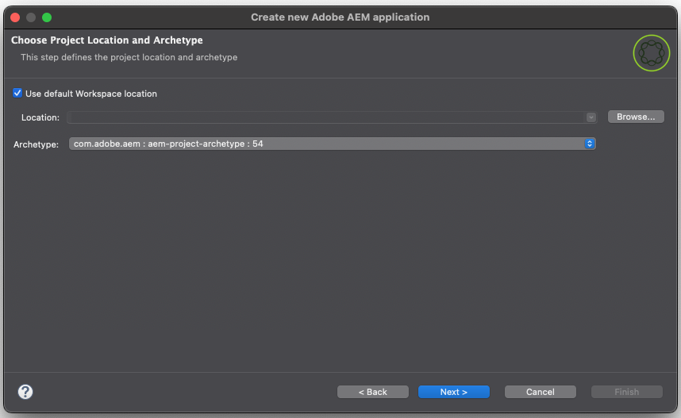

# Strumenti per sviluppatori AEM per Eclipse{#aem-developer-tools-for-eclipse}


## Panoramica {#overview}

_Experience Manager Developer Tools per Eclipse_ è un plug-in Eclipse basato sul [plug-in Eclipse per Apache Sling](https://sling.apache.org/documentation/development/ide-tooling.html) rilasciato con la licenza Apache 2.

Offre diverse funzioni che facilitano lo sviluppo di AEM:

* Integrazione perfetta con le istanze di AEM tramite il connettore server Eclipse
* Sincronizzazione per i bundle OSGi e per i contenuti
* Supporto del debug con funzionalità di hot-swapping del codice
* Creazione guidata progetto: semplice Bootstrap di progetti AEM
* Facile modifica delle proprietà JCR

## Requisiti {#requirements}

Prima di utilizzare gli strumenti per sviluppatori di AEM, è necessario:

* Scarica e installa [Eclipse IDE per Enterprise Java e Web Developers.](https://www.eclipse.org/downloads/packages/)
   * La versione 1.4.0 di AEM Developer Tools per Eclipse è compatibile con Eclipse 2022-12 (4.26) o versione successiva e richiede Java 17 o versione successiva per l’esecuzione.
* Configurare l&#39;installazione di Eclipse per assicurarsi di disporre di almeno 1 GB di memoria heap modificando il file di configurazione `eclipse.ini` come descritto nelle [Domande frequenti su Eclipse.](https://wiki.eclipse.org/FAQ_How_do_I_increase_the_heap_size_available_to_Eclipse%3F)

>[!NOTE]
>
>In macOS, è necessario fare clic con il pulsante destro del mouse su **Eclipse.app**, quindi selezionare **Mostra contenuto pacchetto** per trovare `eclipse.ini`.

## Installare AEM Developer Tools per Eclipse {#how-to-install-the-aem-developer-tools-for-eclipse}

Dopo aver soddisfatto i [requisiti](#requirements) di cui sopra, puoi installare il plug-in degli strumenti per sviluppatori come segue:

1. Apri il sito Web degli strumenti per sviluppatori di [AEM.](https://eclipse.adobe.com/)

1. Copia il **collegamento di installazione**.

   * In alternativa, è possibile scaricare un archivio invece di utilizzare il collegamento di installazione.
   * Questo metodo consente l&#39;installazione offline, ma non si ricevono notifiche di aggiornamento automatico.

1. In Eclipse aprire il menu **Guida**.
1. Fare clic su **Installa nuovo software**.
1. Fare clic su **Aggiungi...**.
1. Nel campo **Name**, immetti `AEM Developer Tools`.
1. Nel campo **Posizione**, copia l&#39;URL di installazione.
1. Fai clic su **Aggiungi**.
1. Controlla entrambi i plug-in **AEM** e **Sling**.
1. Fai clic su **Avanti**.
1. Nella finestra **Dettagli installazione**, controlla gli elementi da installare e fai di nuovo clic su **Avanti**.
1. Accettare i contratti di licenza e fare clic su **Fine**.
1. Nella finestra di dialogo **Autorità di attendibilità** visualizzata, selezionare l&#39;autorità o il sito `https://eclipse.adobe.com` e fare clic su **Considera attendibili selezionati**.
1. Nella finestra di dialogo **Artifact attendibili** visualizzata, selezionare i firmatari del codice e fare clic su **Considera attendibili gli elementi selezionati**.
1. Fare clic su **RiavviaOra** per riavviare Eclipse.

## La prospettiva di AEM {#the-aem-perspective}

In Eclipse, una **prospettiva** determina le azioni e le visualizzazioni disponibili all&#39;interno di una finestra e consente l&#39;interazione orientata alle attività con le risorse in Eclipse. Per ulteriori dettagli sulle prospettive, consulta la [documentazione di Eclipse.](https://help.eclipse.org/latest/index.jsp).

Gli _strumenti di sviluppo Experience Manager per Eclipse_ forniscono una prospettiva AEM che ti offre il controllo completo sui tuoi progetti e istanze AEM. Per aprire la prospettiva di AEM:

1. Dalla barra dei menu Eclipse, seleziona **Finestra** > **Prospettiva** > **Apri prospettiva** > **Altro**.
1. Seleziona **AEM** nella finestra di dialogo e fai clic su **Apri**.


## Esempio di progetto con più moduli {#sample-multi-module-project}

Gli _strumenti per sviluppatori Experience Manager per Eclipse_ includono un esempio di progetto con più moduli che ti consente di imparare rapidamente a utilizzare la configurazione di un progetto in Eclipse. Funge anche da guida alle best practice per diverse funzionalità di AEM, sfruttando il [Archetipo progetto AEM.](https://github.com/adobe/aem-project-archetype)

Per creare il progetto di esempio, segui la procedura riportata di seguito.

1. Nel menu **File** > **Nuovo** > **Progetto**, individua la sezione **AEM** e seleziona **Progetto con più moduli di esempio AEM**.

   

1. Fai clic su **Avanti**.

   >[!NOTE]
   >
   >Questo passaggio potrebbe richiedere alcuni minuti perché [m2eclipse](https://eclipse.dev/m2e/) deve analizzare i cataloghi dell&#39;archetipo.

1. Selezionare automaticamente `com.adobe.aem : aem-project-archetype : <highest-number>` nel menu a discesa **Archetipo**. Se necessario, seleziona una versione precedente. Fai clic su **Avanti**.

   

1. Fornisci i campi seguenti per il progetto di esempio:

   * **Nome**
   * **ID gruppo**
   * **ID elemento**
   * **appId** - Potrebbe essere necessario espandere le opzioni **Avanzate** per impostare questo valore.
   * **appTitle** - Potrebbe essere necessario espandere le opzioni **Advanced** per impostare questo valore.
   * **Pacchetto** - Potrebbe essere necessario espandere le opzioni **Avanzate** per impostare questo valore.

   

1. Fai clic su **Avanti**.

1. Configurare un server AEM al quale Eclipse si connette selezionando **Imposta nuovo server** e fornendo un nome server e i dettagli di connessione necessari.

   

   * Per utilizzare la funzione di debugger, è necessario avviare AEM in modalità di debug fornendo il parametro `-agentlib`, ad esempio:

   ```text
   $ java -agentlib:jdwp=transport=dt_socket,server=y,suspend=n,address=*:5005 -jar aem-author-p4502.jar
   ```

   >[!TIP]
   >
   >Per ulteriori dettagli sul debug del progetto in esecuzione su un SDK AEM locale, consulta il documento [Debug remoto di AEM SDK.](https://experienceleague.adobe.com/en/docs/experience-manager-learn/cloud-service/debugging/debugging-aem-sdk/remote-debugging)

1. Fai clic su **Fine**.

Viene creata la struttura del progetto. Il download degli artefatti necessari nel progetto potrebbe richiedere del tempo.

>[!NOTE]
>
>In una nuova installazione o quando le dipendenze Maven non sono state scaricate in precedenza, Eclipse potrebbe segnalare che il progetto è stato creato con errori. In questo caso, seguire la procedura descritta nella sezione [Risoluzione della definizione del progetto non valida.](#resolving-invalid-project-definition)

## Importare Progetti Esistenti {#how-to-import-existing-projects}

Utilizza la funzionalità **Nuovo progetto** per creare la struttura di progetto di base.

1. Segui le istruzioni per creare un [progetto con più moduli di esempio,](#sample-multi-module-project) che crea una struttura di progetto di base con una valida separazione dei problemi:

   * `PROJECT.ui.apps` per il contenuto di `/apps` e `/etc`
   * `PROJECT.ui.content` per `/content` creato
   * `PROJECT.core` per bundle Java
   * `PROJECT.it.launcher` e `PROJECT.it.tests` per gli integration test

1. Sostituisci il contenuto del progetto `PROJECT.ui.apps` con le cartelle `apps` e `etc` del pacchetto:

   1. Nel pannello **Project Explorer**, espandere `PROJECT.ui.apps` > `src` > `main` > `content` > `jcr_root` > `apps`.
   1. Fare clic con il pulsante destro del mouse sulla cartella `apps` e scegliere **Mostra in** > **Esplora risorse**.
   1. Eliminare le cartelle `apps` e `etc`.
   1. Nella stessa posizione, inserire le cartelle `apps` e `etc` del pacchetto di contenuti.
   1. In Eclipse fare clic con il pulsante destro del mouse sul progetto `PROJECT.ui.apps` e scegliere **Aggiorna**.

1. Eseguire quindi le stesse operazioni per `PROJECT.ui.content` e sostituire la cartella dei contenuti con quella dei pacchetti:

   1. Nel pannello **Project Explorer**, espandere `PROJECT.ui.content` > `src` > `main` > `content` > `jcr_root` > `content`.
   1. Fare clic con il pulsante destro del mouse sulla cartella dei contenuti più profondi e scegliere **Mostra in** > **Esplora sistemi**.
   1. Elimina la cartella dei contenuti.
   1. Nella stessa posizione, inserisci la cartella del contenuto del pacchetto di contenuti.
   1. In Eclipse fare clic con il pulsante destro del mouse sul progetto `PROJECT.ui.content` e scegliere **Aggiorna**.

1. Aggiorna i file `filter.xml` di questi due progetti in modo che corrispondano al contenuto del pacchetto di contenuti aprendo il file `META-INF/vault/filter.xml` del pacchetto di contenuti in un editor di testo/codice separato.

   * Ecco un esempio di come può apparire il file `filter.xml`:

   ```xml
   <?xml version="1.0" encoding="UTF-8"?>
   <workspaceFilter version="1.0">
       <filter root="/apps/foo"/>
       <filter root="/apps/foundation/components/bar"/>
       <filter root="/etc/designs/foo"/>
       <filter root="/content/foo"/>
       <filter root="/content/dam/foo"/>
       <filter root="/content/usergenerated/content/foo"/>
   </workspaceFilter>
   ```

1. Per quanto riguarda il contenuto del pacchetto che è stato diviso in due progetti, è inoltre necessario dividere queste regole di filtro in due e aggiornare di conseguenza i file `filter.xml` dei due progetti.

   1. In Eclipse aprire `PROJECT.ui.apps/src/main/content/META-INF/filter.xml`.
   1. Sostituisci il contenuto dell&#39;elemento `<workspaceFilter>` con le regole del pacchetto che iniziano con `/apps` e `/etc`
      * Ad esempio:

        ```xml
        <?xml version="1.0" encoding="UTF-8"?>
        <workspaceFilter version="1.0">
           <filter root="/apps/foo"/>
           <filter root="/apps/foundation/components/bar"/>
           <filter root="/etc/designs/foo"/>
        </workspaceFilter>
        ```

   1. Quindi apri `PROJECT.ui.content/src/main/content/META-INF/filter.xml`.
   1. Sostituisci le regole con quelle del pacchetto che iniziano con `/content`.
      * Ad esempio:

        ```xml
        <?xml version="1.0" encoding="UTF-8"?>
        <workspaceFilter version="1.0">
           <filter root="/content/foo"/>
           <filter root="/content/dam/foo"/>
           <filter root="/content/usergenerated/content/foo"/>
        </workspaceFilter>
        ```

1. Assicurati di salvare tutte le modifiche. Ora puoi sincronizzare il nuovo contenuto con l’istanza di AEM.

1. Nel pannello **Server**, assicurati che la connessione sia avviata e, in caso contrario, non avviarla.

1. Fai clic sull&#39;icona **Pulisci e pubblica**.

Al termine, il pacchetto dovrebbe essere in esecuzione sull’istanza. Al momento del salvataggio, qualsiasi modifica viene sincronizzata automaticamente con l’istanza.

Se desideri ricreare un pacchetto dal progetto, fai clic con il pulsante destro del mouse su `PROJECT.ui.apps` o `PROJECT.ui.content` e scegli **Esegui come** > **Installazione Maven**.

È ora disponibile una cartella di destinazione creata con il pacchetto all&#39;interno (denominata, ad esempio, `PROJECT.ui.apps-0.0.1-SNAPSHOT.zip`).

## Risoluzione di problemi {#troubleshooting}

### Risoluzione di una definizione di progetto non valida {#resolving-invalid-project-definition}

Per risolvere le dipendenze non valide e la definizione del progetto procedere come segue:

1. Seleziona tutti i progetti creati.
1. Fare clic con il pulsante destro del mouse.
1. Nel menu di scelta rapida, seleziona **Maven** > **Aggiorna progetti**.
1. Controlla **Forza aggiornamenti di snapshot/release**.
1. Fai clic su **OK**.

Eclipse scarica le dipendenze richieste. L&#39;operazione potrebbe richiedere alcuni minuti.

## Ulteriori informazioni {#more-information}

Il sito web ufficiale Apache Sling IDE tooling per Eclipse fornisce utili informazioni aggiuntive:

* La [**Guida utente di Apache Sling IDE per Eclipse**](https://sling.apache.org/documentation/development/ide-tooling.html) ti guida attraverso i concetti generali, l&#39;integrazione del server e le funzionalità di distribuzione supportate dagli strumenti di sviluppo di AEM.
* [Risoluzione dei problemi relativi agli strumenti IDE di Apache Sling](https://sling.apache.org/documentation/development/ide-tooling.html#troubleshooting)
* [Elenco dei problemi noti](https://sling.apache.org/documentation/development/ide-tooling.html#known-issues)

La seguente documentazione ufficiale di [Eclipse](https://www.eclipse.org/) può essere utile per configurare l&#39;ambiente:

* [Guida introduttiva a Eclipse](https://eclipseide.org/getting-started/)
* [Guida di Eclipse Luna](https://help.eclipse.org/latest/index.jsp)
* [Integrazione Maven (m2eclipse)](https://www.eclipse.org/m2e/)
