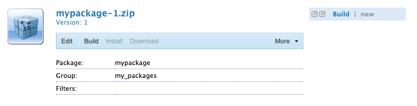

# Gestione pacchetti {#working-with-packages}

I pacchetti consentono l&#39;importazione e l&#39;esportazione del contenuto del repository. È possibile utilizzare i pacchetti per installare nuovi contenuti, trasferire contenuti tra le istanze ed eseguire il backup del contenuto del repository.

Gestione pacchetti consente di trasferire i pacchetti tra l’istanza AEM e il file system locale a scopo di sviluppo.

## Cosa sono i pacchetti? {#what-are-packages}

Un pacchetto è un file zip che contiene il contenuto dell’archivio in un modulo di serializzazione del file system, denominato serializzazione dell’archivio, e fornisce una rappresentazione di file e cartelle facile da usare e da modificare. Il contenuto incluso nel pacchetto viene definito utilizzando i filtri.

Un pacchetto contiene anche metainformazioni di Vault, tra cui le definizioni dei filtri e le informazioni di configurazione dell’importazione. Nel pacchetto possono essere incluse proprietà di contenuto aggiuntive, non utilizzate per l’estrazione del pacchetto, ad esempio una descrizione, un’immagine visiva o un’icona. Queste proprietà di contenuto aggiuntive sono destinate al consumatore del pacchetto di contenuti e solo a scopo informativo.

>[!NOTE]
>
>I pacchetti rappresentano la versione corrente del contenuto al momento della creazione del pacchetto. Non includono alcuna versione precedente del contenuto conservato dall’AEM nell’archivio.

## Pacchetti in AEM as a Cloud Service {#aemaacs-packages}

I pacchetti di contenuti creati per le applicazioni AEM as a Cloud Service devono avere una netta separazione tra contenuti immutabili e mutabili. Pertanto Gestione pacchetti può essere utilizzato solo per gestire i pacchetti contenenti contenuto. Qualsiasi codice deve essere distribuito tramite Cloud Manager.

>[!NOTE]
>
>I pacchetti possono contenere solo contenuto. Qualsiasi funzionalità (ad esempio, contenuto memorizzato in `/apps`) deve essere [implementato utilizzando la pipeline CI/CD in Cloud Manager](/help/implementing/cloud-manager/deploy-code.md).

>[!IMPORTANT]
>
>L’interfaccia utente di Gestione pacchetti potrebbe restituire un messaggio di errore **non definito** se l’installazione di un pacchetto richiede più di 10 minuti.
>
>Questo non è dovuto a un errore nell’installazione, ma a un timeout che il Cloud Service ha per tutte le richieste.
>
>Non ripetere l’installazione se viene visualizzato un errore di questo tipo. L’installazione sta procedendo correttamente in background. Se si riavvia l’installazione, potrebbero essere introdotti alcuni conflitti da più processi di importazione simultanei.

Per ulteriori dettagli su come gestire i pacchetti per AEMaaCS, consulta [Distribuzione a AEM as a Cloud Service](/help/implementing/deploying/overview.md) nella guida utente distribuzione.

## Dimensione pacchetto {#package-size}

L’Adobe consiglia di non creare pacchetti di grandi dimensioni. In questo modo si evitano problemi di timeout durante il caricamento e il download dei pacchetti.

Come regola generale, un pacchetto deve essere trasmesso per intero entro 60 secondi. In questo modo viene fornita la formula seguente come guida.

```text
MaxPackageSize (in MB) = ConnectionSpeed (in MB/s) * 60 s
```

Poiché il traffico di rete è variabile ed è sempre inferiore al valore teorico massimo annunciato, provare a utilizzare uno strumento di prova della velocità della connessione Internet in linea.

La velocità di Internet è quasi sempre diversa per caricamenti e download. Supponendo che sia necessario caricare e scaricare i pacchetti, nel calcolo devi utilizzare il valore più basso (solitamente la velocità di caricamento).

### Esempio {#example}

Utilizzando uno strumento di test della velocità Internet, vedo che la mia attuale velocità di caricamento è di circa 100 Mbps.

```text
100 Mbps = 12.5 MB/s
12.5 MB/s * 60 s = 750 MB
```

Quindi tutti i pacchetti che creo dovrebbero essere più piccoli di 750 MB.

>[!NOTE]
>
>La velocità della rete è soggetta alle condizioni locali attuali. Anche con un test di velocità recente, la velocità effettiva può variare.
>
>Pertanto, la formula fornita è solo una linea guida e la dimensione massima effettiva consigliata del pacchetto può variare.

## Gestione pacchetti {#package-manager}

Gestione pacchetti gestisce i pacchetti nell’installazione AEM. Dopo aver [ha assegnato le autorizzazioni necessarie](#permissions-needed-for-using-the-package-manager) puoi utilizzare Gestione pacchetti per varie azioni, tra cui la configurazione, la creazione, il download e l’installazione dei pacchetti.

### Autorizzazioni richieste {#required-permissions}

Per creare, modificare, caricare e installare pacchetti, gli utenti devono disporre delle autorizzazioni appropriate per i seguenti nodi:

* Diritti completi, esclusa eliminazione il `/etc/packages`
* Nodo che contiene il contenuto del pacchetto

>[!CAUTION]
>
>La concessione delle autorizzazioni per i pacchetti può comportare la divulgazione di informazioni sensibili e la perdita di dati.
>
>Per limitare questi rischi, si consiglia vivamente di concedere autorizzazioni di gruppo specifiche solo sulle sottostrutture dedicate.

### Accesso a Gestione pacchetti {#accessing}

È possibile accedere a Gestione pacchetti in tre modi:

1. Dal menu principale dell’AEM -> **Strumenti** -> **Distribuzione** -> **Pacchetti**
1. Da [CRXDE Lite](crxde.md) utilizzo della barra del commutatore superiore
1. Direttamente accedendo a `http://<host>:<port>/crx/packmgr/`

### Interfaccia utente di Gestione pacchetti {#ui}

Gestione pacchetti è suddiviso in quattro aree funzionali principali:

* **Pannello di navigazione sinistro** : questo pannello consente di filtrare e ordinare l’elenco dei pacchetti.
* **Elenco pacchetti** : elenco dei pacchetti nell’istanza filtrati e ordinati per selezioni nel pannello di navigazione a sinistra.
* **Registro attività** : questo pannello viene ridotto a icona in un primo momento ed espande per descrivere nel dettaglio l’attività di Gestione pacchetti, ad esempio quando un pacchetto viene generato o installato. Nella scheda Registro attività sono disponibili pulsanti aggiuntivi per:
   * **Cancella registro**
   * **Mostra/Nascondi**
* **Barra degli strumenti** - La barra degli strumenti contiene i pulsanti di aggiornamento per il pannello di navigazione sinistro e l&#39;elenco dei pacchetti, nonché i pulsanti per la ricerca, la creazione e il caricamento dei pacchetti.


Facendo clic su un’opzione nel pannello di navigazione a sinistra, l’elenco dei pacchetti viene filtrato immediatamente.

Se si fa clic sul nome di un pacchetto, la voce nell&#39;elenco dei pacchetti viene espansa per visualizzare ulteriori dettagli sul pacchetto.


È possibile eseguire diverse azioni su un pacchetto tramite i pulsanti della barra degli strumenti disponibili quando i dettagli del pacchetto vengono espansi.

* [Modifica](#edit-package)
* [Genera](#building-a-package)
* [Reinstalla](#reinstalling-packages)
* [Scarica](#downloading-packages-to-your-file-system)

Ulteriori azioni sono disponibili sotto **Altro** pulsante.

* [Eliminare](#deleting-packages)
* [Copertura](#package-coverage)
* [Contenuti](#viewing-package-contents-and-testing-installation)
* [Ripeti adattamento](#rewrapping-a-package)
* [Altre versioni](#other-versions)
* [Disinstalla](#uninstalling-packages)
* [Installazione di test](#viewing-package-contents-and-testing-installation)
* [Convalida](#validating-packages)
* [Replica](#replicating-packages)

### Stato pacchetto {#package-status}

Ogni voce nell&#39;elenco dei pacchetti dispone di un indicatore di stato che consente di conoscere immediatamente lo stato del pacchetto. Passando il puntatore del mouse sullo stato viene visualizzata una descrizione con i dettagli dello stato.


Se il pacchetto è stato modificato o non è mai stato creato, lo stato viene presentato come un collegamento per eseguire un’azione rapida di ricostruzione o installazione del pacchetto.

## Impostazioni pacchetto {#package-settings}

Un pacchetto è essenzialmente un set di filtri e i dati dell’archivio basati su tali filtri. Utilizzando l’interfaccia utente per la gestione dei pacchetti, puoi fare clic su un pacchetto e quindi **Modifica** per visualizzare i dettagli di un pacchetto, incluse le impostazioni seguenti.

* [Impostazioni generali](#general-settings)
* [Filtri per pacchetti](#package-filters)
* [Dipendenze pacchetto](#package-dependencies)
* [Impostazioni avanzate](#advanced-settings)
* [Schermate del pacchetto](#package-screenshots)

### Impostazioni generali {#general-settings}

È possibile modificare diverse impostazioni del pacchetto per definire informazioni quali la descrizione del pacchetto, le dipendenze e i dettagli del provider.

Il **Impostazioni pacchetto** è disponibile tramite il **Modifica** quando [creazione](#creating-a-new-package) o [modifica](#viewing-and-editing-package-information) un pacchetto. Dopo aver apportato eventuali modifiche, fai clic su **Salva**.


| Campo | Descrizione |
|---|---|
| Nome | Nome del pacchetto |
| Gruppo | Per organizzare i pacchetti, è possibile digitare il nome di un nuovo gruppo o selezionare un gruppo esistente |
| Versione | Testo da utilizzare per la versione |
| Descrizione | Breve descrizione del pacchetto che consente il markup HTML per la formattazione |
| Miniatura  | Icona visualizzata con l&#39;elenco dei pacchetti |

### Filtri per pacchetti {#package-filters}

I filtri identificano i nodi dell’archivio da includere nel pacchetto. A **Definizione filtro** specifica le informazioni seguenti:

* Il **Percorso directory principale** del contenuto da includere
* **Regole** che includono o escludono nodi specifici sotto il percorso principale

Aggiungere regole utilizzando **+** pulsante. Rimuovere le regole utilizzando **-** pulsante.

Le regole vengono applicate in base al loro ordine, in modo da posizionarle come richiesto utilizzando **Su** e **Giù** pulsanti freccia.

I filtri possono includere zero o più regole. Se non sono definite regole, il pacchetto contiene tutto il contenuto sotto il percorso principale.

Puoi definire una o più definizioni di filtro per un pacchetto. Utilizza più di un filtro per includere il contenuto di più percorsi principali.


Durante la creazione dei filtri, puoi definire un percorso o utilizzare un’espressione regolare per specificare tutti i nodi che desideri includere o escludere.

| Tipo di regola | Descrizione |
|---|---|
| include | L&#39;inclusione di una directory includerà la directory e tutti i file e le cartelle in essa contenuti (ovvero l&#39;intera sottostruttura), ma **non** includi altri file o cartelle dal percorso principale specificato. |
| escludi | L’esclusione di una directory esclude tale directory e tutti i file e le cartelle in essa contenuti (ovvero l’intera sottostruttura). |

I filtri dei pacchetti vengono spesso definiti al momento della prima [crea il pacchetto.](#creating-a-new-package) Tuttavia, possono anche essere modificate in un secondo momento, dopodiché il pacchetto deve essere ricompilato per aggiornarne il contenuto in base alle nuove definizioni di filtro.

>[!TIP]
>
>Un pacchetto può contenere più definizioni di filtro in modo che i nodi di posizioni diverse possano essere facilmente combinati in un unico pacchetto.

### Dipendenze {#dependencies}


| Campo | Descrizione | Esempio/Dettagli |
|---|---|---|
| Testato con | Il nome e la versione del prodotto a cui è destinato o con cui è compatibile questo pacchetto. | `AEMaaCS` |
| Problemi risolti | Un campo di testo che consente di elencare i dettagli dei bug corretti con questo pacchetto, un bug per riga | - |
| Dipende da | Elenca gli altri pacchetti necessari affinché il pacchetto corrente venga eseguito come previsto al momento dell&#39;installazione | `groupId:name:version` |
| Sostituisce | Elenco di pacchetti obsoleti sostituiti da questo pacchetto | `groupId:name:version` |

### Impostazioni avanzate {#advanced-settings}


| Campo | Descrizione | Esempio/Dettagli |
|---|---|---|
| Nome | Nome del provider del pacchetto | `WKND Media Group` |
| URL | URL del provider | `https://wknd.site` |
| Collegamento | Collegamento specifico del pacchetto alla pagina di un provider | `https://wknd.site/package/` |
| Richiede | Definisce se esistono restrizioni durante l’installazione del pacchetto | **Amministratore** - Il pacchetto deve essere installato solo con privilegi di amministratore <br>**Riavvia** - AEM deve essere riavviato dopo l’installazione del pacchetto |
| Gestione AC | Specifica la modalità di gestione delle informazioni di controllo di accesso definite nel pacchetto durante l&#39;importazione del pacchetto | **Ignora** - Mantenere gli ACL nell’archivio <br>**Sovrascrivere** - Sovrascrivi ACL nell’archivio <br>**Unisci** : unisci entrambi i set di ACL <br>**MergePreserve** : unisci il controllo di accesso nel contenuto con quello fornito con il pacchetto aggiungendo le voci di controllo di accesso delle entità non presenti nel contenuto.<br>**Cancella** - Cancella ACL |

### Schermate del pacchetto {#package-screenshots}

Puoi allegare più schermate al pacchetto per fornire una rappresentazione visiva di come viene visualizzato il contenuto.


## Azioni pacchetto {#package-actions}

È possibile eseguire molte azioni su un pacchetto.

### Creazione di un pacchetto {#creating-a-new-package}

1. [Accedere a Gestione pacchetti.](#accessing)

1. Clic **Crea pacchetto**.

   >[!TIP]
   >
   >Se l’istanza dispone di molti pacchetti, potrebbe essere presente una struttura di cartelle. In questi casi, è più facile passare alla cartella di destinazione richiesta prima di creare il nuovo pacchetto.

1. In **Nuovo pacchetto** immetti i campi seguenti:

   

   * **Nome pacchetto** - Seleziona un nome descrittivo per aiutarti (e altri) a identificare facilmente il contenuto del pacchetto.

   * **Versione** - Questo è un campo di testo per indicare una versione. Viene aggiunto al nome del pacchetto per formare il nome del file zip.

   * **Gruppo** : nome del gruppo target (o cartella). I gruppi consentono di organizzare i pacchetti. Se non esiste già, viene creata una cartella per il gruppo. Se si lascia vuoto il nome del gruppo, il pacchetto verrà creato nell&#39;elenco dei pacchetti principale.

1. Clic **OK** per creare il pacchetto.

1. L’AEM elenca il nuovo pacchetto all’inizio dell’elenco.

   

1. Clic **Modifica** per definire [contenuto del pacchetto.](#package-contents) Clic **Salva** al termine della modifica delle impostazioni.

1. Ora puoi [Genera](#building-a-package) il tuo pacco.

Non è obbligatorio costruire immediatamente il pacchetto dopo averlo creato. Un pacchetto non generato non contiene alcun contenuto ed è costituito solo dai dati del filtro e da altri metadati del pacchetto.

>[!TIP]
>
>Per evitare timeout, Adobe consiglia [per non creare pacchetti di grandi dimensioni.](#package-size)

### Creazione di un pacchetto {#building-a-package}

Un pacchetto viene spesso creato contemporaneamente a [creare il pacchetto](#creating-a-new-package), ma puoi tornare in un secondo momento a generare o ricreare il pacchetto. Questo può essere utile se il contenuto all’interno dell’archivio è stato modificato o i filtri del pacchetto sono stati modificati.

1. [Accedere a Gestione pacchetti.](#accessing)

1. Aprire i dettagli del package dall&#39;elenco dei package facendo clic sul nome del package.

1. Clic **Genera**. Viene visualizzata una finestra di dialogo in cui viene richiesto di confermare che si desidera creare il pacchetto perché il contenuto esistente verrà sovrascritto.

1. Fai clic su **OK**. L’AEM crea il pacchetto, elencando tutti i contenuti aggiunti al pacchetto così come fanno nell’elenco delle attività. Una volta completato AEM, viene visualizzata una conferma che il pacchetto è stato creato e, quando si chiude la finestra di dialogo, vengono aggiornate le informazioni sull’elenco dei pacchetti.

>[!TIP]
>
>Per evitare timeout, Adobe consiglia [per non creare pacchetti di grandi dimensioni.](#package-size)

### Modifica di un pacchetto {#edit-package}

Una volta caricato un pacchetto in AEM, puoi modificarne le impostazioni.

1. [Accedere a Gestione pacchetti.](#accessing)

1. Aprire i dettagli del package dall&#39;elenco dei package facendo clic sul nome del package.

1. Clic **Modifica** e aggiorna **[Impostazioni pacchetto](#package-settings)** secondo necessità.

1. Clic **Salva** per salvare.

Potrebbe essere necessario [rigenerare il pacchetto](#building-a-package) per aggiornarne il contenuto in base alle modifiche apportate.

### Ripetizione del wrapping di un pacchetto {#rewrapping-a-package}

Una volta creato un pacchetto, è possibile eseguirne il rewrapping. Il ritorno a capo determina la modifica delle informazioni del pacchetto senza anteprime, descrizioni e così via, senza modificare il contenuto del pacchetto.

1. [Accedere a Gestione pacchetti.](#accessing)

1. Aprire i dettagli del package dall&#39;elenco dei package facendo clic sul nome del package.

1. Clic **Modifica** e aggiorna **[Impostazioni pacchetto](#package-settings)** secondo necessità.

1. Clic **Salva** per salvare.

1. Clic **Altro** -> **Ripeti adattamento** e una finestra di dialogo chiederà la conferma.

### Visualizzazione di altre versioni del pacchetto {#other-versions}

Poiché ogni versione di un pacchetto viene visualizzata nell&#39;elenco come qualsiasi altro pacchetto, Gestione pacchetti può trovare altre versioni di un pacchetto selezionato.

1. [Accedere a Gestione pacchetti.](#accessing)

1. Aprire i dettagli del package dall&#39;elenco dei package facendo clic sul nome del package.

1. Clic **Altro** -> **Altre versioni** e viene visualizzata una finestra di dialogo con un elenco di altre versioni dello stesso pacchetto con informazioni sullo stato.

### Visualizzazione del contenuto del pacchetto e verifica dell’installazione {#viewing-package-contents-and-testing-installation}

Dopo aver generato un pacchetto, puoi visualizzarne il contenuto.

1. [Accedere a Gestione pacchetti.](#accessing)

1. Aprire i dettagli del package dall&#39;elenco dei package facendo clic sul nome del package.

1. Per visualizzare il contenuto, fai clic su **Altro** -> **Sommario**, e Gestione pacchetti elenca l’intero contenuto del pacchetto nel registro attività.

   

1. Per eseguire l&#39;esecuzione dell&#39;installazione, fare clic su **Altro** -> **Installazione di prova** e Gestione pacchetti segnalano nel registro attività i risultati come se l’installazione fosse stata eseguita.

   

### Download dei pacchetti nel file system {#downloading-packages-to-your-file-system}

1. [Accedere a Gestione pacchetti.](#accessing)

1. Aprire i dettagli del package dall&#39;elenco dei package facendo clic sul nome del package.

1. Fai clic su **Scarica** o il nome del file collegato del pacchetto nell&#39;area dei dettagli del pacchetto.

1. AEM scarica il pacchetto sul computer.

>[!TIP]
>
>Per evitare timeout, Adobe consiglia [per non creare pacchetti di grandi dimensioni.](#package-size)

### Caricamento di pacchetti dal file system {#uploading-packages-from-your-file-system}

1. [Accedere a Gestione pacchetti.](#accessing)

1. Selezionare la cartella del gruppo in cui si desidera caricare il pacchetto.

1. Fai clic su **Carica pacchetto** pulsante.

1. Fornisci le informazioni necessarie sul pacchetto caricato.

   

   * **Pacchetto** - Utilizza il **Sfoglia...** per selezionare il pacchetto richiesto dal file system locale.
   * **Forza caricamento** - Se esiste già un pacchetto con questo nome, questa opzione forza il caricamento e sovrascrive il pacchetto esistente.

1. Clic **OK** e il pacchetto selezionato viene caricato e l’elenco dei pacchetti viene aggiornato di conseguenza.

Il contenuto del pacchetto ora esiste sull’AEM, ma per renderlo disponibile all’uso, assicurati di [installare il pacchetto](#installing-packages).

>[!TIP]
>
>Per evitare timeout, Adobe consiglia [per non creare pacchetti di grandi dimensioni.](#package-size)

### Convalida dei pacchetti {#validating-packages}

Poiché i pacchetti possono modificare il contenuto esistente, spesso è utile convalidare queste modifiche prima di installarle.

#### Opzioni di convalida {#validation-options}

Gestione pacchetti può eseguire le convalide seguenti:

* [Importazioni pacchetti OSGi](#osgi-package-imports)
* [Sovrapposizioni](#overlays)
* [ACL](#acls)

##### Convalida importazioni di pacchetti OSGi {#osgi-package-imports}

>[!NOTE]
>
>Poiché i pacchetti non possono essere utilizzati per distribuire il codice in AEMaaCS, **Importazioni pacchetti OSGi** convalida non necessaria.

**Elementi controllati**

Questa convalida analizza il pacchetto per tutti i file JAR (bundle OSGi), estrae i `manifest.xml` (che contiene le dipendenze con versione su cui si basa il bundle OSGi) e verifica che l’istanza AEM esporti tali dipendenze con le versioni corrette.

**Come viene segnalato**

Tutte le dipendenze con versione che non possono essere soddisfatte dall’istanza AEM sono elencate nel registro attività di Gestione pacchetti.

**Stati di errore**

Se le dipendenze non sono soddisfatte, i bundle OSGi nel pacchetto con tali dipendenze non verranno avviati. Questo si traduce in una distribuzione dell’applicazione interrotta, poiché qualsiasi cosa che si basi sul bundle OSGi non avviato a sua volta non funzionerà correttamente.

**Risoluzione degli errori**

Per risolvere gli errori dovuti a bundle OSGi non soddisfatti, è necessario regolare la versione della dipendenza nel bundle con importazioni non soddisfatte.

##### Convalida sovrapposizioni {#overlays}

>[!NOTE]
>
>Poiché i pacchetti non possono essere utilizzati per distribuire il codice in AEMaaCS, **Sovrapposizioni** convalida non necessaria.

**Elementi controllati**

Questa convalida determina se il pacchetto da installare contiene un file già sovrapposto nell’istanza AEM di destinazione.

Ad esempio, data una sovrapposizione esistente in `/apps/sling/servlet/errorhandler/404.jsp`, un pacchetto che contiene `/libs/sling/servlet/errorhandler/404.jsp`, in modo da modificare il file esistente in `/libs/sling/servlet/errorhandler/404.jsp`.

**Come viene segnalato**

Tali sovrapposizioni sono descritte nel registro attività di Gestione pacchetti.

**Stati di errore**

Uno stato di errore indica che il pacchetto sta tentando di distribuire un file già sovrapposto, pertanto le modifiche nel pacchetto verranno ignorate (e quindi &quot;nascoste&quot;) dalla sovrapposizione e non avranno effetto.

**Risoluzione degli errori**

Per risolvere questo problema, il gestore del file di sovrapposizione in `/apps` deve rivedere le modifiche apportate al file sovrapposto in `/libs` e incorpora le modifiche necessarie nella sovrapposizione ( `/apps`) e ridistribuire il file sovrapposto.

>[!NOTE]
>
>Il meccanismo di convalida non consente di verificare se il contenuto sovrapposto è stato incorporato correttamente nel file di sovrapposizione. Pertanto, questa convalida continuerà a segnalare i conflitti anche dopo che saranno state apportate le modifiche necessarie.

##### Convalida ACL {#acls}

**Elementi controllati**

Questa convalida controlla quali autorizzazioni vengono aggiunte, come vengono gestite (unione/sostituzione) e se sono interessate le autorizzazioni correnti.

**Come viene segnalato**

Le autorizzazioni sono descritte nel registro attività di Gestione pacchetti.

**Stati di errore**

Non è possibile fornire errori espliciti. La convalida indica semplicemente se l’installazione del pacchetto comporta l’aggiunta o l’impatto di nuove autorizzazioni ACL.

**Risoluzione degli errori**

Utilizzando le informazioni fornite dalla convalida, i nodi interessati possono essere esaminati in CRXDE e gli ACL possono essere regolati nel pacchetto in base alle esigenze.

>[!CAUTION]
>
>Come best practice, si consiglia che i pacchetti non influiscano sugli ACL forniti dall’AEM, in quanto ciò potrebbe causare un comportamento imprevisto.

#### Esecuzione della convalida {#performing-validation}

La convalida dei pacchetti può essere eseguita in due modi diversi:

* [Tramite l’interfaccia di Gestione pacchetti](#via-package-manager)
* [Tramite richiesta HTTP POST, ad esempio con cURL](#via-post-request)

La convalida deve sempre avvenire dopo il caricamento del pacchetto, ma prima della sua installazione.

##### Convalida Dei Pacchetti Tramite Gestione Pacchetti {#via-package-manager}

1. [Accedere a Gestione pacchetti.](#accessing)

1. Aprire i dettagli del package dall&#39;elenco dei package facendo clic sul nome del package.

1. Per convalidare il pacchetto, fai clic su **Altro** -> **Convalida**,

1. Nella finestra di dialogo modale visualizzata, utilizza le caselle di controllo per selezionare il tipo o i tipi di convalida e avviare la convalida facendo clic su **Convalida**.

1. Le convalide scelte vengono quindi eseguite e i risultati vengono visualizzati nel registro attività di Gestione pacchetti.

##### Convalida del pacchetto tramite richiesta HTTP POST {#via-post-request}

La richiesta POST ha il seguente formato.

```
https://<host>:<port>/crx/packmgr/service.jsp?cmd=validate&type=osgiPackageImports,overlays,acls
```

Il `type` Il parametro può essere qualsiasi elenco non ordinato separato da virgole costituito da:

* `osgiPackageImports`
* `overlays`
* `acls`

Il valore di `type` impostazione predefinita `osgiPackageImports` se non passato in modo esplicito.

Quando si utilizza cURL, eseguire un&#39;istruzione simile alla seguente:

```shell
curl -v -X POST --user admin:admin -F file=@/Users/SomeGuy/Desktop/core.wcm.components.all-1.1.0.zip 'http://localhost:4502/crx/packmgr/service.jsp?cmd=validate&type=osgiPackageImports,overlays,acls'
```

Durante la convalida tramite richiesta POST, la risposta viene inviata nuovamente come oggetto JSON.

### Visualizzazione della copertura del pacchetto {#package-coverage}

I pacchetti sono definiti dai relativi filtri. In Gestione pacchetti puoi applicare i filtri di un pacchetto al contenuto dell’archivio esistente per mostrare quale contenuto dell’archivio è coperto dalla definizione del filtro del pacchetto.

1. [Accedere a Gestione pacchetti.](#accessing)

1. Aprire i dettagli del package dall&#39;elenco dei package facendo clic sul nome del package.

1. Clic **Altro** -> **Copertura**.

1. I dettagli della copertura sono elencati nel registro attività.

### Installazione dei pacchetti {#installing-packages}

Il caricamento di un pacchetto aggiunge solo il contenuto del pacchetto all’archivio, ma non è accessibile. Per utilizzare il contenuto del pacchetto è necessario installare il pacchetto caricato.

>[!CAUTION]
>
>L’installazione di un pacchetto può sovrascrivere o eliminare il contenuto esistente. Carica un pacchetto solo se sei sicuro che non elimini o sovrascriva il contenuto necessario.

Prima dell’installazione del pacchetto, Gestione pacchetti crea automaticamente un pacchetto di istantanee contenente il contenuto sovrascritto. Questa istantanea viene reinstallata se si disinstalla il pacchetto.

1. [Accedere a Gestione pacchetti.](#accessing)

1. Aprire i dettagli del pacchetto che si desidera installare dall&#39;elenco dei pacchetti facendo clic sul nome del pacchetto.

1. Fai clic su **Installa** nei dettagli dell&#39;elemento o nella **Installa** nello stato del pacchetto.

1. Una finestra di dialogo richiede conferma e consente di specificare opzioni aggiuntive.

   * **Solo estrazione** - Estrarre il pacchetto solo in modo che non venga creata alcuna istantanea e che quindi non sia possibile disinstallare
   * **Soglia salvataggio** - Numero di nodi transitori fino all&#39;attivazione del salvataggio automatico (aumenta se si verificano eccezioni di modifica simultanea)
   * **Estrai pacchetti secondari** - Abilita estrazione automatica dei pacchetti secondari
   * **Gestione del controllo degli accessi** - Specifica la modalità di gestione delle informazioni di controllo di accesso definite nel pacchetto durante l&#39;installazione del pacchetto (le opzioni sono le stesse del [impostazioni avanzate del pacchetto](#advanced-settings))
   * **Gestione dipendenze** - Specificare come gestire le dipendenze durante l&#39;installazione

1. Clic **Installa**.

1. Il registro attività descrive l’avanzamento dell’installazione.

Una volta completata e completata l’installazione, l’elenco dei pacchetti viene aggiornato e la parola **Installato** viene visualizzato nello stato del pacchetto.

### Reinstallazione dei pacchetti {#reinstalling-packages}

La reinstallazione dei pacchetti esegue gli stessi passaggi su un pacchetto già installato che vengono elaborati quando [l’installazione iniziale del pacchetto.](#installing-packages)

### Caricamento e installazione basati su file system {#file-system-based-upload-and-installation}

Durante l’installazione dei pacchetti, puoi rinunciare completamente a Gestione pacchetti. L’AEM può rilevare i pacchetti posizionati in una posizione specifica sul file system locale del computer host e caricarli e installarli automaticamente.

1. Nella cartella di installazione dell’AEM è presente `crx-quicksart` cartella accanto al file jar e `license.properties` file. Crea una cartella denominata `install` in `crx-quickstart` risultante nel percorso `<aem-home>/crx-quickstart/install`.

1. In questa cartella, aggiungi i pacchetti. Verranno caricati e installati automaticamente nell’istanza.

1. Una volta completato il caricamento e l’installazione, puoi visualizzare i pacchetti in Gestione pacchetti come se avessi utilizzato l’interfaccia utente di Gestione pacchetti per installarli.

Se l’istanza è in esecuzione, il caricamento e l’installazione iniziano immediatamente quando lo aggiungi al pacchetto `install` cartella

Se l’istanza non è in esecuzione, i pacchetti inseriti nella `install` all&#39;avvio in ordine alfabetico.

### Disinstallazione dei pacchetti {#uninstalling-packages}

La disinstallazione del pacchetto ripristina il contenuto dell’archivio allo snapshot creato automaticamente da Gestione pacchetti prima dell’installazione.

1. [Accedere a Gestione pacchetti.](#accessing)

1. Aprire i dettagli del pacchetto che si desidera disinstallare dall&#39;elenco dei pacchetti facendo clic sul nome del pacchetto.

1. Clic **Altro** -> **Disinstalla**, per rimuovere il contenuto del pacchetto dall&#39;archivio.

1. Una finestra di dialogo richiede conferma ed elenca tutte le modifiche apportate.

1. Il pacchetto viene rimosso e viene applicata l’istantanea. L’avanzamento del processo è indicato nel registro attività.

### Eliminazione dei pacchetti {#deleting-packages}

L’eliminazione di un pacchetto comporta solo l’eliminazione dei relativi dettagli da Gestione pacchetti. Se il pacchetto è già stato installato, il contenuto installato non verrà eliminato.

1. [Accedere a Gestione pacchetti.](#accessing)

1. Aprire i dettagli del package che si desidera eliminare dall&#39;elenco dei package facendo clic sul nome del package.

1. L’AEM chiede di confermare che desideri eliminare il pacchetto. Clic **OK** per confermare l’eliminazione.

1. Le informazioni del pacchetto vengono eliminate e i dettagli vengono riportati nel registro attività.

### Replica dei pacchetti {#replicating-packages}

Replica il contenuto di un pacchetto per installarlo nell’istanza Publish.

1. [Accedere a Gestione pacchetti.](#accessing)

1. Aprire i dettagli del package che si desidera replicare dall&#39;elenco dei package facendo clic sul nome del package.

1. Clic **Altro** -> **Replica**.

1. Il pacchetto viene replicato e i dettagli vengono riportati nel registro attività.

## Distribuzione di software {#software-distribution}

I pacchetti AEM possono essere utilizzati per creare e condividere contenuti tra ambienti AEMaaCS.

[Distribuzione di software](https://downloads.experiencecloud.adobe.com) fornisce pacchetti AEM da utilizzare sull’SDK per AEM per lo sviluppo locale. I pacchetti AEM forniti nella Distribuzione di software non devono essere installati in ambienti cloud AEMaaCS a meno che non siano espressamente approvati dal Supporto Adobe.

Per ulteriori informazioni, consulta [Documentazione di Software Distribution](https://experienceleague.adobe.com/docs/experience-cloud/software-distribution/home.html?lang=it).
