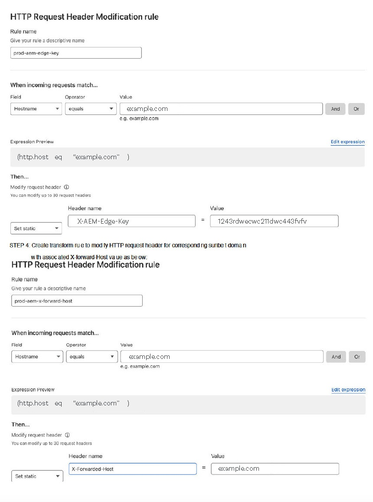

# CDN in AEM as a Cloud Service {#cdn}

>[!CONTEXTUALHELP]
>id="aemcloud_golive_cdn"
>title="CDN in AEM as a Cloud Service"
>abstract="AEM as a Cloud Service viene fornito con una rete CDN incorporata. Il suo scopo principale è ridurre la latenza distribuendo contenuti memorizzabili nella cache dai nodi della CDN al perimetro, vicino al browser. È completamente gestita e configurata per garantire prestazioni ottimali alle applicazioni AEM."

AEM as a Cloud Service viene fornito con una rete CDN integrata, progettata per ridurre la latenza distribuendo contenuto memorizzabile in cache dai nodi edge vicino al browser dell’utente. Questa rete CDN completamente gestita è ottimizzata per le prestazioni delle applicazioni AEM.

La rete CDN gestita da AEM soddisfa le esigenze di prestazioni e sicurezza della maggior parte dei clienti. Per il livello di pubblicazione, i clienti possono scegliere di indirizzare il traffico attraverso la propria rete CDN, che devono gestire. Questa opzione è disponibile caso per caso, in particolare quando i clienti dispongono di integrazioni legacy con un provider CDN difficili da sostituire.

I clienti che desiderano pubblicare sul livello Edge Delivery Services possono sfruttare la rete CDN gestita di Adobe. Vedi [CDN gestito da Adobe](#aem-managed-cdn). <!-- CQDOC-21758, 5b -->


<!-- ERROR: NEITHER URL IS FOUND (HTTP ERROR 404) Also, see the following videos [Cloud 5 AEM CDN Part 1](https://experienceleague.adobe.com/docs/experience-manager-learn/cloud-service/cloud-5/cloud5-aem-cdn-part1.html) and [Cloud 5 AEM CDN Part 2](https://experienceleague.adobe.com/docs/experience-manager-learn/cloud-service/cloud-5/cloud5-aem-cdn-part2.html) for additional information about CDN in AEM as a Cloud Service. -->

## CDN gestito di Adobe {#aem-managed-cdn}

<!-- CQDOC-21758, 5a -->

Per prepararti alla distribuzione dei contenuti utilizzando la rete CDN integrata di AEM tramite l’interfaccia utente self-service di Cloud Manager, puoi sfruttare le funzioni della rete CDN gestita di Adobe. Questa funzionalità consente di gestire la gestione CDN self-service, inclusa la configurazione e l&#39;installazione di certificati SSL come i certificati DV (convalida del dominio) o EV/OV (convalida estesa/organizzazione). Per ulteriori dettagli su questi metodi, vedi:

* [Edge Delivery Services in Cloud Manager](/help/implementing/cloud-manager/edge-delivery/introduction-to-edge-delivery-services.md)
* [Introduzione ai nomi di dominio personalizzati](/help/implementing/cloud-manager/custom-domain-names/introduction.md)
* [Introduzione ai certificati SSL](/help/implementing/cloud-manager/managing-ssl-certifications/introduction-to-ssl-certificates.md)
* [Configurare una rete CDN](/help/implementing/cloud-manager/domain-mappings/add-domain-mapping.md)

**Limitazione del traffico**

Per impostazione predefinita, per una configurazione CDN gestita da AEM tutto il traffico pubblico può indirizzarsi al servizio di pubblicazione, sia per gli ambienti di produzione che per quelli non di produzione (sviluppo e stage). Puoi limitare il traffico verso il servizio di pubblicazione per un dato ambiente (ad esempio, limitando la gestione temporanea da un intervallo di indirizzi IP) tramite l’interfaccia utente di Cloud Manager.

Per ulteriori informazioni, vedi [Gestione degli elenchi IP consentiti](/help/implementing/cloud-manager/ip-allow-lists/introduction.md).

>[!CAUTION]
>
>La rete CDN gestita di AEM trasmette le richieste solo dagli IP consentiti. Se indirizzi la tua rete CDN alla rete CDN gestita da AEM, accertati che gli IP della rete CDN siano inclusi nell’Elenco consentiti IP.

### Configurare il traffico sulla rete CDN {#cdn-configuring-cloud}

Puoi configurare il traffico sulla rete CDN in diversi modi, tra cui:

* blocco del traffico dannoso con [Regole filtro traffico](/help/security/traffic-filter-rules-including-waf.md) (incluse le regole WAF avanzate facoltativamente consentite)
* modifica della natura della [richiesta e risposta](/help/implementing/dispatcher/cdn-configuring-traffic.md#request-transformations)
* applicazione di [reindirizzamenti lato client](/help/implementing/dispatcher/cdn-configuring-traffic.md#client-side-redirectors) per 301/302
* dichiarazione di [selettori origine](/help/implementing/dispatcher/cdn-configuring-traffic.md#client-side-redirectors) per invertire una richiesta tramite proxy ai backend non AEM

Utilizza i file YAML in Git per configurare queste funzioni. E, utilizza la [pipeline di configurazione](/help/implementing/dispatcher/cdn-configuring-traffic.md) di Cloud Manager per distribuirli.

### Configurare le pagine di errore CDN {#cdn-error-pages}

Puoi configurare una pagina di errore CDN per sostituire la pagina predefinita senza marchio. Questa pagina personalizzata viene visualizzata nel raro caso in cui AEM non sia disponibile. Per ulteriori dettagli, vedere [Configurazione delle pagine di errore CDN](/help/implementing/dispatcher/cdn-error-pages.md).

### Eliminare i contenuti memorizzati nella cache sulla rete CDN {#purge-cdn}

Impostando il valore TTL (Time to Live) mediante l’intestazione HTTP cache-control è possibile bilanciare in modo efficace le prestazioni di distribuzione dei contenuti e lo stato di aggiornamento degli stessi. Tuttavia, negli scenari in cui è fondamentale distribuire immediatamente il contenuto aggiornato, può essere utile eliminare direttamente la cache CDN.

Leggi informazioni su [configurazione di un token API di eliminazione](/help/implementing/dispatcher/cdn-credentials-authentication.md/#purge-API-token) e [eliminazione del contenuto CDN memorizzato nella cache](/help/implementing/dispatcher/cdn-cache-purge.md).

### Autenticazione di base alla rete CDN {#basic-auth}

Per i casi di utilizzo di autenticazione leggera che includono soggetti interessati alle attività di revisione del contenuto, proteggi il contenuto visualizzando una finestra di dialogo di autenticazione di base che richiede un nome utente e una password. [Ulteriori informazioni](/help/implementing/dispatcher/cdn-credentials-authentication.md).

## CDN gestita dal cliente punta alla CDN gestita di AEM {#point-to-point-CDN}

>[!CONTEXTUALHELP]
>id="aemcloud_golive_byocdn"
>title="CDN del cliente (o proxy) punta alla CDN gestita di AEM"
>abstract="AEM as a Cloud Service offre alla clientela un’opzione per utilizzare la rete CDN esistente. Per il livello di pubblicazione, i clienti possono facoltativamente puntare a essa dalla propria CDN, che dovranno gestire. Questo scenario viene consentito caso per caso, in base al rispetto di alcuni prerequisiti, come ad esempio la presenza di un’eventuale integrazione precedente del cliente presso il proprio fornitore di CDN che sia difficile da abbandonare."

Se un cliente deve utilizzare la propria rete CDN esistente (o qualsiasi tipo di proxy inverso, ad esempio un loadbalancer o un WAF), può gestirla e indirizzarla alla rete CDN gestita da AEM, purché siano soddisfatte le seguenti condizioni:

* Il cliente deve disporre di una rete CDN esistente che sarebbe onerosa da sostituire.
* Il cliente deve gestirlo.
* Il cliente deve essere in grado di configurare la rete CDN in modo che funzioni con AEM as a Cloud Service (consulta le istruzioni di configurazione presentate di seguito).
* Il cliente deve disporre di esperti CDN tecnici che siano di guardia in caso di problemi correlati.
* Il cliente deve eseguire e superare con successo un test di carico prima di passare alla produzione.

Istruzioni di configurazione:

1. Puntare la rete CDN all’ingresso della rete CDN di Adobe come dominio di origine. Esempio: `publish-p<PROGRAM_ID>-e<ENV-ID>.adobeaemcloud.com`.
1. Imposta SNI sull’ingresso della rete CDN di Adobe.
1. Imposta l’intestazione Host sul dominio di origine. Ad esempio: `Host:publish-p<PROGRAM_ID>-e<ENV-ID>.adobeaemcloud.com`.
1. Imposta l&#39;intestazione `X-Forwarded-Host` con il nome di dominio in modo che AEM possa determinare l&#39;intestazione host. Ad esempio: `X-Forwarded-Host:example.com`.
1. Imposta `X-AEM-Edge-Key`. Il valore deve essere configurato utilizzando una pipeline di configurazione di Cloud Manager, come descritto in [questo articolo](/help/implementing/dispatcher/cdn-credentials-authentication.md#CDN-HTTP-value).

   * Necessario affinché il CDN di Adobe possa convalidare l&#39;origine delle richieste e passare le intestazioni `X-Forwarded-*` all&#39;applicazione AEM. Ad esempio, `X-Forwarded-For` viene utilizzato per determinare l&#39;IP del client. Pertanto, è responsabilità del chiamante fidato (ovvero, la rete CDN gestita dal cliente) garantire la correttezza delle intestazioni `X-Forwarded-*` (vedi la nota seguente).
   * Facoltativamente, l&#39;accesso all&#39;ingresso di Adobe CDN può essere bloccato quando non è presente un `X-AEM-Edge-Key`. Se hai bisogno di accedere direttamente all’ingresso di Adobe CDN (da bloccare), informa Adobe.

Consulta la sezione [Configurazioni di esempio del fornitore CDN](#sample-configurations) per esempi di configurazione dai principali fornitori CDN.

Prima di accettare il traffico in tempo reale, è necessario verificare con l’Assistenza clienti di Adobe che il routing del traffico end-to-end funzioni correttamente.

Dopo aver impostato `X-AEM-Edge-Key`, puoi verificare che la richiesta sia instradata correttamente come segue.

In Linux®:

```
curl https://publish-p<PROGRAM_ID>-e<ENV-ID>.adobeaemcloud.com -H "X-Forwarded-Host: example.com" -H "X-AEM-Edge-Key: <PROVIDED_EDGE_KEY>"
```

In Windows:

```
curl https://publish-p<PROGRAM_ID>-e<ENV-ID>.adobeaemcloud.com --header "X-Forwarded-Host: example.com" --header "X-AEM-Edge-Key: <PROVIDED_EDGE_KEY>"
```

>[!NOTE]
>
>Quando utilizzi una tua rete CDN, non è necessario installare domini e certificati in Cloud Manager. Il routing nella rete CDN di Adobe viene eseguito utilizzando il dominio predefinito `publish-p<PROGRAM_ID>-e<ENV-ID>.adobeaemcloud.com`, che deve essere inviato nell&#39;intestazione della richiesta `Host`. La sovrascrittura dell&#39;intestazione della richiesta `Host` con un nome di dominio personalizzato potrebbe instradare la richiesta in modo errato tramite la rete CDN di Adobe o causare errori 421.

>[!NOTE]
>
>I clienti che gestiscono la propria rete CDN devono garantire l’integrità delle intestazioni inviate tramite la rete CDN di AEM. Ad esempio, si consiglia ai clienti di cancellare tutte le intestazioni `X-Forwarded-*` e impostarle su valori noti e controllati. Ad esempio, `X-Forwarded-For` deve contenere l&#39;indirizzo IP del client, mentre `X-Forwarded-Host` deve contenere l&#39;host del sito.

>[!NOTE]
>
>Gli ambienti dei programmi sandbox non supportano una rete CDN fornita dal cliente.

L’hop aggiuntivo tra la rete CDN del cliente e la rete CDN di AEM è necessario solo se si verifica un errore nella cache. Utilizzando le strategie di ottimizzazione della cache descritte in questo articolo, l’aggiunta di una rete CDN del cliente dovrebbe introdurre solo una latenza trascurabile.

Questa configurazione CDN del cliente è supportata per il livello di pubblicazione, ma non prima del livello di authoring.

### Configurazione di debug

Per eseguire il debug di una configurazione BYOCDN, utilizzare l&#39;intestazione `x-aem-debug` con il valore `edge=true`. Ad esempio:

In Linux®:

```
curl https://publish-p<PROGRAM_ID>-e<ENV-ID>.adobeaemcloud.com -v -H "X-Forwarded-Host: example.com" -H "X-AEM-Edge-Key: <PROVIDED_EDGE_KEY>" -H "x-aem-debug: edge=true"
```

In Windows:

```
curl https://publish-p<PROGRAM_ID>-e<ENV-ID>.adobeaemcloud.com -v --header "X-Forwarded-Host: example.com" --header "X-AEM-Edge-Key: <PROVIDED_EDGE_KEY>" --header "x-aem-debug: edge=true"
```

Questo processo riflette alcune proprietà utilizzate nella richiesta nell&#39;intestazione di risposta `x-aem-debug`. Ad esempio:

```
x-aem-debug: byocdn=true,edge=true,edge-auth=edge-auth,edge-key=edgeKey1,X-AEM-Edge-Key=set,host=publish-p87058-e257304-cmstg.adobeaemcloud.com,x-forwarded-host=wknd.site,adobe_unlocked_byocdn=true
```

Questo processo consente la verifica di dettagli quali i valori host, la configurazione dell’autenticazione edge e il valore dell’intestazione x-forwarded-host. Inoltre, identifica se è impostata una chiave edge e quale chiave viene utilizzata se esiste una corrispondenza.

### Esempio di configurazioni fornitore CDN {#sample-configurations}

Di seguito sono riportati diversi esempi di configurazione di diversi fornitori CDN leader.

**Akamai**


**Amazon CloudFront**


**Cloudflare**




### Errori comuni {#common-errors}

Le configurazioni di esempio fornite mostrano le impostazioni di base necessarie. Tuttavia, una configurazione del cliente può avere altre regole che interessano e che rimuovono, modificano o riorganizzano le intestazioni necessarie affinché AEM as a Cloud Service distribuisca il traffico. Di seguito sono riportati gli errori comuni che si verificano durante la configurazione di una rete CDN gestita dal cliente per puntare ad AEM as a Cloud Service.

**Reindirizzamento all&#39;endpoint del servizio di pubblicazione**

Quando una richiesta riceve una risposta 403 non consentita, significa che mancano alcune intestazioni richieste. Una causa comune è che la rete CDN gestisce sia il traffico del dominio APEX che quello del dominio `www`, ma non aggiunge l&#39;intestazione corretta per il dominio `www`. Per risolvere questo problema, controlla i registri CDN di AEM as a Cloud Service e verifica le intestazioni di richiesta necessarie.

**Errore 421: reindirizzamento errato**

Un errore 421 con il messaggio `Requested host does not match any Subject Alternative Names (SANs) on TLS certificate` indica che l&#39;HTTP `Host` non corrisponde agli host elencati nel certificato. Questo problema indica in genere che `Host` o l&#39;impostazione SNI non è corretta. Assicurarsi che sia `Host` che le impostazioni SNI puntino all&#39;host publish-p&lt;PROGRAM_ID>-e.adobeaemcloud.com.

**Troppi reindirizzamenti al ciclo**

Quando una pagina riceve un loop di tipo &quot;Troppi reindirizzamenti&quot;, viene aggiunta un’intestazione di richiesta alla rete CDN che corrisponde a un reindirizzamento che la forza a tornare a se stessa. Ad esempio:

* Viene creata una regola CDN che corrisponde al dominio apex o al dominio www e aggiunge l’intestazione X-Forwarded-Host solo del dominio apex.
* Una richiesta per un dominio apex corrisponde a questa regola CDN, che aggiunge il dominio apex come intestazione X-Forwarded-Host.
* Viene inviata una richiesta all&#39;origine in cui un reindirizzamento corrisponde esplicitamente all&#39;intestazione host per il dominio apex (ad esempio, ^example.com).
* Viene attivata una regola di riscrittura, che riscrive la richiesta per il dominio apex in https con il sottodominio www.
* Tale reindirizzamento viene quindi inviato al server Edge del cliente, dove viene riattivata la regola CDN, aggiungendo nuovamente l’intestazione X-Forwarded-Host per il dominio apex e non per il sottodominio www. Il processo viene quindi riavviato fino a quando la richiesta non riesce.

Per risolvere questo problema, valuta la strategia di reindirizzamento SSL, le regole CDN e le combinazioni di regole di reindirizzamento e riscrittura.

## Intestazioni di geolocalizzazione {#geo-headers}

Il CDN gestito da AEM aggiunge intestazioni a ogni richiesta con:

* codice paese: `x-aem-client-country`
* Codice continente: `x-aem-client-continent`

>[!NOTE]
>
>Se è presente una rete CDN gestita dal cliente, queste intestazioni riflettono la posizione del server proxy CDN del cliente anziché il client effettivo. I clienti devono gestire le intestazioni di geolocalizzazione tramite la propria rete CDN quando utilizzano una rete CDN gestita dal cliente.

I valori per i codici paese sono i codici Alpha-2 descritti in [ISO 3166-1](https://en.wikipedia.org/wiki/ISO_3166-1).

I valori per i codici continente sono:

* AF Africa
* AN Antartide
* AS Asia
* Europa UE
* NA Nord America
* OC Oceania
* SA Sud America

Queste informazioni sono utili per il reindirizzamento a un URL diverso in base al paese di origine della richiesta. Utilizza l’intestazione Vary per memorizzare nella cache le risposte che dipendono dalle informazioni geografiche. Ad esempio, i reindirizzamenti a una pagina di destinazione di un paese specifico devono sempre contenere `Vary: x-aem-client-country`. Se necessario, è possibile utilizzare `Cache-Control: private` per impedire il caching. Vedi anche [Memorizzazione in cache](/help/implementing/dispatcher/caching.md#html-text).
