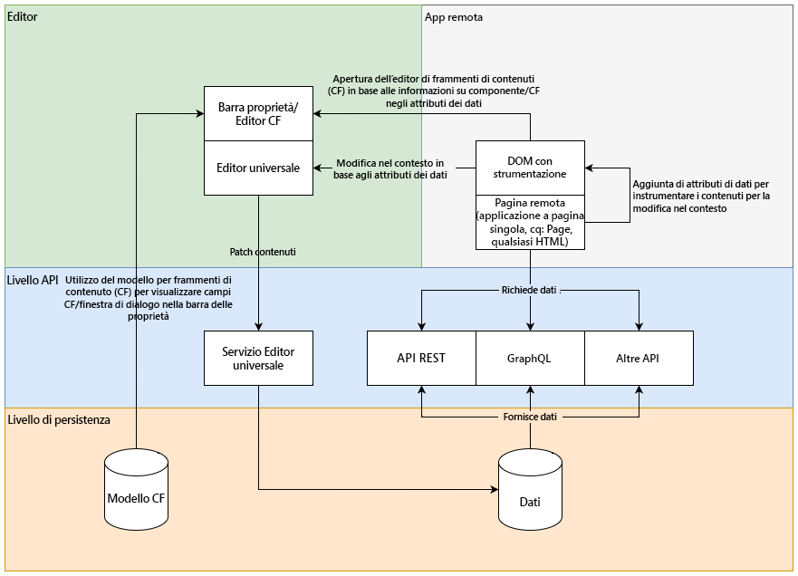
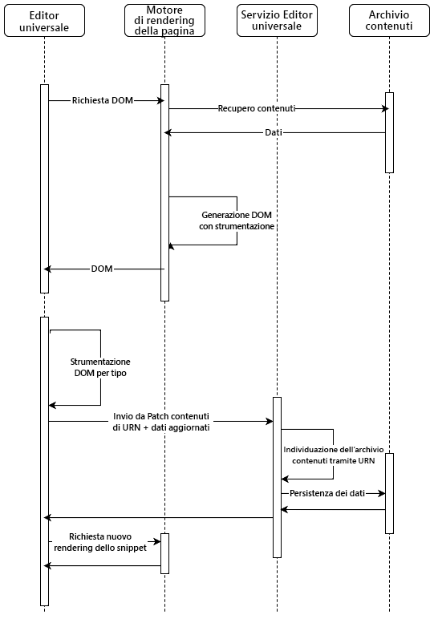
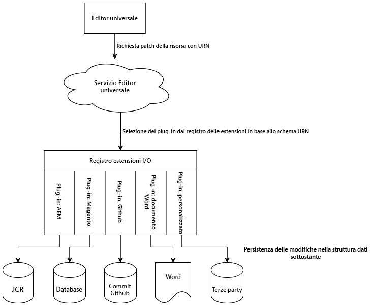
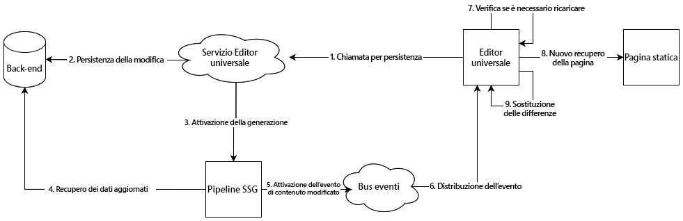
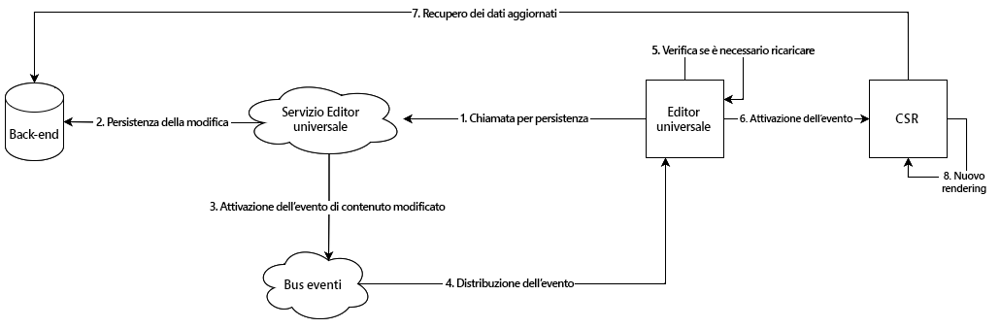

# Architettura dell’editor universale {#architecture}

Scopri l’architettura dell’editor universale e il flusso di dati tra i suoi servizi e livelli.

## Blocchi predefiniti di architettura {#building-blocks}

L’editor universale è costituito da quattro blocchi predefiniti essenziali che interagiscono tra loro e consentono agli autori di contenuti di modificare qualsiasi aspetto di qualsiasi contenuto in qualsiasi implementazione, per offrire esperienze eccezionali, velocizzare i contenuti e fornire un’esperienza di sviluppo all’avanguardia. 

1. [Editor](#editors)
1. [App remota](#remote-app)
1. [Livello API](#api-layer)
1. [Livello di persistenza](#persistence-layer)

Questo documento delinea ciascuno di questi blocchi predefiniti e la loro modalità di scambio dei dati.

>[!TIP]
>
>Per visualizzare l’editor universale e la relativa architettura in azione, consulta il documento [Guida introduttiva all’editor universale in AEM](getting-started.md) per scoprire come accedere all’editor universale e come iniziare a instrumentare la tua prima app AEM da utilizzare.

### Editor {#editors}

* **Editor universale**: l’editor universale utilizza un DOM abilitato per consentire la modifica diretta dei contenuti. Consulta il documento [Attributi e tipi](attributes-types.md) per informazioni dettagliate sui metadati necessari. Consulta il documento [Guida introduttiva all’editor universale in AEM](getting-started.md) per un esempio della strumentazione in AEM.
* **Barra delle proprietà**: alcune proprietà dei componenti non possono essere modificate nel contesto, come il tempo di rotazione di un carosello o quale scheda a soffietto deve essere sempre aperta o chiusa. Per consentire la modifica di tali informazioni sui componenti, nella barra laterale dell’editor viene fornito un editor basato su moduli.

### App remota {#remote-app}

Per rendere modificabile un’app in un contesto nell’editor universale, è necessario instrumentare il DOM. L’app remota deve eseguire il rendering di alcuni attributi nel DOM. Consulta il documento [Attributi e tipi](attributes-types.md) per informazioni dettagliate sui metadati necessari. Consulta il documento [Guida introduttiva all’editor universale in AEM](getting-started.md) per un esempio di strumentazione in AEM.

L’editor universale richiede un SDK minimo, pertanto la strumentazione rientra nell’implementazione dell’app remota. 

### Livello API {#api-layer}

* **Dati contenuto**: per l’editor universale, non è importante né il sistema sorgente dei dati di contenuto né il modo in cui vengono utilizzati. È importante solo definire e fornire gli attributi richiesti utilizzando dati modificabili contestuali.
* **Dati persistenti**: per ogni dato modificabile è presente un identificatore URN. Questo URN viene utilizzato per indirizzare la persistenza al sistema e alla risorsa giusti.

### Livello di persistenza {#persistence-layer}

* **Modello per frammenti di contenuto**: per supportare la barra laterale per la modifica delle proprietà dei frammenti di contenuto, dell’editor di frammenti di contenuto e degli editor basati su moduli, sono necessari modelli per componente e frammenti di contenuto.
* **Contenuto**: il contenuto può essere archiviato ovunque, ad esempio in AEM, Magento, ecc.

## Servizio di editor universale e invio del sistema di back-end {#service}

L’editor universale invia tutte le modifiche al contenuto in un servizio centralizzato denominato servizio dell’editor universale. Questo servizio, in esecuzione su Adobe I/O Runtime, carica i plug-in disponibili nel registro estensioni in base all’URN fornito. Il plug-in è responsabile della comunicazione al back-end e della restituzione di una risposta unificata.

## Pipeline di rendering {#rendering-pipelines}

### Rendering lato server {#server-side}

### Generazione statica del sito {#static-generation}

### Rendering lato client {#client-side}

## Risorse aggiuntive {#additional-resources}

Per ulteriori informazioni sull’editor universale, consulta questi documenti.

* [Introduzione all’editor universale](introduction.md): scopri come l’editor universale consente di modificare qualsiasi aspetto di qualsiasi contenuto in qualsiasi implementazione per offrire esperienze eccezionali, velocizzare i contenuti e fornire un’esperienza di sviluppo all’avanguardia.
* [Authoring dei contenuti con l’editor universale](authoring.md): scopri quanto è semplice e intuitivo per gli autori di contenuti creare contenuti utilizzando l’editor universale.
* [Pubblicazione di contenuti con l’editor universale](publishing.md): scopri in che modo l&#39;editor visivo universale pubblica i contenuti e come le tue app possono gestire i contenuti pubblicati.
* [Guida introduttiva all’editor universale in AEM](getting-started.md): scopri come accedere all’editor universale e come iniziare a instrumentare la tua prima app AEM da utilizzare.
* [Attributi e tipi](attributes-types.md): scopri gli attributi e i tipi di dati richiesti dall’editor universale.
* [Autenticazione dell’editor universale](authentication.md): scopri come l’editor universale effettua l’autenticazione.
