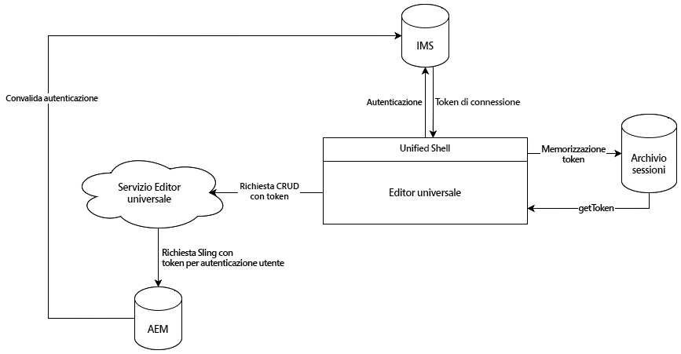

# Autenticazione dell’editor universale {#authentication}

Scopri come l’editor universale effettua l’autenticazione.

## Opzioni {#options}

L’editor universale utilizza l’autenticazione Identity Management System (IMS) di Adobe, fornita tramite la shell unificata.

Tutte le applicazioni/pagine remote necessitano dell’autenticazione dei sistemi back-end richiesti. Il servizio editor universale richiede questa autenticazione ai sistemi di back-end per eseguire operazioni CRUD in quanto si tratta di un servizio indipendente.

## Flusso standard {#standard-flow}

Questa è la soluzione per AEM as a Cloud Service e AMS che usano IMS per servirsi dell’editor universale.

Per utilizzare l’editor universale, l’utente deve essere connesso alla shell unificata che esegue l’autenticazione tramite IMS. Il token IMS fornito viene memorizzato nell’archivio delle sessioni degli utenti.

Ogni volta che un utente esegue un’operazione CRUD, viene inviata una chiamata al servizio editor universale con il token di connessione IMS nell’intestazione HTTP. Il servizio editor universale utilizza quindi il token di connessione per autenticare la richiesta al sistema di back-end di AEM per eseguire operazioni a nome dell’utente.

In questo diagramma e nell’articolo viene descritta l’autenticazione interna dell’editor universale.

{{ue-headless-auth}}
