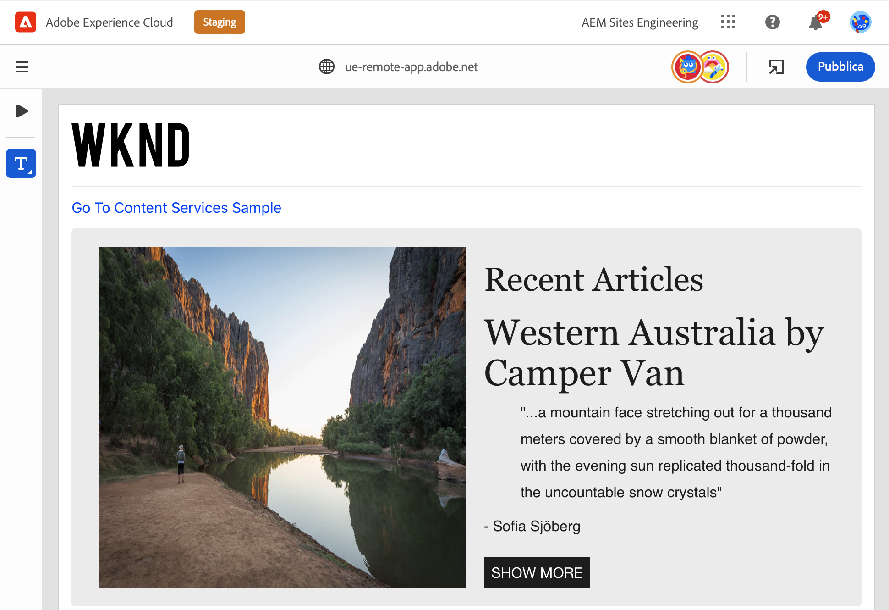
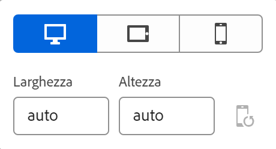
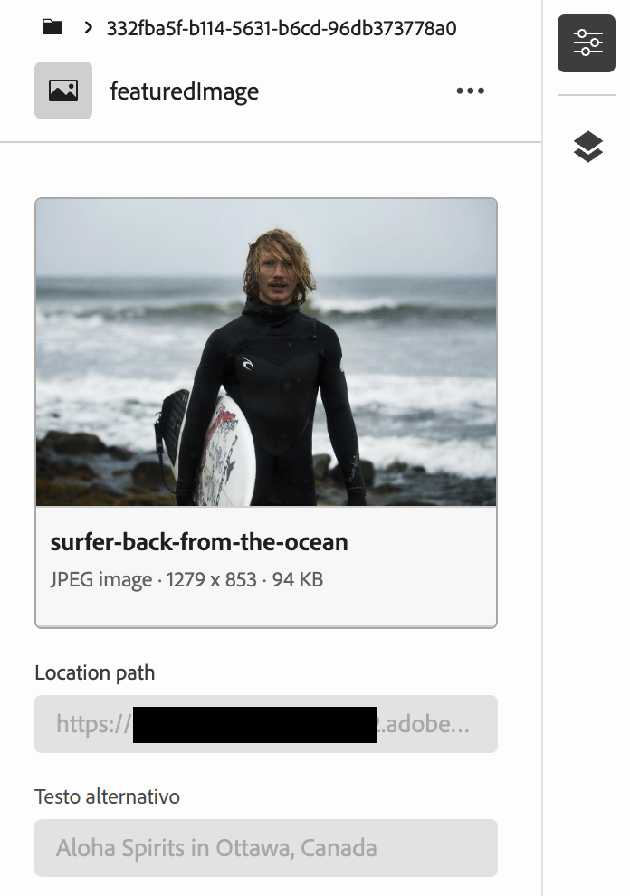
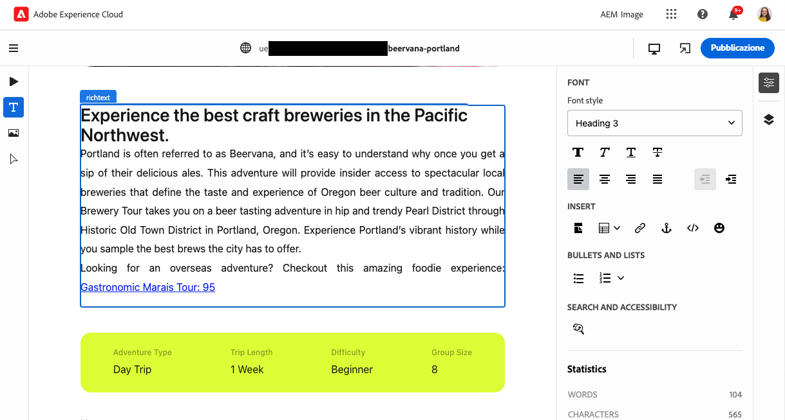
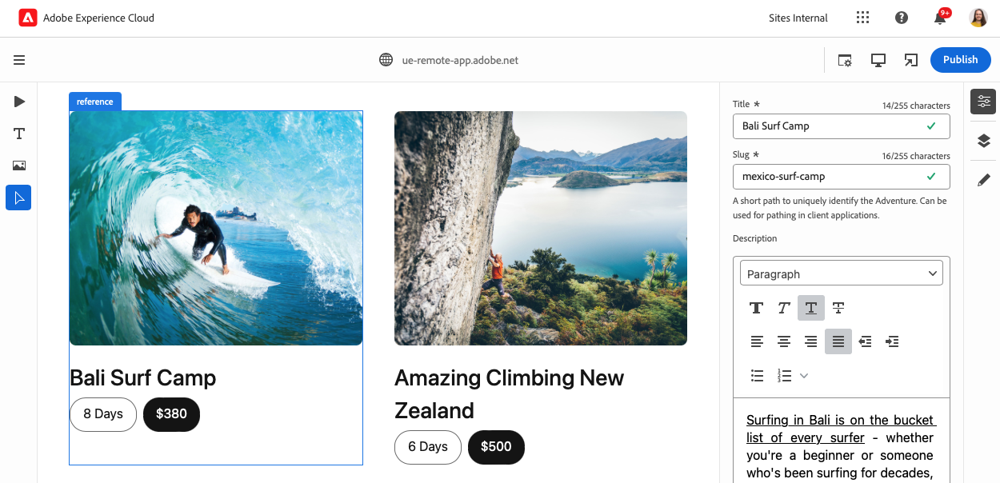

# Authoring dei contenuti con l’editor universale {#authoring}

Scopri quanto è semplice e intuitivo per gli autori di contenuti creare contenuti utilizzando l’editor universale.

## Introduzione {#introduction}

L’editor universale consente di modificare ogni aspetto di qualsiasi contenuto in qualsiasi implementazione in modo da offrire esperienze eccezionali, velocizzare la preparazione dei contenuti e fornire un’esperienza di sviluppo all’avanguardia.

A questo scopo, l’editor universale offre agli autori di contenuti un’interfaccia utente intuitiva che richiede una formazione minima per poter entrare e iniziare a modificare i contenuti. Questo documento descrive l’esperienza di authoring dell’editor universale.

>[!TIP]
>
>Per un’introduzione più dettagliata all’editor universale, consulta il documento [Introduzione all’editor universale.](introduction.md)

>[!NOTE]
>
>L’editor universale è ancora in fase di sviluppo. Attualmente non è possibile modificare tutti i tipi di contenuto.

## Preparare l’app {#prepare-app}

Per creare contenuti per un’app utilizzando l’editor universale, l’app deve essere preparata da uno sviluppatore per supportare l’editor.

>[!TIP]
>
>Consulta il documento [Guida introduttiva all’editor universale in AEM](getting-started.md) per un esempio su come configurare un’app AEM per utilizzare l’editor universale.

## Accedi {#sign-in}

Dopo aver instrumentato l’app per l’utilizzo dell’editor universale, accedi all’editor universale. È necessario un Adobe ID per accedere e [accedere all’editor universale.](getting-started.md#request-access)

Dopo aver effettuato l’accesso, immetti l’URL della pagina da modificare nella [barra degli indirizzi.](#location-bar) in modo da poter iniziare a modificare i contenuti, come [contenuto testo](#text-mode) o il [contenuto multimediale.](#media-mode)

## Comprendere l’interfaccia utente {#ui}

L’interfaccia utente è divisa in cinque aree principali.

* [Intestazione di Experience Cloud](#experience-cloud-header)
* [Intestazione dell’editor universale](#universal-editor-header)
* [La barra modalità](#mode-rail)
* [L’editor](#editor)
* [Barra delle proprietà](#properties-rail)

### Intestazione di Experience Cloud {#experience-cloud-header}

L’intestazione di Experience Cloud è sempre presente nella parte superiore dello schermo. È un ancoraggio che indica dove ti trovi all’interno di Experience Cloud e ti aiuta a passare ad altre app di Experience Cloud.

#### Experience Manager {#experience-manager}

Seleziona il collegamento Adobe Experience Cloud a sinistra dell’intestazione per passare alla directory principale della soluzione Experience Manager e accedere a strumenti come [Cloud Manager,](/help/onboarding/cloud-manager-introduction.md) [Cloud Acceleration Manager,](/help/journey-migration/cloud-acceleration-manager/introduction/overview-cam.md) e [Distribuzione di software.](https://experienceleague.adobe.com/docs/experience-cloud/software-distribution/home.html?lang=it)

#### Organizzazione {#organization}

Viene visualizzata l’organizzazione in cui hai effettuato l’accesso. Seleziona questa opzione per passare a un’altra organizzazione se l’Adobe ID è associata a più.

#### Soluzioni {#solutions}

Toccando o facendo clic sul selettore delle soluzioni puoi passare rapidamente ad altre soluzioni di Experience Cloud.

#### Aiuto {#help}

L’icona dell’aiuto fornisce un accesso rapido alle risorse di apprendimento e supporto.

#### Notifiche {#notifications}

Questa icona viene contrassegnata con il numero di [notifiche](/help/implementing/cloud-manager/notifications.md) incomplete attualmente assegnate.

#### Proprietà utente {#user-properties}

Seleziona l’icona che rappresenta l’utente per accedere alle impostazioni utente. Se non hai configurato un’immagine utente, viene assegnata un’icona in modo casuale.

### Intestazione dell’editor universale {#universal-editor-header}

L’intestazione dell’editor universale è sempre presente nella parte superiore dello schermo immediatamente sotto [l’intestazione di Experience Cloud.](#experience-cloud-header) Consente un accesso rapido per passare a un’altra pagina di modifica e di pubblicazione della pagina corrente.

#### Pulsante Home {#home-button}

Il pulsante Home consente di tornare alla pagina iniziale di Universal Editor

Nella pagina iniziale è possibile immettere l&#39;URL del sito che si desidera modificare con l&#39;editor universale.

>[!NOTE]
>
>Qualsiasi pagina che desideri modificare con Universal Editor deve essere [dotato di strumenti per supportare Universal Editor.](getting-started.md)

#### Barra della posizione {#location-bar}

La barra della posizione mostra l’indirizzo della pagina che stai modificando. Selezionare questa opzione per immettere l&#39;indirizzo di un&#39;altra pagina da modificare.

>[!TIP]
>
>Usa il tasto di scelta rapida `L` per aprire la barra degli indirizzi.

>[!NOTE]
>
>Qualsiasi pagina che desideri modificare con Universal Editor deve essere [dotato di strumenti per supportare Universal Editor.](getting-started.md)

#### Impostazioni intestazione autenticazione {#authentication-settings}

Se devi impostare un segreto di autenticazione, seleziona l’icona delle impostazioni dell’intestazione di autenticazione.

#### Impostazioni emulatore {#emulator}

Seleziona l’icona di emulazione per definire il rendering della pagina in Editor universale.

Toccando o facendo clic sull’icona dell’emulatore vengono visualizzate le opzioni.

Per impostazione predefinita, l’editor si apre in layout desktop, dove l’altezza e la larghezza vengono definite automaticamente dal browser.

Puoi anche scegliere di emulare un dispositivo mobile e nell’editor universale:

* Definirne l’orientamento
* Definire la larghezza e l’altezza
* Modificare l’orientamento

#### Apri anteprima app {#open-app-preview}

Seleziona l’icona di anteprima dell’app aperta per aprire la pagina che stai modificando nella scheda del browser corrispondente, senza dover accedere all’editor per visualizzare l’anteprima dei contenuti.

>[!TIP]
>
>Usa il tasto di scelta rapida `O` (la lettera O) per aprire l’anteprima dell’app.

#### Pubblicazione {#publish}

Seleziona il pulsante Pubblica per pubblicare le modifiche al contenuto live per consentirne l’utilizzo da parte dei lettori.

>[!TIP]
>
>Consulta il documento [Pubblicazione di contenuti con l’editor universale](publishing.md) per ulteriori informazioni sulla pubblicazione con Universal Editor.

### La barra modalità {#rail}

La barra della modalità si trova appena sotto il pulsante Home ed è sempre presente lungo il lato sinistro dell’editor. L&#39;editor può essere commutato facilmente tra le diverse modalità di utilizzo.

#### Modalità Anteprima {#preview-mode}

In modalità anteprima, la pagina viene riprodotta nell’editor come verrebbe visualizzata sul servizio pubblicato. Questo consente all’autore di contenuto di navigare nel contenuto facendo clic sui collegamenti e così via.

>[!TIP]
>
>Usa il tasto di scelta rapida `P` per passare alla modalità anteprima.

#### Modalità componenti {#component-mode}

Nella modalità componenti, l’autore di contenuto può selezionare i componenti da modificare, tra cui:

* [Modifica del testo normale](#editing-content) sul posto.
* [Modifica del testo RTF](#editing-rich-text) nella barra delle proprietà vengono visualizzate ulteriori opzioni di formattazione.
* [Modifica del contenuto multimediale](#editing-media)
* [Modifica di frammenti di contenuto](#edit-content-fragment)

Quando selezioni un componente, i dettagli del suo contenuto vengono visualizzati nel [barra delle proprietà.](#properties-rail) A seconda del tipo di contenuto, puoi modificare direttamente o nella barra delle proprietà.

>[!TIP]
>
>Utilizza il tasto di scelta rapida `C` per passare alla modalità componenti.

### L’editor {#editor}

L’editor occupa la maggior parte della finestra ed è l’area in cui viene eseguito il rendering della pagina specificata nella [barra della posizione](#location-bar).

* Se l’editor è in [modalità componenti,](#component-mode) il contenuto sarà modificabile, ma non puoi seguire i collegamenti.
* Se l’editor è in [modalità anteprima,](#preview-mode) il contenuto sarà navigabile e potrai seguire i collegamenti, ma non puoi modificarlo.

### Barra delle proprietà {#properties-rail}

La barra delle proprietà è sempre presente lungo il lato destro dell’editor. A seconda della modalità, può mostrare i dettagli di un componente selezionato nel contenuto o la gerarchia dei contenuti della pagina.

#### Modalità proprietà {#properties-mode}

In modalità proprietà, la barra mostra le proprietà del componente attualmente selezionato nell’editor. Questa è la modalità predefinita della barra delle proprietà quando viene caricata una pagina.

A seconda del tipo di componente selezionato, i dettagli possono essere visualizzati e modificati nella barra delle proprietà.

Nota che non tutti i componenti hanno dettagli che possono essere visualizzati e/o modificati.

>[!TIP]
>
>Usa il tasto di scelta rapida `D` per passare alla modalità proprietà.

#### Modalità struttura contenuto {#content-tree-mode}

In modalità struttura contenuto, la barra mostra la gerarchia del contenuto della pagina.

Quando si seleziona un elemento nella struttura del contenuto, l’editor scorre fino a quel contenuto e lo seleziona.

>[!TIP]
>
>Usa il tasto di scelta rapida `F` per passare alla modalità struttura contenuto.

##### Modifica {#edit}

In [modalità componenti,](#component-mode) le opzioni di modifica per il componente selezionato vengono visualizzate nella barra delle proprietà. Nella barra delle proprietà puoi modificare il componente selezionato. Se il componente selezionato è un frammento di contenuto, puoi anche selezionare il pulsante Modifica.

Toccando o facendo clic sul pulsante di modifica si apre [Editor frammento di contenuto](/help/assets/content-fragments/content-fragments-managing.md#opening-the-fragment-editor) in una nuova scheda. Questo consente di accedere a tutte le funzionalità dell’Editor frammento di contenuto per modificare il frammento di contenuto associato.

A seconda delle esigenze del flusso di lavoro, può essere utile modificare il frammento di contenuto nell’editor universale o direttamente nell’editor frammento di contenuto.

>[!TIP]
>
>Utilizza il tasto di scelta rapida `E` per modificare un componente selezionato.

##### Aggiungi {#add}

Se selezioni un componente contenitore nella struttura del contenuto o nell’editor, l’opzione aggiungi viene visualizzata nella barra delle proprietà.

Toccando o facendo clic sul pulsante Aggiungi si apre un menu a discesa dei componenti disponibili per [aggiungi al contenitore selezionato.](#adding-components)

>[!TIP]
>
>Utilizza il tasto di scelta rapida `A` per aggiungere un componente a un componente contenitore selezionato.

##### Eliminare {#delete}

Se selezioni un componente all’interno di un componente contenitore nella struttura del contenuto o nell’editor, l’opzione Elimina viene visualizzata nella barra delle proprietà.

Toccando o facendo clic sul pulsante Elimina [elimina il componente.](#deleting-components)

>[!TIP]
>
>Utilizza il tasto di scelta rapida `Shift+Backspace` per eliminare un componente selezionato da un contenitore.

## Modifica del contenuto {#editing-content}

La modifica del contenuto è semplice e intuitiva. In entrata [modalità componenti](#component-mode)Quando passi il mouse sul contenuto nell’editor, il contenuto modificabile viene evidenziato con una casella blu.

>[!TIP]
>
>In modalità componenti, tocca o fai clic sul contenuto per selezionarlo e modificarlo. Se desideri navigare nel contenuto seguendo i collegamenti, passa a [modalità anteprima.](#preview-mode)

A seconda del contenuto selezionato, è possibile che siano disponibili diverse opzioni di modifica diretta e che siano disponibili ulteriori informazioni e opzioni per il contenuto nel [barra delle proprietà.](#properties-rail)

### Modifica del testo normale {#edit-plain-text}

Se ti trovi in [modalità componenti](#component-mode) e selezionare un componente testo normale, puoi modificare il testo nella posizione facendo doppio clic o toccando due volte il componente.

Per salvare le modifiche, premere Invio/Ritorna o selezionare all&#39;esterno della casella.

Quando selezioni di selezionare il componente testo, i relativi dettagli vengono visualizzati nella barra delle proprietà. Puoi anche modificare il testo nella barra.

Inoltre, i dettagli sul testo sono disponibili nella barra delle proprietà. Le modifiche vengono salvate automaticamente una volta che lo stato attivo lascia il campo modificato nella barra delle proprietà.

### Modifica del testo formattato {#edit-rich-text}

Se ti trovi in [modalità componenti](#component-mode) e selezionare un componente testo RTF, puoi modificare il testo nella posizione facendo doppio clic o toccando due volte il componente.

Per salvare le modifiche, premere Invio/Ritorna o selezionare all&#39;esterno della casella.

Inoltre, le opzioni di formattazione e i dettagli sul testo sono disponibili nella barra delle proprietà. Le modifiche vengono salvate automaticamente una volta che lo stato attivo lascia il campo modificato nella barra delle proprietà.

### Editing di file multimediali {#edit-media}

Se ti trovi in [modalità componenti](#component-mode) se selezioni un’immagine, puoi visualizzarne i dettagli nella barra delle proprietà.

Seleziona la **Sostituisci** nella barra delle proprietà, sotto l’anteprima dell’immagine selezionata, per sostituirla con un’altra immagine della libreria di risorse.

1. Il [selettore risorse](/help/assets/asset-selector.md#using-asset-selector) viene visualizzata una finestra che consente di selezionare una risorsa.
1. Seleziona per selezionare una nuova risorsa.
1. Seleziona **Seleziona** per tornare alla barra delle proprietà in cui è stata sostituita la risorsa.

Le modifiche vengono salvate automaticamente nel contenuto.

>[!TIP]
>
>Utilizza il tasto di scelta rapida `R` per aprire il selettore risorse e sostituire l’immagine selezionata.

### Modifica di frammenti di contenuto {#edit-content-fragment}

Se ti trovi in [modalità componenti](#component-mode) e selezioni una [Frammento di contenuto,](/help/sites-cloud/administering/content-fragments/overview.md) puoi modificarne i dettagli nella barra delle proprietà.

I campi definiti nel modello di contenuto del frammento di contenuto selezionato vengono visualizzati e modificabili nella barra delle proprietà.

Se selezioni un campo correlato a un frammento di contenuto, il frammento di contenuto viene caricato nella barra dei componenti e il campo viene scorruto automaticamente in.

Le modifiche vengono salvate automaticamente una volta che lo stato attivo lascia il campo modificato nella barra delle proprietà.

Se desideri modificare il frammento di contenuto in [Editor frammento di contenuto](/help/sites-cloud/administering/content-fragments/authoring.md) invece, fai clic su [pulsante modifica](#edit) nella barra delle modalità.

A seconda delle esigenze del flusso di lavoro, può essere utile modificare il frammento di contenuto nell’editor universale o direttamente nell’editor frammento di contenuto.

### Aggiunta di componenti ai contenitori {#adding-components}

1. Seleziona un componente contenitore nella struttura del contenuto o nell’editor.
1. Quindi seleziona l’icona Aggiungi nella barra delle proprietà.

   

Il componente viene inserito nel contenitore e può essere modificato nell’editor.

>[!TIP]
>
>Utilizza il tasto di scelta rapida `A` per aggiungere un componente al contenitore selezionato.

### Eliminazione di componenti dai contenitori {#deleting-components}

1. Seleziona un componente contenitore nella struttura del contenuto o nell’editor.
1. Seleziona l’icona della freccia del contenitore per espanderne il contenuto nella struttura del contenuto.
1. Quindi, nella struttura del contenuto, seleziona un componente all’interno del contenitore.
1. Seleziona l’icona Elimina nella barra delle proprietà.

   

Il componente selezionato è stato eliminato.

>[!TIP]
>
>Utilizza il tasto di scelta rapida `Shift+Backspace` per eliminare il componente selezionato dal relativo contenitore.

### Riordinamento dei componenti nei contenitori {#reordering-components}

1. Seleziona un componente contenitore nella struttura del contenuto o nell’editor.
1. Se non è già in [modalità struttura contenuto,](#content-tree-mode) passa ad esso.
1. Seleziona l’icona della freccia del contenitore per espanderne il contenuto nella struttura del contenuto.
1. Trascina le icone delle maniglie accanto ai componenti all’interno del contenitore per mostrare che puoi riorganizzarli. Trascina i componenti per riordinarli all’interno del contenitore.

   

1. Il componente trascinato diventa grigio nell’albero dei componenti, mentre il punto di inserimento è rappresentato da una linea blu. Rilasciate il componente per posizionarlo nella nuova posizione.

I componenti vengono riordinati sia nella struttura del contenuto che nell’editor

## Anteprima del contenuto {#previewing-content}

Quando hai finito di modificare il contenuto, spesso desideri navigare in esso per vedere come si presenta nel contenuto di altre pagine. In [modalità anteprima](#preview-mode) puoi fare clic sui collegamenti per navigare nel contenuto come farebbe un lettore. Il contenuto viene riprodotto nell’editor così come verrebbe pubblicato.

In modalità anteprima, toccando o facendo clic sul contenuto questo appare così come si presenterebbe a un lettore. Se desideri selezionare il contenuto da modificare, passa a [modalità componenti.](#component-mode)

## Risorse aggiuntive {#additional-resources}

Per ulteriori informazioni sull’editor universale, consulta questi documenti.

* [Introduzione all’editor universale](introduction.md): scopri come l’editor universale consente di modificare ogni aspetto di qualsiasi contenuto in qualsiasi implementazione per fornire esperienze eccezionali, velocizzare la preparazione dei contenuti e fornire un’esperienza di sviluppo all’avanguardia.
* [Pubblicazione di contenuti con l’editor universale](publishing.md) - Scopri come l’Editor universale pubblica i contenuti e come le app possono gestire i contenuti pubblicati.
* [Guida introduttiva all’editor universale in AEM](getting-started.md): scopri come accedere all’editor universale e come iniziare a instrumentare la prima app AEM per utilizzarla.
* [Architettura dell’editor universale](architecture.md): scopri l’architettura dell’editor universale e il flusso di dati tra i suoi servizi e livelli.
* [Attributi e tipi](attributes-types.md): scopri gli attributi e i tipi di dati richiesti dall’editor universale.
* [Autenticazione dell’editor universale](authentication.md): scopri come l’editor universale effettua l’autenticazione.
