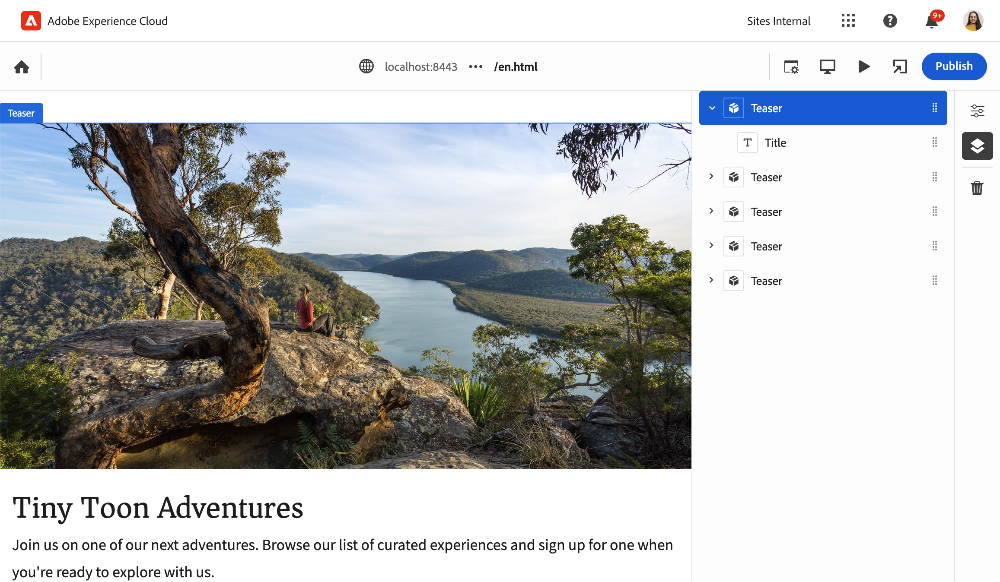

# Panoramica dell’editor universale per sviluppatori AEM {#developer-overview}

Se ti occupi dello sviluppo AEM e ti interessa sapere come funziona l’editor universale e come utilizzarlo nel progetto, questo documento ti offre un’introduzione end-to-end che ti guida attraverso la strumentazione del progetto WKND per utilizzare l’editor universale.

## Scopo {#purpose}

Questo documento fornisce un’introduzione per gli sviluppatori sia sulle modalità di funzionamento dell’editor universale che su come dotare l’applicazione di strumenti per utilizzarlo.

A tal fine, utilizza un esempio standard che la maggior parte degli sviluppatori di AEM conosce, i componenti core e il sito WKND, e fornisce gli strumenti ad alcuni componenti di esempio da modificare utilizzando l’editor universale.

>[!TIP]
>
>Questo documento illustra i passaggi aggiuntivi necessari per illustrare il funzionamento dell’editor universale e ha lo scopo di approfondire la comprensione dell’editor da parte degli sviluppatori. Non prende quindi la via più diretta per aggiungere strumento all’app, ma la più illustrativa dell&#39;editor universale e come funziona.
>
>Se desideri iniziare a utilizzarlo il più rapidamente possibile, consulta il documento [Guida introduttiva all’editor universale in AEM](/help/implementing/universal-editor/getting-started.md).

## Prerequisiti {#prerequisites}

Per proseguire con questa panoramica, devi disporre di quanto segue.

* [Un’istanza di sviluppo locale di AEM as a Cloud Service](https://experienceleague.adobe.com/it/docs/experience-cloud/software-distribution/home)
   * L’istanza di sviluppo locale deve essere [configurata con HTTPS a scopo di sviluppo su `localhost`](https://experienceleague.adobe.com/it/docs/experience-manager-learn/foundation/security/use-the-ssl-wizard).
   * [Deve essere installato il sito dimostrativo di WKND](https://github.com/adobe/aem-guides-wknd).
* [Accesso all’editor universale](/help/implementing/universal-editor/getting-started.md#onboarding).
* [Servizio editor universale locale](/help/implementing/universal-editor/local-dev.md) in esecuzione a scopo di sviluppo.
   * Assicurari di indirizzare il browser per [accettare il certificato autofirmato dei servizi locali](/help/implementing/universal-editor/local-dev.md#editing).

Oltre alla conoscenza generale dello sviluppo web, questo documento presuppone una conoscenza di base dello sviluppo AEM. Se non hai esperienza con lo sviluppo AEM, valuta di rivedere [il tutorial WKND prima di continuare](/help/implementing/developing/introduction/develop-wknd-tutorial.md).

## Avviare AEM e accedere all’editor universale {#sign-in}

Se non lo hai già fatto, devi avere la tua istanza di sviluppo AEM locale in esecuzione con WKND installato e HTTPS abilitato come [descritto nei prerequisiti](#prerequisites). Questa panoramica presuppone che l’istanza sia in esecuzione su `https://localhost:8443`.

1. Apri la pagina mastro principale in lingua inglese di WKND nell’editor di AEM.

   ```text
   https://localhost:8443/editor.html/content/wknd/language-masters/en.html
   ```

1. Nel menu **Informazioni pagina** dell’editor, seleziona **Visualizza come pubblicato**. Viene aperta la stessa pagina in una nuova scheda con l’editor di AEM disabilitato.

   ```text
   https://localhost:8443/content/wknd/language-masters/en.html?wcmmode=disabled
   ```

1. Copia questo collegamento.

1. Ora accedi all’editor universale.

   ```text
   https://experience.adobe.com/#/aem/editor
   ```

1. Incolla il collegamento copiato in precedenza del contenuto WKND nel campo **URL sito** dell’editor universale e fai clic su **Apri**.

   

## L’editor universale tenta di caricare il contenuto {#sameorigin}

L’editor universale carica il contenuto da modificare in un frame. Le impostazioni predefinite di AEM per le opzioni X-Frame lo impediscono, il che può essere chiaramente visto nel browser come un errore e dettagliato nell’output della console quando tenti di caricare la copia locale di WKND.


L’opzione X-Frame `sameorigin` impedisce il rendering delle pagine AEM all’interno di un frame. Devi rimuovere questa intestazione per consentire il caricamento delle pagine nell’editor universale.

1. Apri Configuration Manager.

   ```text
   https://localhost:8443/system/console/configMgr
   ```

1. Modificare la configurazione OSGi `org.apache.sling.engine.impl.SlingMainServlet`

   

1. Elimina la proprietà `X-Frame-Options=SAMEORIGIN` della proprietà **Altre intestazioni di risposta**.

1. Salva le modifiche.

Ora, se ricarichi l’editor universale, la pagina di AEM viene caricata.

>[!TIP]
>
>* Consulta il documento [Guida introduttiva all’editor universale in AEM](/help/implementing/universal-editor/getting-started.md#sameorigin) per un esempio della configurazione OSGi.
>* Per informazioni dettagliate su OSGi in AEM, consulta il documento [Configurazione di OSGi per Adobe Experience Manager as a Cloud Service](/help/implementing/deploying/configuring-osgi.md).

## Gestione dei cookie dello stesso sito {#samesite-cookies}

Quando l’editor universale carica la pagina, questa viene caricata nella pagina di accesso di AEM per garantire che tu sia autenticato per apportare modifiche.

Tuttavia, non puoi accedere correttamente. Visualizzando la console del browser, puoi notare che il browser ha bloccato l’input sul fotogramma


Il cookie del token di accesso viene inviato ad AEM come dominio di terze parti. Pertanto, in AEM devono essere consentiti i cookie dello stesso sito.

1. Apri Configuration Manager.

   ```text
   https://localhost:8443/system/console/configMgr
   ```

1. Modifica la configurazione OSGi `com.day.crx.security.token.impl.impl.TokenAuthenticationHandler`

   

1. Modifica la proprietà **Attributo SameSite per il cookie del token di accesso** in `None`.

1. Salva le modifiche.

Ora, se ricarichi l’editor universale, puoi accedere correttamente ad AEM e la pagina di destinazione viene caricata.

>[!TIP]
>
>* Consulta il documento [Guida introduttiva all’editor universale in AEM](/help/implementing/universal-editor/getting-started.md#samesite-cookies) per maggiori dettagli sulla configurazione OSGi.
>* Per informazioni dettagliate su OSGi in AEM, consulta il documento [Configurazione OSGi per Adobe Experience Manager as a Cloud Service](/help/implementing/deploying/configuring-osgi.md).

## L’editor universale si connette al frame remoto {#ue-connect-remote-frame}

Dopo aver caricato la pagina nell’editor universale e aver effettuato l’accesso ad AEM, l’editor universale tenta di connettersi al frame remoto. Questa operazione viene eseguita tramite una libreria JavaScript che deve essere caricata nel frame remoto. Se la libreria JavaScript non è presente, la pagina genera un errore di timeout nella console.


Devi aggiungere la libreria JavaScript necessaria al componente pagina dell’app WKND.

1. Apri CRXDE Lite.

   ```text
   https://localhost:8443/crx/de
   ```

1. In `/apps/wknd/components/page`, modificare il file `customheaderlibs.html`.

   

1. Aggiungi la libreria JavaScript alla fine del file.

   ```html
   <script src="https://universal-editor-service.adobe.io/cors.js" async></script>
   ```

1. Fai clic su **Salva tutto** e quindi ricarica l’editor universale.

La pagina ora viene caricata con la libreria JavaScript appropriata per consentire all’editor universale di connettersi e nella console non viene più visualizzato l’errore di timeout.

>[!TIP]
>
>* La libreria può essere caricata nell’intestazione o nel piè di pagina.

>[!NOTE]
>
>Il metodo consigliato in precedenza per includere la libreria JavaScript, `<script src="https://universal-editor-service.experiencecloud.live/corslib/LATEST"></script>` o tramite npmjs.com, non è più consigliato in quanto il pacchetto è stato dichiarato obsoleto.
>
>Se un’app utilizza ancora il pacchetto obsoleto, l’editor universale mostrerà un avviso nell’interfaccia utente per segnalare che è stato rilevato un pacchetto obsoleto.

## Definizione di una connessione per confermare le modifiche {#connection}

La pagina WKND ora viene caricata correttamente nell’editor universale e la libreria JavaScript viene caricata per collegare l’editor all’app.

Tuttavia, probabilmente hai notato che non puoi interagire con la pagina nell’editor universale. L’editor universale non può modificare la pagina. Affinché l’editor universale possa modificare il contenuto, è necessario definire una connessione in modo che sappia dove scrivere. Per lo sviluppo locale, devi riscrivere nell’istanza di sviluppo AEM locale in `https://localhost:8443`.

1. Apri CRXDE Lite.

   ```text
   https://localhost:8443/crx/de
   ```

1. In `/apps/wknd/components/page`, modificare il file `customheaderlibs.html`.

   

1. Aggiungi alla fine del file i metadati necessari per la connessione all’istanza AEM locale.

   ```html
   <meta name="urn:adobe:aue:system:aem" content="aem:https://localhost:8443">
   ```

   * Si consiglia sempre di utilizzare la versione più recente della libreria. Se hai bisogno di una versione precedente, consulta il documento [Guida introduttiva all’editor universale in AEM](/help/implementing/universal-editor/getting-started.md#alternative).

1. Aggiungi alla fine del file i metadati necessari per la connessione al servizio editor universale locale.

   ```html
   <meta name="urn:adobe:aue:config:service" content="https://localhost:8000">
   ```

1. Fai clic su **Salva tutto** e quindi ricarica l’editor universale.

Ora l’editor universale non solo può caricare correttamente il contenuto dall’istanza di sviluppo AEM locale, ma sa anche dove mantenere eventuali modifiche apportate utilizzando il servizio editor universale locale. Questo è il primo passaggio per rendere l’app modificabile con l’editor universale.

>[!TIP]
>
>* Consulta il documento [Guida introduttiva all’editor universale in AEM](/help/implementing/universal-editor/getting-started.md#connection) per maggiori dettagli sulla connessione per i metadati.
>* Per ulteriori informazioni sulla struttura dell&#39;editor universale, consulta [Architettura dell&#39;editor universale](/help/implementing/universal-editor/architecture.md#service).
>* Per ulteriori informazioni su come connettersi a una versione self-hosted dell’editor universale, consulta il documento [Sviluppo AEM locale con l’editor universale](/help/implementing/universal-editor/local-dev.md).

## Componenti della strumentazione {#instrumenting-components}

Tuttavia, probabilmente noterai che è ancora possibile fare poco con l’editor universale. Se tenti di fare clic sul teaser nella parte superiore della pagina WKND nell’editor universale, non puoi selezionarlo (o altro sulla pagina).

I componenti devono inoltre essere dotati di strumenti per poter essere modificati con l’editor universale. A questo scopo, è necessario modificare il componente teaser. Pertanto, è necessario sovrapporre i componenti core poiché questi si trovano in `/libs`, che non è possibile modificare.

1. Apri CRXDE Lite.

   ```text
   https://localhost:8443/crx/de
   ```

1. Seleziona il nodo `/libs/core/wcm/components` e fai clic su **Nodo di sovrapposizione** sulla barra degli strumenti.

1. Dopo aver selezionato `/apps/` come **Posizione di sovrapposizione**, fai clic su **OK**.

   

1. Seleziona il nodo `teaser` in `/libs/core/wcm/components` e fai clic su **Copia** nella barra degli strumenti.

1. Selezionare il nodo sovrapposto in `/apps/core/wcm/components` e fare clic su **Incolla** nella barra degli strumenti.

1. Fare doppio clic sul file `/apps/core/wcm/components/teaser/v2/teaser/teaser.html` per modificarlo.

   

1. Alla fine del primo `div`, approssimativamente alla riga 26, aggiungere i dettagli della strumentazione per il componente.

   ```text
   data-aue-resource="urn:aem:${resource.path}"
   data-aue-type="component"
   data-aue-label="Teaser"
   ```

1. Fai clic su **Salva tutto** nella barra degli strumenti e ricarica l’editor universale.

1. Nell’editor universale, fare clic sul componente teaser nella parte superiore della pagina per verificare che ora sia possibile selezionarlo.

1. Facendo clic sull’icona **Struttura contenuto** nel pannello delle proprietà dell’editor universale, è possibile vedere che l’editor ha riconosciuto tutti i teaser sulla pagina dopo averla dotata di strumenti. Il teaser selezionato è quello evidenziato.

   

>[!TIP]
>
>Per ulteriori dettagli sui nodi sovrapposti, consultare il documento [Utilizzo di Sling Resource Merger in Adobe Experience Manager as a Cloud Service](/help/implementing/developing/introduction/sling-resource-merger.md).

## Dotare di strumenti i sottocomponenti del teaser {#subcomponents}

Ora è possibile selezionare il teaser, ma non ancora modificarlo. Questo perché il teaser è un elemento composito di diversi componenti quali il componente immagine e titolo. È necessario dotare di strumenti questi sottocomponenti per poterli modificare.

1. Apri CRXDE Lite.

   ```text
   https://localhost:8443/crx/de
   ```

1. Selezionare il nodo `/apps/core/wcm/components/teaser/v2/teaser/` e fare doppio clic sul file `title.html`.

   

1. Inserire le seguenti proprietà alla fine del tag `h2` (vicino alla riga 17).

   ```text
   data-aue-prop="jcr:title"
   data-aue-type="text"
   data-aue-label="Title"
   ```

1. Fare clic su **Salva tutto** nella barra degli strumenti e ricaricare l’editor universale.

1. Fare clic sul titolo dello stesso componente teaser nella parte superiore della pagina per verificare che ora sia possibile selezionarlo. La struttura del contenuto mostra anche il titolo come parte del componente teaser selezionato.

   

Ora è possibile modificare il titolo del componente teaser.

## Cosa significa tutto questo? {#what-does-it-mean}

Ora che il titolo del teaser è modificabile, è possibile soffermarsi a esaminare cosa e come è stato realizzato.

Il componente teaser è stato identificato nell’editor universale quando è stato dotato di strumenti.

* `data-aue-resource` identifica la risorsa di AEM che viene modificata.
* `data-aue-type` stabilisce che gli elementi devono essere trattati come un componente pagina (anziché, ad esempio, come un contenitore).
* `data-aue-label` visualizza un’etichetta intuitiva nell’interfaccia utente per il teaser selezionato.

Il componente titolo è stato dotato di strumenti all’interno del componente teaser.

* `data-aue-prop` è l’attributo JCR scritto.
* `data-aue-type` è il modo in cui l’attributo deve essere modificato. In questo caso, con l’editor di testo, poiché è un titolo (anziché il rich text editor).

## Definire le intestazioni di autenticazione {#auth-header}

Ora è possibile modificare il titolo del teaser in linea e le modifiche vengono mantenute nel browser.



Tuttavia, ricaricando il browser, il titolo precedente viene a sua volta ricaricato. Questo perché, anche se l’editor universale sa come connettersi all’istanza AEM, non può ancora autenticarsi nell’istanza AEM per riscrivere le modifiche in JCR.

Visualizzando la scheda di rete degli strumenti di sviluppo del browser e cercando `update`, è possibile notare che si verifica un errore 401 durante il tentativo di modifica del titolo.


Quando viene utilizzato l’editor universale per modificare il contenuto di produzione di AEM, l’editor universale utilizza lo stesso token IMS utilizzato per accedere all’editor e autenticarsi in AEM per facilitare la scrittura su JCR.

Durante lo sviluppo a livello locale, non è possibile utilizzare il provider di identità AEM, in quanto i token IMS vengono passati solo ai domini di proprietà di Adobe. È necessario fornire manualmente un modo per eseguire l’autenticazione impostando esplicitamente un’intestazione di autenticazione.

1. Nell&#39;interfaccia dell’editor universale, fai clic sull’icona **Intestazioni di autenticazione** nella barra degli strumenti.

1. Copia l’intestazione di autenticazione necessaria per eseguire l’autenticazione nell’istanza AEM locale e fai clic su **Salva**.

   

1. Ricarica l’editor universale e ora modifica il titolo del teaser.

Non vengono più segnalati errori nella console del browser e le modifiche vengono mantenute nell’istanza di sviluppo AEM locale.

Se analizzi il traffico negli strumenti di sviluppo del browser e cerchi gli eventi `update`, puoi visualizzare i dettagli dell’aggiornamento.


```json
{
  "connections": [
    {
      "name": "aem",
      "protocol": "aem",
      "uri": "https://localhost:8443"
    }
  ],
  "target": {
    "resource": "urn:aem:/content/wknd/language-masters/en/jcr:content/root/container/carousel/item_1571954853062",
    "type": "text",
    "prop": "jcr:title"
  },
  "value": "Tiny Toon Adventures"
}
```

* `connections` è la connessione all’istanza AEM locale
* `target` è il nodo esatto e le proprietà aggiornate in JCR
* `value` è l’aggiornamento che hai effettuato.

Puoi vedere la modifica persistente in JCR.


>[!TIP]
>
>Sono disponibili molti strumenti online per generare le intestazioni di autenticazione necessarie a scopo di test e sviluppo.
>
>L’esempio di intestazione di autenticazione di base `Basic YWRtaW46YWRtaW4=` è per la combinazione utente/password di `admin:admin`, come è comune per lo sviluppo AEM locale.

## Dotare di strumenti l’app per il pannello Proprietà {#properties-rail}

Ora disponi di un’app dotata di strumenti che consentono di modificarla tramite l’editor universale.

La modifica è attualmente limitata alla modifica in linea del titolo del teaser. Tuttavia, in alcuni casi la modifica diretta non è sufficiente. Un testo come il titolo del teaser può essere modificato nella posizione in cui si trova con l’input della tastiera. Tuttavia, è necessario poter visualizzare gli elementi più complicati e consentire la modifica di dati strutturati separati da come vengono riprodotti nel browser. Il pannello Proprietà serve proprio a questo.

Per aggiornare l’app in modo da utilizzare il pannello Proprietà per la modifica, torna al file di intestazione del componente Pagina dell’app. Qui hai già stabilito le connessioni all’istanza di sviluppo AEM locale e al servizio locale dell’editor universale. A questo punto devi definire i componenti modificabili nell’app e i relativi modelli di dati.

1. Apri CRXDE Lite.

   ```text
   https://localhost:8443/crx/de
   ```

1. In `/apps/wknd/components/page`, modificare il file `customheaderlibs.html`.

   

1. Alla fine del file aggiungi lo script necessario per definire i componenti.

   ```html
   <script type="application/vnd.adobe.aue.component+json">
   {
     "groups": [
       {
         "title": "General Components",
         "id": "general",
         "components": [
           {
             "title": "Teaser",
             "id": "teaser",
             "plugins": {
               "aem": {
                 "page": {
                   "resourceType": "wknd/components/teaser"
                 }
               }
             }
           },
           {
             "title": "Title",
             "id": "title",
             "plugins": {
               "aem": {
                 "page": {
                   "resourceType": "wknd/components/title"
                 }
               }
             }
           }
         ]
       }
     ]
   }
   </script>
   ```

1. Di seguito, alla fine del file, aggiungi lo script necessario per definire il modello.

   ```html
   <script type="application/vnd.adobe.aue.model+json">
   [
     {
       "id": "teaser",
       "fields": [
         {
           "component": "text-input",
           "name": "jcr:title",
           "label": "Title",
           "valueType": "string"
         },
         {
           "component": "text-area",
           "name": "jcr:description",
           "label": "Description",
           "valueType": "string"
         }
       ]
     },
     {
       "id": "title",
       "fields": [
         {
           "component": "select",
           "name": "type",
           "value": "h1",
           "label": "Type",
           "valueType": "string",
           "options": [
             { "name": "h1", "value": "h1" },
             { "name": "h2", "value": "h2" },
             { "name": "h3", "value": "h3" },
             { "name": "h4", "value": "h4" },
             { "name": "h5", "value": "h5" },
             { "name": "h6", "value": "h6" }
           ]
         }
       ]
     }
   ]
   </script>
   ```

1. Fai clic su **Salva tutto** nella barra degli strumenti.

## Cosa significa tutto questo? {#what-does-it-mean-2}

Per poter essere modificati tramite il pannello Proprietà, i componenti devono essere assegnati a `groups`, pertanto ogni definizione inizia come un elenco di gruppi contenenti i componenti.

* `title` è il nome del gruppo.
* `id` è l’identificatore univoco del gruppo, in questo caso i componenti generali che costituiscono il contenuto della pagina, ad esempio i componenti avanzati per il layout di pagina.

Ogni gruppo ha quindi una matrice di `components`.

* `title` è il nome del componente.
* `id` è l’identificatore univoco del componente, in questo caso un teaser.

Ogni componente ha quindi una definizione del plug-in che definisce come il componente viene mappato ad AEM.

* `aem` è il plug-in che gestisce le modifiche. Può essere considerato come il servizio che elabora il componente.
* `page` definisce il tipo di componente, in questo caso un componente pagina standard.
* `resourceType` è il mapping al componente AEM effettivo.

Ogni componente deve quindi essere mappato a un `model` per definire i singoli campi modificabili.

* `id` è l’identificatore univoco del modello, che deve corrispondere all’ID del componente.
* `fields` è un array dei singoli campi.
* `component` è il tipo di input, ad esempio area di testo o testo.
* `name` è il nome del campo in JCR a cui è mappato il campo.
* `label` è la descrizione del campo visualizzata nell’interfaccia utente dell’editor.
* `valueType` è il tipo di dati.

## Dotare di strumenti il componente per il pannello Proprietà {#properties-rail-component}

È inoltre necessario definire a livello di componente il modello da utilizzare.

1. Apri CRXDE Lite.

   ```text
   https://localhost:8443/crx/de
   ```

1. Fare doppio clic sul file `/apps/core/wcm/components/teaser/v2/teaser/teaser.html` per modificarlo.

   

1. Alla fine del primo `div`, approssimativamente alla riga 32, dopo le proprietà aggiunte in precedenza, aggiungi i dettagli della strumentazione per il modello che verrà utilizzato dal componente teaser.

   ```text
   data-aue-model="teaser"
   ```

1. Fare clic su **Salva tutto** nella barra degli strumenti e ricaricare l’editor universale.

Ora è possibile testare il pannello delle proprietà dotato di strumenti per il componente.

1. Nell’editor universale, fare clic sul titolo del teaser per modificarlo ancora una volta.

1. Fare clic sul pannello delle proprietà per visualizzare la scheda delle proprietà e i campi appena dotati di strumenti.

   

Ora è possibile modificare il titolo del teaser in linea come in precedenza o nel pannello delle proprietà. In entrambi i casi, le modifiche vengono mantenute nell’istanza di sviluppo AEM locale.

## Aggiungere campi supplementari al pannello Proprietà {#add-fields}

Utilizzando la struttura di base del modello dati per il componente già implementato, è possibile aggiungere campi supplementari seguendo lo stesso modello.

Ad esempio, è possibile aggiungere un campo per regolare lo stile del componente.

1. Apri CRXDE Lite.

   ```text
   https://localhost:8443/crx/de
   ```

1. In `/apps/wknd/components/page`, modificare il file `customheaderlibs.html`.

   

1. Nello script di definizione del modello, aggiungere un elemento supplementare all’array `fields` per il campo di stile. Aggiungere una virgola dopo l’ultimo campo prima di inserirne uno nuovo.

   ```json
   {
      "component": "select",
      "name": "cq:styleIds",
      "label": "Style",
      "valueType": "string",
        "multi": true,
      "options": [
        {"name": "hero", "value":"1555543212672"},
        {"name": "card", "value":"1605057868937"}
      ]
   }
   ```

1. Fare clic su **Salva tutto** nella barra degli strumenti e ricaricare l’editor universale.

1. Fare clic sul titolo del teaser per modificarlo ancora una volta.

1. Fare clic sul pannello delle proprietà; sarà presente un nuovo campo per modificare lo stile del componente.

   

In questo modo, qualsiasi campo in JCR per il componente può essere disponibile nell’editor universale.

## Riepilogo {#summary}

Congratulazioni. Ora è possibile dotare di strumenti le app AEM in modo che funzionino con l’editor universale.

Quando si inizia a dotare l’app di strumenti, è bene tenere presente i passaggi di base di questo esempio.

1. [È stato configurato l’ambiente di sviluppo](#prerequisites).
   * AEM in esecuzione locale su HTTPS con WKND installato
   * Servizio dell’editor universale in esecuzione locale su HTTPS
1. Le impostazioni OSGi di AEM sono state aggiornate per consentire il caricamento in remoto del contenuto.
   * [&quot;org.apache.sling.engine.impl.SlingMainServlet&quot;](#sameorigin)
   * [&quot;com.day.crx.security.token.impl.impl.TokenAuthenticationHandler&quot;](#samesite-cookies)
1. [È stata aggiunta la libreria `universal-editor-embedded.js` al file `customheaderlibs.html` del componente pagina dell’app](#ue-connect-remote-frame).
1. [È stata stabilita una connessione per rendere definitive le modifiche nel file `customheaderlibs.html` del componente pagina dell’app](#connection).
   * È stata stabilita una connessione all’istanza di sviluppo AEM locale.
   * È stata inoltre definita una connessione al servizio dell’editor universale locale.
1. [Il componente teaser ](#instrumenting-components) è stato dotato di strumenti.
1. [Sono stati dotati di strumenti i sottocomponenti del teaser](#subcomponents).
1. [È stata stabilita un’intestazione di autenticazione personalizzata che consente di salvare le modifiche utilizzando il servizio dell’editor universale locale](#auth-header).
1. [È stata dotata di strumenti l’app per utilizzare il pannello delle proprietà](#properties-rail).
1. [Il componente teaser è stato dotato di strumenti per utilizzare il pannello delle proprietà](#properties-rail-component).

Seguire gli stessi passaggi per dotare l’app di strumenti per l’utilizzo con l’editor universale. Tutte le proprietà in JCR possono essere rese disponibili nell’editor universale.

## Risorse aggiuntive {#additional-resources}

Per ulteriori informazioni e dettagli sulle funzioni dell’editor universale, consultare i seguenti documenti.

* Per iniziare il prima possibile l’utilizzo, consultare la [Guida introduttiva all’editor universale in AEM](/help/implementing/universal-editor/getting-started.md).
* Per maggiori dettagli sulle configurazioni OSGi necessarie, consultare il documento [Guida introduttiva all’editor universale in AEM](/help/implementing/universal-editor/getting-started.md#sameorigin).
* Per ulteriori informazioni sui metadati di connessione, consulta la [Guida introduttiva all’editor universale in AEM](/help/implementing/universal-editor/getting-started.md#connection).
* Per ulteriori informazioni sulla struttura dell&#39;editor universale, consulta [Architettura dell&#39;editor universale](/help/implementing/universal-editor/architecture.md#service).
* Per ulteriori informazioni su come connettersi a una versione self-hosted di Universal Editor, consulta [Sviluppo AEM locale con l&#39;editor universale](/help/implementing/universal-editor/local-dev.md).
* Per ulteriori informazioni sull’aggiunta di nodi in sovrapposizione, consulta [Utilizzo di Sling Resource Merger in Adobe Experience Manager as a Cloud Service](/help/implementing/developing/introduction/sling-resource-merger.md).

