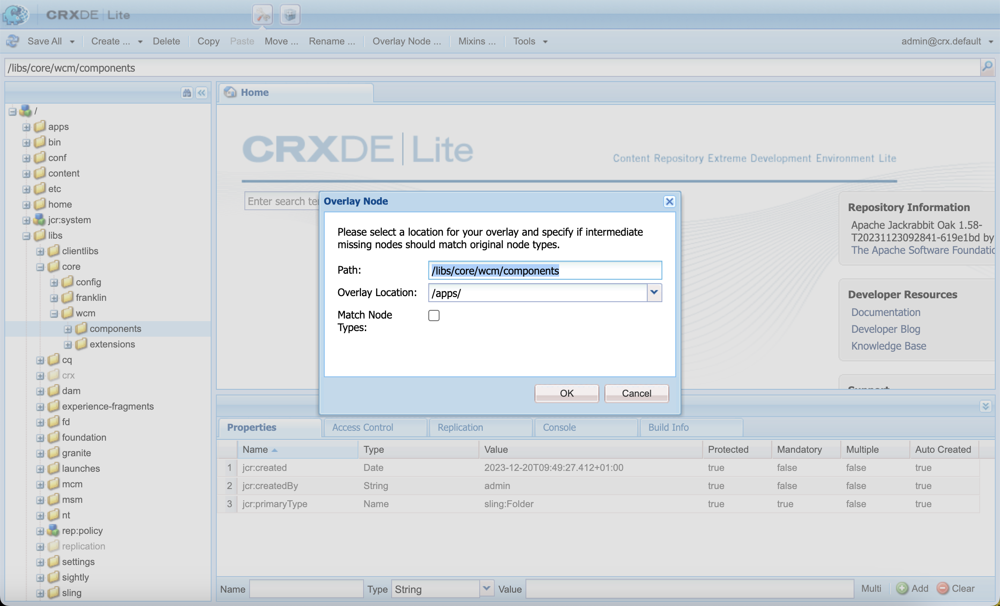

# Panoramica di Universal Editor per sviluppatori AEM {#developer-overview}

Se sei uno sviluppatore AEM interessato al funzionamento di Universal Editor e a come utilizzarlo nel progetto, questo documento offre un’introduzione end-to-end che ti guida attraverso la strumentazione del progetto WKND per lavorare con Universal Editor.

## Scopo {#purpose}

Questo documento fornisce un’introduzione per gli sviluppatori sia sulle modalità di funzionamento dell’Editor universale che su come dotare l’applicazione di strumenti per utilizzarla.

A tal fine, prende un esempio standard che la maggior parte degli sviluppatori AEM conosce, i Componenti core e il sito WKND e strumenta alcuni componenti di esempio da modificare utilizzando l’editor universale.

>[!TIP]
>
>Questo documento illustra i passaggi aggiuntivi necessari per illustrare il funzionamento dell’editor universale e ha lo scopo di approfondire la comprensione dell’editor da parte dello sviluppatore. Non prende quindi la via più diretta per strumentare un&#39;app, ma la più illustrativa dell&#39;Editor Universale e come funziona.
>
>Per iniziare a utilizzare il sistema il più rapidamente possibile, vedere la [Guida introduttiva all&#39;editor universale nel documento AEM](/help/implementing/universal-editor/getting-started.md).

## Prerequisiti {#prerequisites}

Per seguire questa panoramica, è necessario disporre dei seguenti elementi.

* [Un&#39;istanza di sviluppo locale di AEM as a Cloud Service](https://experienceleague.adobe.com/docs/experience-cloud/software-distribution/home.html?lang=it)
   * L&#39;istanza di sviluppo locale deve essere [configurata con HTTPS a scopo di sviluppo il `localhost`.](https://experienceleague.adobe.com/docs/experience-manager-learn/foundation/security/use-the-ssl-wizard.html?lang=it)
   * [È necessario installare il sito di dimostrazione WKND.](https://github.com/adobe/aem-guides-wknd)
* [Accesso all’editor universale](/help/implementing/universal-editor/getting-started.md#onboarding)
* [Un servizio Universal Editor locale](/help/implementing/universal-editor/local-dev.md) in esecuzione per scopi di sviluppo
   * Accertati di indirizzare il browser a [accettare il certificato autofirmato dei servizi locali.](/help/implementing/universal-editor/local-dev.md#editing)

Al di là della generale familiarità con lo sviluppo web, questo documento presuppone una conoscenza di base con lo sviluppo dell’AEM. Se non hai esperienza con lo sviluppo di AEM, valuta di rivedere [l&#39;esercitazione WKND prima di continuare.](/help/implementing/developing/introduction/develop-wknd-tutorial.md)

## Avviare l’AEM e accedere all’editor universale {#sign-in}

Se non lo hai già fatto, devi avere la tua istanza di sviluppo AEM locale in esecuzione con WKND installato e HTTPS abilitato come [descritto nei prerequisiti.](#prerequisites) Questa panoramica presuppone che l&#39;istanza sia in esecuzione alle `https://localhost:8443`.

1. Apri la pagina mastro principale in lingua inglese WKND nell’editor AEM.

   ```text
   https://localhost:8443/editor.html/content/wknd/language-masters/en.html
   ```

1. Nel menu **Informazioni pagina** dell&#39;editor, seleziona **Visualizza come pubblicato**. Viene aperta la stessa pagina in una nuova scheda con l’editor AEM disabilitato.

   ```text
   https://localhost:8443/content/wknd/language-masters/en.html?wcmmode=disabled
   ```

1. Copia questo collegamento.

1. Ora accedi a Universal Editor.

   ```text
   https://experience.adobe.com/#/aem/editor
   ```

1. Incolla il collegamento copiato in precedenza del contenuto WKND nel campo **URL sito** di Universal Editor e fai clic su **Apri**.

   

## L’editor universale tenta di caricare il contenuto {#sameorigin}

Universal Editor carica il contenuto da modificare in un frame. Le impostazioni predefinite dell’AEM per le opzioni X-Frame lo impediscono, il che può essere chiaramente visto nel browser come un errore e descritto nell’output della console quando si tenta di caricare la copia locale di WKND.


L&#39;opzione X-Frame `sameorigin` impedisce il rendering delle pagine AEM all&#39;interno di un frame. È necessario rimuovere questa intestazione per consentire il caricamento delle pagine nell’Editor universale.

1. Apri Configuration Manager.

   ```text
   https://localhost:8443/system/console/configMgr
   ```

1. Modifica la configurazione OSGi `org.apache.sling.engine.impl.SlingMainServlet`

   

1. Elimina la proprietà `X-Frame-Options=SAMEORIGIN` della proprietà **Altre intestazioni di risposta**.

1. Salva le modifiche.

Ora, se ricarichi l’editor universale, vedrai che la pagina AEM si carica.

>[!TIP]
>
>* Per ulteriori informazioni su questa configurazione OSGi, consulta il documento [Guida introduttiva all&#39;editor universale in AEM](/help/implementing/universal-editor/getting-started.md#sameorigin).
>* Per informazioni dettagliate su OSGi nell&#39;AEM, consulta il documento [Configurazione di OSGi per Adobe Experience Manager as a Cloud Service](/help/implementing/deploying/configuring-osgi.md).

## Gestione dei cookie dello stesso sito {#samesite-cookies}

Quando Universal Editor carica la pagina, questa viene caricata nella pagina di accesso AEM per garantire che l&#39;utente sia autenticato per apportare modifiche.

Tuttavia, non puoi accedere correttamente. Visualizzando la console del browser, potete notare che il browser ha bloccato l&#39;input sul frame


Il cookie del token di accesso viene inviato a AEM come dominio di terze parti. Pertanto, i cookie dello stesso sito devono essere consentiti nell’AEM.

1. Apri Configuration Manager.

   ```text
   https://localhost:8443/system/console/configMgr
   ```

1. Modifica la configurazione OSGi `com.day.crx.security.token.impl.impl.TokenAuthenticationHandler`

   

1. Modificare la proprietà **Attributo SameSite per il cookie token di accesso** in `None`.

1. Salva le modifiche.

Ora, se ricarichi l’Editor universale, potrai accedere all’AEM e caricare la pagina di destinazione.

>[!TIP]
>
>* Per ulteriori informazioni su questa configurazione OSGi, consulta il documento [Guida introduttiva all&#39;editor universale in AEM](/help/implementing/universal-editor/getting-started.md#samesite-cookies).
>* Per informazioni dettagliate su OSGi nell&#39;AEM, consulta il documento [Configurazione di OSGi per Adobe Experience Manager as a Cloud Service](/help/implementing/deploying/configuring-osgi.md).

## Universal Editor si connette al frame remoto {#ue-connect-remote-frame}

Dopo aver caricato la pagina nell&#39;editor universale e aver effettuato l&#39;accesso a AEM, l&#39;editor universale tenta di connettersi al frame remoto. Questa operazione viene eseguita tramite una libreria JavaScript che deve essere caricata nel frame remoto. Se la libreria JavaScript non è presente, nella pagina viene generato un errore di timeout nella console.


Devi aggiungere la libreria JavaScript necessaria al componente pagina dell’app WKND.

1. Apri CRXDE Lite.

   ```text
   https://localhost:8443/crx/de
   ```

1. In `/apps/wknd/components/page`, modificare il file `customheaderlibs.html`.

   

1. Aggiungi la libreria JavaScript alla fine del file.

   ```html
   <script src="https://universal-editor-service.experiencecloud.live/corslib/LATEST"></script>
   ```

1. Fare clic su **Salva tutto** e quindi ricaricare l&#39;editor universale.

La pagina ora viene caricata con la libreria JavaScript appropriata per consentire all’editor universale di connettersi alla pagina e l’errore di timeout non viene più visualizzato nella console.

>[!TIP]
>
>* La libreria può essere caricata nell’intestazione o nel piè di pagina.
>* La libreria [ di `universal-editor-embedded.js` è disponibile in NPM](https://www.npmjs.com/package/@adobe/universal-editor-cors) e puoi ospitarla autonomamente se necessario o inserirla direttamente nell&#39;applicazione.

## Definizione di una connessione per rendere le modifiche permanenti {#connection}

La pagina WKND ora viene caricata correttamente nell’editor universale e la libreria JavaScript viene caricata per collegare l’editor all’app.

Tuttavia, probabilmente hai notato che non puoi interagire con la pagina nell’Editor universale. Editor universale non può modificare la pagina. Affinché l’editor universale possa modificare il contenuto, è necessario definire una connessione in modo che sappia dove scriverlo. Per lo sviluppo locale, è necessario riscrivere nell&#39;istanza di sviluppo AEM locale in `https://localhost:8443`.

1. Apri CRXDE Lite.

   ```text
   https://localhost:8443/crx/de
   ```

1. In `/apps/wknd/components/page`, modificare il file `customheaderlibs.html`.

   

1. Aggiungi alla fine del file i metadati necessari per la connessione all’istanza AEM locale.

   ```html
   <meta name="urn:adobe:aue:system:aem" content="aem:https://localhost:8443">
   ```

   * Si consiglia sempre di utilizzare la versione più recente della libreria. Se hai bisogno di una versione precedente, consulta il documento [Guida introduttiva all&#39;editor universale in AEM.](/help/implementing/universal-editor/getting-started.md#alternative)

1. Aggiungere alla fine del file i metadati necessari per la connessione al servizio Universal Editor locale.

   ```html
   <meta name="urn:adobe:aue:config:service" content="https://localhost:8000">
   ```

1. Fare clic su **Salva tutto** e quindi ricaricare l&#39;editor universale.

Ora Universal Editor non solo può caricare correttamente il contenuto dall’istanza di sviluppo AEM locale, ma sa anche dove mantenere eventuali modifiche apportate utilizzando il servizio Universal Editor locale. Questo è il primo passaggio per rendere l’app modificabile con l’Editor universale.

>[!TIP]
>
>* Per ulteriori informazioni sui metadati della connessione, vedere il documento [Guida introduttiva all&#39;editor universale in AEM](/help/implementing/universal-editor/getting-started.md#connection).
>* Per ulteriori informazioni sulla struttura dell&#39;editor universale, vedere il documento [Architettura dell&#39;editor universale](/help/implementing/universal-editor/architecture.md#service).
>* Per ulteriori informazioni su come connettersi a una versione self-hosted di Universal Editor, vedere il documento [Sviluppo locale AEM con Universal Editor](/help/implementing/universal-editor/local-dev.md).

## Strumentazione dei componenti {#instrumenting-components}

Tuttavia, probabilmente noterai che è ancora possibile fare poco con l’Editor universale. Se tenti di fare clic sul teaser nella parte superiore della pagina WKND nell’Universal Editor, non puoi selezionarlo (o altro sulla pagina).

I componenti devono inoltre essere dotati di strumenti per poter essere modificati con l’Editor universale. A questo scopo, devi modificare il componente teaser. Pertanto, è necessario sovrapporre i Componenti core poiché questi si trovano in `/libs`, che è immutabile.

1. Apri CRXDE Lite.

   ```text
   https://localhost:8443/crx/de
   ```

1. Selezionare il nodo `/libs/core/wcm/components` e fare clic su **Sovrapponi nodo** sulla barra degli strumenti.

1. Con `/apps/` selezionato come **Posizione sovrapposizione**, fai clic su **OK**.

   

1. Seleziona il nodo `teaser` in `/libs/core/wcm/components` e fai clic su **Copia** nella barra degli strumenti.

1. Seleziona il nodo sovrapposto in `/apps/core/wcm/components` e fai clic su **Incolla** nella barra degli strumenti.

1. Fare doppio clic sul file `/apps/core/wcm/components/teaser/v2/teaser/teaser.html` per modificarlo.

   

1. Alla fine del primo `div`, approssimativamente alla riga 26, aggiungere i dettagli della strumentazione per il componente.

   ```text
   data-aue-resource="urn:aem:${resource.path}"
   data-aue-type="component"
   data-aue-label="Teaser"
   ```

1. Fare clic su **Salva tutto** nella barra degli strumenti e ricaricare l&#39;editor universale.

1. Nell’Editor universale, fai clic sul componente teaser nella parte superiore della pagina per verificare che ora sia possibile selezionarlo.

1. Se si fa clic sull&#39;icona **Struttura contenuto** nel pannello delle proprietà di Universal Editor, è possibile vedere che l&#39;editor ha riconosciuto tutti i teaser sulla pagina dopo averla dotata di strumenti. Il teaser selezionato è quello evidenziato.

   

>[!TIP]
>
>Per ulteriori dettagli sui nodi sovrapposti, consulta il documento [Utilizzo di Sling Resource Merger in Adobe Experience Manager as a Cloud Service](/help/implementing/developing/introduction/sling-resource-merger.md).

## Sottocomponenti strumento del teaser {#subcomponents}

Ora puoi selezionare il teaser, ma non modificarlo. Questo perché il teaser è un composito di diversi componenti come il componente Immagine e Titolo. Devi instrumentare questi sottocomponenti per modificarli.

1. Apri CRXDE Lite.

   ```text
   https://localhost:8443/crx/de
   ```

1. Selezionare il nodo `/apps/core/wcm/components/teaser/v2/teaser/` e fare doppio clic sul file `title.html`.

   

1. Inserire le seguenti proprietà alla fine del tag `h2` (vicino alla riga 17).

   ```text
   data-aue-prop="jcr:title"
   data-aue-type="text"
   data-aue-label="Title"
   ```

1. Fare clic su **Salva tutto** nella barra degli strumenti e ricaricare l&#39;editor universale.

1. Fai clic sul titolo dello stesso componente teaser nella parte superiore della pagina per verificare che ora sia possibile selezionarlo. La struttura del contenuto mostra anche il titolo come parte del componente teaser selezionato.

   

Ora puoi modificare il titolo del componente teaser.

## Cosa significa tutto questo? {#what-does-it-mean}

Ora che puoi modificare il titolo del teaser, soffermiamoci a esaminare cosa hai realizzato e come.

Il componente teaser è stato identificato nell’editor universale strumentandolo.

* `data-aue-resource` identifica la risorsa in AEM che viene modificata.
* `data-aue-type` definisce che gli elementi devono essere trattati come un componente pagina (anziché, ad esempio, come un contenitore).
* `data-aue-label` visualizza un&#39;etichetta intuitiva nell&#39;interfaccia utente per il teaser selezionato.

Hai anche instrumentato il componente titolo all’interno del componente teaser.

* `data-aue-prop` è l&#39;attributo JCR scritto.
* `data-aue-type` è il modo in cui l&#39;attributo deve essere modificato. In questo caso, con l’editor di testo, poiché è un titolo (anziché l’editor Rich Text).

## Definizione delle intestazioni di autenticazione {#auth-header}

Ora puoi modificare il titolo del teaser in linea e le modifiche vengono mantenute nel browser.


Tuttavia, se ricarichi il browser, il titolo precedente viene ricaricato. Questo perché, anche se l’editor universale sa come connettersi all’istanza AEM, non può ancora autenticarsi nell’istanza AEM per riscrivere le modifiche in JCR.

Se si visualizza la scheda di rete degli strumenti di sviluppo del browser e si cerca `update`, è possibile notare che si verifica un errore 401 quando si tenta di modificare il titolo.


Quando si utilizza l’editor universale per modificare il contenuto dell’AEM di produzione, l’editor universale utilizza lo stesso token IMS utilizzato per accedere all’editor e autenticarsi nell’AEM per facilitare la riscrittura in JCR.

Quando si sviluppa localmente, non è possibile utilizzare il provider di identità AEM poiché i token IMS vengono passati solo ai domini di proprietà di Adobe. Devi fornire manualmente un modo per eseguire l’autenticazione impostando esplicitamente un’intestazione di autenticazione.

1. Nell&#39;interfaccia di Universal Editor, fare clic sull&#39;icona **Intestazioni di autenticazione** nella barra degli strumenti.

1. Copia nell&#39;intestazione di autenticazione necessaria per autenticarti nell&#39;istanza AEM locale e fai clic su **Salva**.

   

1. Ricarica l’Editor universale e ora modifica il titolo del teaser.

Non vengono più segnalati errori nella console del browser e le modifiche vengono mantenute nell’istanza di sviluppo AEM locale.

Se analizzi il traffico negli strumenti di sviluppo del browser e cerchi gli eventi `update`, puoi visualizzare i dettagli dell&#39;aggiornamento.


```json
{
  "connections": [
    {
      "name": "aem",
      "protocol": "aem",
      "uri": "https://localhost:8443"
    }
  ],
  "target": {
    "resource": "urn:aem:/content/wknd/language-masters/en/jcr:content/root/container/carousel/item_1571954853062",
    "type": "text",
    "prop": "jcr:title"
  },
  "value": "Tiny Toon Adventures"
}
```

* `connections` è la connessione all&#39;istanza AEM locale
* `target` è il nodo esatto e le proprietà aggiornate nel JCR
* `value` è l&#39;aggiornamento che hai effettuato.

Puoi vedere la modifica persistente in JCR.


>[!TIP]
>
>Sono disponibili molti strumenti online per generare le intestazioni di autenticazione necessarie a scopo di test e sviluppo.
>
>L&#39;esempio di intestazione di autenticazione di base `Basic YWRtaW46YWRtaW4=` è per la combinazione utente/password di `admin:admin`, come è comune per lo sviluppo AEM locale.

## Strumentazione dell’app per il pannello Proprietà {#properties-rail}

Ora disponi di un’app dotata di strumenti per essere modificabile tramite l’Editor universale.

La modifica è attualmente limitata alla modifica in linea del titolo del teaser. Tuttavia, in alcuni casi la modifica diretta non è sufficiente. Il testo, come il titolo del teaser, può essere modificato nella posizione in cui si trova con l’input della tastiera. Tuttavia, gli elementi più complicati devono poter essere visualizzati e consentire la modifica di dati strutturati separati da come vengono riprodotti nel browser. A questo serve il pannello delle proprietà.

Per aggiornare l’app in modo da utilizzare il pannello delle proprietà per la modifica, torna al file di intestazione del componente Pagina dell’app. Qui sono già state stabilite le connessioni all&#39;istanza di sviluppo AEM locale e al servizio Universal Editor locale. Qui devi definire i componenti modificabili nell’app e i relativi modelli di dati.

1. Apri CRXDE Lite.

   ```text
   https://localhost:8443/crx/de
   ```

1. In `/apps/wknd/components/page`, modificare il file `customheaderlibs.html`.

   

1. Alla fine del file aggiungi lo script necessario per definire i componenti.

   ```html
   <script type="application/vnd.adobe.aue.component+json">
   {
     "groups": [
       {
         "title": "General Components",
         "id": "general",
         "components": [
           {
             "title": "Teaser",
             "id": "teaser",
             "plugins": {
               "aem": {
                 "page": {
                   "resourceType": "wknd/components/teaser"
                 }
               }
             }
           },
           {
             "title": "Title",
             "id": "title",
             "plugins": {
               "aem": {
                 "page": {
                   "resourceType": "wknd/components/title"
                 }
               }
             }
           }
         ]
       }
     ]
   }
   </script>
   ```

1. Sotto, alla fine del file aggiungete lo script necessario per definire il modello.

   ```html
   <script type="application/vnd.adobe.aue.model+json">
   [
     {
       "id": "teaser",
       "fields": [
         {
           "component": "text-input",
           "name": "jcr:title",
           "label": "Title",
           "valueType": "string"
         },
         {
           "component": "text-area",
           "name": "jcr:description",
           "label": "Description",
           "valueType": "string"
         }
       ]
     },
     {
       "id": "title",
       "fields": [
         {
           "component": "select",
           "name": "type",
           "value": "h1",
           "label": "Type",
           "valueType": "string",
           "options": [
             { "name": "h1", "value": "h1" },
             { "name": "h2", "value": "h2" },
             { "name": "h3", "value": "h3" },
             { "name": "h4", "value": "h4" },
             { "name": "h5", "value": "h5" },
             { "name": "h6", "value": "h6" }
           ]
         }
       ]
     }
   ]
   </script>
   ```

1. Fare clic su **Salva tutto** nella barra degli strumenti.

## Cosa significa tutto questo? {#what-does-it-mean-2}

Per poter essere modificati tramite il pannello delle proprietà, i componenti devono essere assegnati a `groups`, pertanto ogni definizione inizia come un elenco di gruppi contenenti i componenti.

* `title` è il nome del gruppo.
* `id` è l&#39;identificatore univoco del gruppo, in questo caso i componenti generali che compongono il contenuto della pagina, ad esempio i componenti avanzati per il layout di pagina.

Ogni gruppo ha quindi una matrice di `components`.

* `title` è il nome del componente.
* `id` è l&#39;identificatore univoco del componente, in questo caso un teaser.

Ogni componente ha quindi una definizione del plug-in che definisce come il componente viene mappato all’AEM.

* `aem` è il plug-in che gestisce le modifiche. Può essere considerato come il servizio che elabora il componente.
* `page` definisce il tipo di componente, in questo caso un componente pagina standard.
* `resourceType` è la mappatura del componente AEM effettivo.

Ogni componente deve quindi essere mappato a un `model` per definire i singoli campi modificabili.

* `id` è l&#39;identificatore univoco del modello, che deve corrispondere all&#39;ID del componente.
* `fields` è un array dei singoli campi.
* `component` è il tipo di input, ad esempio area di testo o testo.
* `name` è il nome del campo nel JCR a cui è mappato il campo.
* `label` è la descrizione del campo visualizzato nell&#39;interfaccia utente dell&#39;editor.
* `valueType` è il tipo di dati.

## Strumentazione del componente per il pannello Proprietà {#properties-rail-component}

È inoltre necessario definire a livello di componente quale modello utilizzare.

1. Apri CRXDE Lite.

   ```text
   https://localhost:8443/crx/de
   ```

1. Fare doppio clic sul file `/apps/core/wcm/components/teaser/v2/teaser/teaser.html` per modificarlo.

   

1. Alla fine del primo `div`, approssimativamente alla riga 32, dopo le proprietà aggiunte in precedenza, aggiungi i dettagli della strumentazione per il modello che verrà utilizzato dal componente teaser.

   ```text
   data-aue-model="teaser"
   ```

1. Fare clic su **Salva tutto** nella barra degli strumenti e ricaricare l&#39;editor universale.

Ora puoi testare il pannello delle proprietà dotato di strumenti per il componente.

1. Nell’Editor universale, fai clic sul titolo del teaser per modificarlo ancora una volta.

1. Fai clic sul pannello delle proprietà per visualizzare la scheda delle proprietà e visualizzare i campi appena instrumentati.

   

Ora puoi modificare il titolo del teaser in linea come in precedenza o nel pannello delle proprietà. In entrambi i casi, le modifiche vengono mantenute nell’istanza di sviluppo AEM locale.

## Aggiungi campi aggiuntivi al pannello Proprietà {#add-fields}

Utilizzando la struttura di base del modello dati per il componente già implementato, puoi aggiungere campi aggiuntivi seguendo lo stesso modello.

Ad esempio, puoi aggiungere un campo per regolare lo stile del componente.

1. Apri CRXDE Lite.

   ```text
   https://localhost:8443/crx/de
   ```

1. In `/apps/wknd/components/page`, modificare il file `customheaderlibs.html`.

   

1. Nello script di definizione del modello, aggiungere un elemento aggiuntivo all&#39;array `fields` per il campo di stile. Ricordati di aggiungere una virgola dopo l’ultimo campo prima di inserirne uno nuovo.

   ```json
   {
      "component": "select",
      "name": "cq:styleIds",
      "label": "Style",
      "valueType": "string",
        "multi": true,
      "options": [
        {"name": "hero", "value":"1555543212672"},
        {"name": "card", "value":"1605057868937"}
      ]
   }
   ```

1. Fare clic su **Salva tutto** nella barra degli strumenti e ricaricare l&#39;editor universale.

1. Fai clic sul titolo del teaser per modificarlo ancora una volta.

1. Fai clic sul pannello delle proprietà e osserva che è presente un nuovo campo per regolare lo stile del componente.

   

Qualsiasi campo nel JCR del componente può essere esposto in questo modo nell’Editor universale.

## Riepilogo {#summary}

Congratulazioni Ora puoi personalizzare le tue app per l’AEM in modo che funzionino con l’Editor universale.

Quando inizi a dotare la tua app di strumenti, tieni presente i passaggi di base eseguiti in questo esempio.

1. [Puoi configurare l’ambiente di sviluppo.](#prerequisites)
   * AEM in esecuzione in locale su HTTPS con WKND installato
   * Servizio Universal Editor in esecuzione in locale su HTTPS
1. Hai aggiornato le impostazioni OSGi dell’AEM per consentirne il caricamento remoto del contenuto.
   * [&quot;org.apache.sling.engine.impl.SlingMainServlet&quot;](#sameorigin)
   * [&quot;com.day.crx.security.token.impl.impl.TokenAuthenticationHandler&quot;](#samesite-cookies)
1. [Hai aggiunto il ](#ue-connect-remote-frame)
1. [Hai definito una connessione per rendere persistenti le modifiche in ](#connection)
   * È stata definita una connessione all’istanza di sviluppo AEM locale.
   * È stata inoltre definita una connessione al servizio Universal Editor locale.
1. [È stato instrumentato il componente teaser.](#instrumenting-components)
1. [Hai instrumentato i sottocomponenti del teaser.](#subcomponents)
1. [È stata definita un&#39;intestazione di autenticazione personalizzata che consente di salvare le modifiche utilizzando il servizio Universal Editor locale.](#auth-header)
1. [Hai instrumentato l’app per utilizzare il pannello delle proprietà.](#properties-rail)
1. [Hai instrumentato il componente teaser per utilizzare il pannello delle proprietà.](#properties-rail-component)

Puoi seguire questi stessi passaggi per dotare la tua app di strumenti per l’utilizzo con l’Editor universale. Tutte le proprietà nel JCR possono essere esposte all’Editor universale.

## Risorse aggiuntive {#additional-resources}

Per ulteriori informazioni e dettagli sulle funzioni di Universal Editor, consulta i seguenti documenti.

* Per iniziare a utilizzare il sistema il più rapidamente possibile, vedere la [Guida introduttiva all&#39;editor universale nel documento AEM](/help/implementing/universal-editor/getting-started.md).
* Per ulteriori informazioni sulle configurazioni OSGi necessarie, consulta il documento [Guida introduttiva all&#39;editor universale in AEM](/help/implementing/universal-editor/getting-started.md#sameorigin).
* Per ulteriori informazioni sui metadati della connessione, vedere il documento [Guida introduttiva all&#39;editor universale in AEM](/help/implementing/universal-editor/getting-started.md#connection).
* Per ulteriori informazioni sulla struttura dell&#39;editor universale, vedere il documento [Architettura dell&#39;editor universale](/help/implementing/universal-editor/architecture.md#service).
* Per ulteriori informazioni su come connettersi a una versione self-hosted di Universal Editor, vedere il documento [Sviluppo locale AEM con Universal Editor](/help/implementing/universal-editor/local-dev.md).
* Per ulteriori dettagli sui nodi sovrapposti, consulta il documento [Utilizzo di Sling Resource Merger in Adobe Experience Manager as a Cloud Service](/help/implementing/developing/introduction/sling-resource-merger.md).

