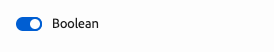

# Definizioni di modelli, campi e tipi di componenti {#field-types}

Scopri i campi e i tipi di componenti che l’editor universale può modificare nel pannello delle proprietà con alcuni esempi. Scopri come puoi dotare di strumenti la tua app creando una definizione di modello e un collegamento al componente.

## Panoramica {#overview}

Quando adatti le tue app per utilizzarle con l’editor universale, devi dotare di strumenti i componenti e definire quali campi e tipi di componenti possono manipolare nel pannello delle proprietà dell’editor. Questo avviene mediante la creazione di un modello e un collegamento ad esso dal componente.

Questo documento fornisce una panoramica della definizione di un modello, dei campi e dei tipi di componenti disponibili, insieme a configurazioni di esempio.

>[!TIP]
>
>Se non sai come dotare di strumenti la tua app per l’editor universale, consulta il documento [Panoramica dell’editor universale per sviluppatori AEM](/help/implementing/universal-editor/developer-overview.md).

## Struttura della definizione di un modello {#model-structure}

Per configurare un componente tramite il pannello delle proprietà nell’editor universale, è necessario che sia presente una definizione di modello e che questa sia collegata al componente.

La definizione del modello è una struttura JSON che inizia con un array di modelli.

```json
[
  {
    "id": "model-id",        // must be unique
    "fields": []             // array of fields which shall be rendered in the properties panel
  }
]
```

Per ulteriori informazioni su come definire l’array `fields`, consulta la sezione **[Campi](#fields)** di questo documento.

Puoi collegare un modello a un componente in due modi, ovvero utilizzando la [definizione del componente](#component-definition) o [tramite la strumentazione.](#instrumentation)

### Collegamento tramite la definizione del componente {#component-definition}

Si tratta del metodo preferito per collegare il modello al componente. In questo modo puoi mantenere il collegamento a livello centrale nella definizione del componente e consentire il trascinamento dei componenti tra i contenitori.

È sufficiente includere la proprietà `model` nell’oggetto del componente nell’array `components` nel file `component-definition.json`.

Per informazioni dettagliate, consulta il documento [Definizione del componente.](/help/implementing/universal-editor/component-definition.md)

### Collegamento tramite strumentazione {#instrumentation}

Per utilizzare la definizione del modello con un componente, è possibile utilizzare l’attributo `data-aue-model`.

```html
<div data-aue-resource="urn:datasource:/content/path" data-aue-type="component"  data-aue-model="model-id">Click me</div>
```

>[!NOTE]
>
>L’editor universale verifica innanzitutto se un modello è collegato tramite la strumentazione e lo utilizza prima di verificare la definizione del componente. Ciò significa che:
>
>* I progetti che hanno implementato il collegamento al modello tramite la strumentazione continueranno a funzionare così come sono senza bisogno di modifiche.
>* Se definisci il modello nella [definizione del componente](#component-definition) e nella strumentazione, quest’ultima verrà sempre utilizzata.

## Caricamento della definizione di un modello {#loading-model}

Una volta creato un modello, è possibile farvi riferimento come file esterno.

```html
<script type="application/vnd.adobe.aue.model+json" src="<url-of-model-definition>"></script>
```

In alternativa, puoi anche definire il modello in linea.

```html
<script type="application/vnd.adobe.aue.model+json">
  { ... model definition ... }
</script>
```

## Campi {#fields}

Di seguito è riportata la definizione di tipo di un oggetto campo.

| Configurazione | Tipo di valore | Descrizione | Obbligatorio |
|---|---|---|---|
| `component` | `ComponentType` | Modulo di rendering del componente | Sì |
| `name` | `string` | Proprietà [o percorso](#nesting) in cui devono essere mantenuti i dati | Sì |
| `label` | `FieldLabel` | Etichetta del campo | Sì |
| `description` | `FieldDescription` | Descrizione del campo | No |
| `value` | `FieldValue` | Questo è un valore predefinito, che funge da segnaposto. Se non viene impostato alcun valore, l&#39;editor universale manterrà qualsiasi elemento definito come `value` nella definizione del modello. In questo modo ciò che visualizzi corrisponderà a ciò che viene mantenuto nel backend. | No |
| `valueType` | `ValueType` | Convalida standard, può essere `string`, `string[]`, `number`, `date`, `boolean` | No |
| `required` | `boolean` | Il campo è obbligatorio? | No |
| `readOnly` | `boolean` | Il campo è di sola lettura? | No |
| `hidden` | `boolean` | Il campo è nascosto per impostazione predefinita? | No |
| `condition` | `RulesLogic` | Regola per mostrare o nascondere il campo in base a una [condizione](/help/implementing/universal-editor/customizing.md#conditionally-hide) | No |
| `multi` | `boolean` | Si tratta di un campo multiplo<br/>L’annidamento dei contenitori non è consentito per i campi multipli nel pannello delle proprietà | No |
| `validation` | `ValidationType` | Regola o regole di convalida per il campo | No |
| `raw` | `unknown` | Dati non elaborati che possono essere utilizzati dal componente | No |

### Campo name e annidamento {#nesting}

Il campo `name` può puntare direttamente a una proprietà della risorsa corrente oppure, nel caso di componenti in `cq:Pages`, può anche utilizzare un percorso a una proprietà annidata. Ad esempio:

```json
"name": "teaser/image/fileReference"
```

### Tipi di componente {#component-types}

Di seguito sono elencati i tipi di componenti che è possibile utilizzare per il rendering dei campi.

| Descrizione | Tipo componente |
|---|---|
| [Tag AEM](#aem-tag) | `aem-tag` |
| [Contenuto AEM](#aem-content) | `aem-content` |
| [Booleano](#boolean) | `boolean` |
| [Gruppo di caselle di controllo](#checkbox-group) | `checkbox-group` |
| [Contenitore](#container) | `container` |
| [Frammento di contenuto](#content-fragment) | `aem-content-fragment` |
| [Data/ora](#date-time) | `date-time` |
| [Frammento di esperienza](#experience-fragment) | `aem-experience-fragment` |
| [Selezione multipla](#multiselect) | `multiselect` |
| [Numero](#number) | `number` |
| [Gruppo pulsanti di scelta](#radio-group) | `radio-group` |
| [Riferimento](#reference) | `reference` |
| [Formattato](#rich-text) | `richtext` |
| [Seleziona](#select) | `select` |
| [Scheda](#tab) | `tab` |
| [Testo](#text) | `text` |

#### Tag AEM {#aem-tag}

Un tipo di componente tag AEM abilita un selettore di tag AEM che può essere utilizzato per applicare i tag al componente.

>[!BEGINTABS]

>[!TAB Esempio]

```json
{
  "id": "aem-tag-picker",
  "fields": [
    {
      "component": "aem-tag",
      "label": "AEM Tag Picker",
      "name": "cq:tags",
      "valueType": "string"
    }
  ]
}
```

>[!TAB Schermata]


>[!ENDTABS]

>[!TIP]
>
>Per ulteriori informazioni su come utilizzare i fogli di calcolo per gestire i dati della tassonomia per il progetto Edge Delivery Services, consulta il documento [Gestione dei dati della tassonomia](https://www.aem.live/docs/authoring-taxonomy).

#### Contenuto AEM {#aem-content}

Un tipo di componente contenuto AEM abilita un selettore di contenuti AEM che può essere utilizzato per selezionare qualsiasi risorsa AEM. A differenza del [componente riferimento](#reference) che può selezionare solo le risorse, il componente contenuto AEM può fare riferimento a qualsiasi contenuto AEM. Offre un tipo di convalida aggiuntivo.

| Tipo di convalida | Tipo di valore | Descrizione | Obbligatorio |
|---|---|---|---|
| `rootPath` | `string` | Percorso che il selettore di contenuti aprirà per consentire all’utente di selezionare il contenuto AEM, limitando la selezione a tale directory e sottodirectory | No |

>[!BEGINTABS]

>[!TAB Esempio]

```json
{
  "id": "aem-content-picker",
  "fields": [
    {
      "component": "aem-content",
      "name": "reference",
      "value": "",
      "label": "AEM Content Picker",
      "valueType": "string",
      "validation": {
            "rootPath": "/content/refresh"
        }
    }
  ]
}
```

>[!TAB Schermata]


>[!ENDTABS]

#### Booleano {#boolean}

Un tipo di componente booleano memorizza un semplice valore vero/falso sottoposto a rendering come pulsante di attivazione/disattivazione. Offre un tipo di convalida aggiuntivo.

| Tipo di convalida | Tipo di valore | Descrizione | Obbligatorio |
|---|---|---|---|
| `customErrorMsg` | `string` | Messaggio che verrà visualizzato se il valore immesso non è un valore booleano | No |

>[!BEGINTABS]

>[!TAB Esempio 1]

```json
{
  "id": "boolean",
  "fields": [
    {
      "component": "boolean",
      "label": "Boolean",
      "name": "boolean",
      "valueType": "boolean"
    }
  ]
}
```

>[!TAB Esempio 2]

```json
{
  "id": "another-boolean",
  "fields": [
    {
      "component": "boolean",
      "label": "Boolean",
      "name": "boolean",
      "valueType": "boolean",
      "validation": {
        "customErrorMsg": "Think, McFly. Think!"
      }
    }
  ]
}
```

>[!TAB Schermata]



>[!ENDTABS]

#### Gruppo di caselle di controllo {#checkbox-group}

Essendo simile a un booleano, un tipo di componente gruppo di caselle di controllo consente la selezione di più elementi veri/falsi, sottoposti a rendering come più caselle di controllo.

>[!BEGINTABS]

>[!TAB Esempio]

```json
{
  "id": "checkbox-group",
  "fields": [
    {
      "component": "checkbox-group",
      "label": "Checkbox Group",
      "name": "checkbox",
      "valueType": "string[]",
      "options": [
        { "name": "Option 1", "value": "option1" },
        { "name": "Option 2", "value": "option2" }
      ]
    }
  ]
}
```

>[!TAB Schermata]


>[!ENDTABS]

#### Contenitore {#container}

Un tipo di componente contenitore consente il raggruppamento di componenti, incluso il supporto per più campi. Offre una configurazione aggiuntiva. L’annidamento dei contenitori non è consentito per i campi multipli nel pannello delle proprietà

| Configurazione | Tipo di valore | Descrizione | Obbligatorio |
|---|---|---|---|
| `collapsible` | `boolean` | Il contenitore è comprimibile? | No |

>[!BEGINTABS]

>[!TAB Esempio]

```json
 {
  "id": "container",
  "fields": [
    {
      "component": "container",
      "label": "Container",
      "name": "container",
      "valueType": "string",
      "collapsible": true,
      "fields": [
        {
          "component": "text-input",
          "label": "Simple Text 1",
          "name": "text",
          "valueType": "string"
        },
        {
          "component": "text-input",
          "label": "Simple Text 2",
          "name": "text2",
          "valueType": "string"
        }
      ]
    }
  ]
}
```

>[!TAB Schermata]


>[!TAB Supporto per campi multipli]

```json
{
  "component": "container",
  "name": "test",
  "label": "Multi Text",
  "multi": true,
  "fields": [
    {
      "component": "reference",
      "name": "image",
      "value": "",
      "label": "Sample Image",
      "valueType": "string"
    },
    {
      "component": "text",
      "name": "alt",
      "value": "",
      "label": "Alt Text",
      "valueType": "string"
    }
  ]
}
```

>[!ENDTABS]


#### Frammento di contenuto {#content-fragment}

Il selettore di frammenti di contenuto può essere utilizzato per selezionare un [frammento di contenuto](/help/sites-cloud/authoring/fragments/content-fragments.md) e le relative varianti (se necessario). Offre una configurazione aggiuntiva.

| Configurazione | Tipo di valore | Descrizione | Obbligatorio |
|---|---|---|---|
| `variationName` | `string` | Nome della variabile per archiviare la variante selezionata. Se non è definito, non viene visualizzato alcun selettore di varianti | No |

Offre inoltre un tipo di convalida aggiuntivo.

| Tipo di convalida | Tipo di valore | Descrizione | Obbligatorio |
|---|---|---|---|
| `rootPath` | `string` | Percorso che il selettore di contenuti aprirà per consentire all’utente di selezionare il frammento di contenuto, limitando la selezione a tale directory e alle sottodirectory | No |

>[!NOTE]
>
>L’editor universale [convalida i campi dei frammenti di contenuto in base ai relativi modelli](/help/assets/content-fragments/content-fragments-models.md#validation), consentendo di applicare regole di integrità dei dati, ad esempio i pattern delle espressioni regolari e i vincoli di univocità.
>
>In questo modo, il contenuto soddisfa i requisiti aziendali specifici prima della pubblicazione.

>[!BEGINTABS]

>[!TAB Esempio 1]

```json
[
  {
    "id": "aem-content-fragment",
    "fields": [
      {
        "component": "aem-content-fragment",
        "name": "picker",
        "label": "Content Fragment Picker",
        "valueType": "string",
        "variationName": "contentFragmentVariation",
        "validation": {
            "rootPath": "/content/refresh"
        }
      }
    ]
  }
]
```

>[!TAB Schermata]


>[!ENDTABS]

#### Data e ora {#date-time}

Un tipo di componente data e ora consente di specificare una data, un’ora o una combinazione di esse. Offre configurazioni aggiuntive.

| Configurazione | Tipo di valore | Descrizione | Obbligatorio |
|---|---|---|---|
| `displayFormat` | `string` | Formato con cui visualizzare la stringa della data | Sì |
| `valueFormat` | `string` | Formato in cui memorizzare la stringa della data | Sì |

Offre inoltre un tipo di convalida aggiuntivo.

| Tipo di convalida | Tipo di valore | Descrizione | Obbligatorio |
|---|---|---|---|
| `customErrorMsg` | `string` | Messaggio che verrà visualizzato se `valueFormat` non viene soddisfatto | No |

>[!BEGINTABS]

>[!TAB Esempio 1]

```json
{
  "id": "date-time",
  "fields": [
    {
      "component": "date-time",
      "label": "Date & Time",
      "name": "date",
      "valueType": "date"
    }
  ]
}
```

>[!TAB Esempio 2]

```json
{
  "id": "another-date-time",
  "fields": [
    {
      "component": "date-time",
       "valueType": "date-time",
      "name": "field1",
      "label": "Date Time",
      "description": "This is a date time field that stores both date and time.",
      "required": true,
      "placeholder": "YYYY-MM-DD HH:mm:ss",
      "displayFormat": null,
      "valueFormat": null,
      "validation": {
        "customErrorMsg": "Marty! You have to come back with me!"
      }
    },
    {
      "component": "date-time",
      "valueType": "date",
      "name": "field2",
      "label": "Another Date Time",
      "description": "This is another date time field that only stores the date.",
      "required": true,
      "placeholder": "YYYY-MM-DD",
      "displayFormat": null,
      "valueFormat": null,
      "validation": {
        "customErrorMsg": "Back to the future!"
      }
    },
    {
      "component": "date-time",
      "valueType": "time",
      "name": "field3",
      "label": "Yet Another Date Time",
      "description": "This is another date time field that only stores the time.",
      "required": true,
      "placeholder": "HH:mm:ss",
      "displayFormat": null,
      "valueFormat": null,
      "validation": {
        "customErrorMsg": "Great Scott!"
      }
    }
  ]
}
```

>[!TAB Schermata]


>[!ENDTABS]

#### Frammento di esperienza {#experience-fragment}

Il selettore Frammento di esperienza può essere utilizzato per selezionare un [frammento esperienza](/help/sites-cloud/authoring/fragments/experience-fragments.md) e le relative varianti (se necessario). Offre una configurazione aggiuntiva.

| Configurazione | Tipo di valore | Descrizione | Obbligatorio |
|---|---|---|---|
| `variationName` | `string` | Nome della variabile per archiviare la variante selezionata. Se non è definito, non viene visualizzato alcun selettore di varianti | No |

Offre inoltre un tipo di convalida aggiuntivo.

| Tipo di convalida | Tipo di valore | Descrizione | Obbligatorio |
|---|---|---|---|
| `rootPath` | `string` | Percorso che il selettore di contenuti aprirà per consentire all’utente di selezionare il frammento di esperienza, limitando la selezione a tale directory e sottodirectory | No |

>[!BEGINTABS]

>[!TAB Esempio 1]

```json
[
  {
    "id": "experience-fragment",
    "fields": [
      {
        "component": "aem-experience-fragment",
        "valueType": "string",
        "name": "experience-fragment",
        "label": "experience-fragment",
        "variationName": "experienceFragmentVariation",
        "validation": {
            "rootPath": "/content/refresh"
        }
      }
    ]
  }
]
```

>[!TAB Schermata]


>[!ENDTABS]


#### Selezione multipla {#multiselect}

Un tipo di componente a selezione multipla presenta più elementi da selezionare in un elenco a discesa, con la possibilità di raggruppare gli elementi selezionabili.

>[!BEGINTABS]

>[!TAB Esempio 1]

```json
{
  "id": "multiselect",
  "fields": [
    {
      "component": "multiselect",
      "name": "multiselect",
      "label": "Multi Select",
      "valueType": "string",
      "options": [
        { "name": "Option 1", "value": "option1" },
        { "name": "Option 2", "value": "option2" }
      ]
    }
  ]
}
```

>[!TAB Esempio 2]

```json
{
  "id": "multiselect-grouped",
  "fields": [
    {
      "component": "multiselect",
      "name": "property",
      "label": "Multiselect field",
      "valueType": "string",
      "required": true,
      "maxSize": 2,
      "options": [
        {
          "name": "Theme",
          "children": [
            { "name": "Light", "value": "light" },
            { "name": "Dark",  "value": "dark" }
          ]
        },
        {
          "name": "Type",
          "children": [
            { "name": "Alpha", "value": "alpha" },
            { "name": "Beta", "value": "beta" },
            { "name": "Gamma", "value": "gamma" }
          ]
        }
      ]
    }
  ]
}
```

>[!TAB Schermate]


>[!ENDTABS]

#### Numero {#number}

Un tipo di componente numero consente di immettere un numero. Offre tipi di convalida aggiuntivi.

| Tipo di convalida | Tipo di valore | Descrizione | Obbligatorio |
|---|---|---|---|
| `numberMin` | `number` | Numero minimo consentito | No |
| `numberMax` | `number` | Numero massimo consentito | No |
| `customErrorMsg` | `string` | Messaggio che verrà visualizzato se `numberMin` o `numberMax` non è soddisfatto | No |

>[!BEGINTABS]

>[!TAB Esempio 1]

```json
{
  "id": "number",
  "fields": [
    {
      "component": "number",
      "name": "number",
      "label": "Number",
      "valueType": "number",
      "value": 0
    }
  ]
}
```

>[!TAB Esempio 2]

```json
{
  "id": "another-number",
  "fields": [
   {
      "component": "number",
      "valueType": "number",
      "name": "field1",
      "label": "Number Field",
      "description": "This is a number field.",
      "required": true,
      "placeholder": null,
      "validation": {
        "numberMin": 0,
        "numberMax": 88,
        "customErrorMsg": "You also need 1.21 gigawatts."
      }
    }
  ]
}
```

>[!TAB Schermata]


>[!ENDTABS]

#### Gruppo pulsanti di scelta {#radio-group}

Un tipo di componente gruppo pulsanti di scelta consente una selezione reciprocamente esclusiva di più opzioni sottoposte a rendering come gruppo simile a un gruppo di caselle di controllo.

>[!BEGINTABS]

>[!TAB Esempio]

```json
{
  "id": "radio-group",
  "fields": [
    {
      "component": "radio-group",
      "label": "Radio Group",
      "name": "radio",
      "valueType": "string",
      "options": [
        { "name": "Option 1", "value": "option1" },
        { "name": "Option 2", "value": "option2" }
      ]
    }
  ]
}
```

>[!TAB Schermata]


>[!ENDTABS]

#### Riferimento {#reference}

Un tipo di componente riferimento abilita un selettore di risorse AEM che può essere utilizzato per selezionare qualsiasi risorsa AEM a cui fare riferimento. A differenza del [componente contenuto AEM](#aem-content) che può selezionare qualsiasi risorsa AEM, il componente riferimento può fare riferimento solo alle risorse. Offre un tipo di convalida aggiuntivo.

Un tipo di componente riferimento consente un riferimento a un altro oggetto dati dall’oggetto corrente.

>[!BEGINTABS]

>[!TAB Esempio]

```json
{
  "id": "reference",
  "fields": [
    {
      "component": "reference",
      "label": "Reference",
      "name": "reference",
      "valueType": "string"
    }
  ]
}
```

>[!TAB Schermata]


>[!ENDTABS]

#### Testo formattato {#rich-text}

Il testo formattato può essere inserito su più righe.

>[!BEGINTABS]

>[!TAB Esempio 1]

```json
{
  "id": "richtext",
  "fields": [
    {
      "component": "richtext",
      "name": "rte",
      "label": "Rich Text",
      "valueType": "string"
    }
  ]
}
```

>[!TAB Schermata]


>[!ENDTABS]

#### Seleziona {#select}

Un tipo di componente selezione consente di selezionare una singola opzione da un elenco di opzioni predefinite in un menu a discesa.

>[!BEGINTABS]

>[!TAB Esempio]

```json
{
  "id": "select",
  "fields": [
    {
      "component": "select",
      "label": "Select",
      "name": "select",
      "valueType": "string",
      "options": [
        { "name": "Option 1", "value": "option1" },
        { "name": "Option 2", "value": "option2" }
      ]
    }
  ]
}
```

>[!TAB Schermata]


>[!ENDTABS]

#### Scheda {#tab}

Un tipo di componente Scheda consente di raggruppare altri campi di input in più schede per migliorare l’organizzazione del layout per gli autori.

Una definizione di `tab` può essere considerata come un separatore nell’array di `fields`. Tutto ciò che arriva dopo un `tab` verrà inserito in quella scheda fino a quando non si incontra un nuovo `tab`, dopo di che i seguenti elementi verranno inseriti nella nuova scheda.

Se desideri che gli elementi vengano visualizzati sopra tutte le schede, è necessario definirli prima di qualsiasi scheda.

>[!BEGINTABS]

>[!TAB Esempio]

```json
{
  "id": "tab",
  "fields": [
    {
      "component": "tab",
      "label": "Tab 1",
      "name": "tab1"
    },
    {
      "component": "text-input",
      "label": "Text 1",
      "name": "text1",
      "valueType": "string"
    },
    {
      "component": "tab",
      "label": "Tab 2",
      "name": "tab2"
    },
    {
      "component": "text-input",
      "label": "Text 2",
      "name": "text2",
      "valueType": "string"
    }
  ]
}
```

>[!TAB Schermata]


>[!ENDTABS]

#### Testo {#text}

Il testo consente di inserire una singola riga di testo.  Include tipi di convalida aggiuntivi.

| Tipo di convalida | Tipo di valore | Descrizione | Obbligatorio |
|---|---|---|---|
| `minLength` | `number` | Numero minimo di caratteri consentito | No |
| `maxLength` | `number` | Numero massimo di caratteri consentito | No |
| `regExp` | `string` | Espressione regolare che deve corrispondere al testo di input | No |
| `customErrorMsg` | `string` | Messaggio che verrà visualizzato se `minLength`, `maxLength` e/o `regExp` sono violati | No |

>[!BEGINTABS]

>[!TAB Esempio 1]

```json
{
  "id": "simpletext",
  "fields": [
    {
      "component": "text",
      "name": "text",
      "label": "Simple Text",
      "valueType": "string"
    }
  ]
}
```

>[!TAB Esempio 2]

```json
{
  "id": "another simpletext",
  "fields": [
    {
      "component": "text",
      "name": "text",
      "label": "Simple Text",
      "valueType": "string",
      "valueFormat": "regexp",
      "description": "This is a text input with validation.",
      "required": true,
      "validation": {
        "minLength": 1955,
        "maxLength": 1985,
        "regExp": "^foo:.*",
        "customErrorMsg": "Why don't you make like a tree and get outta here?"
      }
    }
  ]
}
```

>[!TAB Schermata]


>[!ENDTABS]
