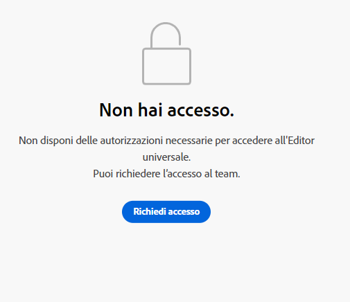

# Guida introduttiva all’editor universale in AEM {#getting-started}

Scopri come accedere all’editor universale e come iniziare a preparare la tua prima app AEM per utilizzarla.

>[!TIP]
>
>Se preferisci approfondire direttamente un esempio, puoi rivedere l’[app di esempio dell’editor universale su GitHub.](https://github.com/adobe/universal-editor-sample-editable-app)

## Passaggi di onboarding {#onboarding}

Anche se l’editor universale può modificare il contenuto da qualsiasi origine, questo documento utilizza un’app AEM come esempio.

Sono disponibili diversi passaggi per l’onboarding dell’app AEM e la relativa preparazione per l’utilizzo dell’editor universale.

1. [Richiedi l’accesso all’editor universale.](#request-access)
1. [Includi la libreria principale dell’editor universale.](#core-library)
1. [Aggiungi la configurazione OSGi necessaria.](#osgi-configurations)
1. [Prepara la pagina.](#instrument-page)

Questo documento ti guiderà attraverso questi passaggi.

## Richiedi l’accesso all’editor universale {#request-access}

Innanzitutto, è necessario richiedere l’accesso all’editor universale. Vai all’indirizzo [https://experience.adobe.com/#/aem/editor](https://experience.adobe.com/#/aem/editor), accedi e verifica se hai accesso all’editor universale.

Se non hai accesso, puoi richiederlo tramite un modulo collegato sulla stessa pagina.



Fai clic su **Richiesta di accesso** e compila il modulo come indicato per richiedere l’accesso. Un rappresentante Adobe esaminerà la tua richiesta e ti contatterà per discutere del tuo caso d’uso.

## Includi la libreria principale dell’editor universale {#core-library}

Prima di poter preparare l’app con l’editor universale, è necessario includere la seguente dipendenza.

```javascript
@adobe/universal-editor-cors
```

Per attivare la preparazione, è necessario aggiungere la seguente importazione al `index.js`.

```javascript
import "@adobe/universal-editor-cors";
```

### Alternativa per le app non React {#alternative}

Se non stai implementando un’app React e/o hai bisogno di eseguire il rendering lato server, un metodo alternativo consiste nell’includere quanto segue nel corpo del documento.

```html
<script src="https://cdn.jsdelivr.net/gh/adobe/universal-editor-cors/dist/universal-editor-embedded.js" async></script>
```

## Aggiungi le configurazioni OSGi necessarie {#osgi-configurations}

Per poter modificare il contenuto di AEM con l’app utilizzando l’editor universale, le impostazioni CORS e cookie devono essere eseguiti in AEM.

Le seguenti [configurazioni OSGi devono essere impostate sull’istanza di authoring di AEM.](/help/implementing/deploying/configuring-osgi.md)

* `SameSite Cookies = None` in `com.day.crx.security.token.impl.impl.TokenAuthenticationHandler`
* Rimuovi X-FRAME-OPTIONS: intestazione SAMEORIGIN in `org.apache.sling.engine.impl.SlingMainServlet`

### com.day.crx.security.token.impl.impl.TokenAuthenticationHandler {#samesite-cookies}

Il cookie del token di accesso deve essere inviato ad AEM come dominio di terze parti. Pertanto, il cookie dello stesso sito deve essere impostato esplicitamente su `None`.

Questa proprietà deve essere impostata nella configurazione OSGi `com.day.crx.security.token.impl.impl.TokenAuthenticationHandler`.

```xml
<?xml version="1.0" encoding="UTF-8"?>
<jcr:root xmlns:sling="http://sling.apache.org/jcr/sling/1.0"
          xmlns:jcr="http://www.jcp.org/jcr/1.0" jcr:primaryType="sling:OsgiConfig"
          token.samesite.cookie.attr="None" />
```

### org.apache.sling.engine.impl.SlingMainServlet {#sameorigin}

X-Frame-Options: SAMEORIGIN impedisce il rendering di pagine AEM all’interno di un iframe. La rimozione dell’intestazione consente di caricare le pagine.

Questa proprietà deve essere impostata nella configurazione OSGi `org.apache.sling.engine.impl.SlingMainServlet`.

```xml
<?xml version="1.0" encoding="UTF-8"?>
<jcr:root xmlns:sling="http://sling.apache.org/jcr/sling/1.0"
          xmlns:jcr="http://www.jcp.org/jcr/1.0"
          jcr:primaryType="sling:OsgiConfig"
          sling.additional.response.headers="[X-Content-Type-Options=nosniff]"/>
```

## Prepara la pagina {#instrument-page}

Il servizio di editor universale richiede un [nome risorsa uniforme (URN)](https://en.wikipedia.org/wiki/Uniform_Resource_Name) per identificare e utilizzare il sistema back-end corretto per il contenuto dell’app in fase di modifica. Pertanto, è necessario uno schema URN per mappare il contenuto alle risorse di contenuto.

Gli attributi della preparazione aggiunti alla pagina sono costituiti per lo più da [Microdati HTML,](https://developer.mozilla.org/en-US/docs/Web/HTML/Microdata) uno standard di settore che può essere utilizzato anche per rendere l’HTML più semantico, rendere i documenti HTML indicizzabili, ecc.

### Creazione di connessioni {#connections}

Le connessioni utilizzate nell’app vengono memorizzate come `<meta>` tag nella pagina `<head>`.

```html
<meta name="urn:adobe:aem:editor:<referenceName>" content="<protocol>:<url>">
```

* `<referenceName>`: questo è un nome breve che viene utilizzato nuovamente nel documento per identificare la connessione. Ad esempio, `aemconnection`.
* `<protocol>`: indica il plug-in di persistenza del servizio di persistenza dell’editor universale da utilizzare. Ad esempio, `aem`
* `<url>`: questo è l’URL del sistema in cui le modifiche devono essere mantenute. Ad esempio, `http://localhost:4502`

L’identificatore `adobe:aem:editor` rappresenta la connessione per Adobe Universal Editor.

Negli identificatori `itemid` verrà utilizzato il prefisso `urn` per accorciare l’identificatore.

```html
itemid="urn:<referenceName>:<resource>"
```

* `<referenceName>`: questo è il riferimento menzionato nel tag `<meta>`. Ad esempio, `aemconnection`.
* `<resource>`: questo è un puntatore verso la risorsa nel sistema di destinazione. Ad esempio, un percorso di contenuto AEM come `/content/page/jcr:content`

>[!TIP]
>
>Per ulteriori dettagli sugli attributi e i tipi di dati richiesti dall’editor universale, consulta [Attributi e tipi](attributes-types.md).

### Connessione di esempio {#example}

```html
<html>
<head>
    <meta name="urn:adobe:aem:editor:aemconnection" content="aem:https://localhost:4502">
    <meta name="urn:adobe:aem:editor:fcsconnection" content="fcs:https://example.franklin.adobe.com/345fcdd">
</head>
<body>
        <aside>
          <ul itemscope itemid="urn:aemconnection:/content/example/list" itemtype="container">
            <li itemscope itemid="urn:aemconnection/content/example/listitem" itemtype="component">
              <p itemprop="name" itemtype="text">Jane Doe</p>
              <p itemprop="title" itemtype="text">Journalist</p>
              
            </li>
 
...
 
            <li itemscope itemid="urn:fcsconnection:/documents/mytext" itemtype="component">
              <p itemprop="name" itemtype="text">John Smith</p>
              <p itemid="urn:aemconnection/content/example/another-source" itemprop="title" itemtype="text">Photographer</p>
              
            </li>
          </ul>
        </aside>
</body>
</html>
```

## Iniziare a utilizzare l’editor universale {#youre-ready}

L’app è ora preparata per l’utilizzo dell’editor universale.

Consulta [Authoring dei contenuti con l’editor universale](authoring.md) per scoprire quanto sia semplice e intuitivo per gli autori creare contenuti utilizzando l’editor universale.

## Risorse aggiuntive {#additional-resources}

Per ulteriori informazioni sull’editor universale, consulta questi documenti.

* [Introduzione all’editor universale](introduction.md): scopri come l’editor universale consente di modificare qualsiasi aspetto di qualsiasi contenuto in qualsiasi implementazione per fornire esperienze eccezionali, aumentare la velocità del contenuto e fornire un’esperienza di sviluppo all’avanguardia.
* [Authoring dei contenuti con l’editor universale](authoring.md): scopri quanto è semplice e intuitivo per gli autori di contenuto creare contenuto utilizzando l’editor universale.
* [Pubblicazione di contenuti con l’editor universale](publishing.md): scopri in che modo l&#39;editor visivo universale pubblica i contenuti e come le tue app possono gestire i contenuti pubblicati.
* [Architettura dell’editor universale](architecture.md): scopri l’architettura dell’editor universale e come avviene il flusso di dati tra i suoi servizi e livelli.
* [Attributi e tipi](attributes-types.md): scopri gli attributi e i tipi di dati richiesti dall’editor universale.
* [Autenticazione dell’editor universale](authentication.md): scopri come l’editor universale effettua l’autenticazione.
