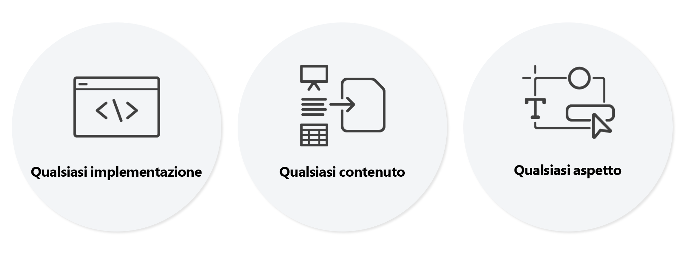

# Introduzione all’editor universale {#introduction}

Universal Editor è un editor visivo versatile che fa parte di Adobe Experience Manager Sites. Consente agli autori di eseguire la modifica WYSIWYG (What-you-see-is-what-you-get) di qualsiasi esperienza headless o headful. Scopri in che modo può aiutare gli autori di contenuti a fornire esperienze eccezionali e come offre agli sviluppatori una libertà senza precedenti.

## Informazioni di base {#background}

Universal Editor offre un’esperienza di authoring in-context efficiente e intuitiva che richiede una formazione minima. Con esso, gli autori possono gestire i loro contenuti direttamente nel contesto dell’esperienza web, esattamente come apparirà ai visitatori. Essendo un vero editor come servizio e complessivamente più flessibile, intende alla fine sostituire l’Editor pagina.

Gli autori traggono vantaggio dalla flessibilità dell’Editor universale in quanto supporta lo stesso editing visivo coerente per tutte le forme di contenuto AEM: la modifica diretta e la composizione del layout sono possibili anche per i frammenti di contenuto e i componenti di pagina. Le due forme di contenuto possono anche essere modificate quando si presentano affiancate in un’esperienza web, senza che gli autori debbano cambiare contesto. Si tratta di un miglioramento enorme rispetto ai precedenti editor dell&#39;AEM che supportavano un solo tipo di contenuto.

Gli sviluppatori traggono vantaggio dalla versatilità di Universal Editor in quanto supporta anche un vero e proprio disaccoppiamento dell’implementazione. Consente agli sviluppatori di utilizzare virtualmente qualsiasi framework o architettura a loro scelta, senza imporre vincoli di SDK o tecnologia. Questa flessibilità consente anche di dotare le app web esistenti di strumenti facilmente utilizzabili dall’editor universale, senza doverle riprogettare.

## Veramente universale {#universal}

L’Editor universale può essere utilizzato per qualsiasi implementazione, per qualsiasi contenuto e per qualsiasi aspetto del contenuto.

### Qualsiasi implementazione {#any-implementation}

Poiché le esperienze possono essere create in tanti modi diversi, qualsiasi implementazione può utilizzare l’Editor universale, per consentire agli autori di eseguire modifiche nel contesto.

Gli utenti spesso pensano che un’implementazione headless limiti gli autori a modificare tutto il contenuto in un’interfaccia utente basata su moduli, ma questo non vale per l’Editor universale

I requisiti per un’implementazione che utilizza l’Editor universale sono molto semplici e supportano:

* **Qualsiasi architettura** : rendering lato server, rendering lato edge, rendering lato client e così via.
* **Qualsiasi framework** - AEM &quot;vanilla&quot; o qualsiasi framework di terze parti come React, Next.js, Angular e così via.
* **Qualsiasi hosting** - Può essere ospitato localmente su AEM o su un dominio remoto

### Qualsiasi contenuto {#any-content}

Un autore di contenuto deve avere la stessa potente esperienza di modifica precedentemente offerta dall’editor pagina AEM. Tuttavia, l’Editor universale consente agli autori di contenuto di modificare **qualsiasi** contenuto visivamente e nel contesto e supporta:

* **Strutture di pagina AEM** - `cq:Components` nidificati di `cq:Pages`, compresi i Frammenti di esperienza
* **Frammenti di contenuto AEM** - Modifica il contenuto dei Frammenti di contenuto visualizzati nel contesto dell’esperienza.
* **Documenti** - La bozza dei concetti ha mostrato che anche i documenti Word, Excel, Google Docs o Markdown possono essere modificati nello stesso modo (WIP).

### Qualsiasi aspetto {#any-aspect}

Per un autore di contenuto, il contenuto non riguarda solo le informazioni contenute, ma anche il rendering e la ricezione. Il contenuto viene fornito con metadati aggiuntivi e regole di strumentazione, che l’editor universale può comprendere e modificare, tra cui:

* **Applicazione di layout e stile** - Utilizzando un sistema di stili, l’operatore marketing e l’autore di contenuti possono applicare stili diversi al contenuto e creare layout diversi per il contenuto, ad esempio colonne, caroselli, schede, fisarmoniche e così via.

## Valore {#value}

Svincolando l’esperienza di modifica del contenuto da qualsiasi sistema di distribuzione del contenuto, l’editor diventa davvero universale e flessibile, consentendo all’autore del contenuto di fornire esperienze eccezionali, di aumentare la velocità del contenuto e di fornire un’esperienza di sviluppo all’avanguardia.

* **Fornire esperienze eccezionali**: per consentire ai professionisti di creare un’esperienza coinvolgente per i visitatori, l’Editor universale consente loro di creare e modificare il contenuto nel contesto dell’anteprima. Questo consente di creare contenuti adatti alla progettazione dell’esperienza, in grado di costituire un percorso significativo per i visitatori.
* **Aumento della velocità del contenuto** - Per semplificare la gestione del flusso di lavoro dei professionisti, l’Editor universale consente di modificare il contenuto nell’anteprima per guidare i professionisti mostrando solo le opzioni pertinenti a tale contesto e rende il flusso di lavoro indipendente dalle origini del contenuto.
* **Esperienza per sviluppatori all’avanguardia** - Per supportare un panorama delle applicazioni eterogeneo nel mondo reale, l’Editor universale è completamente dissociato e indipendente dalla tecnologia, consentendo agli sviluppatori di utilizzare l’insieme di tecnologie preferito per implementare l’esperienza.

## Editor universale e Editor frammento di contenuto {#universal-editor-content-fragment-editor}

A prima vista, potrebbe sembrare che l’Editor universale e l’Editor frammento di contenuto forniscano funzionalità di modifica simili. Tuttavia, questi editor offrono funzionalità molto diverse e svolgono diversi compiti del professionista di marketing.

### Editor frammento di contenuto {#content-fragment-editor}

Un professionista del marketing desidera creare contenuto senza doversi preoccupare del layout, in modo che possa essere riutilizzato in numerosi contesti dell’esperienza.

* Il lavoro sottostante da realizzare è quello di scalare la strategia del contenuto.

### Editor universale {#universal-editor}

Un professionista del marketing desidera creare contenuto personalizzato in base al layout di un determinato contesto per offrire un’esperienza eccezionale.

* Il lavoro sottostante da realizzare è quello di entrare in contatto in modo convincente con i lettori.

## Limitazioni {#limitations}

Quando esplori l’Editor universale e procedi alla sua implementazione nei tuoi progetti, tieni presenti le seguenti limitazioni.

* Non più di 25 risorse AEM (frammenti di contenuto, pagine, frammenti di esperienza, risorse, ecc.) devono essere riferimenti come strumentazione su una singola pagina.
* AEM as a Cloud Service è l&#39;unico back-end AEM supportato.
* Rilascio as a Cloud Service di AEM `2023.8.13099` o superiore.
* Gli autori dei contenuti devono avere un proprio account Experience Cloud.
* Chrome ed Edge sono i browser supportati

## Passaggi successivi {#next-steps}

Consulta il documento [Casi d’uso e percorsi di apprendimento dell’editor universale](/help/implementing/universal-editor/use-cases.md) per ulteriori informazioni sui casi d’uso comuni per Universal Editor e per scoprire le risorse di documentazione adatte per supportarti nel progetto.
