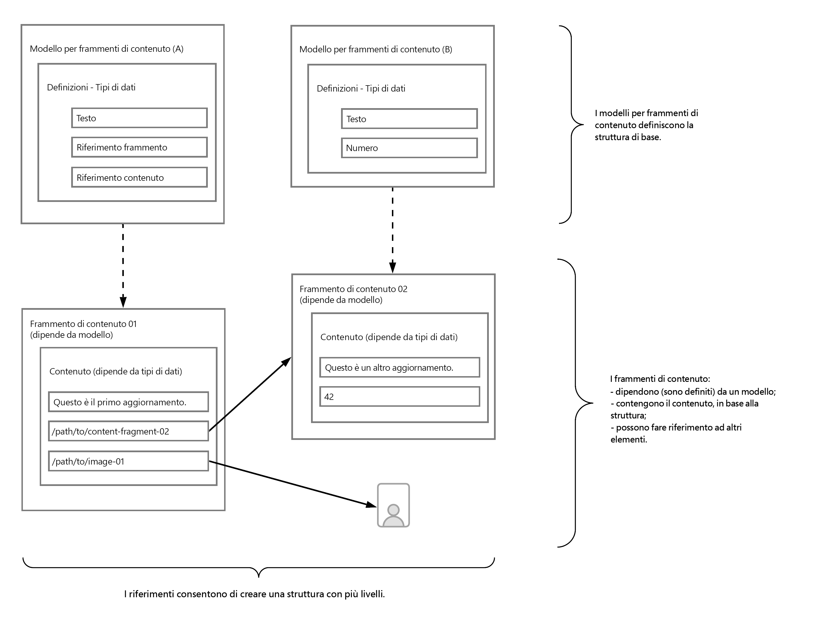

# Scopri le nozioni di base sulla modellazione dei contenuti per Headless con AEM {#content-modeling-headless-basics}

## Percorso affrontato finora {#story-so-far}

All’inizio del [percorso Architect di contenuti AEM headless](overview.md) l’[introduzione](introduction.md) ha trattato i concetti e la terminologia di base relativi alla modellazione dei contenuti headless.

Questo articolo si basa su questi elementi per comprendere come modellare i contenuti per il progetto AEM headless.

## Obiettivo {#objective}

* **Pubblico**: principiante
* **Obiettivo**: introdurre i concetti di modellazione dei contenuti per CMS headless.

## Modellazione dei contenuti con modelli di Frammenti di contenuto {#architect-content-fragment-models}

La modellazione dei contenuti (dati) è un insieme di tecniche consolidate, spesso utilizzate quando si sviluppano database di relazioni, quindi cosa significa la modellazione dei contenuti per AEM headless?

### Perché? {#why}

Per garantire che l’applicazione possa richiedere e ricevere in modo coerente ed efficiente il contenuto richiesto da AEM, questo contenuto deve essere strutturato.

Ciò significa che l’applicazione conosce in anticipo la forma della risposta e quindi come elaborarla. Questo è molto più semplice della ricezione di contenuti in formato libero, che devono essere analizzati per determinare cosa contengono e quindi come possono essere utilizzati.

### Introduzione a Come? {#how}

AEM utilizza Frammenti di contenuto per fornire le strutture necessarie per la distribuzione headless dei contenuti alle applicazioni.

La struttura del modello di contenuto è:

* realizzata secondo la definizione del modello per frammenti di contenuto,
* utilizzata come base dei frammenti di contenuto impiegati per la generazione dei contenuti.

>[!NOTE]
>
>I modelli per Frammenti di contenuto vengono utilizzati anche come base degli schemi GraphQL AEM, utilizzati per recuperare i contenuti. Troverai ulteriori informazioni su questo nel percorso per sviluppatori.

Le richieste di contenuti vengono effettuate utilizzando l’API GraphQL di AEM, un’implementazione personalizzata dell’API GraphQL standard. L’API GraphQL di AEM consente alle applicazioni di eseguire query (complesse) sui frammenti di contenuto. Ogni query è basata su un tipo di modello specifico.

Il contenuto restituito può quindi essere utilizzato dalle applicazioni.

## Creazione della struttura con modelli per frammenti di contenuto {#create-structure-content-fragment-models}

I modelli per frammenti di contenuto forniscono vari meccanismi che consentono di definire la struttura del contenuto.

Un modello per frammento di contenuto descrive un’entità.

>[!NOTE]
>La funzionalità Frammento di contenuto deve essere abilitata nel browser di configurazione per consentire la creazione di nuovi modelli.

>[!TIP]
>
>Il modello deve essere denominato in modo che l’autore del contenuto sappia quale modello selezionare durante la creazione di un frammento di contenuto.

All’interno di un modello:

1. **Tipi di dati** consente di definire i singoli attributi.
Ad esempio, definisci il campo contenente il nome di un insegnante come **Testo** e i relativi anni di servizio come **Numero**.
1. I tipi di dati **Riferimento contenuto** e **Riferimento frammento** consentono di creare relazioni con altri contenuti all’interno di AEM.
1. Il **Riferimento frammento** Il tipo di dati consente di realizzare più livelli di struttura nidificando i Frammenti di contenuto (in base al tipo di modello). Questo è fondamentale per la modellazione dei contenuti.

Esempio:

## Tipi di dati {#data-types}

AEM fornisce i seguenti tipi di dati per modellare il contenuto:

* Testo su riga singola
* Testo su più righe
* Numero
* Booleano
* Data e ora
* Enumerazione
* Tag
* Riferimento contenuto
* Riferimento frammento
* Oggetto JSON

>[!NOTE]
>
>Ulteriori dettagli sono disponibili in Modelli di frammento di contenuto - Tipi di dati.

## Riferimenti e contenuto nidificato {#references-nested-content}

Due tipi di dati forniscono riferimenti a contenuti esterni a uno specifico frammento:

* **Riferimento contenuto**
Fornisce un semplice riferimento ad altri contenuti di qualsiasi tipo.
Ad esempio, è possibile fare riferimento a un’immagine in una posizione specifica.

* **Riferimento frammento**
Fornisce riferimenti ad altri frammenti di contenuto.
Questo tipo di riferimento viene utilizzato per creare contenuti nidificati, introducendo le relazioni necessarie per modellare il contenuto.
Il tipo di dati può essere configurato in modo da consentire agli autori di frammenti di:
   * Modificare direttamente il frammento a cui si fa riferimento.
   * Creare un nuovo frammento di contenuto basato sul modello appropriato

>[!NOTE]
>
>È inoltre possibile creare riferimenti ad-hoc utilizzando i collegamenti all’interno dei blocchi di testo.

## Livelli di struttura (frammenti nidificati) {#levels-of-structure-nested-fragments}

Per la modellazione dei contenuti **Riferimento frammento** tipo di dati consente di creare più livelli di struttura e relazioni.

Con questo riferimento è possibile *connettere* vari modelli di frammenti di contenuto per rappresentare le interrelazioni. Questo consente all’applicazione headless di seguire le connessioni e accedere al contenuto in base alle necessità.

>[!NOTE]
>
>Questo dovrebbe essere utilizzato con cautela e le migliori pratiche possono essere definite come *nidificare quanto necessario, ma il meno possibile*.

I riferimenti frammento consentono di fare riferimento a un altro frammento.

Ad esempio, è possibile che siano definiti i seguenti modelli di frammento di contenuto:

* Città
* Azienda
* Persona
* Premi

Sembra abbastanza semplice, ma ovviamente un’Azienda ha sia un amministratore delegato che dei dipendenti....e queste sono tutte persone, ognuna definita come Persona.

E una Persona può ricevere un Premio (o forse due).

* La mia azienda - Azienda
   * Amministratore delegato - Persona
   * Dipendente/i - Persona
      * Premio(i) personale(i) - Premio

E siamo solo all’inizio. A seconda della complessità, un premio potrebbe essere specifico per l’Azienda o un’Azienda potrebbe avere la sua sede principale in una città specifica.

La rappresentazione di queste interrelazioni può essere ottenuta con i Riferimenti frammento, poiché sono compresi dall’utente (l’architetto), dall’autore o autrice dei contenuti e dalle applicazioni headless.

## Passaggio successivo {#whats-next}

Ora che hai imparato le nozioni di base, il passo successivo è quello di [scoprire come creare modelli di frammenti di contenuto in AEM](model-structure.md). Questo introdurrà e approfondirà i vari riferimenti disponibili e come creare livelli di struttura con i Riferimenti frammento, una parte chiave della modellazione per gli headless.

## Risorse aggiuntive {#additional-resources}

* [Modelli per frammenti di contenuto](/help/sites-cloud/administering/content-fragments/content-fragments-models.md)

   * [Modelli per frammenti di contenuto - Tipi di dati](/help/sites-cloud/administering/content-fragments/content-fragments-models.md#data-types)

* [Concetti relativi all’authoring](/help/sites-cloud/authoring/getting-started/concepts.md)

* [Operazioni di base](/help/sites-cloud/authoring/getting-started/basic-handling.md): questa pagina si basa principalmente sulla console **Sites**, ma molte delle funzioni sono anche rilevanti per l’authoring dei **Frammenti di contenuto** nella console **Risorse**.

* [Utilizzo di frammenti di contenuto](/help/sites-cloud/administering/content-fragments/content-fragments.md)
