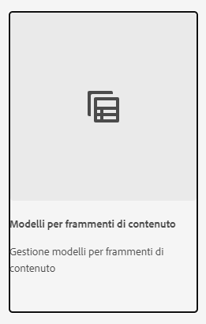

# Scopri come creare modelli per frammenti di contenuto in AEM {#architect-headless-content-fragment-models}

## Percorso affrontato finora {#story-so-far}

All’inizio del [Percorso di authoring di contenuti AEM Headless](overview.md), [Nozioni di base sulla modellazione dei contenuti per headless con AEM](basics.md) ha trattato i concetti e la terminologia di base relativi all’authoring per headless.

L&#39;articolo si basa su questi elementi per comprendere come creare modelli per frammenti di contenuto personalizzati per il progetto AEM headless.

## Obiettivo {#objective}

* **Pubblico**: principiante
* **Obiettivo**: i concetti e la meccanica di modellazione dei contenuti per i CMS headless utilizzando Modelli per frammenti di contenuto.

<!-- which persona does this? -->
<!-- and who allows the configuration on the folders? -->

<!--
## Enabling Content Fragment Models {#enabling-content-fragment-models}

At the very start you need to enable Content Fragment Models for your site, this is done in the Configuration Browser; under Tools -> General -> Configuration Browser. You can either select to configure the global entry, or create a configuration. For example:

>[!NOTE]
>
>See Additional Resources - Content Fragments in the Configuration Browser
-->

## Creazione di modelli per frammenti di contenuto {#creating-content-fragment-models}

È quindi possibile creare modelli per frammenti di contenuto e definire la struttura. Questo può essere fatto in **Strumenti** -> **Generale** -> **Modelli per frammenti di contenuto**.

Dopo aver selezionato questa opzione, passa alla posizione del modello e seleziona **Crea**. Qui puoi inserire vari dettagli chiave.

L’opzione **Abilita modello** è attivata per impostazione predefinita. Ciò significa che il modello è disponibile per l’uso (nella creazione di frammenti di contenuto) non appena lo hai salvato. Se lo desideri, puoi disattivarlo; in seguito potrai abilitare (o disabilitare) un modello esistente.

Conferma con **Crea** e poi **Apri** il modello per iniziare a definire la struttura.

## Definizione dei modelli per frammenti di contenuto {#defining-content-fragment-models}

Quando aprite un nuovo modello, viene visualizzato un grande spazio vuoto a sinistra e un lungo elenco di **Tipi di dati** a destra:

Quindi, cosa fare?

Puoi trascinare le istanze dei **Tipi di dati** nello spazio a sinistra: stai già definendo il tuo modello!

Dopo aver aggiunto un tipo di dati, dovrai definire le **Proprietà** per quel campo. Dipendono dal tipo utilizzato. Esempio:

È possibile aggiungere un numero illimitato di campi. Esempio:

### Gli autori dei contenuti {#your-content-authors}

Gli autori dei contenuti non visualizzano i tipi di dati e le proprietà effettivamente utilizzati per creare i modelli. Ciò significa che potresti dover fornire loro aiuto e informazioni su come completare campi specifici. Per informazioni di base è possibile utilizzare Etichetta campo e Valore predefinito, ma in casi più complessi potrebbe essere necessario prendere in considerazione la documentazione specifica del progetto.

>[!NOTE]
>
>Consulta Risorse aggiuntive - Modelli per frammenti di contenuto.

## Gestione dei modelli per frammenti di contenuto {#managing-content-fragment-models}

<!-- needs more details -->

La gestione dei modelli per frammenti di contenuto comporta:

* Abilitarli (o disattivarli), per renderli disponibili agli autori al momento della creazione dei frammenti di contenuto.
* Eliminazione: è sempre necessario eliminare, ma ci si deve accertare di eliminare un modello già utilizzato per i frammenti di contenuto, in particolare i frammenti già pubblicati.

## Pubblicazione {#publishing}

<!-- needs more details -->

I modelli per frammenti di contenuto devono essere pubblicati quando/prima che vengano pubblicati eventuali frammenti di contenuto dipendenti.

>[!NOTE]
>
>Se un autore cerca di pubblicare un frammento di contenuto per il quale il modello non è stato ancora pubblicato, questo viene segnalato in un elenco di selezione e il modello viene pubblicato con il frammento.

Non appena un modello viene pubblicato, viene *bloccato* in modalità SOLA LETTURA sull’autore. Questo serve a evitare modifiche che potrebbero causare errori agli schemi e alle query GraphQL esistenti, soprattutto nell’ambiente di pubblicazione. È indicato nella console come **Bloccato**.

Quando il modello è **Bloccato** (in modalità SOLA LETTURA), è possibile visualizzare il contenuto e la struttura dei modelli, ma non è possibile modificarli direttamente; anche se puoi gestire i modelli **Bloccati** dalla console o dall’editor modelli.

## Passaggio successivo {#whats-next}

Dopo aver appreso le nozioni di base, il passaggio successivo consiste nell’iniziare a creare modelli per frammenti di contenuto personalizzati.

## Risorse aggiuntive {#additional-resources}

* [Concetti relativi all’authoring](/help/sites-cloud/authoring/getting-started/concepts.md)

* [Operazioni di base](/help/sites-cloud/authoring/getting-started/basic-handling.md): questa pagina si basa principalmente sulla console **Sites**, ma molte delle funzioni sono utili anche per navigare verso e intervenire su **Modelli per frammenti di contenuto** nella console **Generale**.

* [Utilizzo di frammenti di contenuto](/help/sites-cloud/administering/content-fragments/overview.md)

   * [Modelli per frammenti di contenuto](/help/sites-cloud/administering/content-fragments/content-fragment-models.md)

      * [Definizione del modello per frammenti di contenuto](/help/sites-cloud/administering/content-fragments/content-fragment-models.md#defining-your-content-fragment-model)

      * [Abilitazione o disabilitazione di un modello per frammenti di contenuto](/help/sites-cloud/administering/content-fragments/content-fragment-models.md#enabling-disabling-a-content-fragment-model)

      * [Consentire modelli per frammenti di contenuto nella cartella delle risorse](/help/sites-cloud/administering/content-fragments/content-fragment-models.md#allowing-content-fragment-models-assets-folder)

      * [Eliminazione di un modello per frammenti di contenuto](/help/sites-cloud/administering/content-fragments/content-fragment-models.md#deleting-a-content-fragment-model)

      * [Pubblicazione di un modello per frammenti di contenuto](/help/sites-cloud/administering/content-fragments/content-fragment-models.md#publishing-a-content-fragment-model)

      * [Annullamento della pubblicazione di un modello per frammenti di contenuto](/help/sites-cloud/administering/content-fragments/content-fragment-models.md#unpublishing-a-content-fragment-model)

      * [Modelli per frammenti di contenuto bloccati (pubblicati)](/help/sites-cloud/administering/content-fragments/content-fragment-models.md#locked-published-content-fragment-models)

* Guide introduttive

   * [Creare la configurazione headless dei modelli per frammenti di contenuto](/help/headless/setup/create-content-model.md)
