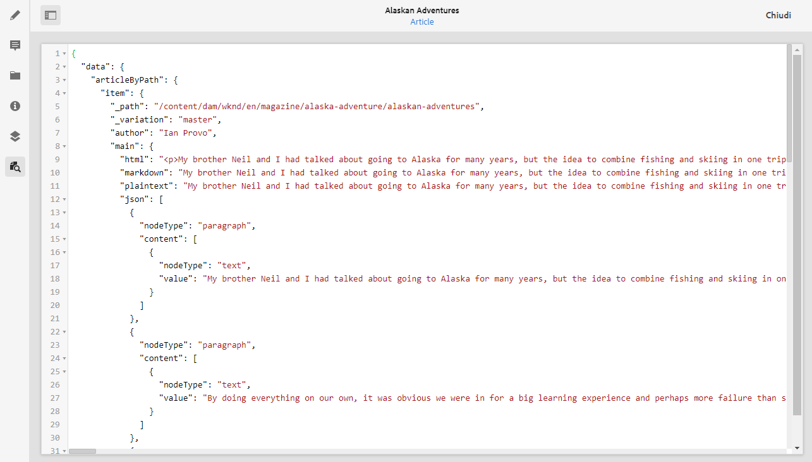
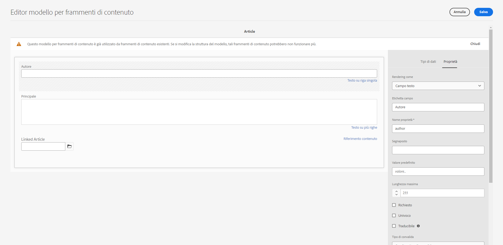
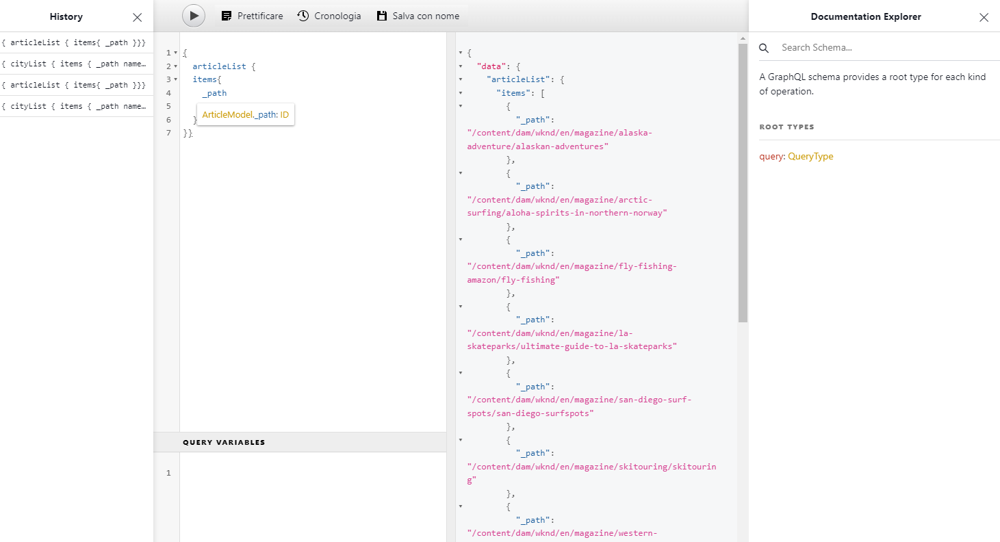

# Come accedere al contenuto tramite API di consegna di AEM {#access-your-content}

In questa parte del [Percorso per sviluppatori headless di AEM](overview.md) scopri come utilizzare le query GraphQL per accedere al contenuto dei frammenti di contenuto e inviarlo all’app (consegna headless).

## Percorso affrontato finora {#story-so-far}

Nel documento precedente del percorso headless AEM, [Come modellare il contenuto](model-your-content.md) hai appreso le nozioni di base sulla modellazione dei contenuti in AEM, quindi ora devi capire come modellare la struttura dei contenuti, quindi realizzare tale struttura utilizzando AEM Modelli di frammento di contenuto e Frammenti di contenuto:

* Riconoscere i concetti e la terminologia relativi alla modellazione dei contenuti.
* Scopri perché è necessaria la modellazione dei contenuti per la distribuzione di contenuti headless.
* Scopri come realizzare questa struttura utilizzando Modelli di frammenti di contenuto di AEM (e creare contenuti con frammenti di contenuto).
* Come modellare il contenuto; principi con esempi base.

Questo articolo si basa su questi elementi fondamentali per comprendere come accedere al contenuto headless esistente in AEM utilizzando l’API GraphQL AEM.

* **Pubblico**: principiante
* **Obiettivo**: scopri come accedere al contenuto dei frammenti di contenuto utilizzando query GraphQL di AEM:
   * Introduzione a GraphQL e all’API GraphQL di AEM.
   * Approfondisci i dettagli dell’API GraphQL di AEM.
   * Osserva alcune query di esempio per vedere come funzionano in pratica.

## Desideri accedere ai tuoi contenuti? {#so-youd-like-to-access-your-content}

Allora... disponi di tutto questo contenuto, ben strutturato (in Frammenti di contenuto) e in attesa di alimentare la tua nuova app. La domanda è: come arrivarci?

Ciò di cui hai bisogno è un modo per eseguire il targeting di contenuti specifici, selezionare ciò che ti serve e restituirlo all’app per un’ulteriore elaborazione.

Con Adobe Experience Manager (AEM) as a Cloud Service, puoi accedere in modo selettivo ai frammenti di contenuto, utilizzando l’API GraphQL di AEM, per restituire solo il contenuto necessario. Ciò significa che è possibile realizzare una distribuzione headless di contenuti strutturati da utilizzare nelle applicazioni.

>[!NOTE]
>
>API GraphQL di AEM è un’implementazione personalizzata, basata sulle specifiche API GraphQL standard.

## GraphQL - Introduzione {#graphql-introduction}

GraphQL è una specifica open-source che fornisce:

* un linguaggio di query che consente di selezionare contenuto specifico da oggetti strutturati.
* un runtime per eseguire queste query con il contenuto strutturato.

GraphQL è un’API fortemente tipizzata. Ciò significa che *tutti* i contenuti devono essere chiaramente strutturati e organizzati per tipo, in modo che GraphQL *comprenda* accesso e modalità dello stesso. I campi dati sono definiti all’interno degli schemi GraphQL che definiscono la struttura degli oggetti contenuto.

Gli endpoint GraphQL forniscono quindi i percorsi che rispondono alle query GraphQL.

Ciò significa che l’app può selezionare in modo preciso, affidabile ed efficiente il contenuto necessario, esattamente ciò di cui hai bisogno quando viene utilizzata con AEM.

>[!NOTE]
>
>Vedi *GraphQL*.org e *GraphQL*.com.

<!--
## AEM and GraphQL {#aem-graphql}

GraphQL is used in various locations in AEM; for example:

* Content Fragments
  * A customized API has been developed for this use-case (Headless Delivery to your app).
    * This is the AEM GraphQL API.
* Commerce
  * AEM Commerce consumes data from a Commerce platform via GraphQL.
  * There are GraphQL integrations between AEM and various third-party commerce solutions, used with the extension hooks provided by the CIF Core Components.
    * This does not use the AEM GraphQL API.

>[!NOTE]
>
>This step of the Headless Journey is only concerned with the AEM GraphQL API and Content Fragments.
-->

## API GraphQL di AEM {#aem-graphql-api}

L’API GraphQL di AEM è una versione personalizzata basata sulle specifiche API standard di GraphQL, appositamente configurata per consentire l’esecuzione di query (complesse) sui frammenti di contenuto.

I frammenti di contenuto vengono utilizzati, in quanto il contenuto è strutturato in base ai modelli di frammenti di contenuto. Questo soddisfa i requisiti fondamentali di GraphQL.

* Un modello di frammento di contenuto è costituito da uno o più campi.
   * Ogni campo è definito in base a un tipo di dati.
* I modelli per frammenti di contenuto vengono utilizzati per generare gli schemi GraphQL di AEM corrispondenti.

Per accedere effettivamente a GraphQL per AEM (e il contenuto) viene utilizzato un endpoint per fornire il percorso di accesso.

Il contenuto restituito, tramite l’API GraphQL di AEM, può quindi essere utilizzato dalle tue applicazioni.

Per facilitare l’input diretto e il test delle query, è disponibile anche un’implementazione dell’interfaccia standard GraphiQL da usare con GraphQL di AEM (installabile con AEM). Offre funzioni quali evidenziazione della sintassi, completamento automatico, suggerimenti automatici, nonché una cronologia e una documentazione online.

>[!NOTE]
>
>L’implementazione dell’API GraphQL per AEM si basa sulle librerie Java GraphQL.

<!--
### Use Cases for Author and Publish Environments {#use-cases-author-publish-environments}

The use cases for the AEM GraphQL API can depend on the type of AEM as a Cloud Service environment:

* Publish environment; used to: 
  * Query content for JS application (standard use-case)

* Author environment; used to: 
  * Query content for "content management purposes":
    * GraphQL in AEM as a Cloud Service is currently a read-only API.
    * The REST API can be used for CR(u)D operations.
-->

## Frammenti di contenuto da utilizzare con l’API GraphQL di AEM {#content-fragments-use-with-aem-graphql-api}

I frammenti di contenuto possono essere utilizzati come base per GraphQL per schemi e query AEM dato che:

* Consentono di progettare, creare, curare e pubblicare contenuti indipendenti dalla pagina che possono essere distribuiti in modo headless.
* Si basano su un modello per frammenti di contenuto, che predefinisce la struttura del frammento risultante utilizzando una selezione di tipi di dati.
* È possibile ottenere livelli aggiuntivi di struttura con il tipo di dati Riferimento frammento, disponibile quando si definisce un modello.

### Modelli per frammenti di contenuto {#content-fragments-models}

Questi Modelli per frammenti di contenuto:

* Sono utilizzati per generare gli Schemi, una volta **Abilitati**.
* Forniscono i tipi di dati e i campi richiesti per GraphQL. Assicurano che l’applicazione trasmetta solo richieste ammesse e riceva solo i contenuti previsti.
* Il tipo di dati **Riferimenti frammento** può essere utilizzato nel modello per fare riferimento a un altro frammento di contenuto e quindi introdurre ulteriori livelli di struttura.

### Riferimenti frammento {#fragment-references}

Il **Riferimento frammento**:

* È un tipo di dati specifico disponibile quando si definisce un modello di frammento di contenuto.
* Fa riferimento a un altro frammento, a seconda di un modello per frammento di contenuto specifico.
* Consente di creare e quindi recuperare dati strutturati.

   * Quando è definito come **multifeed**, è possibile fare riferimento a (recuperare) più frammenti secondari dal frammento principale.

### Anteprima JSON {#json-preview}

Per facilitare la progettazione e lo sviluppo di modelli di frammenti di contenuto, puoi visualizzare in anteprima l’output JSON nell’Editor frammento di contenuto.



<!--
## GraphQL Schema Generation from Content Fragments {#graphql-schema-generation-content-fragments}

GraphQL is a strongly-typed API, which means that content must be clearly structured and organized by type. The GraphQL specification provides a series of guidelines on how to create a robust API for interrogating content on a certain instance. To do this, a client must fetch the Schema, which contains all the types necessary for a query. 

For Content Fragments, the GraphQL schemas (structure and types) are based on **Enabled** Content Fragment Models and their data types.

>[!CAUTION]
>
>All the GraphQL schemas (derived from Content Fragment Models that have been **Enabled**) are readable through the GraphQL endpoint.
>
>This means that you need to ensure that no sensitive content is available, to ensure that no sensitive data is exposed via GraphQL endpoints; for example, this includes information that could be present as field names in the model definition.

For example, if a user created a Content Fragment Model called `Article`, then AEM generates the object `article` that is of a type `ArticleModel`. The fields within this type correspond to the fields and data types defined in the model.

1. A Content Fragment Model:

   

1. The corresponding GraphQL schema (output from GraphiQL automatic documentation):
   

   This shows that the generated type `ArticleModel` contains several [fields](#fields). 
   
   * Three of them have been controlled by the user: `author`, `main` and `referencearticle`.

   * The other fields were added automatically by AEM, and represent helpful methods to provide information about a certain Content Fragment; in this example, `_path`, `_metadata`, `_variations`. These [helper fields](#helper-fields) are marked with a preceding `_` to distinguish between what has been defined by the user and what has been auto-generated.

1. After a user creates a Content Fragment based on the Article model, it can then be interrogated through GraphQL. For examples, see the Sample Queries.md#graphql-sample-queries) (based on a sample Content Fragment structure for use with GraphQL.

In GraphQL for AEM, the schema is flexible. This means that it is auto-generated each and every time a Content Fragment Model is created, updated or deleted. The data schema caches are also refreshed when you update a Content Fragment Model.

The Sites GraphQL service listens (in the background) for any modifications made to a Content Fragment Model. When updates are detected, only that part of the schema is regenerated. This optimization saves time and provides stability.

So for example, if you:

1. Install a package containing `Content-Fragment-Model-1` and `Content-Fragment-Model-2`:
 
   1. GraphQL types for `Model-1` and `Model-2` are generated.

1. Then modify `Content-Fragment-Model-2`:

   1. Only the `Model-2` GraphQL type will get updated.

   1. Whereas `Model-1` will remain the same. 

>[!NOTE]
>
>This is important to note in case you want to do bulk updates on Content Fragment Models through the REST api, or otherwise.

The schema is served through the same endpoint as the GraphQL queries, with the client handling the fact that the schema is called with the extension `GQLschema`. For example, performing a simple `GET` request on `/content/cq:graphql/global/endpoint.GQLschema` will result in the output of the schema with the Content-type: `text/x-graphql-schema;charset=iso-8859-1`.

### Schema Generation - Unpublished Models {#schema-generation-unpublished-models}

When Content Fragments are nested it can happen that a parent Content Fragment Model is published, but a referenced model is not.

>[!NOTE]
>
>The AEM UI prevents this happening, but if publishing is made programmatically, or with content packages, it can occur.

When this happens, AEM generates an *incomplete* Schema for the parent Content Fragment Model. This means that the Fragment Reference, which is dependent on the unpublished model, is removed from the schema.

## AEM GraphQL Endpoints {#aem-graphql-endpoints}

An endpoint is the path used to access GraphQL for AEM. Using this path you (or your app) can:

* access the GraphQL schemas,
* send your GraphQL queries,
* receive the responses (to your GraphQL queries).

AEM allows for:

* A global endpoint - available for use by all sites.
* Endpoints for specific Sites configurations - that you can configure (in the Configuration Browser), specific to a specified site/project.

## Permissions {#permissions}

The permissions are those required for accessing Assets.

## The AEM GraphiQL Interface {#aem-graphiql-interface}

To help you directly input, and test queries, an implementation of the standard GraphiQL interface is available for use with AEM GraphQL. This can be installed with AEM.

>[!NOTE]
>
>GraphiQL is bound the global endpoint (and does not work with other endpoints for specific Sites configurations).

It provides features such as syntax-highlighting, auto-complete, auto-suggest, together with a history and online documentation.


-->

## Accessibili tramite l’API GraphQL di AEM {#actually-using-aem-graphiql}

### Configurazione iniziale {#initial-setup}

Prima di iniziare con le query sul contenuto è necessario:

* Abilitare l’endpoint 
   * Usa Strumenti -> Generale -> GraphQL
   * [Abilitazione dell’endpoint GraphQL](/help/headless/graphql-api/graphql-endpoint.md)
      * In questo modo sarà possibile abilitare anche IDE GraphiQL.

### Struttura di esempio {#sample-structure}

Per utilizzare effettivamente l’API GraphQL di AEM in una query, possiamo utilizzare le due strutture modello di frammento di contenuto molto semplici:

* Azienda
   * Nome - Testo
   * Amministratore delegato (Persona) - Riferimento al frammento
   * Dipendenti (Persone) - Riferimento/i al frammento
* Persona
   * Nome - Testo
   * Nome - Testo

Come puoi vedere, i campi Amministratore delegato e Dipendenti fanno riferimento ai frammenti persona.

I modelli di frammento vengono utilizzati:

* durante la creazione del contenuto nell’Editor frammento di contenuto
* per generare gli schemi GraphQL da interrogare

### Dove testare le query {#where-to-test-your-queries}

Le query possono essere immesse nell&#39;interfaccia GraphiQL. Puoi accedere all’editor di query da:

* **Strumenti** -> **Generale** -> **Editor query GraphQL**
* direttamente; ad esempio `http://localhost:4502/aem/graphiql.html`


### Guida introduttiva alle query {#getting-Started-with-queries}

Una query semplice consiste nel restituire il nome di tutte le voci nello schema Azienda. Qui si richiede un elenco di tutti i nomi aziendali:

```xml
query {
  companyList {
    items {
      name
    }
  }
}
```

Una query leggermente più complessa consiste nel selezionare tutte le persone che non hanno un nome di “Jobs”. In questo modo verranno filtrate tutte le persone per quelle che non hanno il nome Jobs. Questo si ottiene con l&#39;operatore EQUALS_NOT (ce ne sono molti altri):

```xml
query {
  personList(filter: {
    name: {
      _expressions: [
        {
          value: "Jobs"
          _operator: EQUALS_NOT
        }
      ]
    }
  }) {
    items {
      name
      firstName
    }
  }
}
```

È inoltre possibile creare query più complesse. Ad esempio, eseguire una query per tutte le aziende che hanno almeno un dipendente con il nome di “Smith”. Questa query illustra il filtro per qualsiasi persona di nome “Smith” e restituisce informazioni da frammenti nidificati:

```xml
query {
  companyList(filter: {
    employees: {
      _match: {
        name: {
          _expressions: [
            {
              value: "Smith"
            }
          ]
        }
      }
    }
  }) {
    items {
      name
      ceo {
        name
        firstName
      }
      employees {
        name
        firstName
      }
    }
  }
}
```

<!-- need code / curl / cli examples-->

Per informazioni dettagliate sull’utilizzo dell’API GraphQL di AEM e sulla configurazione degli elementi necessari, puoi fare riferimento a:

* Imparare a utilizzare GraphQL con AEM
* La struttura del frammento di contenuto di esempio
* Imparare a utilizzare GraphQL con AEM: contenuto di esempio e query

## Passaggio successivo {#whats-next}

Ora che hai imparato ad accedere ai contenuti headless e ad eseguire query tramite l’API GraphQL di AEM puoi [imparare ad utilizzare l’API REST per accedere e aggiornare il contenuto dei frammenti di contenuto](update-your-content.md).

## Risorse aggiuntive {#additional-resources}

* [API di Adobe Experience Manager as a Cloud Service](https://developer.adobe.com/experience-cloud/experience-manager-apis/)
* [GraphQL.org](https://graphql.org)
   * [Schemi](https://graphql.org/learn/schema/)
   * [Variabili](https://graphql.org/learn/queries/#variables)
   * [Librerie Java GraphQL](https://graphql.org/code/#java)
* [GraphiQL](https://graphql.org/learn/serving-over-http/#graphiql)
* [Imparare a utilizzare GraphQL con AEM](/help/headless/graphql-api/content-fragments.md)
   * [Abilitazione dell’endpoint GraphQL](/help/headless/graphql-api/graphql-endpoint.md)
   * [Installazione dell’interfaccia di GraphiQL per AEM](/help/headless/graphql-api/graphiql-ide.md)
* [La struttura del frammento di contenuto di esempio](/help/headless/graphql-api/sample-queries.md#content-fragment-structure-graphql)
* [Imparare a utilizzare GraphQL con AEM: contenuto di esempio e query](/help/headless/graphql-api/sample-queries.md)
   * [Query di esempio: un singolo frammento di città specifico](/help/headless/graphql-api/sample-queries.md#sample-single-specific-city-fragment)
   * [Esempio di query per metadati: elenco dei metadati per i riconoscimenti denominati GB](/help/headless/graphql-api/sample-queries.md#sample-metadata-awards-gb)
   * [Query di esempio: tutte le città con una variante denominata](/help/headless/graphql-api/sample-queries.md#sample-cities-named-variation)
* [Abilitare la funzionalità dei frammenti di contenuto nel browser configurazioni](/help/sites-cloud/administering/content-fragments/setup.md#enable-content-fragment-functionality-configuration-browser)
* [Utilizzo di frammenti di contenuto](/help/sites-cloud/administering/content-fragments/overview.md)
   * [Modelli per frammenti di contenuto](/help/sites-cloud/administering/content-fragments/content-fragment-models.md)
   * [Output JSON](/help/assets/content-fragments/content-fragments-json-preview.md)
* [Comprendere la condivisione CORS (Cross-Origin Resource Sharing)](https://experienceleague.adobe.com/docs/experience-manager-learn/foundation/security/understand-cross-origin-resource-sharing.html?lang=it#understand-cross-origin-resource-sharing-(cors))
* [Query persistenti GraphQL: abilitazione della memorizzazione in cache in Dispatcher](/help/headless/deployment/dispatcher-caching.md)
* [Generazione dei token di accesso per le API lato server](/help/implementing/developing/introduction/generating-access-tokens-for-server-side-apis.md)
* [Guida introduttiva ad AEM Headless](https://experienceleague.adobe.com/docs/experience-manager-learn/getting-started-with-aem-headless/graphql/overview.html?lang=it) - Una breve serie di video tutorial che offre una panoramica dell’utilizzo di funzioni headless di AEM, tra cui modellazione dei contenuti e GraphQL.
