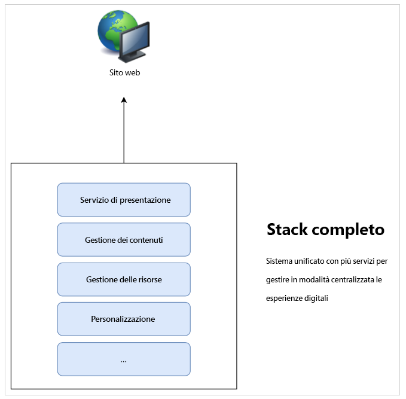
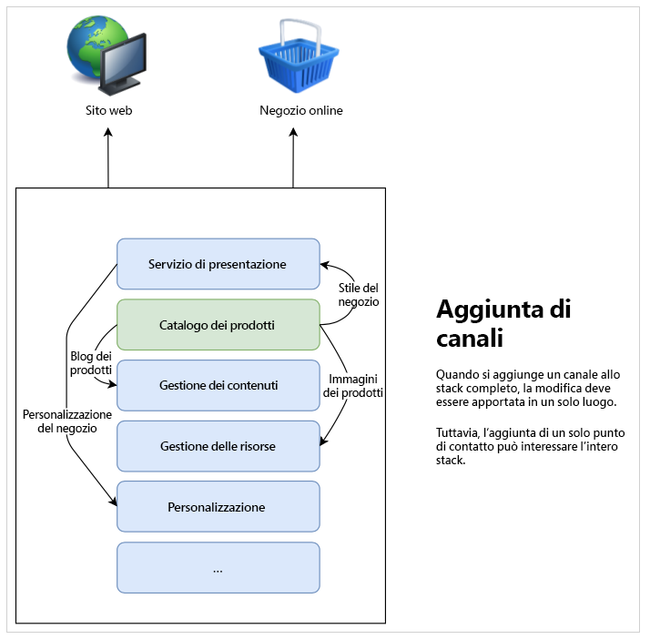
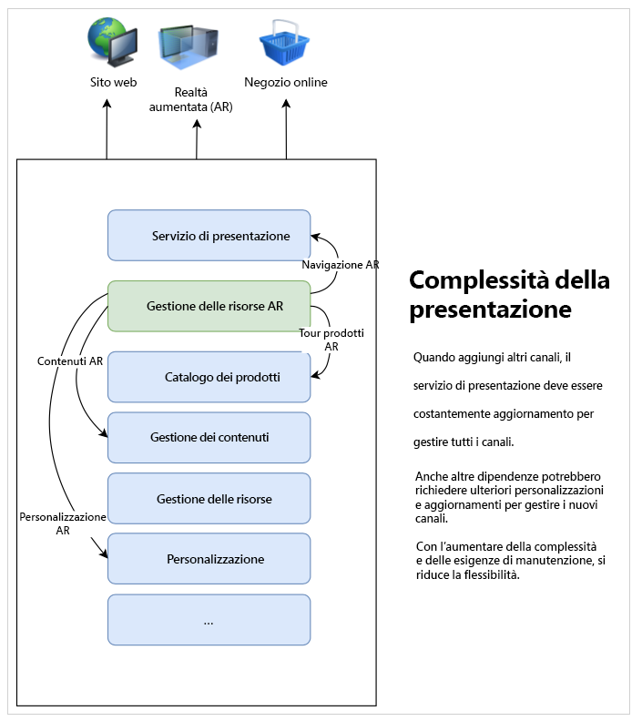
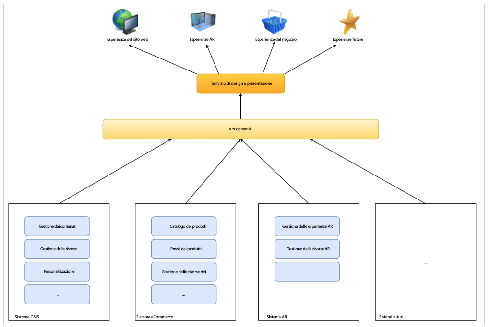

# Scopri di più sullo sviluppo di CMS headless {#learn-about}

In questa parte del [Percorso per sviluppatori di AEM Headless](overview.md), scoprirai la tecnologia headless e perché utilizzarla.

## Obiettivo {#objective}

Questo documento è utile per comprendere la distribuzione dei contenuti headless e perché deve essere utilizzata. Dopo la lettura dovresti:

* Comprendere i concetti e la terminologia di base per la distribuzione di contenuti headless
* Perché e quando è richiesto un headless
* Conoscere ad alto livello come vengono utilizzati i concetti headless e come si relazionano

## Distribuzione contenuti full-stack {#full-stack}

Sin dall’introduzione dei sistemi di gestione dei contenuti (CMS), facili da usare e su larga scala, le aziende li hanno utilizzati come punto centrale per gestire messaggistica, branding e comunicazioni. Utilizzando il CMS come punto centrale per l’amministrazione delle esperienze, è possibile migliorare l’efficienza eliminando la necessità di duplicare attività in sistemi diversi.

In un CMS full-stack, tutte le funzionalità per la modifica del contenuto si trovano nel CMS. Le funzionalità del sistema sono articolate nei diversi componenti dello stack CMS. La soluzione full-stack offre molti vantaggi.

* Hai un sistema da mantenere.
* I contenuti vengono gestiti a livello centrale.
* Tutti i servizi del sistema sono integrati.
* L’authoring dei contenuti è semplice.

Quindi, se desideri aggiungere un nuovo canale o supportare nuovi tipi di esperienze, puoi inserire uno (o più) nuovi componenti allo stack e disporre di una sola posizione per apportare le modifiche.

La complessità delle dipendenze all’interno dello stack diventa subito evidente, in quanto è possibile che altri elementi dello stack debbano essere regolati per adattarsi alle modifiche.

## Limiti della consegna full-stack {#limits}

L’approccio full-stack crea intrinsecamente un silo in cui tutte le esperienze arrivano in un unico sistema. Le modifiche o le aggiunte a un componente del silo richiedono modifiche ad altri componenti che possono rendere le modifiche molto lunghe e costose.

Ciò vale in particolare per il sistema di presentazione, che nelle configurazioni tradizionali è spesso strettamente legato al CMS. Ogni nuovo canale implica generalmente un aggiornamento del sistema di presentazione, che può interessare tutti gli altri canali.

I limiti di questo silo naturale possono diventare evidenti, dato che serve uno sforzo maggiore per coordinare le modifiche tra tutti i componenti dello stack.

Gli utenti si aspettano un coinvolgimento indipendentemente dalla piattaforma o dal punto di contatto, il che richiede flessibilità nella distribuzione delle esperienze.  Questo approccio multicanale è lo standard delle esperienze digital, mentre in alcune circostanze un approccio full-stack può rivelarsi rigido.

## La “testa” in headless {#the-head}

La “testa” di qualsiasi sistema è generalmente il renderer di output di quel sistema, tipicamente un&#39;interfaccia utente grafica o un altro tipo di output grafico.

Un server headless, ad esempio, è probabilmente situato in un rack in una stanza server da qualche parte e non ha monitor collegati. Per accedervi è necessario connettersi in remoto. In questo caso, il monitor è la “testa” perché si occupa del rendering dell’output del server. In qualità di consumatore del servizio, quando ti connetti da remoto, la tua “testa” è il monitor.

Quando parliamo di un CMS headless, il CMS gestisce i contenuti e continua a consegnarli ai consumatori. Tuttavia, consegnando solo il **contenuto** in modo standardizzato, un CMS headless omette il rendering finale dell’output, lasciando la **presentazione** del contenuto al servizio utilizzato.

I servizi utilizzati, siano essi esperienze AR, un webshop, esperienze mobili, app web progressive (PWA), ecc., prendono i contenuti dal CMS headless e forniscono il loro rendering. Si occupano di fornire le teste per i tuoi contenuti.

Omettendo la “testa” si semplifica il CMS rimuovendo la complessità. In questo modo si sposta anche la responsabilità di eseguire il rendering dei contenuti ai servizi che ne hanno effettivamente bisogno e che sono spesso più adatti a tale rendering.

## Separazione {#decoupling}

La distribuzione headless è possibile esponendo un set di interfacce di programmazione delle applicazioni (API) affidabili e flessibili in cui è possibile selezionare tutte le esperienze. L’API funge da linguaggio comune tra i servizi e li associa a livello di contenuto tramite la distribuzione standardizzata dei contenuti, ma offre la flessibilità necessaria per implementare le proprie soluzioni.

Headless è un esempio di separazione del contenuto dalla presentazione. O in senso più generico, separando il front end dal back end dello stack di servizi. In una configurazione headless, il sistema di presentazione (la “testa”) viene separato dalla gestione dei contenuti (la coda). I due interagiscono solo tramite chiamate API.

Questa separazione consente a ogni servizio utilizzato (front-end) di creare la propria esperienza in base allo stesso contenuto distribuito tramite le API, garantendo il riutilizzo e la coerenza dei contenuti. I servizi utilizzati possono quindi implementare i propri sistemi di presentazione, consentendo la scalabilità orizzontale dello stack di gestione dei contenuti (back-end).

## Sostegni tecnologici {#technology}

Un approccio headless consente di creare uno stack tecnologico in grado di adattarsi rapidamente e facilmente alle esigenze future di esperienza digitale.

In passato, le API per CMS erano solitamente basate su REST. Il trasferimento di stato rappresentativo (REST) fornisce risorse come testo in modo senza stato. Questo consente di leggere e modificare le risorse con un set di operazioni predefinito. REST ha consentito una grande interoperabilità tra i servizi sul web garantendo una rappresentazione senza stato del contenuto.

C&#39;è ancora bisogno di disporre di API REST affidabili. Tuttavia le richieste REST possono essere grandi e complesse. Se hai più consumatori che fanno chiamate REST per tutti i tuoi canali, questi composti di verbosità e le prestazioni possono essere influenzati.

La distribuzione di contenuti headless utilizza spesso le API GraphQL. GraphQL consente un trasferimento senza stato simile, ma consente query più mirate, riducendo il numero totale di query necessarie e migliorando le prestazioni. È comune vedere le soluzioni utilizzare un mix di REST e GraphQL, essenzialmente scegliendo lo strumento migliore per il lavoro in corso.

Qualunque sia l’API scelta, definendo un sistema headless basato su API comuni, puoi sfruttare il browser più aggiornato e altre tecnologie web come le app web progressive (PWA). Le API creano un’interfaccia standard facilmente estensibile e adattabile.

In genere, il rendering del contenuto viene eseguito sul lato client. Normalmente, ciò significa che il contenuto viene richiamato da un utente su un dispositivo mobile, il CMS lo distribuisce e il dispositivo mobile (il client) è responsabile del rendering del contenuto servito. Se il dispositivo è vecchio o altrimenti lento, anche l’esperienza digitale è lenta.

La possibilità di separare i contenuti dalla presentazione consente di avere un maggiore controllo su tali problemi di prestazioni dal lato client. Il rendering dal lato server (SSR) trasferisce la responsabilità del rendering del contenuto dal browser del client al server. In questo modo, in qualità di fornitore del contenuto, puoi offrire al pubblico un livello di prestazioni garantito, se necessario.

## Sfide organizzative {#organization}

Headless rende la distribuzione delle esperienze digitali ancora più flessibile. Ma questa flessibilità può anche presentare la propria sfida.

Avere molti canali diversi può significare che ciascuno di essi dispone di propri sistemi di presentazione. Anche se tutti utilizzano lo stesso contenuto tramite le stesse API, l’esperienza può essere diversa a causa delle diverse presentazioni. Occorre prestare attenzione e preoccupazione per garantire la coerenza dell’esperienza del cliente.

Implementando sistemi di progettazione accurati, condividendo librerie di pattern e utilizzando componenti di progettazione riutilizzabili e framework lato client aperti consolidati, è possibile garantire esperienze coerenti, ma questo deve essere pianificato.

## Il futuro è headless e il futuro è adesso {#future}

Le esperienze digitali continueranno a definire il modo in cui i brand interagiscono con i clienti. La novità del design headless è la flessibilità che ci offre per rispondere alle aspettative dei clienti in continua evoluzione.

È impossibile prevedere il futuro, ma l’headless ti dà l’agilità di reagire a qualsiasi cosa il futuro abbia in serbo.

## AEM e headless {#aem-and-headless}

Continuando a utilizzare questo percorso per sviluppatori, scoprirai come AEM supporta la consegna headless lungo le sue funzionalità di consegna full-stack.

In qualità di leader di settore nella gestione dell&#39;esperienza digitale, Adobe si rende conto che la soluzione ideale per le sfide del mondo reale che i creatori di esperienze affrontano raramente è una scelta binaria. Questo è il motivo per cui AEM non solo supporta entrambi i modelli, ma consente anche di creare una combinazione unica perfetta che unisce i vantaggi di uno stack headless e completo, per aiutarti a servire al meglio i consumatori dei contenuti, ovunque si trovino.

Questo percorso si concentra sul modello di distribuzione dei contenuti unicamente headless. Tuttavia, una volta appresi questi concetti fondamentali, è possibile continuare a esplorare le possibilità di entrambi i modelli.

## Passaggio successivo {#what-is-next}

Grazie per la tua partecipazione al percorso headless di AEM Dopo aver letto questo documento, dovresti:

* Comprendere i concetti e la terminologia di base per la distribuzione di contenuti headless.
* Capire perché e quando è richiesto l&#39;headless.
* Sapere bene come vengono utilizzati i concetti headless e come si relazionano.

Sviluppa questa conoscenza e continua il tuo percorso AEM headless rivedendo il documento successivo [Guida introduttiva a AEM Headless as a Cloud Service](getting-started.md) dove verrà illustrato come impostare gli strumenti necessari e come iniziare a pensare a come AEM affronta la distribuzione di contenuti headless e i relativi prerequisiti.

## Risorse aggiuntive {#additional-resources}

Sebbene sia consigliabile spostarsi nella parte successiva del percorso per lo sviluppo headless rivedendo il documento [Guida introduttiva ad AEM headless as a Cloud Service](getting-started.md), di seguito si trovano alcune risorse aggiuntive e opzionali per approfondire concetti menzionati in questo documento, che tuttavia non sono necessarie per continuare il percorso headless.

* [Introduzione all’Architettura di Adobe Experience Manager as a Cloud Service](/help/overview/architecture.md) - Comprendere la struttura di AEM as a Cloud Service
* [Introduzione ad AEM come CMS headless](/help/headless/introduction.md)
* Il [Portale per sviluppatori AEM](https://experienceleague.adobe.com/landing/experience-manager/headless/developer.html?lang=it)
* [Tutorial di AEM Headless](https://experienceleague.adobe.com/docs/experience-manager-learn/getting-started-with-aem-headless/overview.html?lang=it): segui questi pratici tutorial per scoprire come utilizzare le varie opzioni per distribuire contenuti agli endpoint headless con AEM e scegliere quello adatto a te.
