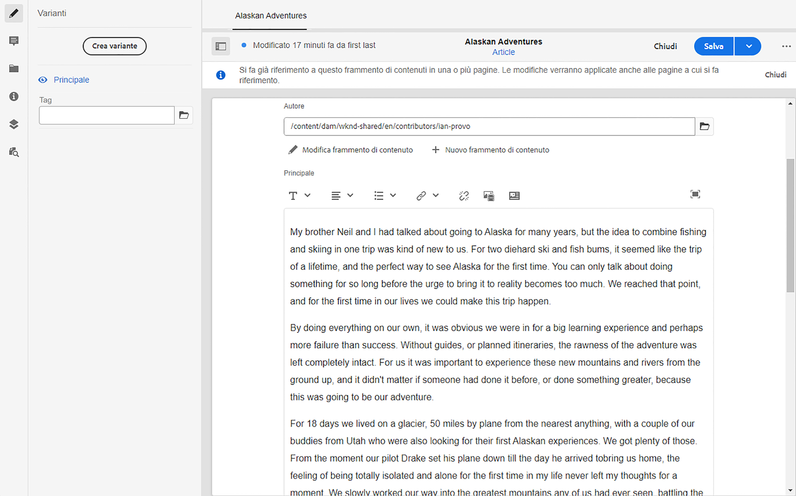

# Come modellare il contenuto {#model-your-content}

In questa parte del [Percorso di sviluppatori AEM headless](overview.md), scopri come modellare la struttura del contenuto. Quindi realizza quella struttura per Adobe Experience Manager (AEM) utilizzando Modelli per frammenti di contenuto e Frammenti di contenuto, da riutilizzare tra i canali.

## Percorso affrontato finora {#story-so-far}

All&#39;inizio, [Scopri lo sviluppo headless di CMS](learn-about.md) la distribuzione di contenuti headless e il motivo del loro utilizzo. In seguito la [Guida introduttiva a AEM headless as a Cloud Service](getting-started.md) ha descritto AEM headless nel contesto del tuo progetto.

Nel documento precedente del percorso di AEM headless, [Percorso della tua prima esperienza con AEM headless](path-to-first-experience.md), hai quindi appreso i passaggi necessari per implementare il primo progetto. Dopo averlo letto, puoi effettuare le seguenti operazioni:

* Comprendere e spiegare importanti considerazioni di pianificazione per la progettazione dei contenuti
* Scopri e spiega i passaggi per implementare headless, in base ai requisiti del livello di integrazione.
* impostare gli strumenti e le configurazioni AEM necessarie.
* Conoscere le best practice per semplificare il percorso headless, garantire l&#39;efficienza della generazione dei contenuti e garantire la distribuzione rapida dei contenuti.

Questo articolo si basa su questi fondamentali in modo da capire come preparare il tuo progetto AEM headless.

## Obiettivo {#objective}

* **Pubblico**: principiante
* **Obiettivo**: scopri come modellare la struttura del contenuto, quindi realizzare tale struttura utilizzando i Modelli per frammenti di contenuto di AEM e i Frammenti di contenuto:
   * Introduzione dei concetti e della terminologia relativi alla modellazione di dati/contenuti.
   * Scopri perché è necessaria la modellazione dei contenuti per la distribuzione di contenuti headless.
   * Scopri come realizzare questa struttura utilizzando Modelli di frammenti di contenuto di AEM (e creare contenuti con Frammenti di contenuto).
   * Scopri come modellare il contenuto; principi con campioni di base.

>[!NOTE]
>
>Modellazione dati è un campo di grandi dimensioni, in quanto viene utilizzato per lo sviluppo di database relazionali. Ci sono molti libri e fonti online di informazioni disponibili.
>
>Questo percorso considera solo gli aspetti di interesse durante la modellazione dei dati da utilizzare con AEM Headless.

## Modellazione dei contenuti {#content-modeling}

*Il mondo là fuori è grande e brutto*.

Forse sì, forse no. È certamente un ***complicato*** world out there e la modellazione dei dati viene utilizzata per definire una rappresentazione semplificata di una sottosezione molto piccola, utilizzando le informazioni specifiche necessarie per un determinato scopo.

>[!NOTE]
>
>Poiché l’AEM si occupa di contenuti, questo percorso si riferisce alla modellazione dati come modellazione dei contenuti.

Esempio:

Ci sono molte scuole, ma tutte hanno varie cose in comune:

* Una posizione
* Un dirigente scolastico
* Molti insegnanti
* Molti membri del personale non docente
* Molti studenti
* Molti ex-insegnanti
* Molti ex allievi
* Molte classi
* Molti (molti) libri
* Molti (molti) pezzi di attrezzatura
* Molte attività extra curriculari
* e così via....

Anche in un esempio così piccolo, la lista può sembrare infinita. Tuttavia, se si desidera che l&#39;applicazione esegua solo un&#39;attività semplice, limitare le informazioni alle attività essenziali.

Ad esempio, pubblicità di eventi speciali per tutte le scuole della zona:

* Nome della scuola
* Posizione della scuola
* Dirigente scolastico
* Tipo di evento
* Data dell’evento
* Insegnante che organizza l’evento

### Concetti {#concepts}

Ciò che si desidera descrivere viene definito **Entità** - praticamente le &quot;cose&quot; di cui vuoi archiviare le informazioni.

Le informazioni che si desidera memorizzare su di essi sono le **Attributi** (proprietà), come Nome e Qualifiche per gli insegnanti.

Poi ci sono varie **Relazioni** tra le entità. Per esempio, di solito una scuola ha un solo preside e molti insegnanti (e di solito il preside è anche un insegnante).

Il processo di analisi e definizione di queste informazioni, insieme alle relazioni tra di esse, è chiamato **Modellazione dei contenuti**.

### Funzioni di base {#basics}

Spesso è necessario iniziare con la stesura di un **Schema concettuale** che descrive le entità e le loro relazioni. Di solito questo schema è di alto livello (concettuale).

Dopo aver fissato lo schema concettuale è possibile tradurre i modelli in uno **Schema logico** che descrive le entità, gli attributi e le relazioni. A questo livello, esamina attentamente le definizioni per eliminare le duplicazioni e ottimizzare la progettazione.

>[!NOTE]
>
>A volte questi due passaggi vengono uniti, spesso a seconda della complessità dello scenario.

Ad esempio, sono necessarie entità separate per `Head Teacher` e `Teacher` o è sufficiente un attributo aggiuntivo sul modello `Teacher`?

### Garantire l’integrità dei dati {#data-integrity}

L’integrità dei dati è necessaria per garantire l’accuratezza e la coerenza dei contenuti durante l’intero ciclo di vita. Ciò include la garanzia che gli autori dei contenuti possano capire facilmente cosa archiviare e dove, per cui sono fondamentali i seguenti elementi:

* una struttura chiara
* una struttura il più concisa possibile (senza sacrificare la precisione)
* la convalida dei singoli campi
* all’occorrenza, limitare il contenuto di campi specifici a ciò che è significativo

### Eliminazione della ridondanza dei dati {#data-redundancy}

La ridondanza dei dati si verifica quando le stesse informazioni vengono memorizzate due volte nella struttura del contenuto. Questo dovrebbe essere evitato in quanto può generare confusione durante la creazione del contenuto ed errori durante l’esecuzione di query; per non parlare dell’uso improprio dello spazio di archiviazione.

### Ottimizzazione e prestazioni {#optimization-and-performance}

Ottimizzando la struttura è possibile migliorare le prestazioni, sia per la creazione di contenuti che per l’esecuzione di query.

Tutto è un bilanciamento, ma la creazione di una struttura troppo complessa o con troppi livelli può confondere gli autori che generano il contenuto. Inoltre, può influire notevolmente sulle prestazioni se la query deve accedere a più frammenti di contenuto nidificati (di riferimento) per recuperare il contenuto richiesto.

## Modellazione dei contenuti per AEM Headless {#content-modeling-for-aem-headless}

La Modellazione dati è un insieme di tecniche consolidate, spesso utilizzate quando si sviluppano database relazionali, quindi cosa significa Modellazione dei contenuti per AEM Headless?

### Perché? {#why}

Per garantire che l’applicazione possa richiedere e ricevere in modo coerente ed efficiente il contenuto richiesto da AEM, questo contenuto deve essere strutturato.

Ciò significa che l’applicazione conosce in anticipo la forma della risposta e quindi come elaborarla. Questo è più semplice della ricezione di contenuto in formato libero, che deve essere analizzato per determinare cosa contiene e quindi come può essere utilizzato.

### Introduzione a Come? {#how}

AEM utilizza Frammenti di contenuto per fornire le strutture necessarie per la distribuzione headless dei contenuti alle applicazioni.

La struttura del modello di contenuto è:

* realizzata secondo la definizione del modello per frammenti di contenuto,
* utilizzata come base dei frammenti di contenuto impiegati per la generazione dei contenuti.

>[!NOTE]
>
>I modelli per frammenti di contenuto vengono utilizzati anche come base degli schemi GraphQL AEM, utilizzati per recuperare i contenuti. Ulteriori informazioni su questo argomento in una sessione successiva.

Le richieste di contenuti vengono effettuate utilizzando l’API GraphQL di AEM, un’implementazione personalizzata dell’API GraphQL standard. L’API GraphQL dell’AEM consente di eseguire query (complesse) sui frammenti di contenuto, in cui ogni query è basata su un tipo di modello specifico.

Il contenuto restituito può quindi essere utilizzato dalle applicazioni.

## Creazione della struttura con modelli per frammenti di contenuto {#create-structure-content-fragment-models}

I modelli per frammenti di contenuto forniscono vari meccanismi che consentono di definire la struttura del contenuto.

Un modello per frammento di contenuto descrive un’entità.

>[!NOTE]
>Per poter creare modelli, è necessario abilitare la funzionalità Frammento di contenuto nel browser configurazioni.

>[!TIP]
>
>Il modello deve essere denominato in modo che l’autore del contenuto sappia quale modello selezionare durante la creazione di un frammento di contenuto.

All’interno di un modello:

1. **Tipi di dati** consente di definire i singoli attributi.
Ad esempio, definisci il campo contenente il nome di un insegnante come **Testo** e i relativi anni di servizio come **Numero**.
1. I tipi di dati **Riferimento contenuto** e **Riferimento frammento** consentono di creare relazioni con altri contenuti all’interno di AEM.
1. Il **Riferimento frammento** Il tipo di dati consente di realizzare più livelli di struttura nidificando i Frammenti di contenuto (in base al tipo di modello). Questo è fondamentale per la modellazione dei contenuti.

Ad esempio:

### Tipi di dati {#data-types}

AEM fornisce i seguenti tipi di dati per modellare il contenuto:

* Testo su riga singola
* Testo su più righe
* Numero
* Booleano
* Data e ora
* Enumerazione
* Tag
* Riferimento contenuto
* Riferimento frammento
* Oggetto JSON

### Riferimenti e contenuto nidificato {#references-nested-content}

Due tipi di dati forniscono riferimenti a contenuti esterni a uno specifico frammento:

* **Riferimento contenuto**
Fornisce un semplice riferimento ad altri contenuti di qualsiasi tipo.
Ad esempio, è possibile fare riferimento a un’immagine in una posizione specifica.

* **Riferimento frammento**
Fornisce riferimenti ad altri frammenti di contenuto.
Questo tipo di riferimento viene utilizzato per creare contenuti nidificati, introducendo le relazioni necessarie per modellare il contenuto.
Il tipo di dati può essere configurato in modo da consentire agli autori di frammenti di:
   * Modificare direttamente il frammento a cui si fa riferimento.
   * Creare un frammento di contenuto in base al modello appropriato

### Creazione di modelli per frammenti di contenuto {#creating-content-fragment-models}

All’inizio, devi abilitare i modelli per frammenti di contenuto per il sito. Questa operazione viene eseguita nel browser configurazioni in **Strumenti** > **Generale** > **Browser configurazioni**. Puoi scegliere di configurare la voce globale o creare una configurazione. Esempio:

>[!NOTE]
>
>Consulta Risorse aggiuntive - Frammenti di contenuto nel Browser configurazioni

È quindi possibile creare modelli per frammenti di contenuto e definire la struttura. Questo può essere fatto in **Strumenti** -> **Generale** -> **Modelli per frammenti di contenuto**. Esempio:

>[!NOTE]
>
>Consulta Risorse aggiuntive - Modelli per frammenti di contenuto.

## Uso del modello per creare contenuti con frammenti di contenuto {#use-content-to-author-content}

I frammenti di contenuto vengono creati in base a un modello per frammenti di contenuto. Il modello fornisce la struttura, il frammento ospita il contenuto.

### Selezione del modello appropriato {#select-model}

Il primo passaggio per creare effettivamente il contenuto è la creazione di un frammento di contenuto. Questa operazione viene eseguita utilizzando Crea -> Frammento di contenuto nella cartella richiesta in Risorse -> File. La procedura guidata ti guida attraverso i passaggi.

Un frammento di contenuto si basa su un modello per frammento di contenuto specifico, selezionato come primo passaggio del processo di creazione.

### Creazione e modifica di contenuti strutturati {#create-edit-structured-content}

Una volta creato il frammento, è possibile aprirlo nell’Editor frammento di contenuto. Qui puoi effettuare le seguenti operazioni:

* Modifica i contenuti in modalità normale o a schermo intero.
* Formatta il contenuto come Testo completo, Testo normale o Markdown.
* Crea e gestisci le varianti dei contenuti.
* Associare contenuto.
* Modificare i metadati.
* Mostrare la struttura ad albero.
* Visualizzare un’anteprima della rappresentazione JSON.

### Creare frammenti di contenuto {#creating-content-fragments}

Dopo aver selezionato il modello appropriato, nell’Editor frammento di contenuto viene aperto un frammento di contenuto per la modifica:

>[!NOTE]
>
>Consultare Risorse aggiuntive - Utilizzo di frammenti di contenuto.

## Guida introduttiva con alcuni esempi {#getting-started-examples}

<!--
tbc...
...and/or see the structures covered for the GraphQL samples...
...will those (ever) be delivered as an official sample package?
-->

Per una struttura di base come esempio, vedere Struttura dei frammenti di contenuto di esempio.

## Passaggio successivo {#whats-next}

Ora che hai imparato a modellare la tua struttura e a creare contenuti basandoti su di essa, il passaggio successivo è: [Scoprire come utilizzare le query GraphQL per accedere e recuperare il contenuto dei frammenti di contenuto](access-your-content.md). Questo introduce e illustra GraphQL, quindi esamina alcune query di esempio per vedere come funzionano le cose in pratica.

## Risorse aggiuntive {#additional-resources}

* [Utilizzo di frammenti di contenuto](/help/sites-cloud/administering/content-fragments/overview.md): la pagina iniziale per i frammenti di contenuto
   * [Frammenti di contenuto nel Browser configurazioni](/help/sites-cloud/administering/content-fragments/setup.md#enable-content-fragment-functionality-configuration-browser): abilitare la funzionalità Frammento di contenuto nel browser configurazioni
   * [Modelli per frammenti di contenuto](/help/sites-cloud/administering/content-fragments/content-fragment-models.md): creazione e modifica di modelli per frammenti di contenuto
   * [Gestione dei frammenti di contenuto](/help/sites-cloud/administering/content-fragments/managing.md) : creazione e authoring di frammenti di contenuto; questa pagina conduce ad altre sezioni dettagliate
* [Schemi GraphQL AEM](access-your-content.md): come GraphQL realizza i modelli
* [La struttura del frammento di contenuto di esempio](/help/headless/graphql-api/sample-queries.md#content-fragment-structure-graphql)
* [Guida introduttiva di AEM Headless](https://experienceleague.adobe.com/docs/experience-manager-learn/getting-started-with-aem-headless/graphql/overview.html?lang=it): una breve serie di esercitazioni video che offre una panoramica dell’utilizzo delle funzioni headless in AEM, inclusa la modellazione dei contenuti e GraphQL
   * [Nozioni di base sulla modellazione di GraphQL](https://experienceleague.adobe.com/docs/experience-manager-learn/getting-started-with-aem-headless/graphql/video-series/modeling-basics.html?lang=it): scopri come definire e inserire i frammenti di contenuto in Adobe Experience Manager (AEM) per l’utilizzo con GraphQL.
