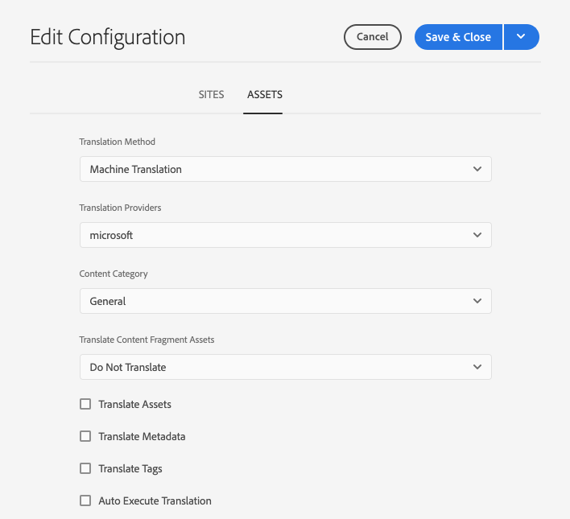

# Configurare il connettore di traduzione {#configure-connector}

Scopri come connettersi AEM a un servizio di traduzione.

## La storia finora {#story-so-far}

Nel documento precedente del percorso di localizzazione senza testa di AEM, [Inizia con AEM localizzazione senza testa](learn-about.md) hai imparato a organizzare i contenuti headless e come funzionano AEM strumenti di localizzazione e ora dovresti:

* Comprendere l’importanza della struttura dei contenuti per la localizzazione.
* Comprendere come AEM memorizza i contenuti headless.
* Acquisisci familiarità con AEM strumenti di localizzazione.

Questo articolo si basa su queste nozioni di base per permetterti di compiere il primo passaggio di configurazione e impostare un servizio di traduzione, che utilizzerai successivamente nel percorso per tradurre i contenuti.

## Obiettivo {#objective}

Questo documento spiega come impostare un connettore AEM per il servizio di traduzione selezionato. Dopo la lettura è necessario:

* Comprendi gli importanti parametri del framework di integrazione della traduzione in AEM.
* È possibile impostare la propria connessione al servizio di traduzione.

## Quadro di riferimento per l&#39;integrazione della traduzione {#tif}

AEM Translation Integration Framework si integra con servizi di traduzione di terze parti per orchestrare la traduzione dei contenuti AEM. Si tratta di tre passaggi fondamentali.

1. Connettiti al provider di servizi di traduzione.
1. Creare una configurazione di Translation Integration Framework.
1. Associa la configurazione al contenuto.

## Connessione a un provider di servizi di traduzione {#connect-translation-provider}

Il primo passo è quello di scegliere quale servizio di traduzione si desidera utilizzare. Ci sono molte scelte per i servizi di traduzione umana e automatica disponibili per AEM. Per una selezione di opzioni disponibili, consulta la sezione [Risorse aggiuntive](#additional-resources) .

La maggior parte dei provider offrirà un pacchetto di traduttori da installare. Ai fini del presente percorso, utilizzeremo Microsoft Translator che AEM fornito con una licenza di prova preconfigurata. Per ulteriori informazioni su questo provider, consulta la sezione [Risorse aggiuntive](#additional-resources) .

Se scegli un altro provider, dovrai installare il pacchetto del connettore secondo le istruzioni fornite dal servizio di traduzione.

>[!NOTE]
>
>L’utilizzo di Microsoft Translator in AEM non richiede un’ulteriore configurazione e funziona così come è senza ulteriore configurazione del connettore.
>
>Se si sceglie di utilizzare il connettore Microsoft Translator a scopo di test, non è necessario eseguire i passaggi descritti nelle due sezioni successive, ma si consiglia di leggerli in modo da avere familiarità con quando è necessario collegare il connettore preferito.
>
>La licenza di prova del connettore Microsoft Translator non è destinata alla produzione e, se si decide di concedere la licenza, sarà necessario seguire i passaggi successivi descritti nella sezione [Risorse aggiuntive](#additional-resources) alla fine del presente documento per configurare la licenza.

## Creazione di una configurazione dell’integrazione di traduzione {#create-config}

Innanzitutto, devi creare una configurazione del framework di integrazione della traduzione per specificare come tradurre il contenuto. La configurazione include le seguenti informazioni:

* Quale provider di servizi di traduzione utilizzare
* Se la traduzione umana o automatica deve essere eseguita
* Se tradurre altri contenuti associati al frammento di contenuto, ad esempio i tag

Per creare una nuova configurazione di traduzione:

1. Nel menu di navigazione globale, tocca o fai clic su **Strumenti** -> **Cloud Services** -> **Cloud Services di traduzione**.
1. Passa alla posizione in cui desideri creare la configurazione nella struttura del contenuto. Spesso si basa su un particolare progetto o può essere globale.
   * Ad esempio, in questo caso, una configurazione può essere resa globale da applicare a tutti i contenuti o solo al progetto WKND.

   

1. Fornisci le seguenti informazioni nei campi, quindi tocca o fai clic su **Crea**.
   1. Seleziona **Tipo di configurazione** nel menu a discesa. Seleziona **Integrazione di traduzione** dall&#39;elenco.
   1. Immetti un **Titolo** per la configurazione. La **Titolo** identifica la configurazione nella console **Cloud Services** e negli elenchi a discesa delle proprietà della pagina.
   1. Facoltativamente, digita un **Nome** da utilizzare per il nodo del repository che memorizza la configurazione.

   

1. Tocca o fai clic su **Crea** e viene visualizzata la finestra **Modifica configurazione** in cui puoi configurare le proprietà di configurazione.

1. I frammenti di contenuto sono memorizzati come risorse in AEM. Tocca o fai clic sulla scheda **Risorse** .



1. Fornisci le seguenti informazioni.

   1. **Metodo di traduzione**  - Seleziona  **Machine** Translationor  **Human** Translationion a seconda del provider di traduzione. Ai fini di questo percorso ci affidiamo alla traduzione automatica.
   1. **Provider di traduzione** : seleziona dall’elenco il connettore installato per il servizio di traduzione.
   1. **Categoria di contenuto** : seleziona la categoria più appropriata per eseguire il targeting migliore della traduzione (solo per la traduzione automatica).
   1. **Traduci risorse frammento di contenuto** - ???
   1. **Traduci risorse** : controlla questo per tradurre le risorse.
   1. **Traduci metadati** : controlla questo per tradurre i metadati delle risorse.
   1. **Tag di traduzione** : seleziona questa opzione per tradurre i tag associati alla risorsa.
   1. **Esegui automaticamente traduzione** : seleziona questa proprietà se desideri che le traduzioni vengano inviate automaticamente al servizio di traduzione.

1. Tocca o fai clic su **Salva e chiudi**.

Il connettore è stato configurato nel servizio di traduzione.

## Associare la configurazione al contenuto {#associate}

AEM è uno strumento flessibile e potente e supporta più servizi di traduzione simultanea tramite più connettori e configurazioni multiple. L’impostazione va oltre l’ambito di questo percorso, ma richiede di specificare quali connettori e configurazione devono essere utilizzati per tradurre il contenuto.

A questo scopo, accedi alla directory principale della lingua del contenuto. Per il nostro esempio:

```text
/content/dam/<your-project>/en
```

1. Vai alla navigazione globale e vai a **Navigazione** -> **Risorse** -> **File**.
1. Nella console delle risorse, seleziona la directory principale lingua da configurare e tocca o fai clic su **Proprietà**.
1. Tocca o fai clic sulla scheda **Cloud Services** .
1. In **Configurazioni Cloud Service** nel menu a discesa **Aggiungi configurazione** , seleziona il connettore. Dovrebbe apparire nel menu a discesa quando hai installato il pacchetto come [descritto in precedenza.](#connect-translation-provider)
1. Seleziona anche la configurazione alla voce **Configurazioni Cloud Service** nel menu a discesa **Aggiungi configurazione** .
1. Tocca o fai clic su **Salva e chiudi**.


## Novità {#what-is-next}

Ora che hai completato questa parte del percorso di localizzazione headless devi:

* Comprendi gli importanti parametri del framework di integrazione della traduzione in AEM.
* È possibile impostare la propria connessione al servizio di traduzione.

Sviluppa questa conoscenza e continua il tuo percorso di localizzazione senza testa AEM esaminando il documento [Configura regole di traduzione,](translation-rules.md) dove imparerai a definire quale contenuto tradurre.

## Risorse aggiuntive {#additional-resources}

Mentre si consiglia di passare alla parte successiva del percorso di localizzazione headless esaminando il documento [Configura regole di traduzione](translation-rules.md), quanto segue contiene alcune risorse aggiuntive facoltative che approfondiscono alcuni concetti menzionati in questo documento, ma non è necessario che continuino nel percorso headless.

* [Configurazione del framework di integrazione della traduzione](/help/sites-cloud/administering/translation/integration-framework.md)  - Scopri come configurare il framework di integrazione della traduzione per l’integrazione con i servizi di traduzione di terze parti.
* [Connessione a Microsoft Translator](/help/sites-cloud/administering/translation/connect-ms-translator.md)  - AEM fornisce un account di Microsoft Translation di prova a scopo di test.
