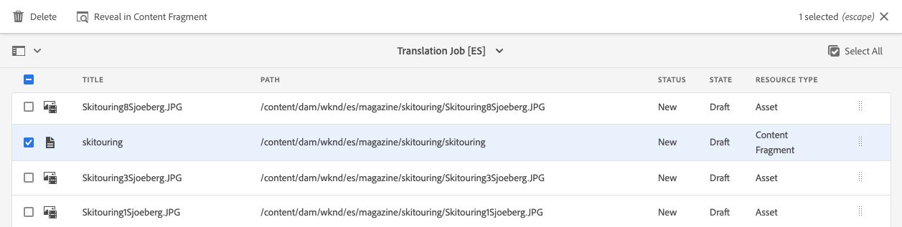

# Traduci contenuto {#translate-content}

Utilizza il connettore di traduzione e le regole per tradurre i contenuti headless.

## La storia finora {#story-so-far}

Nel documento precedente del percorso di localizzazione headless AEM [Configura regole di traduzione](translation-rules.md) hai imparato a utilizzare AEM regole di traduzione per identificare il contenuto di traduzione. Ora dovresti:

* Comprendi cosa fanno le regole di traduzione.
* Puoi definire le tue regole di traduzione.

Ora che le regole del connettore e delle traduzioni sono configurate, questo articolo ti guida attraverso il passaggio successivo per tradurre i tuoi contenuti headless.

## Obiettivo {#objective}

Questo documento ti aiuta a capire come utilizzare AEM progetti di traduzione insieme al connettore e le regole di traduzione per tradurre il contenuto. Dopo aver letto questo documento è necessario:

* Scopri cos’è un progetto di traduzione.
* Potrai creare nuovi progetti di traduzione.
* Utilizza i progetti di traduzione per tradurre i tuoi contenuti headless.

## Creazione di un progetto di traduzione {#creating-translation-project}

I progetti di traduzione consentono di gestire la traduzione di contenuti AEM headless. Un progetto di traduzione contiene i contenuti da tradurre in altre lingue.

Quando il contenuto viene aggiunto a un progetto di traduzione, per esso viene creato un processo di traduzione. I processi forniscono i comandi e le informazioni sullo stato utilizzati per gestire i flussi di lavoro di traduzione umana e di traduzione automatica che vengono eseguiti sulle risorse.

Per creare un progetto di traduzione:

1. Passa a **Navigazione** -> **Risorse** -> **File**. Il contenuto headless in AEM viene memorizzato come risorse note come Frammenti di contenuto.
1. Seleziona la directory principale della lingua del progetto. In questo caso abbiamo selezionato `/content/dam/wknd/en`.
1. Tocca o fai clic sul selettore della barra e mostra il pannello **Riferimenti** .
1. Tocca o fai clic su **Copie per lingua**.
1. Seleziona la casella di controllo **Copie per lingua** .
1. Espandi la sezione **Aggiorna copie per lingua** nella parte inferiore del pannello Riferimenti.
1. Nel menu a discesa **Progetto**, seleziona **Crea progetto di traduzione**.
1. Fornisci un titolo appropriato per il progetto di traduzione.
1. Tocca o fai clic su **Avvia**.


Viene visualizzato un messaggio che informa che il progetto è stato creato.

>[!NOTE]
>
>Si presume che la struttura linguistica necessaria per le lingue delle traduzioni sia già stata creata come parte della [definizione della struttura dei contenuti.](getting-started.md#content-structure) Questo dovrebbe essere fatto in collaborazione con l&#39;architetto dei contenuti.

## Utilizzo di un progetto di traduzione {#using-translation-project}

Durante la creazione del progetto di traduzione, AEM valutato il contenuto headless nel percorso selezionato e in base alle regole precedentemente definite. In base a queste regole, estrae il contenuto che richiede la traduzione in un nuovo progetto di traduzione.

Per visualizzare il progetto di traduzione:

1. Passa a **Navigazione** -&amp; **Progetti**.
1. Tocca o fai clic sul progetto creato nella sezione precedente.


Il progetto è diviso in più schede.

* **Riepilogo** : questa scheda mostra le informazioni di intestazione di base del progetto, inclusi il proprietario, la lingua e il provider di traduzione.
* **Processo di traduzione** : questa scheda mostra una panoramica del processo di traduzione effettivo, compreso lo stato, il numero di risorse, ecc.
* **Team** : questa scheda mostra gli utenti che stanno collaborando a questo progetto di traduzione. Questo percorso non tratterà questo argomento.
* **Attività** : attività aggiuntive associate alla traduzione del contenuto, ad esempio per eseguire elementi o elementi del flusso di lavoro. Questo percorso non tratterà questo argomento.

Per visualizzare i dettagli del contenuto headless incluso in questo progetto:

1. Tocca o fai clic sul pulsante dei puntini di sospensione nella parte inferiore della scheda **Processo di traduzione** .
1. Nella finestra **Processo di traduzione** sono elencati tutti gli elementi del processo.
   
1. Tocca o fai clic su una riga per visualizzare i dettagli di tale riga, tenendo presente che una riga può rappresentare più elementi di contenuto da tradurre.
1. Tocca o fai clic sulla casella di controllo della selezione di un elemento per visualizzare ulteriori opzioni, ad esempio l’opzione per eliminarlo dal processo o visualizzarlo nelle console Frammenti di contenuto o Risorse .



In genere il contenuto del processo di traduzione inizia nello stato **Bozza** come indicato dalla colonna **Stato** nella finestra **Processo di traduzione**.

Per avviare il processo di traduzione, torna alla panoramica del progetto di traduzione e tocca o fai clic sul pulsante con freccia nella parte superiore della scheda **Processo di traduzione** e seleziona **Avvia**.


AEM ora comunica con la configurazione di traduzione e il connettore per inviare il contenuto al servizio di traduzione. Puoi visualizzare l’avanzamento della traduzione tornando alla finestra **Processo di traduzione** e visualizzando la colonna **Stato** delle voci.


Le traduzioni automatiche restituiscono automaticamente lo stato **Approvato**. La traduzione umana consente una maggiore interazione, ma va oltre lo scopo di questo percorso.

## Revisione dei contenuti tradotti {#reviewing}

[Come visto in precedenza, il contenuto tradotto ](#using-translation-project)   **** automaticamente ritorna in AEM con lo stato di Approvato, in quanto si presume che, poiché si utilizza la traduzione automatica, non sia necessario alcun intervento umano. Tuttavia è ancora possibile rivedere il contenuto tradotto.

Basta andare al processo di traduzione completato e selezionare una riga toccando o facendo clic sulla casella di controllo. L’icona **Mostra nel frammento di contenuto** viene visualizzata nella barra degli strumenti.


Tocca o fai clic su tale icona per aprire il frammento di contenuto tradotto nella console dell’editor per visualizzare i dettagli del contenuto tradotto.


Se necessario, puoi modificare ulteriormente il frammento di contenuto, disponendo delle autorizzazioni necessarie, ma la modifica dei frammenti di contenuto va oltre l’ambito di questo percorso. Per ulteriori informazioni su questo argomento, consulta la sezione [Risorse aggiuntive](#additional-resources) alla fine del presente documento.

Il compito del progetto è quello di raccogliere tutte le risorse relative a una traduzione in un unico luogo per un facile accesso e una chiara panoramica. Tuttavia, come puoi vedere visualizzando i dettagli di un elemento tradotto, le traduzioni stesse scorrono nuovamente nella cartella delle risorse del linguaggio di traduzione. Nel nostro esempio qui

```text
/content/dam/wknd/es
```

Se passi a questa cartella tramite **Navigazione** -> **File** -> **Risorse**, il contenuto tradotto verrà visualizzato.


AEM framework di traduzione riceve le traduzioni dal connettore di traduzione e quindi crea automaticamente la struttura del contenuto in base alla directory principale della lingua e utilizzando le traduzioni fornite dal connettore.

È importante comprendere che questo contenuto non viene pubblicato. Resta nell’istanza di authoring di AEM finché non decidi che è pronto per essere pubblicato. Vedremo come farlo nel prossimo passaggio del percorso di localizzazione.

## Traduzione manuale {#human-translation}

Se il servizio di traduzione fornisce la traduzione umana, il processo di revisione offre più opzioni. Ad esempio, le traduzioni arrivano nuovamente nel progetto con lo stato **Bozza** e devono essere riviste e approvate o rifiutate manualmente.

La traduzione umana va oltre l&#39;ambito di questo percorso di localizzazione. Per ulteriori informazioni su questo argomento, consulta la sezione [Risorse aggiuntive](#additional-resources) alla fine del presente documento.

## Novità {#what-is-next}

Ora che hai completato questa parte del percorso di localizzazione headless devi:

* Scopri cos’è un progetto di traduzione.
* Potrai creare nuovi progetti di traduzione.
* Utilizza i progetti di traduzione per tradurre i tuoi contenuti headless.

Sviluppa questa conoscenza e continua il tuo percorso di localizzazione AEM headless esaminando il documento [Pubblica contenuto tradotto](publish-content.md) dove imparerai a pubblicare il contenuto tradotto e come aggiornare tali traduzioni quando il contenuto principale della lingua cambia.

## Risorse aggiuntive {#additional-resources}

Mentre si consiglia di passare alla parte successiva del percorso di localizzazione headless esaminando il documento [Pubblica contenuto tradotto,](publish-content.md) sono riportate di seguito alcune risorse aggiuntive facoltative che consentono di approfondire alcuni concetti menzionati in questo documento, ma non è necessario che continuino nel percorso headless.

* [Gestione dei progetti di traduzione](/help/sites-cloud/administering/translation/managing-projects.md) : scopri i dettagli dei progetti di traduzione e le funzioni aggiuntive, come i flussi di lavoro di traduzione umana e i progetti multilingue.
