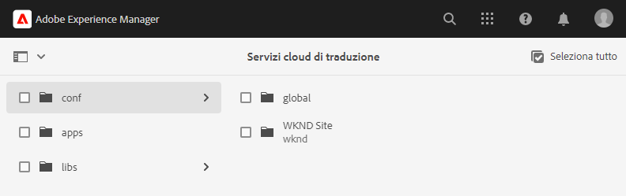
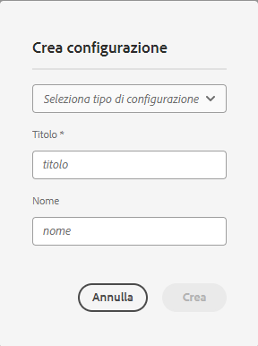
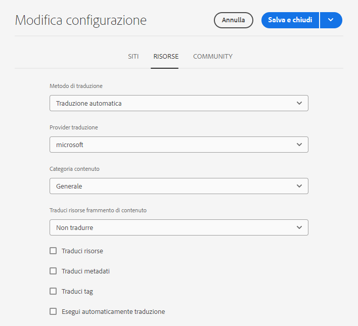
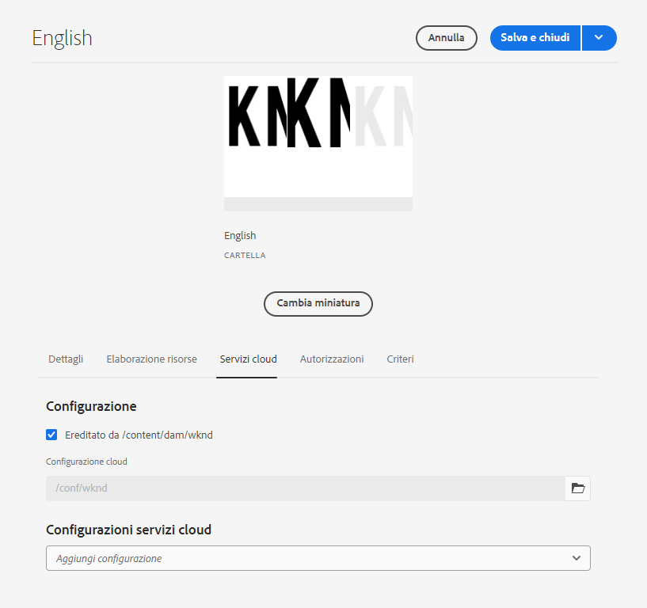

# Configurare l’integrazione della traduzione {#configure-integration}

Scopri come connettere AEM a un servizio di traduzione.

## Percorso affrontato finora {#story-so-far}

Nel documento precedente del percorso di traduzione di AEM headless, [Guida introduttiva alla traduzione in AEM headless](learn-about.md), hai imparato a organizzare i contenuti headless e il modo in cui gli strumenti di traduzione di AEM funzionano. Ora dovresti aver appreso quanto segue:

* L’importanza della struttura dei contenuti per la traduzione.
* Come AEM archivia il contenuto headless.
* Gli strumenti di traduzione di AEM.

Questo articolo si basa su queste nozioni di base per permetterti di compiere il primo passaggio di configurazione e impostare un servizio di traduzione, che utilizzerai successivamente nel percorso per tradurre i contenuti.

## Obiettivo {#objective}

Questo documento spiega come impostare un’integrazione AEM per il servizio di traduzione selezionato. Dopo la lettura dovresti:

* Comprendere i parametri importanti del framework di integrazione della traduzione in AEM.
* Essere in grado di impostare la propria connessione al servizio di traduzione.

## Framework di integrazione della traduzione {#tif}

Il framework di integrazione della traduzione di AEM (TIF) si integra con servizi di traduzione di terze parti per orchestrare la traduzione dei contenuti AEM. Comporta tre passaggi fondamentali.

1. Connessione al fornitore di servizi di traduzione.
1. Creare una configurazione del framework di integrazione della traduzione.
1. Associare la configurazione al contenuto.

Le sezioni seguenti descrivono questi passaggi in modo più dettagliato.

## Connessione a un fornitore di servizi di traduzione {#connect-translation-provider}

Il primo passo è scegliere quale servizio di traduzione si desidera utilizzare.  Ci sono molte scelte per i servizi di traduzione umana e automatica disponibili per AEM. La maggior parte dei fornitori offre un pacchetto di traduzione da installare. Consulta la sezione [Risorse aggiuntive](#additional-resources) per una selezione di opzioni disponibili.

>[!NOTE]
>
>Lo specialista della traduzione è di solito responsabile della scelta del servizio di traduzione da utilizzare, ma in genere l’amministratore è responsabile dell’installazione del pacchetto del connettore di traduzione richiesto.

Ai fini del presente percorso, utilizziamo Microsoft Translator che AEM fornisce con una licenza di prova preconfigurata. Consulta la sezione [Risorse aggiuntive](#additional-resources) per ulteriori informazioni su questo fornitore.

Se scegli un altro fornitore, l’amministratore deve installare il pacchetto del connettore in base alle istruzioni fornite dal servizio di traduzione.

>[!NOTE]
>
>L’utilizzo di Microsoft Translator in AEM non richiede un’ulteriore configurazione e funziona così come è senza ulteriore configurazione del connettore.
>
>Se scegli di utilizzare il connettore Microsoft Translator a scopo di test, non è necessario eseguire i passaggi descritti nelle due sezioni successive: [Creazione di una configurazione integrazione della traduzione](#create-config) e [Associare la configurazione al contenuto](#associate). Si consiglia tuttavia di leggerli in modo da conoscere i passaggi necessari per configurare il connettore preferito.
>
>La licenza di prova del connettore Microsoft Translator non è destinata alla produzione. Se si decide di ottenerne la licenza, l’amministratore di sistema deve seguire i passaggi descritti nella sezione [Risorse aggiuntive](#additional-resources) alla fine del presente documento per configurare tale licenza.

## Creazione di una configurazione dell’integrazione di traduzione {#create-config}

Dopo aver installato il pacchetto del connettore per il servizio di traduzione preferito, è necessario creare una configurazione del Framework di integrazione della traduzione per tale servizio. La configurazione include le seguenti informazioni:

* Quale fornitore di servizi di traduzione utilizzare
* Se deve essere eseguita la traduzione umana o automatica
* Se tradurre altri contenuti associati ai Frammenti di contenuto, come i tag

Per creare una configurazione di traduzione:

1. Nel menu di navigazione globale, seleziona **Strumenti** > **Servizi cloud** > **Servizi cloud di traduzione**.
1. Passa alla posizione in cui desideri creare la configurazione nella struttura del contenuto. Spesso si basa su un particolare progetto o può essere globale.
   * Ad esempio, in questo caso, una configurazione può essere resa globale da applicare a tutti i contenuti o solo al progetto WKND.

   

1. Fornisci le seguenti informazioni nei campi, quindi seleziona **Crea**.
   1. Seleziona **Tipo di configurazione** nel menu a discesa. Seleziona **Integrazione della traduzione** dall’elenco.
   1. Inserisci un **Titolo** per la configurazione. Il **Titolo** identifica la configurazione nella console **Cloud Services** così come negli elenchi a discesa delle proprietà della pagina.
   1. Facoltativamente, digita un **Nome** da utilizzare per il nodo dell’archivio che memorizza la configurazione.

   

1. Selezionando **Crea** viene visualizzata la finestra **Modifica configurazione** in cui è possibile configurare le proprietà di configurazione.

1. I frammenti di contenuto sono memorizzati come risorse in AEM. Seleziona la scheda **Risorse**.



1. Fornisci le seguenti informazioni.

   1. **Metodo di traduzione** - Seleziona **Traduzione automatica** o **Traduzione manuale** a seconda del provider di traduzione. Ai fini di questo percorso, si assume la traduzione automatica.
   1. **Fornitori di traduzioni** - Seleziona dall’elenco il connettore installato per il servizio di traduzione.
   1. **Categoria contenuto** - Seleziona la categoria più appropriata per eseguire meglio il targeting della traduzione (solo per la traduzione automatica).
   1. **Traduci le risorse dei Frammenti di contenuto**: seleziona questa opzione per tradurre le risorse associate ai Frammenti di contenuto.
   1. **Traduci risorse**: seleziona questa opzione per tradurre le risorse.
   1. **Traduci metadati**: seleziona questa opzione per tradurre i metadati delle risorse.
   1. **Traduci tag**: seleziona questa opzione per tradurre i tag associati alle risorse.
   1. **Esegui automaticamente la traduzione** - Seleziona questa proprietà se vuoi che le traduzioni vengano inviate automaticamente al tuo servizio di traduzione.
   1. **Disattiva la traduzione di solo aggiornamento**: quando questa opzione è selezionata, l’aggiornamento del progetto di traduzione invierà in traduzione tutti i campi traducibili, non solo quelli modificati dall’ultima traduzione. L’aggiornamento del progetto di traduzione verrà trattato più avanti nel percorso.
   1. **Abilita campi del modello di contenuto per la traduzione**: seleziona questa opzione in modo che la configurazione di traduzione riconosca automaticamente i campi nei Modelli di contenuto in base al flag **Traducibile**.

1. Seleziona **Salva e chiudi**.

Il connettore è stato configurato nel servizio di traduzione.

## Associare la configurazione al contenuto {#associate}

AEM è uno strumento flessibile e potente e supporta più servizi di traduzione simultanea tramite più connettori e configurazioni. L’impostazione di tale configurazione va oltre l’ambito di questo percorso. Tuttavia, questa flessibilità implica la necessità di specificare quali connettori e configurazione devono essere utilizzati per tradurre il contenuto associando questa configurazione al contenuto.

A questo scopo, accedi alla directory principale della lingua del contenuto. Per il nostro esempio:

```text
/content/dam/<your-project>/en
```

1. Vai alla navigazione globale e passa a **Navigazione** > **Risorse** > **File**.
1. Nella console delle risorse, seleziona la directory principale per la lingua da configurare e seleziona **Proprietà**.
1. Seleziona la scheda **Servizi cloud**.
1. Nella sezione **Configurazioni Cloud Service**, nell’elenco a discesa **Aggiungi configurazione**, seleziona il connettore. Dovrebbe comparire nel menu a discesa dopo averne installato il pacchetto come [descritto in precedenza](#connect-translation-provider).
1. Nella sezione **Configurazioni Cloud Service**, seleziona anche la configurazione nell’elenco a discesa **Aggiungi configurazione**.
1. Seleziona **Salva e chiudi**.



## Passaggio successivo {#what-is-next}

Ora cha hai completato questa parte del percorso di traduzione headless, dovresti:

* I parametri importanti del framework di integrazione della traduzione in AEM.
* Come impostare la propria connessione al servizio di traduzione.

Sviluppa questa conoscenza e prosegui nel tuo percorso di traduzione headless in AEM consultando il documento [Tradurre il contenuto](translation-rules.md), per capire come utilizzare la configurazione impostata finora per tradurre effettivamente i tuoi contenuti.

## Risorse aggiuntive {#additional-resources}

Sebbene sia consigliabile passare alla parte successiva del percorso di traduzione headless consultando il documento [Configurare le regole di traduzione](translation-rules.md), le seguenti risorse sono aggiuntive e opzionali e approfondiscono alcuni concetti menzionati in questo documento, ma non sono necessarie per continuare il percorso headless.

* [Configurazione del framework di integrazione della traduzione](/help/sites-cloud/administering/translation/integration-framework.md) - Rivedi un elenco di connettori di traduzione selezionati e scopri come configurare il framework di integrazione della traduzione per l’integrazione con i servizi di traduzione di terze parti.
* [Connessione a Microsoft Translator](/help/sites-cloud/administering/translation/connect-ms-translator.md) - AEM fornisce un account di traduzione Microsoft di prova a scopo di test.
