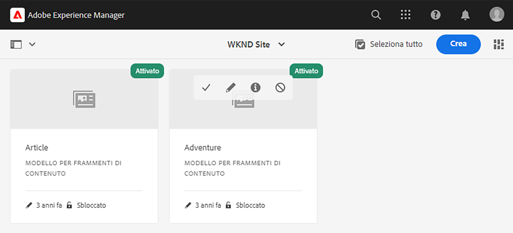
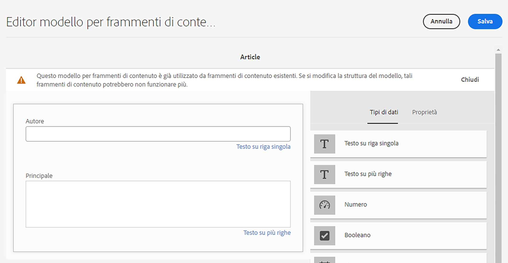
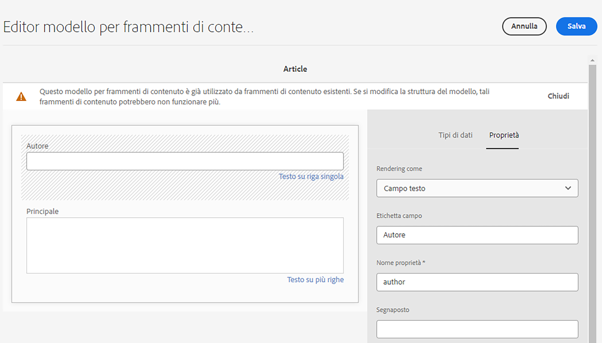

# Guida introduttiva AEM traduzione headless {#getting-started}

Scopri come organizzare i contenuti headless e come funzionano gli strumenti di traduzione AEM.

## La storia finora {#story-so-far}

Nel documento precedente del percorso di traduzione senza testa AEM, [Scopri i contenuti headless e come tradurre in AEM](learn-about.md) hai imparato la teoria di base su cosa sia un CMS headless e dovresti ora:

* Comprendi i concetti di base sulla distribuzione di contenuti headless.
* Sii familiare con come AEM supporta headless e la traduzione.

Questo articolo si basa su questi elementi fondamentali per comprendere come AEM memorizza e gestisce i contenuti headless e come puoi utilizzare gli strumenti di traduzione AEM per tradurli.

## Obiettivo {#objective}

Questo documento ti aiuta a capire come iniziare a tradurre contenuti headless in AEM. Dopo la lettura è necessario:

* Comprendere l’importanza della struttura dei contenuti per la traduzione.
* Comprendere come AEM memorizza i contenuti headless.
* Conoscere AEM strumenti di traduzione.

## Requisiti e prerequisiti {#requirements-prerequisites}

Ci sono una serie di requisiti prima di iniziare a tradurre il tuo contenuto AEM headless.

### Conoscenza {#knowledge}

* Esperienza nella traduzione dei contenuti in un CMS
* Esperienza utilizzando le funzioni di base di un CMS su larga scala
* Avere una conoscenza operativa AEM manipolazione di base
* Informazioni sul servizio di traduzione utilizzato
* Comprensione di base del contenuto che si sta traducendo

>[!TIP]
>
>Se non hai familiarità con l&#39;utilizzo di un CMS su larga scala come AEM, considera la revisione del [Operazioni di base](/help/sites-cloud/authoring/getting-started/basic-handling.md) prima di procedere. La documentazione di base sulla gestione non fa parte del percorso, quindi torna a questa pagina una volta completata.

### Strumenti {#tools}

* Accesso alla sandbox per testare la traduzione del contenuto
* Credenziali per la connessione al servizio di traduzione preferito
* Essere membro del `project-administrators` gruppo in AEM

## La struttura è la chiave {#content-structure}

AEM contenuto, sia esso headless o pagine web tradizionali, è guidato dalla sua struttura. AEM impone pochi requisiti alla struttura dei contenuti, ma un’attenta considerazione della gerarchia dei contenuti come parte della pianificazione del progetto può rendere la traduzione molto più semplice.

>[!TIP]
>
>Piano di traduzione all&#39;inizio del progetto headless. Collabora con il project manager e gli architetti di contenuti fin da subito.
>
>Un Project Manager per l&#39;internazionalizzazione può essere richiesto come persona separata la cui responsabilità è quella di definire quali contenuti tradurre e cosa no, e quali contenuti tradotti possono essere modificati dai produttori di contenuti regionali o locali.

## Come AEM memorizza i contenuti headless {#headless-content-in-aem}

Per lo specialista della traduzione, non è importante comprendere in profondità come AEM gestire i contenuti headless. Tuttavia, conoscere i concetti e la terminologia di base sarà utile in seguito all’utilizzo di strumenti di traduzione AEM. È importante comprendere il proprio contenuto e la sua struttura per tradurlo in modo efficace.

### Modelli di contenuto {#content-models}

Affinché i contenuti headless possano essere distribuiti in modo coerente tra canali, aree geografiche e lingue diverse, i contenuti devono essere altamente strutturati. AEM utilizza Modelli di contenuto per applicare questa struttura. Pensa ai Modelli di contenuto come a un tipo di modello o pattern per la creazione di contenuti headless. Poiché ogni progetto ha le proprie esigenze, ogni progetto definisce modelli di frammento di contenuto personalizzati. AEM non ha requisiti o struttura fissi per tali modelli.

L’architetto dei contenuti lavora all’inizio del progetto per definire questa struttura. In qualità di esperto di traduzione, è necessario collaborare strettamente con l&#39;architetto dei contenuti per comprendere e organizzare i contenuti.

>[!NOTE]
>
>È responsabilità dell’architetto dei contenuti definire i Modelli di contenuto. Lo specialista della traduzione deve avere familiarità con la propria struttura come descritto nei seguenti passaggi.

Poiché i Modelli di contenuto definiscono la struttura del contenuto, è necessario sapere quali campi dei modelli devono essere tradotti. In genere si lavora con l’architettura dei contenuti per definirlo. Per sfogliare i campi dei modelli di contenuto, effettua le seguenti operazioni.

1. Passa a **Strumenti** -> **Risorse** -> **Modelli per frammenti di contenuto**.
1. I modelli per frammenti di contenuto sono generalmente memorizzati in una struttura di cartelle. Tocca o fai clic sulla cartella del progetto.
1. I modelli sono elencati. Tocca o fai clic sul modello per visualizzare i dettagli.
   
1. La **Editor modello frammento di contenuto** si apre.
   1. La colonna a sinistra contiene i campi del modello. Questa colonna ci interessa.
   1. La colonna a destra contiene i campi che possono essere aggiunti al modello. Questa colonna possiamo ignorare.
      
1. Tocca o fai clic su uno dei campi del modello. AEM lo contrassegna e i dettagli di quel campo sono visualizzati nella colonna di destra.
   

Prendi nota del campo **Nome proprietà** per tutti i campi che devono essere tradotti. Queste informazioni saranno necessarie più avanti nel percorso. Tali **Nome proprietà** Per informare AEM quali campi del contenuto devono essere tradotti, è necessario utilizzare i moduli.

>[!TIP]
>
>Generalmente l&#39;architetto dei contenuti fornisce allo specialista della traduzione il **Nome proprietà** s di tutti i campi necessari per la traduzione. Questi nomi di campo sono necessari in un secondo momento nel percorso. Le fasi precedenti sono fornite per la comprensione dello specialista della traduzione.

### Frammenti di contenuto {#content-fragments}

I modelli di contenuto vengono utilizzati dagli autori dei contenuti per creare il contenuto effettivo senza titolo. Gli autori dei contenuti selezionano il modello su cui basare i propri contenuti e quindi creano frammenti di contenuto. I frammenti di contenuto sono istanze dei modelli e rappresentano il contenuto effettivo da distribuire senza problemi.

Se i Modelli di contenuto sono i pattern per il contenuto, i Frammenti di contenuto sono il contenuto effettivo basato su tali pattern. I frammenti di contenuto rappresentano il contenuto da tradurre.

I frammenti di contenuto sono gestiti come risorse in AEM come parte della gestione delle risorse digitali (DAM). Questo è importante in quanto si trovano tutti sotto il percorso `/content/dam`.

## Struttura dei contenuti consigliata {#recommended-structure}

Come precedentemente consigliato, collabora con l’architettura dei contenuti per determinare la struttura del contenuto appropriata per il tuo progetto. Tuttavia il seguente è una struttura collaudata, semplice e intuitiva che è abbastanza efficace.

Definire una cartella di base per il progetto in `/content/dam`.

```text
/content/dam/<your-project>
```

La lingua in cui viene creato il contenuto è denominata radice della lingua. Nel nostro esempio è inglese e dovrebbe essere sotto questo percorso.

```text
/content/dam/<your-project>/en
```

Tutti i contenuti di progetto che possono essere necessari per essere localizzati devono essere posizionati sotto la directory principale della lingua.

```text
/content/dam/<your-project>/en/<your-project-content>
```

Le traduzioni devono essere create come cartelle di pari livello accanto alla directory principale della lingua con il nome della cartella che rappresenta il codice della lingua ISO-2. Ad esempio, il percorso per il tedesco è il seguente.

```text
/content/dam/<your-project>/de
```

>[!NOTE]
>
>L’architetto dei contenuti è generalmente responsabile della creazione di queste cartelle linguistiche. Se non vengono create, AEM non sarà in grado di creare successivamente lavori di traduzione.

La struttura finale può avere un aspetto simile al seguente.

```text
/content
    |- dam
        |- your-project
            |- en
                |- some
                |- exciting
                |- headless
                |- content
            |- de
            |- fr
            |- it
            |- ...
        |- another-project
        |- ...
```

È necessario prendere nota del percorso specifico del contenuto, in quanto sarà necessario in seguito per configurare la traduzione.

>[!NOTE]
>
>È generalmente responsabilità dell&#39;architetto dei contenuti definire la struttura dei contenuti, ma può collaborare con lo specialista della traduzione.
>
>Qui è dettagliato per la completezza.

## Strumenti di traduzione AEM {#translation-tools}

Ora che capisci cosa sono i frammenti di contenuto e l’importanza della struttura del contenuto, possiamo capire come tradurre questo contenuto. Gli strumenti di traduzione in AEM sono abbastanza potenti, ma sono semplici da comprendere ad alto livello.

* **Connettore di traduzione** - Il connettore è il collegamento tra AEM e il servizio di traduzione utilizzato.
* **Regole di traduzione** - Le regole definiscono quali contenuti in determinati percorsi dovrebbero essere tradotti.
* **Progetti di traduzione** - I progetti di traduzione raccolgono contenuti che devono essere affrontati come un unico sforzo di traduzione e tengono traccia dei progressi della traduzione, interfacciandosi con il connettore per trasmettere il contenuto da tradurre e riceverlo nuovamente dal servizio di traduzione.

In genere si imposta il connettore una sola volta per l&#39;istanza e le regole per ogni progetto headless. Poi utilizzi i progetti di traduzione per tradurre i contenuti e tenerne aggiornate le traduzioni su base continua.

## Novità {#what-is-next}

Ora che hai completato questa parte del percorso di traduzione headless dovresti:

* Comprendere l’importanza della struttura dei contenuti per la traduzione.
* Comprendere come AEM memorizza i contenuti headless.
* Conoscere AEM strumenti di traduzione.

Sviluppa questa conoscenza e continua il tuo percorso di traduzione senza testa AEM prossimo revisione del documento [Configurare il connettore di traduzione](configure-connector.md) dove verrà illustrato come connettersi AEM a un servizio di traduzione.|

## Risorse aggiuntive {#additional-resources}

Mentre si consiglia di passare alla parte successiva del percorso di traduzione headless rivedendo il documento [Configurare il connettore di traduzione](configure-connector.md) di seguito sono riportate alcune risorse aggiuntive facoltative che approfondiscono alcuni concetti menzionati in questo documento, ma non è necessario che continuino sul percorso headless.

* [AEM Operazioni di base](/help/sites-cloud/authoring/getting-started/basic-handling.md) - Scopri le nozioni di base dell’interfaccia utente AEM per navigare comodamente ed eseguire attività essenziali come la ricerca dei contenuti.
* [Identificazione del contenuto da tradurre](/help/sites-cloud/administering/translation/rules.md) - Scopri come le regole di traduzione identificano i contenuti da tradurre.
* [Configurazione del framework di integrazione della traduzione](/help/sites-cloud/administering/translation/integration-framework.md) - Scopri come configurare il framework di integrazione della traduzione per l’integrazione con i servizi di traduzione di terze parti.
* [Gestione dei progetti di traduzione](/help/sites-cloud/administering/translation/managing-projects.md) - Scopri come creare e gestire progetti di traduzione automatica e umana in AEM.
