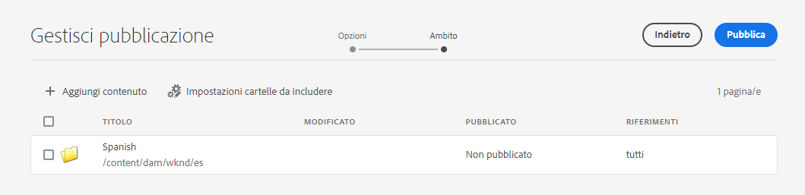

# Pubblica contenuto tradotto senza titolo {#publish-content}

Scopri come pubblicare i contenuti tradotti e aggiornare le traduzioni come aggiornamenti dei contenuti.

## La storia finora {#story-so-far}

Nel documento precedente del percorso di traduzione senza testa AEM, [Traduci contenuto,](configure-connector.md) hai imparato a utilizzare AEM progetti di traduzione per tradurre i contenuti headless. Ora dovresti:

* Scopri cos’è un progetto di traduzione.
* Potrai creare nuovi progetti di traduzione.
* Utilizza i progetti di traduzione per tradurre i tuoi contenuti headless.

Una volta completata la traduzione iniziale, questo articolo illustra il passaggio successivo per la pubblicazione di tale contenuto e le operazioni da eseguire per aggiornare le traduzioni quando il contenuto sottostante nella directory principale della lingua cambia.

## Obiettivo {#objective}

Questo documento ti aiuta a capire come pubblicare contenuti headless in AEM e come creare un flusso di lavoro continuo per mantenere le traduzioni aggiornate. Dopo aver letto questo documento, è necessario:

* Comprendere il modello di AEM di pubblicazione dell’autore.
* Scopri come pubblicare i contenuti tradotti.
* Puoi implementare un modello di aggiornamento continuo per i contenuti tradotti.

## Modello di pubblicazione AEM {#author-publish}

Prima di pubblicare i contenuti, è utile comprendere AEM modello di pubblicazione dell’autore. In termini semplificati, AEM divide gli utenti del sistema in due gruppi.

1. Coloro che creano e gestiscono il contenuto e il sistema
1. Coloro che utilizzano il contenuto del sistema

AEM è quindi fisicamente separato in due istanze.

1. La **autore** instance è il sistema in cui autori e amministratori di contenuti lavorano per creare e gestire i contenuti.
1. La **pubblicare** istanza è il sistema che consegna il contenuto ai consumatori.

Una volta creato il contenuto sull’istanza di authoring, deve essere trasferito nell’istanza di pubblicazione per renderlo disponibile per il consumo. Viene chiamato il processo di trasferimento dall’autore alla pubblicazione **pubblicazione**.

## Pubblicazione del contenuto tradotto {#publishing}

Quando sei soddisfatto dello stato dei contenuti tradotti, devi pubblicarli in modo che i servizi headless possano utilizzarli. Questa attività di solito non è responsabilità dello specialista della traduzione, ma è documentata qui per illustrare il flusso di lavoro completo.

>[!NOTE]
>
>Generalmente, quando la traduzione è completa, lo specialista delle traduzioni informa i proprietari dei contenuti che le traduzioni sono pronte per la pubblicazione. I proprietari dei contenuti li pubblicano.
>
>Sono previste le seguenti fasi per completezza.

Il modo più semplice per pubblicare le traduzioni è passare alla cartella delle risorse del progetto.

```text
/content/dam/<your-project>/
```

In questo percorso sono presenti sottocartelle per ogni lingua di traduzione e puoi scegliere quale pubblicare.

1. Vai a **Navigazione** -> **Risorse** -> **File** e apri la cartella del progetto.
1. Qui si vede la cartella principale della lingua e tutte le altre cartelle della lingua. Seleziona la lingua o le lingue localizzate da pubblicare.
   
1. Tocca o fai clic su **Gestisci pubblicazione**.
1. In **Gestisci pubblicazione** finestra, assicurarsi che **Pubblica** viene selezionato automaticamente in **Azione** e **Ora** è selezionato in **Pianificazione**. Tocca o fai clic su **Avanti**.
   
1. Nel successivo **Gestisci pubblicazione** conferma che i percorsi corretti siano selezionati. Tocca o fai clic su **Pubblica**.
   
1. AEM conferma l’azione di pubblicazione con un messaggio a comparsa nella parte inferiore dello schermo.
   

Il tuo contenuto tradotto headless è ora pubblicato! È ora possibile accedervi e utilizzarli dai servizi headless.

>[!TIP]
>
>Per pubblicare più traduzioni contemporaneamente, è possibile selezionare più elementi (ad esempio cartelle multilingue) durante la pubblicazione.

Quando si pubblicano i contenuti, sono disponibili opzioni aggiuntive, ad esempio per pianificare un’ora di pubblicazione, che vanno oltre l’ambito di questo percorso. Vedi la [Risorse aggiuntive](#additional-resources) sezione alla fine del documento per ulteriori informazioni.

## Aggiornamento del contenuto tradotto {#updating-translations}

La traduzione è raramente un esercizio una tantum. In genere, al termine della traduzione iniziale, gli autori dei contenuti continuano ad aggiungere e modificare il contenuto nella directory principale lingua. Questo significa che devi anche aggiornare il contenuto tradotto.

I requisiti specifici del progetto definiscono la frequenza con cui devi aggiornare le traduzioni e quale processo decisionale viene seguito prima di eseguire un aggiornamento. Una volta che hai deciso di aggiornare le tue traduzioni, il processo in AEM è molto semplice. Poiché la traduzione iniziale era basata su un progetto di traduzione, lo sono anche gli aggiornamenti.

Tuttavia, come in precedenza, il processo varia leggermente se si sceglie di creare automaticamente il progetto di traduzione o manualmente il progetto di traduzione.

### Aggiornamento di un progetto di traduzione creato automaticamente {#updating-automatic-project}

1. Passa a **Navigazione** -> **Risorse** -> **File**. Il contenuto headless in AEM viene memorizzato come risorse note come Frammenti di contenuto.
1. Seleziona la directory principale della lingua del progetto. In questo caso abbiamo selezionato `/content/dam/wknd/en`.
1. Tocca o fai clic sul selettore della barra e mostra il **Riferimenti** pannello.
1. Tocca o fai clic su **Copie per lingua**.
1. Controlla la **Copie per lingua** casella di controllo.
1. Espandi la sezione . **Aggiorna copie per lingua** nella parte inferiore del pannello dei riferimenti.
1. In **Progetto** a discesa, seleziona **Aggiungi a un progetto di traduzione esistente**.
1. In **Progetto di traduzione esistente** seleziona il progetto creato per la traduzione iniziale dal menu a discesa.
1. Tocca o fai clic su **Inizio**.


Il contenuto viene aggiunto al progetto di traduzione esistente. Per visualizzare il progetto di traduzione:

1. Passa a **Navigazione** -> **Progetti**.
1. Tocca o fai clic sul progetto appena aggiornato.
1. Tocca o fai clic sulla lingua o su una delle lingue aggiornate.

Al progetto è stata aggiunta una nuova carta di lavoro. In questo esempio è stata aggiunta un’altra traduzione spagnola.


È possibile notare che le statistiche elencate nella nuova scheda (numero di risorse e frammenti di contenuto) sono diverse. Questo perché AEM riconosce ciò che è cambiato dopo l&#39;ultima traduzione e include solo il contenuto che deve essere tradotto. Ciò include la ritraduzione dei contenuti aggiornati e la prima traduzione dei nuovi contenuti.

Da questo punto, [inizia e gestisci il tuo lavoro di traduzione proprio come hai fatto con l&#39;originale.](translate-content.md#using-translation-project)

### Aggiornamento di un progetto di traduzione creato manualmente {#updating-manual-project}

Per aggiornare una traduzione è possibile aggiungere al progetto esistente un nuovo processo responsabile della traduzione del contenuto aggiornato.

1. Passa a **Navigazione** -> **Progetti**.
1. Tocca o fai clic sul progetto da aggiornare.
1. Tocca o fai clic sul pulsante **Aggiungi** nella parte superiore della finestra.
1. In **Aggiungi sezione** finestra, tocca o fai clic **Processo di traduzione** e poi **Invia**.

   

1. Sulla scheda del nuovo lavoro di traduzione, tocca o fai clic sul pulsante con freccia in alto nella scheda e seleziona **Aggiorna Target** definire la lingua di destinazione del nuovo processo.

   

1. In **Selezionare la lingua di destinazione** utilizza l’elenco a discesa per selezionare la lingua e tocca o fai clic su **Fine**.

   

1. Una volta impostata la lingua di destinazione del nuovo lavoro di traduzione, tocca o fai clic sul pulsante con i puntini di sospensione nella parte inferiore della scheda del lavoro per visualizzare i dettagli del lavoro.
1. Il processo è vuoto al momento della creazione. Aggiungi contenuto al processo toccando o facendo clic sul pulsante **Aggiungi** e utilizzando il browser del percorso [come in precedenza durante la creazione del progetto di traduzione.](translate-content.md##manually-creating)

>[!TIP]
>
>I potenti filtri del browser del percorso possono essere di nuovo utili per trovare solo il contenuto aggiornato.
>
>Per ulteriori informazioni sul browser percorsi in [sezione risorse aggiuntive.](#additional-resources)

Da questo punto, [inizia e gestisci il tuo lavoro di traduzione proprio come hai fatto con l&#39;originale.](translate-content.md#using-translation-project)

## Fine del Percorso? {#end-of-journey}

Congratulazioni! Hai completato il percorso di traduzione headless! Ora dovresti:

* Panoramica della distribuzione headless dei contenuti.
* Avere una comprensione di base AEM funzionalità headless.
* Comprendere AEM funzioni di traduzione e come si relazionano al contenuto headless.
* Avere la possibilità di iniziare a tradurre i propri contenuti headless.

Ora sei pronto a tradurre i tuoi contenuti headless in AEM. Tuttavia AEM è uno strumento potente e ci sono molte opzioni aggiuntive disponibili. Consulta alcune delle risorse aggiuntive disponibili nella sezione [Sezione Risorse aggiuntive](#additional-resources) per ulteriori informazioni sulle funzioni visualizzate in questo percorso.

## Risorse aggiuntive {#additional-resources}

* [Gestione dei progetti di traduzione](/help/sites-cloud/administering/translation/managing-projects.md) - Scopri i dettagli dei progetti di traduzione e le funzioni aggiuntive, come i flussi di lavoro di traduzione umana e i progetti multilingue.
* [Concetti di authoring](/help/sites-cloud/authoring/getting-started/concepts.md) - Scopri il modello di authoring e pubblicazione di AEM più dettagliatamente. Questo documento si concentra sull’authoring delle pagine anziché sui frammenti di contenuto, ma la teoria è ancora valida.
* [Pubblicazione delle pagine](/help/sites-cloud/authoring/fundamentals/publishing-pages.md) - Scopri le funzioni aggiuntive disponibili per la pubblicazione dei contenuti. Questo documento si concentra sull’authoring delle pagine anziché sui frammenti di contenuto, ma la teoria è ancora valida.
* [Ambiente e strumenti di authoring](/help/sites-cloud/authoring/fundamentals/environment-tools.md##path-selection) - AEM offre diversi meccanismi per organizzare e modificare i contenuti, tra cui un browser con percorso affidabile.
