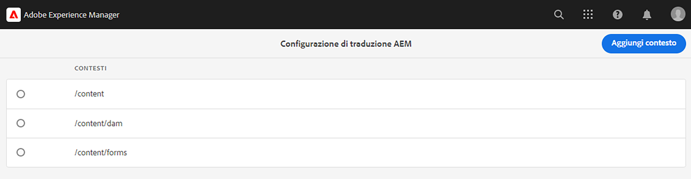
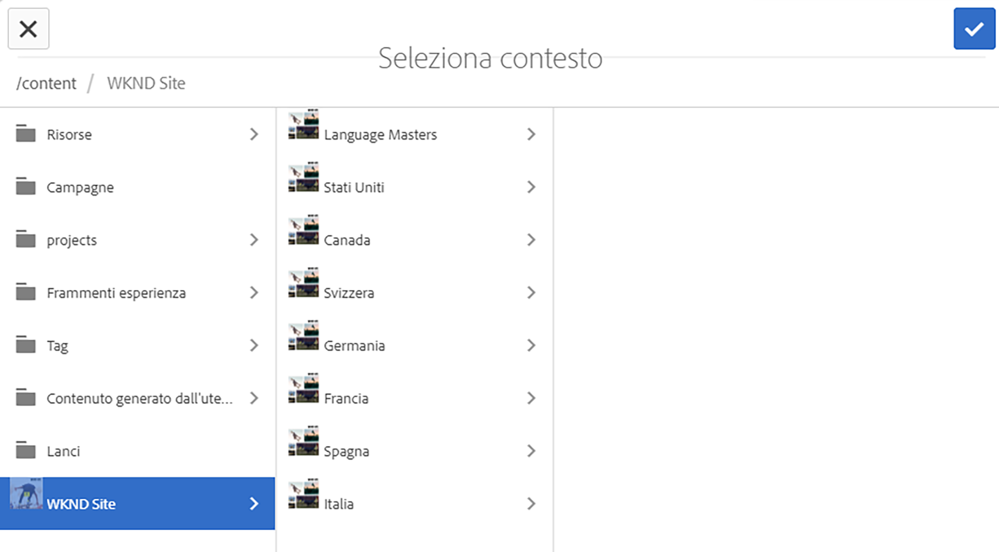
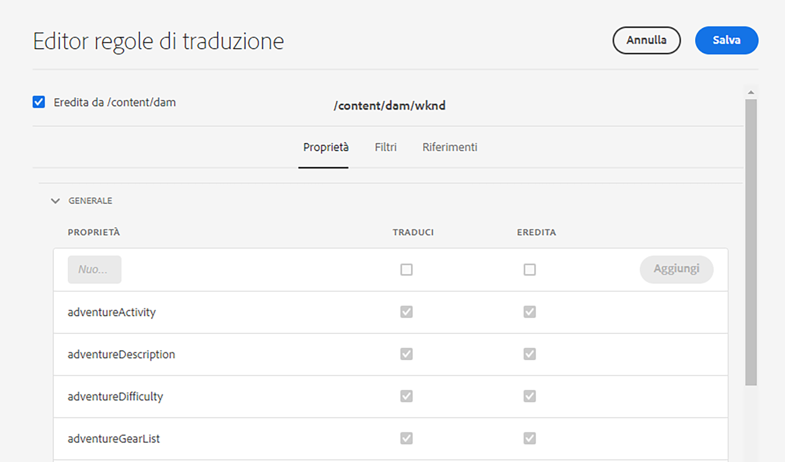
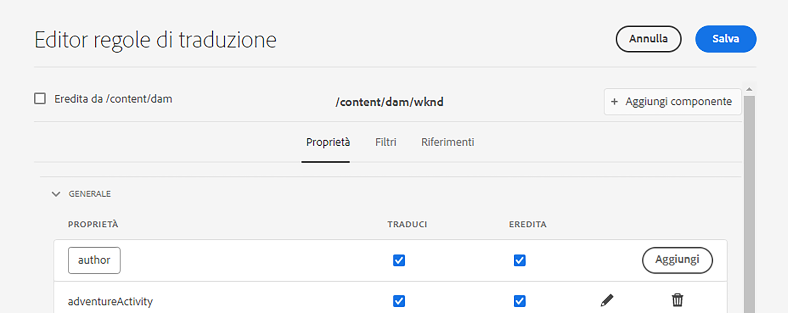

# Configurare le regole di traduzione {#configure-translation-rules}

Scopri come definire le regole di traduzione per identificare i contenuti per la traduzione.

## Percorso affrontato finora {#story-so-far}

Nel documento precedente del percorso di traduzione AEM headless, [Configurare l’integrazione della traduzione](configure-connector.md), hai imparato a installare e configurare l’integrazione della traduzione e ora dovresti:

* I parametri importanti del framework di integrazione della traduzione in AEM.
* Come impostare la propria connessione al servizio di traduzione.

Ora che l’integrazione è configurata, questo articolo illustra il passaggio successivo per identificare il contenuto da tradurre.

>[!CAUTION]
>
>Questo passaggio del percorso di documentazione è necessario solo se non utilizzi il contrassegno **Traducibile** nei frammenti di contenuto.
>
>* Il contrassegno **Traducibile** crea automaticamente le regole di traduzione per te e non richiede alcun intervento.
>* Il contrassegno **Traducibile** viene utilizzato solo se la configurazione del framework di integrazione della traduzione è impostata su **[Abilita campi del modello di contenuto per la traduzione](/help/sites-cloud/administering/translation/integration-framework.md)**.
>* L’abilitazione di questa opzione nella configurazione TIF sostituirà eventuali regole di traduzione create manualmente.|

## Obiettivo {#objective}

Questo documento ti aiuta a capire come utilizzare le regole di traduzione di AEM per identificare il contenuto per la traduzione. Dopo aver letto questo documento, dovresti:

* Come funzionano le regole di traduzione.
* Essere in grado di definire le tue regole di traduzione.

## Regole di traduzione {#translation-rules}

I frammenti di contenuto, che rappresentano il contenuto headless, possono contenere molte informazioni organizzate in campi strutturati. A seconda delle esigenze del progetto, è probabile che non tutte le informazioni all’interno di un Frammento di contenuto debbano essere tradotte.

Le regole di traduzione identificano il contenuto incluso o escluso nei progetti di traduzione. Quando il contenuto viene tradotto, AEM estrae o raccoglie il contenuto in base a queste regole. In questo modo solo il contenuto da tradurre viene inviato al servizio di traduzione.

Le regole di traduzione includono le seguenti informazioni:

* Percorso del contenuto a cui si applica la regola
   * La regola si applica anche ai discendenti del contenuto
* Nomi delle proprietà che contengono il contenuto da tradurre
   * La proprietà può essere specifica per un tipo di risorsa specifica o per tutti i tipi di risorsa

Poiché i modelli per frammenti di contenuto, che definiscono la struttura dei frammenti di contenuto, sono specifici del tuo progetto, è fondamentale impostare le regole di traduzione in modo che AEM conosca gli elementi dei modelli di contenuto da tradurre.

>[!TIP]
>
>Generalmente, l’architetto dei contenuti fornisce a chi si occupa della traduzione il **Nome proprietà** di tutti i campi necessari per la traduzione. Questi nomi sono necessari per configurare le regole di traduzione. Se ti occupi della traduzione, puoi [trovare questi **Nomi proprietà** in autonomia](getting-started.md#content-modlels), come descritto in precedenza in questo percorso.

## Creazione di regole di traduzione {#creating-rules}

È possibile creare più regole per supportare requisiti di traduzione complessi. Ad esempio, potresti lavorare su un progetto che richiede la traduzione di tutti i campi del modello e su un altro in cui devono essere tradotti solo i campi descrizione mentre i titoli non vengono tradotti.

Le regole di traduzione sono progettate per gestire tali scenari. Tuttavia, in questo esempio viene illustrato come creare regole concentrandosi su una configurazione semplice e singola.

Una console **Configurazione della traduzione** è disponibile per la configurazione delle regole di traduzione. Per accedervi:

1. Passa a **Strumenti** > **Generale**.
1. Seleziona **Configurazione traduzione**.

Nell’interfaccia utente di **Configurazione della traduzione** sono disponibili diverse opzioni per le regole di traduzione. Qui vengono evidenziati i passaggi più necessari e tipici necessari per una configurazione di base della localizzazione headless.

1. Seleziona **Aggiungi contesto** per aggiungere un percorso. Questo è il percorso del contenuto interessato dalla regola.
   
1. Utilizza il Browser percorsi per selezionare il percorso desiderato e seleziona **Conferma** per salvare. Ricorda che i frammenti di contenuto, che contengono contenuto headless, si trovano in genere in `/content/dam/<your-project>`.
   
1. Seleziona il contesto appena creato, quindi seleziona **Modifica**. Viene aperto l’**Editor regole di traduzione** per configurare le proprietà.
   
1. Per impostazione predefinita, tutte le configurazioni vengono ereditate dal percorso padre, in questo caso `/content/dam`. Deseleziona l’opzione **Eredita da`/content/dam`** per aggiungere ulteriori campi alla configurazione.
1. Dopo averla deselezionata, nella sezione **Generale** dell’elenco aggiungi i nomi delle proprietà dei modelli per Frammenti di contenuto [precedentemente identificati come campi per la traduzione](getting-started.md#content-models).
   1. Nel campo **Nuova proprietà**, inserisci il nome della proprietà. Le opzioni **Traduci** e **Eredita** vengono selezionate automaticamente.
   1. Seleziona **Aggiungi**.
   1. Ripeti questi passaggi per tutti i campi da tradurre.
   1. Seleziona **Salva**.
      

Hai configurato le regole di traduzione.

## Utilizzo avanzato {#advanced-usage}

È possibile configurare una serie di proprietà aggiuntive come parte delle regole di traduzione. Inoltre, è possibile specificare le regole manualmente come XML, consentendo una maggiore specificità e flessibilità.

Tali funzioni generalmente non sono necessarie per iniziare a localizzare il contenuto headless ma, se ti interessa, puoi avere maggiori informazioni nella sezione [Risorse aggiuntive](#additional-resources).

## Passaggio successivo {#what-is-next}

Ora cha hai completato questa parte del percorso di traduzione headless, dovresti:

* Come funzionano le regole di traduzione.
* Come definire le tue regole di traduzione.

Sviluppa questa conoscenza e continua il tuo percorso di traduzione AEM headless esaminando successivamente il documento [Tradurre il contenuto](translate-content.md) dove verrà illustrato come l’integrazione e le regole contribuiscono alla traduzione dei contenuti.

## Risorse aggiuntive {#additional-resources}

Sebben sia raccomandat di passare alla parte successiva del percorso di traduzione headless esaminando il documento [Tradurre i contenuti,](translate-content.md) di seguito si trovano alcune risorse aggiuntive e facoltative per approfondire concetti menzionati in questo documento. Tuttavia, tali risorse non sono necessarie per continuare il percorso headless.

* [Identificazione del contenuto da tradurre](/help/sites-cloud/administering/translation/rules.md): scopri come le regole di traduzione identificano i contenuti da tradurre.
