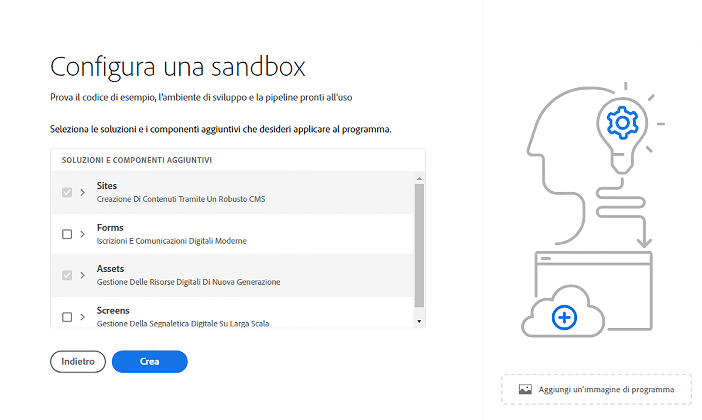

# Creazione di un programma {#create-program}

In questa sezione del [percorso di onboarding](overview.md), imparerai a utilizzare Cloud Manager per creare il tuo primo programma.

## Obiettivo {#objective}

Dopo aver esaminato il documento precedente di questo percorso di onboarding, [Accedi a Cloud Manager](cloud-manager.md), hai appurato di avere accesso a Cloud Manager. Ora puoi creare il primo programma.

Dopo aver letto questo documento, saprai:

* Comprendere e spiegare che cos’è un programma.
* Conoscere la differenza tra i programmi di produzione e i programmi sandbox.
* Creare un programma personalizzato.

## Che cos’è un programma? {#programs}

I programmi rappresentano il livello organizzativo più alto in Cloud Manager. In base alla licenza Adobe in uso, i programmi consentono di organizzare la soluzione e concedere le autorizzazioni di accesso a tali programmi a determinati membri del gruppo.

I programmi Cloud Manager rappresentano set di ambienti di Cloud Manager. Questi programmi supportano set logici di iniziative aziendali, in genere corrispondenti al contratto del livello di servizio (SLA) concesso in licenza. Ad esempio, un programma può rappresentare le risorse Adobe Experience Manager (AEM) per supportare il sito web pubblico globale di un’organizzazione, mentre un altro programma può rappresentare un DAM interno centrale.

Se ricordi l’esempio teorico di WKND Travel and Adventure Enterprises, un tenant che si occupa di media legati ai viaggi, potrebbe avere due programmi. Un programma di AEM Sites per la divisione WKND Magazine e un programma di AEM Assets per la divisione WKND Media. Diversi membri del gruppo avrebbero quindi accesso a diversi programmi grazie alla divisione dei lavori.

Vi sono due diversi tipi di programmi:

* Un **programma di produzione** viene creato per abilitare il traffico in tempo reale per il sito. Si tratta del tuo ambiente &quot;reale&quot;.
* I **programmi sandbox** vengono generalmente creati a scopi di formazione, esecuzione di demo, abilitazione, POC o documentazione.

Poiché hanno scopi diversi, i diversi ambienti presentano opzioni differenti. Tuttavia, il processo per la loro creazione è analogo. Per questo percorso di onboarding creerai un ambiente sandbox.

>[!TIP]
>
>Se devi creare un programma di produzione, consulta la sezione [Risorse aggiuntive](#additional-resources) per un collegamento alla documentazione che descrive i programmi in dettaglio.

## Creazione di un programma sandbox {#create-sandbox}

1. Accedi a Cloud Manager all’indirizzo [my.cloudmanager.adobe.com](https://my.cloudmanager.adobe.com/) e seleziona l’organizzazione appropriata.

1. Dalla pagina di destinazione di Cloud Manager, fai clic su **Aggiungi programma** nell’angolo in alto a destra della schermata.

   

1. Dalla procedura guidata Crea programma, seleziona **Configura una sandbox**, assegna un nome al programma, quindi seleziona **Continua**.

   

1. Nella finestra di dialogo **Configura una sandbox**, puoi scegliere le soluzioni da abilitare nel programma sandbox. Le soluzioni **Sites** e **Assets** sono sempre incluse nei programmi sandbox e vengono selezionate automaticamente. Questo è sufficiente per il nostro esempio di onboarding. Fai clic su **Crea**.

   

Nella pagina di destinazione viene visualizzata una nuova scheda del programma sandbox e un indicatore di stato che mostra l’avanzamento del processo di configurazione.

Dopo aver completato il programma, i membri dell’organizzazione assegnati al profilo di prodotto **Sviluppatore** possono accedere a Cloud Manager e gestire gli archivi Git di Cloud Manager.

## Passaggio successivo {#whats-next}

Ora che hai creato il primo programma, puoi creare degli ambienti da aggiungere. Continua il tuo percorso di onboarding passando al documento [Creazione di ambienti](create-environments.md).

## Risorse aggiuntive {#additional-resources}

Di seguito sono riportate risorse aggiuntive e opzionali utili per andare oltre il contenuto del percorso di onboarding.

* [Programmi e tipi di programmi](/help/implementing/cloud-manager/getting-access-to-aem-in-cloud/program-types.md): scopri la gerarchia di Cloud Manager, le differenze tra i diversi tipi di programmi e come si adattano alla struttura gerarchica.
* [Creazione di programmi sandbox](/help/implementing/cloud-manager/getting-access-to-aem-in-cloud/creating-sandbox-programs.md): scopri come creare un programma sandbox personalizzato da utilizzare per formazione, demo, POC o altre finalità non di produzione con Cloud Manager.
* [Creazione di programmi di produzione](/help/implementing/cloud-manager/getting-access-to-aem-in-cloud/creating-production-programs.md): scopri come creare un programma di produzione per ospitare il traffico in tempo reale con Cloud Manager.
* [Utilizzo dei programmi di Adobe Cloud Manager](https://experienceleague.adobe.com/docs/experience-manager-learn/cloud-service/cloud-manager/programs.html?lang=it): i programmi Cloud Manager rappresentano insiemi di ambienti AEM che supportano set logici di iniziative aziendali, in genere corrispondenti a un contratto del livello di servizio (SLA) acquistato.
* [Team e profili di prodotto di AEM as a Cloud Service](/help/onboarding/aem-cs-team-product-profiles.md): scopri come i team e i profili di prodotto di AEM as a Cloud Service possono concedere e limitare l’accesso alle soluzioni di Adobe con licenza.
