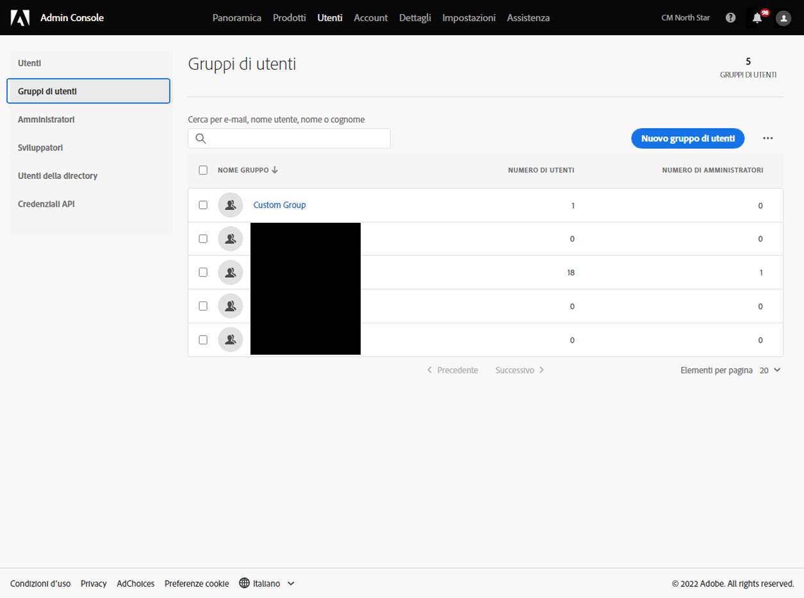
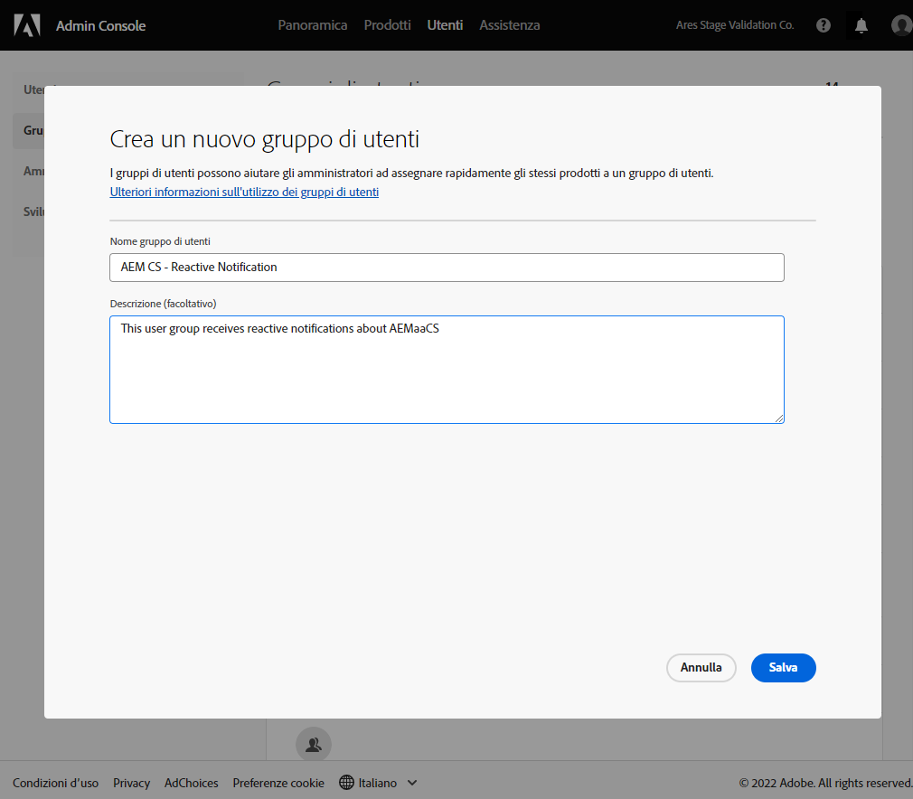
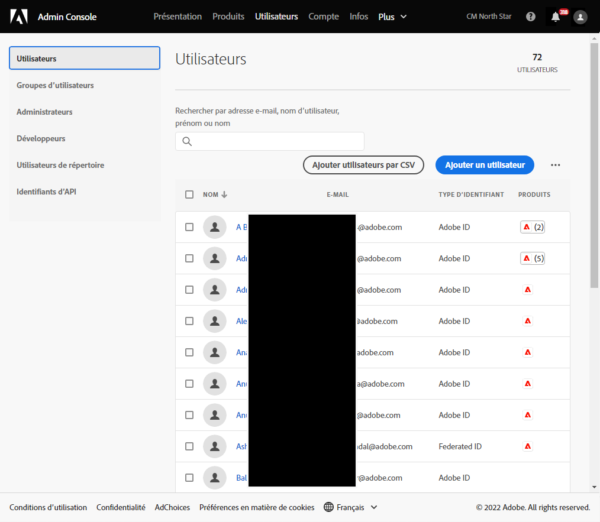
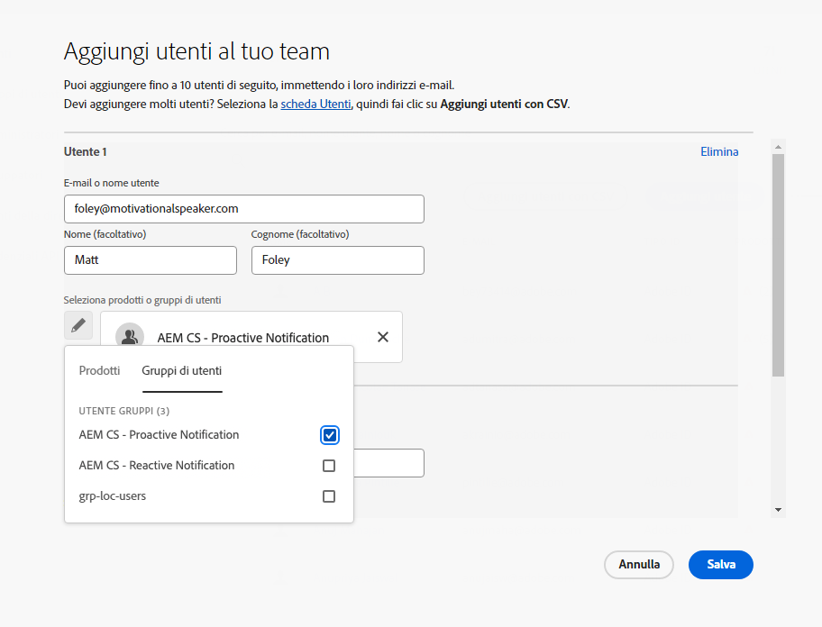
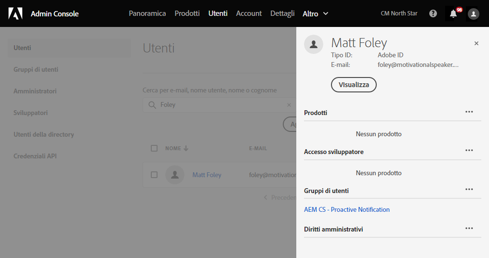

# Gruppi di utenti per le notifiche {#user-groups}

Scopri come creare un gruppo di utenti nell’Admin Console per gestire la ricezione di notifiche e-mail importanti.

## Panoramica {#overview}

Di tanto in tanto, l’Adobe deve contattare per quanto riguarda i propri ambienti as a Cloud Service AEM. Oltre alla notifica interna al prodotto, l’Adobe utilizza occasionalmente anche e-mail per tali notifiche. Esistono due tipi di notifica:

* **Notifica reattiva** - Queste notifiche vengono inviate durante un incidente o quando Adobe ha identificato un potenziale problema di disponibilità con il tuo ambiente as a Cloud Service AEM.
* **Notifica proattiva** - Queste notifiche vengono inviate quando un membro del team di supporto di Adobe desidera fornire indicazioni su una potenziale ottimizzazione o raccomandazione che possa apportare vantaggi all’ambiente as a Cloud Service AEM.

Affinché gli utenti corretti ricevano queste notifiche, devi configurare i gruppi di utenti.

## Prerequisiti {#prerequisites}

Poiché i gruppi di utenti vengono creati e mantenuti nell&#39;Admin Console, prima di creare gruppi di utenti per le notifiche, devi:

* Disporre delle autorizzazioni per aggiungere e modificare le appartenenze ai gruppi.
* Avere un profilo Adobe Admin Console valido.

## Creare gruppi di utenti per le notifiche {#create-groups}

Per impostare correttamente la ricezione delle notifiche è necessario creare due gruppi di utenti. Questi passaggi devono essere eseguiti una sola volta.

1. Accedi all&#39;Admin Console in [`https://adminconsole.adobe.com`.](https://adminconsole.adobe.com)

1. Fai clic sul pulsante **Utenti** e quindi la **Gruppi di utenti** nel pannello di navigazione a sinistra.

   

1. Fai clic sul pulsante **Nuovo gruppo di utenti** e fornire un **Nome del gruppo di utenti** esattamente come specificato e come facoltativo **Descrizione**.

   * I nomi dei gruppi devono corrispondere a quanto segue. Non modificare in alcun modo i nomi dei gruppi.
      * `AEM CS - Reactive Notification`
      * `AEM CS - Proactive Notification`

   

1. Fai clic su **Salva**.

1. Ripetere i passaggi per il secondo gruppo.

Nei casi in cui i gruppi non sono definiti, Adobe avviserà gli utenti esistenti con Cloud Manager **Sviluppatore** o **Distribuzione** profili.

## Aggiungi utenti a gruppi {#add-users}

Ora che i gruppi sono stati creati, devi assegnare gli utenti appropriati. Puoi eseguire questa operazione durante la creazione di nuovi utenti o aggiornando quelli esistenti.

### Aggiungi nuovi utenti ai gruppi {#new-user}

1. Accedi all&#39;Admin Console in [`https://adminconsole.adobe.com`](https://adminconsole.adobe.com) se non hai ancora effettuato l&#39;accesso.

1. Fai clic sul pulsante **Utenti** e quindi la **Utenti** nel pannello di navigazione a sinistra.

   

1. Fai clic sul pulsante **Aggiungi utente** e fornisci l&#39;indirizzo e-mail dell&#39;utente. Facoltativamente, puoi anche specificare un nome e un cognome.

   * Se l’utente esiste già, l’Admin Console corrisponderà all’indirizzo e-mail e precompila i campi.

1. Fai clic sul segno più sotto i campi del nome utente, quindi fai clic sul pulsante **Gruppi di utenti** nella finestra a comparsa per selezionare i gruppi per l’utente.

   

1. Fai clic su **Salva** per salvare il nuovo utente.

Ripetere questi passaggi per ogni utente per il quale è necessario assegnare i gruppi di notifica.

### Aggiungi utenti esistenti a gruppi {#existing-user}

1. Accedi all&#39;Admin Console in [`https://adminconsole.adobe.com`](https://adminconsole.adobe.com) se non hai ancora effettuato l&#39;accesso.

1. Fai clic sul pulsante **Utenti** e quindi la **Utenti** nel pannello di navigazione a sinistra.

   

1. Fai clic sulla riga dell’utente che desideri aggiungere a un gruppo di notifiche. Viene visualizzato un pannello che mostra i dettagli utente.

1. Fai clic sull’icona dei puntini di sospensione sul lato destro del **Gruppi di utenti** nel pannello dei dettagli.