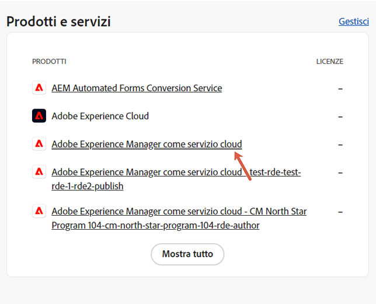

# Gruppi di utenti per le notifiche {#user-groups}

Scopri come creare un gruppo di utenti nell’Admin Console per gestire la ricezione di notifiche e-mail importanti.

## Panoramica {#overview}

Di tanto in tanto, Adobe deve contattare gli utenti per quanto riguarda i loro ambienti as a Cloud Service AEM. Oltre alle notifiche interne al prodotto, l’Adobe utilizza occasionalmente anche le e-mail per le notifiche. Esistono due tipi di notifiche e-mail di questo tipo:

* **Notifica dell&#39;incidente** - Queste notifiche vengono inviate durante un incidente o quando Adobe ha identificato un potenziale problema di disponibilità con il tuo ambiente as a Cloud Service AEM.
* **Notifica proattiva** - Queste notifiche vengono inviate quando un membro del team di supporto di Adobe desidera fornire indicazioni su una potenziale ottimizzazione o raccomandazione che possa apportare vantaggi all’ambiente as a Cloud Service AEM.

Affinché gli utenti corretti ricevano queste notifiche, devi configurare e assegnare gruppi di utenti e descritti in questo documento.

## Prerequisiti {#prerequisites}

Poiché i gruppi di utenti vengono creati e mantenuti nell&#39;Admin Console, prima di creare gruppi di utenti per le notifiche, devi:

* Disporre delle autorizzazioni per aggiungere e modificare le appartenenze ai gruppi.
* Avere un profilo Adobe Admin Console valido.

## Creare nuovi profili di prodotto di Cloud Manager {#create-groups}

Per impostare correttamente la ricezione delle notifiche è necessario creare due gruppi di utenti. Questi passaggi devono essere eseguiti una sola volta.

1. Accedi all&#39;Admin Console in [`https://adminconsole.adobe.com`.](https://adminconsole.adobe.com)

1. Da **Panoramica** pagina, seleziona **Adobe Experience Manager as a Cloud Service** dal **Prodotti e servizi** il Card.

   

1. Passa a **Cloud Manager** dall’elenco di tutte le istanze.

   

1. Verrà visualizzato l’elenco di tutti i profili di prodotto Cloud Manager configurati.

   

1. Fai clic su **Nuovo profilo** e fornire i seguenti dettagli:

   * **Nome del profilo di prodotto**: `Incident Notification - Cloud Service`
   * **Nome visualizzato**: `Incident Notification - Cloud Service`
   * **Descrizione**: Profilo Cloud Manager per gli utenti che riceveranno notifiche durante un incidente o quando Adobe ha identificato un potenziale problema di disponibilità con l’ambiente as a Cloud Service AEM

1. Fai clic su **Salva**.

1. Fai clic su **Nuovo profilo** ancora una volta e fornisci i seguenti dettagli:

   * **Nome del profilo di prodotto**: `Proactive Notification - Cloud Service`
   * **Nome visualizzato**: `Proactive Notification - Cloud Service`
   * **Descrizione**: Profilo Cloud Manager per gli utenti che riceveranno notifiche quando un membro del team di supporto di Adobe desidera fornire indicazioni su una potenziale ottimizzazione o raccomandazione da eseguire con la configurazione dell’ambiente as a Cloud Service AEM

1. Fai clic su **Salva**.

Vengono creati i nuovi due gruppi di notifica.

>[!NOTE]
>
>È importante che Cloud Manager **nome del profilo di prodotto** è esattamente uguale a quello fornito. Copia e incolla il nome del profilo di prodotto fornito per evitare errori. Eventuali deviazioni o errori di battitura causeranno l’invio di notifiche non conforme alle tue esigenze.
>
>In caso di errore o se i profili non sono stati definiti, per impostazione predefinita, l’Adobe notificherà agli utenti esistenti assegnati al **Sviluppatore Cloud Manager** o **Gestione distribuzione** profili.

## Assegnare gli utenti ai nuovi profili di prodotto delle notifiche {#add-users}

Ora che i gruppi sono stati creati, devi assegnare gli utenti appropriati. Puoi eseguire questa operazione durante la creazione di nuovi utenti o aggiornando quelli esistenti.

### Aggiungi nuovi utenti ai gruppi {#new-user}

Segui questi passaggi per aggiungere utenti per i quali non sono ancora stati impostati ID federati.

1. Identifica gli utenti che devono ricevere notifiche incidenti o proattive.

1. Accedi all&#39;Admin Console in [`https://adminconsole.adobe.com`](https://adminconsole.adobe.com) se non hai ancora effettuato l&#39;accesso.

1. Da **Panoramica** pagina, seleziona **Adobe Experience Manager as a Cloud Service** dal **Prodotti e servizi** il Card.

   

1. Se l&#39;ID federato per i membri del team non è ancora stato impostato, seleziona la **Utenti** scheda dalla navigazione in alto, quindi seleziona **Aggiungi utente**. In caso contrario, passa alla sezione . [Aggiungi utenti esistenti ai gruppi.](#existing-users)

   

1. In **Aggiungi utenti al tuo team** , inserisci l’ID e-mail dell’utente che desideri aggiungere e selezionare `Adobe ID` per **Tipo di ID**.

1. Fai clic sul pulsante più sotto il pulsante **Seleziona prodotti** intestazione per iniziare la selezione del prodotto.

1. Seleziona **Adobe Experience Manager as a Cloud Service** e assegna all&#39;utente uno o entrambi i nuovi gruppi.

   * **Notifica incidente - Cloud Service**
   * **Notifica proattiva - Cloud Service**

1. Fai clic su **Salva** e viene inviata un’e-mail di benvenuto all’utente aggiunto.

L’utente invitato riceverà ora le notifiche. Ripeti questi passaggi per gli utenti del tuo team che desideri ricevere le notifiche.

### Aggiungi utenti esistenti a gruppi {#existing-user}

Segui questi passaggi per aggiungere utenti per i quali esistono già ID federati.

1. Identifica gli utenti che devono ricevere notifiche incidenti o proattive.

1. Accedi all&#39;Admin Console in [`https://adminconsole.adobe.com`](https://adminconsole.adobe.com) se non hai ancora effettuato l&#39;accesso.

1. Da **Panoramica** pagina, seleziona **Adobe Experience Manager as a Cloud Service** dal **Prodotti e servizi** il Card.

1. Seleziona la **Utenti** scheda dalla navigazione superiore.

1. Se l&#39;ID federato esiste già per il membro del team che si desidera aggiungere a un gruppo di notifiche, individuare l&#39;utente nell&#39;elenco e fare clic su di esso. In caso contrario, passa alla sezione . [Aggiungi nuovi utenti ai gruppi.](#add-user)

1. In **Prodotti** nella sezione della finestra dei dettagli utente, fare clic sul pulsante dei puntini di sospensione e quindi selezionare **Modifica**.

1. In **Modifica prodotti** fai clic sul pulsante a matita sotto la **Seleziona prodotti** intestazione per iniziare la selezione del prodotto.

1. Seleziona **Adobe Experience Manager as a Cloud Service** e assegna all&#39;utente uno o entrambi i nuovi gruppi.

   * **Notifica incidente - Cloud Service**
   * **Notifica proattiva - Cloud Service**

1. Fai clic su **Salva** e viene inviata un’e-mail di benvenuto all’utente aggiunto.

L’utente invitato riceverà ora le notifiche. Ripeti questi passaggi per gli utenti del tuo team che desideri ricevere le notifiche.
