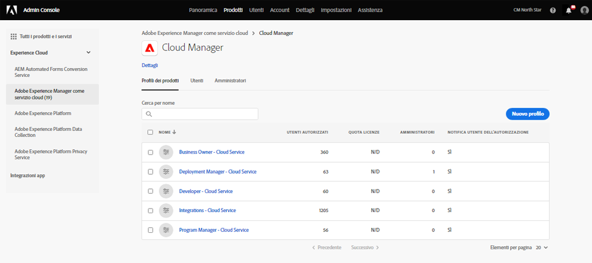
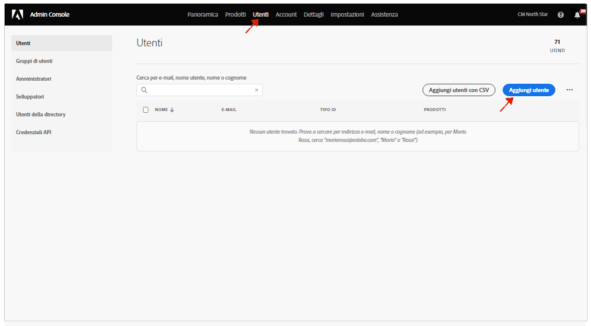

# Gruppi di utenti per le notifiche {#user-groups}

Scopri come creare un gruppo di utenti nell’Admin Console per gestire la ricezione di notifiche e-mail importanti.

## Panoramica {#overview}

Di tanto in tanto, l’Adobe deve contattare per quanto riguarda i propri ambienti as a Cloud Service AEM. Oltre alla notifica interna al prodotto, l’Adobe utilizza occasionalmente anche e-mail per tali notifiche. Esistono due tipi di notifica:

* **Notifica incidente - Cloud Service** - Queste notifiche vengono inviate durante un incidente o quando Adobe ha identificato un potenziale problema di disponibilità con il tuo ambiente as a Cloud Service AEM.
* **Notifica proattiva - Cloud Service** - Queste notifiche vengono inviate quando un membro del team di supporto di Adobe desidera fornire indicazioni su una potenziale ottimizzazione o raccomandazione che possa apportare vantaggi all’ambiente as a Cloud Service AEM.

Affinché gli utenti corretti ricevano queste notifiche, devi configurare i gruppi di utenti.

## Prerequisiti {#prerequisites}

Poiché i gruppi di utenti vengono creati e mantenuti nell&#39;Admin Console, prima di creare gruppi di utenti per le notifiche, devi:

* Disporre delle autorizzazioni per aggiungere e modificare le appartenenze ai gruppi.
* Avere un profilo Adobe Admin Console valido.

## Creare nuovi profili di prodotto di Cloud Manager {#create-groups}

Per impostare correttamente la ricezione delle notifiche è necessario creare due gruppi di utenti. Questi passaggi devono essere eseguiti una sola volta.

1. Accedi all&#39;Admin Console in [`https://adminconsole.adobe.com`.](https://adminconsole.adobe.com)

1. Da **Panoramica** pagina, seleziona **Adobe Experience Manager as a Cloud Service** dal **Prodotti e servizi** il Card.

   

1. Passa a **Cloud Manager** dall’elenco di tutte le istanze.

   

1. Verrà visualizzato l’elenco di tutti i profili di prodotto Cloud Manager configurati. Esempio:

   

1. Fai clic su Nuovo profilo e introduce i seguenti dettagli:

* Nome del profilo di prodotto: Notifica incidente - Cloud Service
* Nome visualizzato: Notifica incidente - Cloud Service
* Descrizione: Profilo Cloud Manager per gli utenti che riceveranno notifiche durante un incidente o quando Adobe ha identificato un potenziale problema di disponibilità con l’ambiente as a Cloud Service AEM.

1. Fai clic su Salva e ripeti il passaggio 4 con i seguenti dettagli:

* Nome del profilo di prodotto: Notifica proattiva - Cloud Service
* Nome visualizzato: Notifica proattiva - Cloud Service
* Descrizione: Profilo Cloud Manager per gli utenti che riceveranno notifiche quando un membro del team di supporto di Adobe desidera fornire indicazioni su una potenziale ottimizzazione o raccomandazione da eseguire con la configurazione dell’ambiente as a Cloud Service AEM.

>[!NOTE]
>
>È importante che il nome del profilo Cloud Manager sia esattamente lo stesso di quanto sopra. Copia e incolla il nome del profilo di prodotto dalla descrizione fornita. Eventuali deviazioni o errori di battitura causeranno l’invio di notifiche non conforme alle tue esigenze. In caso di errore o se i profili non sono stati definiti, per impostazione predefinita, Adobe avviserà gli utenti esistenti assegnati ai profili di Cloud Manager Developer (it o , o e) Deployment Manager.

## Assegnare gli utenti ai nuovi profili di prodotto delle notifiche {#add-users}

Ora che i gruppi sono stati creati, devi assegnare gli utenti appropriati. Puoi eseguire questa operazione durante la creazione di nuovi utenti o aggiornando quelli esistenti.

### Aggiungi nuovi utenti ai gruppi {#new-user}

1. Identifica gli utenti che devono ricevere le notifiche Incident o Proactive.

1. Accedi all&#39;Admin Console in [`https://adminconsole.adobe.com`](https://adminconsole.adobe.com) se non hai ancora effettuato l&#39;accesso.

1. Da **Panoramica** pagina, seleziona **Adobe Experience Manager as a Cloud Service** dal **Prodotti e servizi** il Card.

   

1. Seleziona la **Utenti** scheda dalla navigazione in alto, quindi seleziona **Aggiungi utente**.

1. Nella finestra di dialogo Aggiungi utenti al team , immetti l’ID e-mail dell’utente che desideri aggiungere.

* Se l&#39;ID federato per i membri del team non è ancora stato impostato, selezionare Adobe ID per il tipo di ID.
* Se l’utente esiste già, vedi il passaggio 7.

1. Fai clic sul pulsante più sotto il pulsante **Seleziona prodotti** intestazione per iniziare la selezione del prodotto e selezionare **Adobe Experience Manager as a Cloud Service** e assegna **Notifica incidente - Cloud Service** o **Notifica proattiva - Cloud Service** o entrambi per l’utente.

1. Fai clic su **Salva** e viene inviata un’e-mail di benvenuto all’utente aggiunto. L’utente invitato riceverà ora le notifiche.

1. Ripeti questi passaggi per gli utenti del tuo team che desideri ricevere le notifiche.

1. Se l’utente esiste già, cerca il nome dell’utente e:

* Fare clic sul nome dell&#39;utente.
* In **Prodotti** sezione, fai clic su **Modifica**.
* Fai clic sul pulsante della matita nel **Seleziona prodotti** intestazione per iniziare la selezione del prodotto e selezionare **Adobe Experience Manager as a Cloud Service** e assegna **Notifica incidente - Cloud Service** o **Notifica proattiva - Cloud Service** o entrambi per l’utente.
* Fai clic su **Salva** e viene inviata un’e-mail di benvenuto all’utente aggiunto. L’utente invitato riceverà ora le notifiche.
