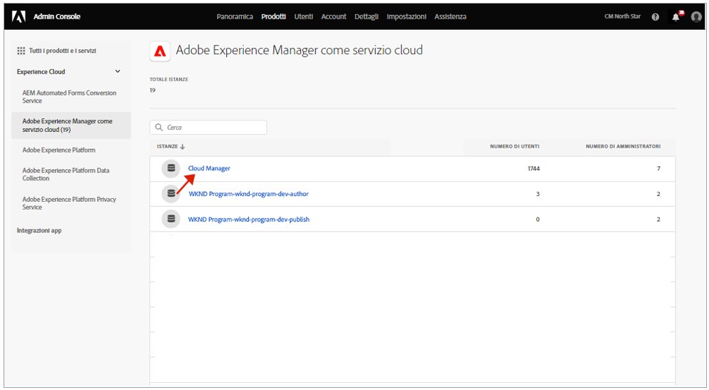

# Gruppi di utenti per le notifiche {#user-groups}

Scopri come creare un gruppo di utenti in Admin Console per gestire la ricezione di notifiche e-mail importanti.

## Panoramica {#overview}

Di tanto in tanto, Adobe deve contattare gli utenti in merito ai loro ambienti AEM as a Cloud Service. Oltre alle notifiche interne al prodotto, Adobe a volte potrebbe inviare le notifiche per e-mail. Esistono due tipi di notifiche e-mail:

* **Notifica per incidente**: queste notifiche vengono inviate se si verifica un incidente o se Adobe ha identificato un potenziale problema di disponibilità che interessa il tuo ambiente AEM as a Cloud Service.
* **Notifica proattiva**: queste notifiche vengono inviate quando un membro del team del supporto Adobe desidera fornire indicazioni su una potenziale ottimizzazione o consigli su come sfruttare al megliio l’ambiente AEM as a Cloud Service.

Affinché gli utenti appropriati possano ricevere queste notifiche, devi configurare e assegnare gruppi di utenti come descritto in questo documento.

## Prerequisiti {#prerequisites}

Poiché i gruppi di utenti vengono creati e mantenuti in Admin Console, prima di creare gruppi di utenti per le notifiche, assicurati di soddisfare i seguenti requisiti:

* Devi disporre delle autorizzazioni necessarie per aggiungere e modificare le appartenenze ai gruppi.
* Devi avere un profilo Adobe Admin Console valido.

## Creare nuovi profili di prodotto per Cloud Manager {#create-groups}

Per impostare correttamente la ricezione delle notifiche è necessario creare due gruppi di utenti. Questi passaggi devono essere eseguiti una sola volta.

1. Accedi a Admin Console all’indirizzo [`https://adminconsole.adobe.com`.](https://adminconsole.adobe.com)

1. Dalla pagina **Panoramica**, accedi alla scheda **Prodotti e servizi** e seleziona **Adobe Experience Manager as a Cloud Service**.

   

1. Dall’elenco di tutte le istanze, accedi all’istanza di **Cloud Manager**.

   

1. Viene visualizzato l’elenco dei profili di prodotto configurati per Cloud Manager.

   

1. Fai clic su **Nuovo profilo** e fornisci i seguenti dettagli:

   * **Nome del profilo di prodotto**: `Incident Notification - Cloud Service`
   * **Nome visualizzato**: `Incident Notification - Cloud Service`
   * **Descrizione**: profilo Cloud Manager per gli utenti che riceveranno notifiche se si verifica un incidente o se Adobe identifica un potenziale problema di disponibilità che interessa il tuo ambiente AEM as a Cloud Service.

1. Fai clic su **Salva**.

1. Fai clic su **Nuovo profilo** ancora una volta e fornisci i seguenti dettagli:

   * **Nome del profilo di prodotto**: `Proactive Notification - Cloud Service`
   * **Nome visualizzato**: `Proactive Notification - Cloud Service`
   * **Descrizione**: profilo Cloud Manager per gli utenti che riceveranno notifiche se un membro del team del supporto Adobe desidera fornire indicazioni su una potenziale ottimizzazione o consigli in merito alla configurazione del tuo ambiente AEM as a Cloud Service.

1. Fai clic su **Salva**.

Vengono creati i due nuovi gruppi di notifica.

>[!NOTE]
>
>È importante che il **nome del profilo di prodotto** di Cloud Manager sia esattamente uguale a quello fornito. Per evitare errori, copia e incolla il nome del profilo di prodotto. Se è diverso o presenta errori di battitura, l’invio delle notifiche non avverrà correttamente.
>
>In caso di errore o se i profili non sono stati definiti, per impostazione predefinita Adobe invierà le notifiche agli utenti esistenti assegnati al profilo **Sviluppatore Cloud Manager** o **Responsabile della distribuzione**.

## Assegnare gli utenti ai nuovi profili di prodotto per le notifiche {#add-users}

Ora che i gruppi sono stati creati, devi assegnarvi gli utenti appropriati. Puoi eseguire questa operazione durante la creazione di nuovi utenti o aggiornando quelli esistenti.

### Aggiungere utenti nuovi ai gruppi {#new-user}

Segui questi passaggi per aggiungere utenti per i quali non sono ancora stati impostati ID federati.

1. Identifica gli utenti che devono ricevere notifiche proattive o per incidenti.

1. Accedi ad Admin Console in [`https://adminconsole.adobe.com`](https://adminconsole.adobe.com), se non hai ancora effettuato l’accesso.

1. Dalla pagina **Panoramica**, accedi alla scheda **Prodotti e servizi** e seleziona **Adobe Experience Manager as a Cloud Service**.

   

1. Se l’ID federato per i membri del team non è ancora stato impostato, seleziona la scheda **Utenti** nell’area di navigazione in alto, quindi seleziona **Aggiungi utente**. In caso contrario, passa alla sezione [Aggiungere utenti esistenti ai gruppi.](#existing-users)

   

1. Nella finestra di dialogo **Aggiungi utenti al team**, inserisci l’ID e-mail dell’utente che desideri aggiungere e seleziona `Adobe ID` per il **tipo di ID**.

1. Per iniziare la selezione del prodotto, fai clic sul pulsante più sotto a **Seleziona prodotti**.

1. Seleziona **Adobe Experience Manager as a Cloud Service** e assegna all’utente uno dei nuovi gruppi, o entrambi.

   * **Notifica per incidente - Cloud Service**
   * **Notifica proattiva - Cloud Service**

1. Fai clic su **Salva**; un’e-mail di benvenuto viene inviata all’utente aggiunto.

L’utente invitato riceverà le notifiche. Ripeti questi passaggi per gli altri utenti del tuo team che dovranno ricevere le notifiche.

### Aggiungere utenti esistenti ai gruppi {#existing-user}

Segui questi passaggi per aggiungere utenti per i quali esistono già ID federati.

1. Identifica gli utenti che devono ricevere notifiche proattive o per incidenti.

1. Accedi ad Admin Console in [`https://adminconsole.adobe.com`](https://adminconsole.adobe.com), se non hai ancora effettuato l’accesso.

1. Dalla pagina **Panoramica**, accedi alla scheda **Prodotti e servizi** e seleziona **Adobe Experience Manager as a Cloud Service**.

1. Seleziona la scheda **Utenti** nell’area di navigazione in alto.

1. Se l’ID federato esiste già per il membro del team che desideri aggiungere a un gruppo di notifiche, individua l’utente nell’elenco e fai clic su di esso. In caso contrario, passa alla sezione [Aggiungere nuovi utenti ai gruppi.](#add-user)

1. Nella sezione **Prodotti** della finestra dei dettagli utente, fai clic sul pulsante dei puntini di sospensione e quindi seleziona **Modifica**.

1. Nella finestra **Modifica prodotti** fai clic sul pulsante con l’icona della matita sotto a **Seleziona prodotti** per iniziare la selezione del prodotto.

1. Seleziona **Adobe Experience Manager as a Cloud Service** e assegna all’utente uno dei nuovi gruppi, o entrambi.

   * **Notifica per incidente - Cloud Service**
   * **Notifica proattiva - Cloud Service**

1. Fai clic su **Salva**; un’e-mail di benvenuto viene inviata all’utente aggiunto.

L’utente invitato riceverà le notifiche. Ripeti questi passaggi per gli altri utenti del tuo team che dovranno ricevere le notifiche.
