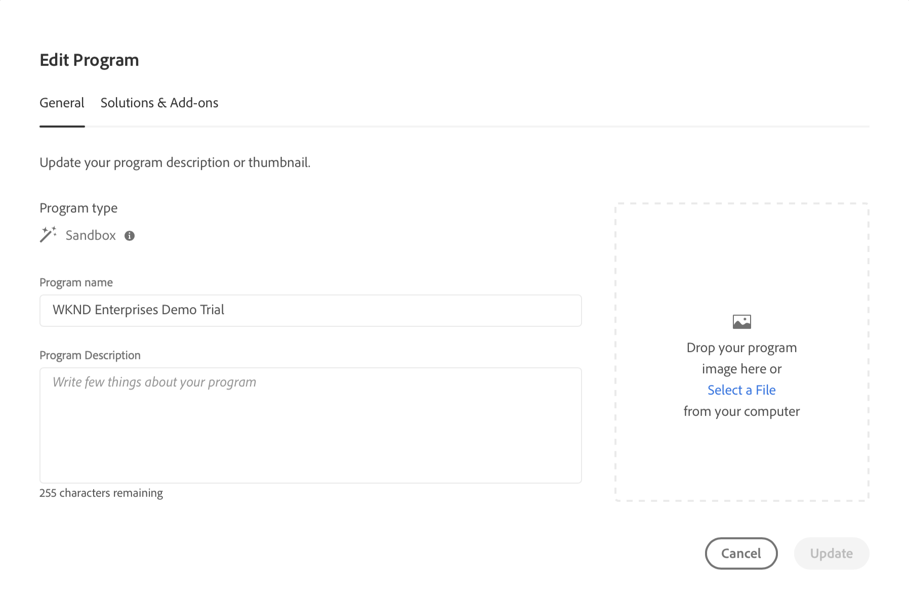

# Crea programma {#creating-a-program}

Scopri come impostare un nuovo programma e una nuova pipeline per distribuire il componente aggiuntivo.

## La storia finora {#story-so-far}

Nel documento precedente di AEM Reference Demos Add-On, [Comprendere l’installazione di AEM Reference Demos Add-On,](installation.md) hai imparato come funziona il processo di installazione del componente aggiuntivo Reference Demos, illustrando come funzionano i diversi componenti insieme. Ora dovresti:

* Avere una conoscenza di base di Cloud Manager.
* Scoprire come le pipeline forniscono contenuto e configurazione ad AEM.
* Scoprire come i modelli possono creare nuovi siti precompilati con contenuti dimostrativi con pochi clic.

Questo articolo si basa su tali elementi fondamentali e mostra il primo passaggio di configurazione per creare un programma a scopo di test e utilizza una pipeline per distribuire il contenuto aggiuntivo.

## Obiettivo {#objective}

Questo documento spiega come impostare un nuovo programma e una nuova pipeline per distribuire il componente aggiuntivo. Dopo la lettura dovresti:

* Scopri come utilizzare Cloud Manager per creare un nuovo programma.
* Scopri come attivare AEM Reference Demos Add-On per il nuovo programma.
* Puoi eseguire una pipeline per distribuire il contenuto aggiuntivo.

## Creare un programma {#create-program}

Dopo aver effettuato l’accesso a Cloud Manager, puoi creare un nuovo programma sandbox a scopo di test e demo.

>[!NOTE]
>
>L&#39;utente deve essere membro di **Proprietario business** ruolo in Cloud Manager nella tua organizzazione per creare programmi.

1. Accedi ad Adobe Cloud Manager all’indirizzo [my.cloudmanager.adobe.com](https://my.cloudmanager.adobe.com/).

1. Una volta effettuato l’accesso, assicurati di essere nell’organizzazione corretta controllando nell’angolo in alto a destra dello schermo. Se sei membro di una sola organizzazione, questo passaggio non è necessario.

   

1. Tocca o fai clic su **Aggiungi programma** in alto a destra nella finestra.

1. Nella finestra **Creiamo il programma**, assicurati che **Adobe Experience Manager** sia selezionato in **Prodotti** quindi tocca o fai clic su **Continua**.

   

1. Nella finestra di dialogo successiva:

   * Inserisci un **Nome del programma** per descriverlo.
   * Tocca o fai clic su **Configura una sandbox** per l&#39;**Obiettivo del programma**

   Tocca o fai clic su **Crea**.

   

1. Viene visualizzata la schermata di panoramica del programma in cui puoi osservare il processo di creazione. Cloud Manager fornisce stime del tempo rimanente. Puoi spostarti da questa schermata quando il programma viene creato e, se necessario, tornare in un secondo momento.

   

1. Al termine, Cloud Manager presenta una panoramica che include gli ambienti e le pipeline creati automaticamente.

   

1. Modifica i dettagli del programma facendo clic sul nome del programma in alto a sinistra della pagina e nel menu a discesa seleziona **Modifica programma**.

   

1. Nella finestra di dialogo **Modifica programma**, passa alla scheda **Soluzioni &amp; componenti aggiuntivi**.

   

1. Nella scheda **Soluzioni &amp; componenti aggiuntivi**, espandi la voce **Sites** nell&#39;elenco e quindi spunta **Reference Demos**. Se desideri anche creare demo per AEM Screens, spunta anche l&#39;opzione **Screens** nell’elenco. Tocca o fai clic su **Aggiorna**.

   

1. Il componente aggiuntivo è ora abilitato come opzione, ma il relativo contenuto deve essere distribuito a AEM per essere disponibile. Torna alla pagina della panoramica del programma, tocca o fai clic su **Avvio** per avviare la pipeline per distribuire il contenuto aggiuntivo a AEM.

   

1. La pipeline viene avviata e viene visualizzata una pagina che descrive l’avanzamento della distribuzione. Puoi spostarti da questa schermata quando il programma viene creato e, se necessario, tornare in un secondo momento.

   

Una volta completata la pipeline, il componente aggiuntivo e il relativo contenuto demo sono disponibili per l’utilizzo nell’ambiente di authoring AEM.

## Novità {#what-is-next}

Adesso che hai completato questa parte del percorso di AEM Reference Demo Add-On, dovresti:

* Scopri come utilizzare Cloud Manager per creare un nuovo programma.
* Scopri come attivare AEM Reference Demos Add-On per il nuovo programma.
* Puoi eseguire una pipeline per distribuire il contenuto aggiuntivo.

Approfondisci questo argomento e continua il percorso con AEM Reference Demos Add-On consultando il documento successivo [Creare un sito demo,](create-site.md) dove imparerai a creare un sito demo in AEM basato su una libreria di modelli preconfigurati distribuiti dalla pipeline.

## Risorse aggiuntive {#additional-resources}

* [Documentazione di Cloud Manager](https://experienceleague.adobe.com/docs/experience-manager-cloud-service/onboarding/onboarding-concepts/cloud-manager-introduction.html?lang=it): per ulteriori informazioni sulle funzioni di Cloud Manager, consulta direttamente i documenti tecnici approfonditi.
