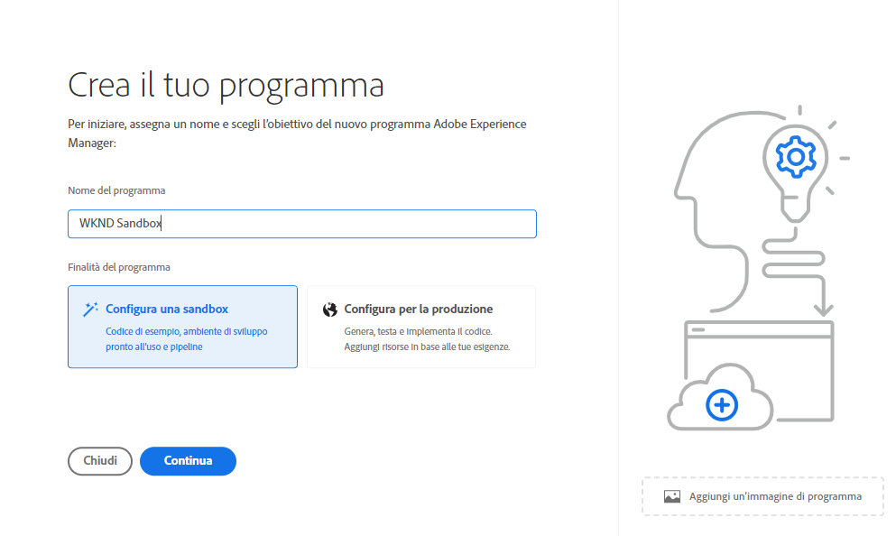
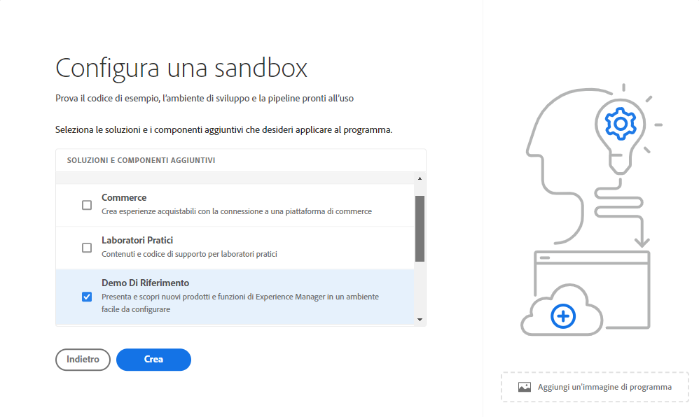
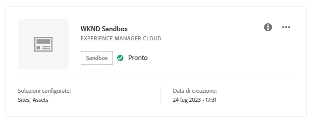
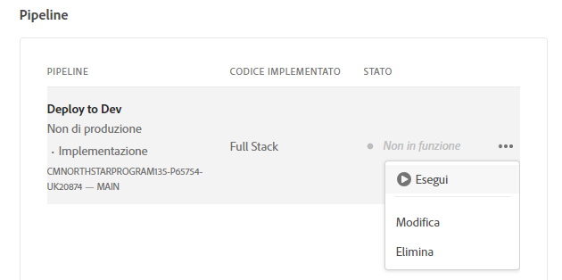
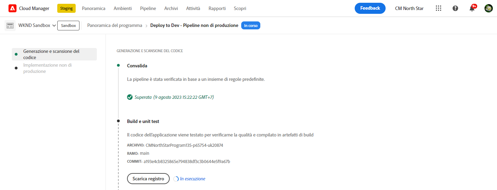

# Crea programma {#creating-a-program}

Scopri come impostare un nuovo programma e una nuova pipeline per distribuire il componente aggiuntivo.

## La storia finora {#story-so-far}

Nel documento precedente del percorso Adobe Experience Manager (AEM) Reference Demos Add-on, [Comprendere l’installazione di Reference Demo Add-on,](installation.md) hai imparato come funziona il processo di installazione del componente aggiuntivo Demo di riferimento, illustrando come funzionano i diversi pezzi insieme. Ora dovresti:

* Avere una conoscenza di base di Cloud Manager.
* Scoprire come le pipeline forniscono contenuto e configurazione ad AEM.
* Scoprire come i modelli possono creare siti precompilati con contenuti dimostrativi con pochi clic.

Questo articolo si basa su tali elementi fondamentali e mostra il primo passaggio di configurazione per creare un programma a scopo di test e utilizza una pipeline per distribuire il contenuto aggiuntivo.

## Obiettivo {#objective}

Questo documento spiega come impostare un nuovo programma e una nuova pipeline per distribuire il componente aggiuntivo. Dopo la lettura, dovresti essere in grado di effettuare le seguenti operazioni:

* Scopri e spiega come creare un programma con Cloud Manager.
* Attiva il componente aggiuntivo Demo di riferimento per il nuovo programma.
* Esegui una pipeline per distribuire il contenuto aggiuntivo.

## Creazione di un programma {#create-program}

Dopo aver effettuato l’accesso a Cloud Manager, puoi creare un programma sandbox a scopo di test e dimostrazione.

>[!NOTE]
>
>L’utente deve avere il ruolo di **Proprietario business** in Cloud Manager nella tua organizzazione per poter creare programmi.

1. Accedi ad Adobe Cloud Manager all’indirizzo [my.cloudmanager.adobe.com](https://my.cloudmanager.adobe.com/).

1. Una volta effettuato l’accesso, assicurati di essere nell’organizzazione corretta controllando nell’angolo in alto a destra dello schermo. Se sei membro di una sola organizzazione, questo passaggio non è necessario.

   

1. Seleziona **Aggiungi programma** in alto a destra nella finestra.

1. Nella finestra di dialogo **Creiamo il tuo programma**:

   1. Inserisci un **Nome del programma** per descriverlo.
   1. Seleziona **Configurare una sandbox** per **Obiettivo del programma**
   1. Seleziona **Continua**.

   

1. In **Configurare la sandbox** finestra di dialogo in **Soluzioni e componenti aggiuntivi** tabella, espandi **Sites** per inserire un elemento nell’elenco, toccalo o fai clic su di esso, quindi seleziona **Demo di riferimento**.

   * Se desideri anche creare demo per AEM Screens, seleziona la **Schermi** nell&#39;elenco. Seleziona **Aggiorna**.

   

1. Seleziona **Crea** e Cloud Manager inizia a configurare il programma sandbox. Viene visualizzata la schermata panoramica del programma e una breve notifica nel banner indica che il processo è stato avviato. È stata aggiunta una scheda alla pagina panoramica del nuovo programma. Il processo di configurazione richiede alcuni minuti.

1. Una volta completata la configurazione, la scheda dell’ambiente nella pagina panoramica mostrerà lo stato come **Pronto**. Seleziona la scheda in modo da poter aprire l’ambiente.

   

1. L’ambiente è pronto e il componente aggiuntivo è ora abilitato come opzione, ma il contenuto della Demo deve essere distribuito in AEM per essere disponibile. A questo scopo, seleziona il pulsante con i puntini di sospensione accanto a Distribuisci su pipeline di sviluppo in **Pipeline** e seleziona **Esegui**.

   

1. La pipeline viene avviata e viene visualizzata una pagina che descrive l’avanzamento della distribuzione. Puoi spostarti da questa schermata quando il programma viene creato e, se necessario, tornare in un secondo momento.

   

Il completamento della pipeline può richiedere alcuni minuti. Una volta completato, il componente aggiuntivo e il relativo contenuto demo sono disponibili per l’utilizzo nell’ambiente di authoring AEM.

## Passaggio successivo {#what-is-next}

Adesso che hai completato questa parte del percorso del Componente aggiuntivo Demo di riferimento AEM, è necessario:

* Scopri come creare un programma con Cloud Manager.
* Scopri come attivare il componente aggiuntivo Demo di riferimento per il programma.
* Essere in grado di eseguire una pipeline per distribuire il contenuto aggiuntivo.

Approfondisci l&#39;argomento e continua il tuo percorso di add-on con Demo di riferimento AEM con la prossima revisione [Creare un sito demo](create-site.md). In questa sezione imparerai a creare un sito demo in AEM basato su una libreria di modelli preconfigurati distribuiti dalla pipeline.

## Risorse aggiuntive {#additional-resources}

* [Documentazione di Cloud Manager](https://experienceleague.adobe.com/docs/experience-manager-cloud-service/content/onboarding/onboarding-concepts/cloud-manager-introduction.html?lang=it): per ulteriori informazioni sulle funzioni di Cloud Manager, consulta direttamente i documenti tecnici approfonditi.
