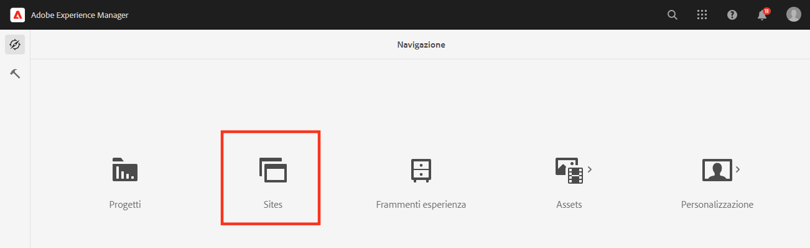
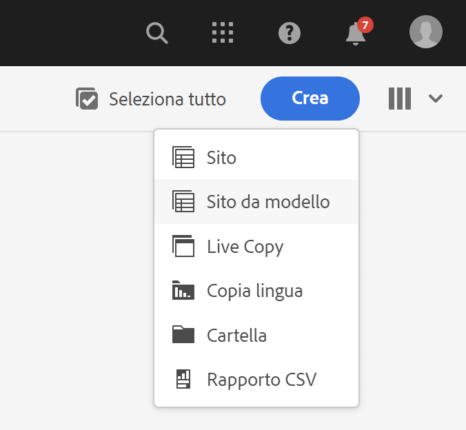
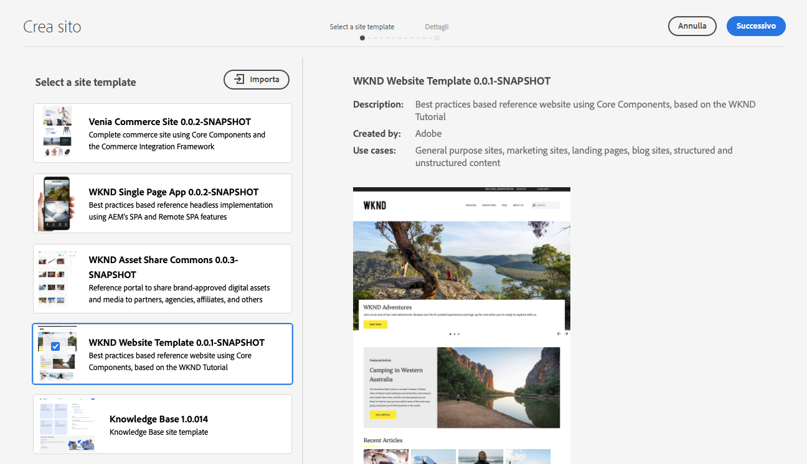
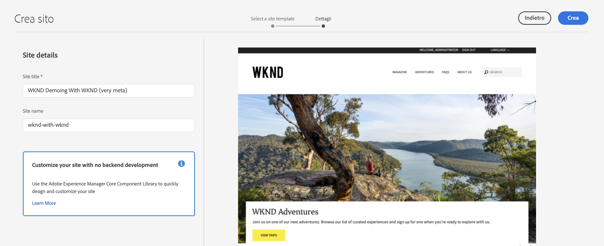
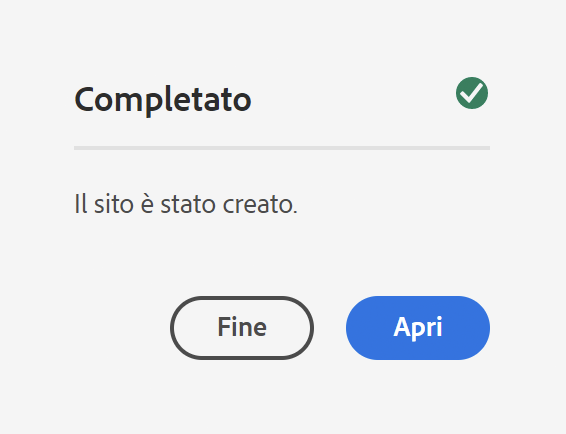
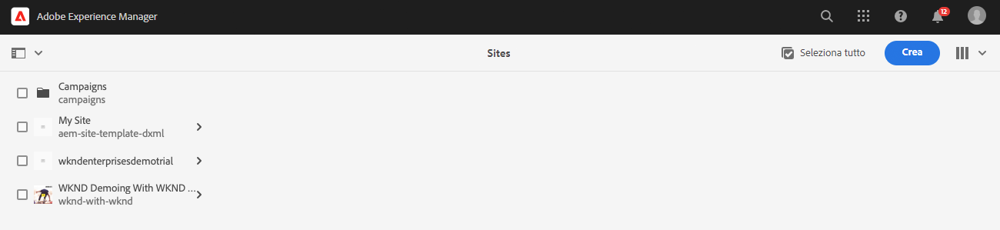
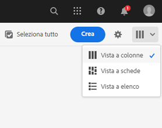
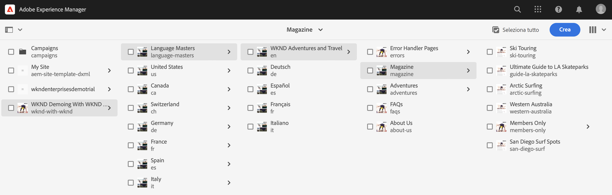
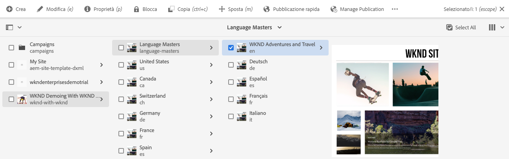
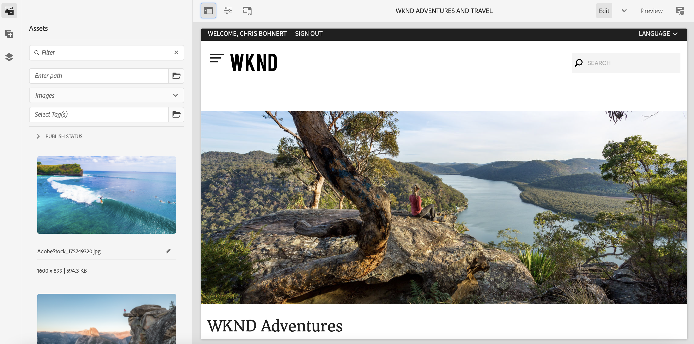

# Crea sito demo {#creating-a-site}

Crea un sito demo in AEM basato su una libreria di modelli preconfigurati.

## La storia finora {#story-so-far}

Nel precedente documento del percorso AEM Reference Demos Add-On, [Crea programma,](create-program.md) hai fatto il primo passaggio di configurazione per creare un programma a scopo di test e hai utilizzato una pipeline per distribuire il contenuto aggiuntivo. Ora dovresti:

* Scopri come utilizzare Cloud Manager per creare un nuovo programma.
* Scopri come attivare AEM Reference Demos Add-On per il nuovo programma.
* Puoi eseguire una pipeline per distribuire il contenuto aggiuntivo.

Questo articolo descrive il passaggio successivo del processo di creazione di un nuovo sito o progetto AEM Screens in AEM basato sui modelli di AEM Reference Demos Add-On.

## Obiettivo {#objective}

Questo documento spiega come creare un nuovo sito basato sui modelli di AEM Reference Demos Add-On. Dopo la lettura dovresti:

* Comprendere come accedere all’ambiente di authoring AEM.
* Conoscere come creare un sito basato su un modello.
* Comprendere le nozioni di base per navigare nella struttura del sito e modificare una pagina.

## Creare un sito demo o un progetto Screens {#create-site}

Una volta implementato AEM Reference Demos Add-On, la pipeline può accedere all’ambiente di authoring AEM per creare siti demo in base al contenuto aggiuntivo.

1. Dalla pagina di panoramica del programma in Cloud Manager, tocca o fai clic sul collegamento all’ambiente di authoring AEM.

   

1. Dal menu principale dell’AEM, tocca o fai clic su **Sites**.

   

1. Dalla console Sites, tocca o fai clic su **Crea** in alto a destra dello schermo e seleziona **Sito da modello** nel menu a discesa.

   

1. Viene avviata la procedura guidata di creazione del sito. Nella colonna a sinistra puoi vedere i modelli demo distribuiti dalla pipeline nell’istanza di authoring. Tocca o fai clic su uno per selezionarlo e visualizzare i dettagli nella colonna a destra. Se desideri testare AEM Screens, assicurati di scegliere il **modello del sito We.Cafe**. Tocca o fai clic su **Avanti**.

   

1. Nella schermata successiva, specifica un titolo per il sito o il progetto Screens. Se omesso, puoi specificare un nome per il sito o generarlo dal titolo. Tocca o fai clic su **Crea**.

   * Il titolo del sito viene visualizzato nella barra del titolo del browser.
   * Il nome del sito diventa parte dell’URL.
   * Il nome del sito deve rispettare le convenzioni AEM di denominazione delle pagine, i cui dettagli sono disponibili nella sezione [Risorse aggiuntive](#additional-resources).

   

1. La creazione del sito viene confermata con una finestra di dialogo. Tocca o fai clic su **Fine**.

   

Ora hai creato il tuo sito demo!

## Usare il sito demo {#use-site}

Una volta creato il sito demo, puoi navigarlo e utilizzarlo come qualsiasi altro sito in AEM.

1. Il sito viene ora visualizzato nella console Sites.

   

1. Nell’angolo in alto a destra dello schermo, accertati che la visualizzazione della console sia impostata su **Vista a colonne**.

   

1. Tocca o fai clic sul sito per esplorarne la struttura e il contenuto. La vista a colonne si espande continuamente durante la navigazione nella struttura del contenuto del sito demo.

   

1. Tocca o fai clic su una pagina per selezionarla, quindi tocca o fai clic su **Modifica** nella barra degli strumenti.

   

1. Puoi modificare la pagina come qualsiasi altra pagina di contenuto AEM, ad esempio aggiungendo o modificando componenti o risorse, e testando la funzionalità di AEM.

   

Congratulazioni! Ora puoi esplorare ulteriormente il contenuto del sito demo e scoprire tutto quello che AEM può offrirti attraverso il contenuto delle best practice di Reference Demos Add-On.

Crea siti aggiuntivi basati su altri modelli per esplorare diverse funzionalità AEM.

## Novità {#what-is-next}

Adesso che hai completato questa parte del percorso di AEM Reference Demo Add-On, dovresti:

* Comprendere come accedere all’ambiente di authoring AEM.
* Conoscere come creare un sito basato su un modello.
* Comprendere le nozioni di base per navigare nella struttura del sito e modificare una pagina.

Puoi testare le funzioni di AEM utilizzando il contenuto aggiuntivo. Sono disponibili due opzioni per continuare il percorso:

* Se desideri una demo per testare completamente il contenuto di AEM Screens, assicurati di aver implementato un sito basato su **Modello del sito We.Cafe** come descritto in precedenza e continua tramite [Abilita AEM Screens per il tuo sito dimostrativo.](screens.md)
* Se utilizzi solo contenuti demo di Sites, continua con [Gestire i siti demo,](manage.md) dove scopri gli strumenti disponibili per aiutarti a gestire i siti demo e come rimuoverli.

## Risorse aggiuntive {#additional-resources}

* [Documentazione di Cloud Manager](https://experienceleague.adobe.com/docs/experience-manager-cloud-service/onboarding/onboarding-concepts/cloud-manager-introduction.html?lang=it): per ulteriori informazioni sulle funzioni di Cloud Manager, consulta direttamente i documenti tecnici dettagliati.
* [Crea sito](/help/sites-cloud/administering/site-creation/create-site.md) - scopri come utilizzare AEM per creare un sito utilizzando i modelli per definirne lo stile e la struttura.
* [Convenzioni AEM di denominazione delle pagine](/help/sites-cloud/authoring/fundamentals/organizing-pages.md#page-name-restrictions-and-best-practices). - Per informazioni sulle convenzioni per l’organizzazione delle pagine AEM, consulta questa pagina.
* [Operazioni di base in AEM](/help/sites-cloud/authoring/getting-started/basic-handling.md): se non hai ancora familiarità con AEM, esplora questo documento per comprendere i concetti di base, come la navigazione e l’organizzazione della console.
