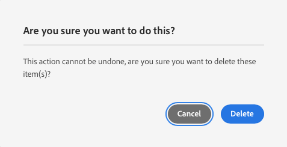

# Gestire siti demo {#manage-demo-sites}

Scopri gli strumenti disponibili per aiutarti a gestire i siti demo e come rimuoverli.

## La storia finora {#story-so-far}

Nel documento precedente del percorso del componente aggiuntivo Demo di riferimento AEM, [Crea sito,](create-site.md) hai creato un nuovo sito demo basato sui modelli del componente aggiuntivo Demo di riferimento. Ora dovresti:

* Comprendere come accedere all’ambiente di authoring AEM.
* Conoscere come creare un sito basato su un modello.
* Comprendere le nozioni di base per navigare nella struttura del sito e modificare una pagina.

Se hai anche [abilitato AEM Screens per il sito demo,](screens.md) dovresti anche:

* Conoscere le nozioni di base di AEM Screens.
* Comprendere il contenuto demo di We.Cafe.
* Sapere come configurare AEM Screens per We.Cafe.

Ora che hai il sito demo da esplorare, questo articolo descrive gli strumenti disponibili per aiutarti a gestire i tuoi siti demo e a rimuoverli.

## Obiettivo {#objective}

Questo documento illustra come gestire i siti demo creati. Dopo la lettura dovresti:

* Scopri come accedere alle utilità demo self-service.
* Scopri quali utilità sono disponibili.
* Come eliminare un sito o un modello demo esistente.

## Accesso alle utilità demo self-service {#accessing-utilities}

Ora che hai dei siti dimostrativi, probabilmente vorrai sapere come gestirli. La pipeline non solo ha implementato i modelli di sito per fornire il contenuto dei siti demo, ma ha anche implementato un set di utilità per gestirli.

1. Dalla barra di navigazione globale AEM, seleziona **Strumenti** -> **Demo di riferimento** -> **Utilità demo di riferimento**.

   

1. Utilità demo di riferimento è una raccolta di utili funzionalità per la configurazione e il monitoraggio dell’ambiente Adobe Experience Manager. La visualizzazione iniziale è la **Dashboard**, che funge da controllo dello stato dell’ambiente e della relativa funzionalità demo.

   

Utilità demo self-service fornisce una serie di strumenti.

* **Elimina siti**: seleziona il sito da eliminare in questa istanza di Adobe Experience Manager. Tieni presente che si tratta di un’azione distruttiva e non può essere annullata una volta avviata.
* **Elimina modelli di sito**: seleziona il modello di sito da eliminare in questa istanza di Adobe Experience Manager. Prima di eliminare un modello di sito, assicurati che vengano eliminati anche tutti i siti che fanno riferimento al modello. Tieni presente che si tratta di un’azione distruttiva e non può essere annullata una volta avviata.
* **Cache Prime Author**: in questo modo verranno recuperate diverse risorse all’interno dell’istanza di Adobe Experience Manager, velocizzando i tempi di recupero. Potrebbero volerci diversi secondi.
* **App Android**: strumenti per l’installazione e l’avvio della dimostrazione dell’app Android. Crea un sito basato su **App a pagina singola WKND** per compilare questa pagina. Utilizza da un dispositivo Android, un emulatore o bluestack.
* **Preferenze utente**: disattivare le finestre di dialogo a comparsa dei tutorial.
* **Configurazione GraphQL**: configurazione rapida dell’endpoint GraphQL globale.

## Eliminazione di siti e modelli demo {#deleting}

Dopo aver testato un set di funzionalità AEM, potrebbe non essere più necessario il sito demo o persino il modello su cui si basa. È facile eliminare sia i siti demo che i modelli di sito.

1. Accedi a **Utilità Demo di riferimento** e tocca o fai clic su **Elimina siti**.

   

1. I siti disponibili sono presentati in un elenco. Controlla il sito o i siti che desideri eliminare, quindi tocca o fai clic su **Elimina**.

   >[!CAUTION]
   >
   >L’eliminazione di siti e modelli è un’azione distruttiva e non può essere annullata una volta avviata.

1. Conferma l’eliminazione del sito nella finestra di dialogo.

   

1. AEM elimina il sito o i siti selezionati e mostra l’avanzamento dell’operazione nel punto in cui si trovava il pulsante **Elimina**.

   

Il sito ora è eliminato.

Nello stesso modo è possibile eliminare i modelli sotto l’intestazione **Elimina modelli di sito** in **Utilità Demo di riferimento**.

>[!CAUTION]
>
>Prima di eliminare un modello di sito, assicurati che vengano eliminati anche tutti i siti che fanno riferimento al modello.

## Fine del percorso? {#end-of-journey}

Congratulazioni! Hai completato il percorso del componente aggiuntivo Demo di riferimento AEM. Ora dovresti:

* Scopri le nozioni di base di Cloud Manager e come le pipeline distribuiscono contenuti e configurazioni da AEM.
* Scopri come utilizzare Cloud Manager per creare un nuovo programma.
* Scopri come attivare il componente aggiuntivo Demo di riferimento per il nuovo programma e come eseguire una pipeline per distribuirne il contenuto.
* Scopri come accedere all’ambiente di authoring AEM per creare un sito basato su un modello.
* Scopri come accedere alle utilità demo self-service.
* Scopri come eliminare un sito o un modello demo esistente.

Ora puoi esplorare le funzionalità di AEM utilizzando i tuoi siti demo. Tuttavia AEM è uno strumento potente e ci sono molte opzioni aggiuntive disponibili. Consulta alcune delle risorse aggiuntive disponibili nella [sezione Risorse aggiuntive](#additional-resources) per ulteriori informazioni sulle funzioni visualizzate in questo percorso.

## Risorse aggiuntive {#additional-resources}

* [Documentazione di Cloud Manager](https://experienceleague.adobe.com/docs/experience-manager-cloud-service/onboarding/onboarding-concepts/cloud-manager-introduction.html?lang=it): per ulteriori informazioni sulle funzioni di Cloud Manager, consulta direttamente i documenti tecnici dettagliati.
* [Crea sito](/help/sites-cloud/administering/site-creation/create-site.md) - scopri come utilizzare AEM per creare un sito utilizzando i modelli per definirne lo stile e la struttura.
* [Convenzioni AEM di denominazione delle pagine](/help/sites-cloud/authoring/fundamentals/organizing-pages.md#page-name-restrictions-and-best-practices). - Consulta questa pagina per comprendere le convenzioni per l’organizzazione delle pagine AEM.
* [Operazioni di base in AEM](/help/sites-cloud/authoring/getting-started/basic-handling.md): esplora questo documento se hai poca esperienza con AEM per comprendere i concetti di base, come la navigazione e l’organizzazione della console.
* [Documentazione tecnica AEM as a Cloud Service](https://experienceleague.adobe.com/docs/experience-manager-cloud-service.html?lang=it): se hai già una conoscenza approfondita di AEM, potresti voler consultare i documenti tecnici approfonditi.
* [Modelli del sito](/help/sites-cloud/administering/site-creation/site-templates.md): per ulteriori informazioni sulla struttura dei modelli del sito e sulla relativa modalità di creazione, consulta questo documento.
