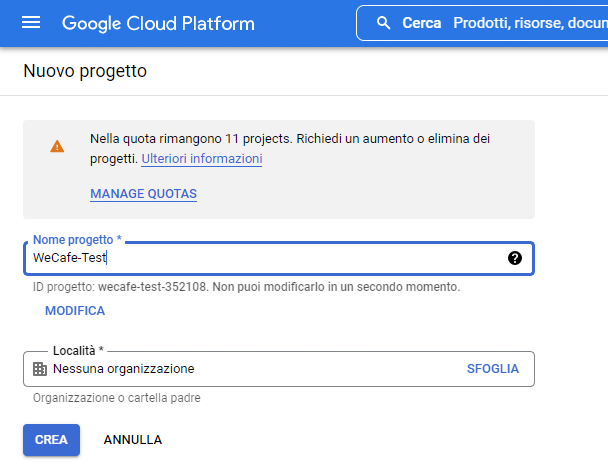
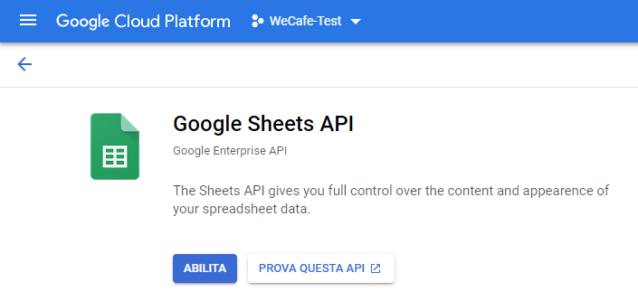
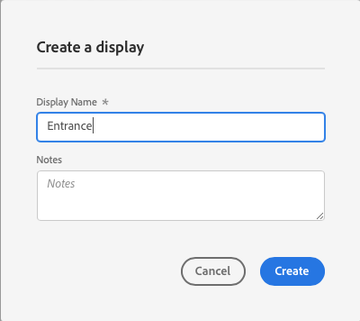

# Abilitare AEM Screens per il tuo sito demo {#enable-screens}

Scopri i passaggi per abilitare l’esperienza completa di AEM Screens as a Cloud Service sul tuo sito demo.

>[!NOTE]
>
>AEM Screens Demo richiede l’aggiunta del componente aggiuntivo Screens al programma Cloud Manager. Scopri [qui](https://experienceleague.adobe.com/docs/experience-manager-cloud-service/content/screens-as-cloud-service/onboarding-screens-cloud/adding-screens-addon/add-on-new-program-screens-cloud.html?lang=it) come aggiungerlo.

## Percorso affrontato finora {#story-so-far}

Nel documento precedente del percorso del componente aggiuntivo Demo di riferimento AEM, [Crea sito demo,](create-site.md) hai creato un sito demo basato sui modelli del componente aggiuntivo Demo di riferimento. Ora dovresti:

* Comprendere come accedere all’ambiente di authoring AEM.
* Conoscere come creare un sito basato su un modello.
* Comprendere le nozioni di base per navigare nella struttura del sito e modificare una pagina.

Adesso che disponi di un sito demo per esplorare e comprendere gli strumenti per aiutarti a gestirlo, abilita l’esperienza completa di AEM Screens as a Cloud Service per i siti demo.

## Obiettivo {#objective}

Il componente aggiuntivo Demo di riferimento AEM contiene i contenuti AEM Screens per We.Cafe, una caffetteria verticale. Questo documento spiega come eseguire la configurazione demo di We.Cafe nel contesto di AEM Screens. Dopo la lettura dovresti:

* Conoscere le nozioni di base di AEM Screens.
* Comprendere il contenuto demo di We.Cafe.
* Sapere come configurare AEM Screens per We.Cafe.
   * Conoscere come creare un progetto Screens per We.Cafe.
   * Essere in grado di configurare un servizio meteo simulato utilizzando i fogli e gli API di Google.
   * Simulare la modifica dinamica del contenuto di Screens in base al “servizio meteo“.
   * Installare e utilizzare il lettore Screens.

## Comprendere Screens {#understand-screens}

AEM Screens as a Cloud Service è una soluzione di segnaletica digitale che consente ai professionisti del marketing di creare e gestire esperienze digitali dinamiche su larga scala. Con AEM Screens as a Cloud Service, puoi creare esperienze di segnaletica digitale coinvolgenti e dinamiche destinate a essere utilizzate negli spazi pubblici.

>[!TIP]
>
>Per informazioni complete su AEM Screens as a Cloud Service, consulta la sezione [Risorse aggiuntive](#additional-resources) alla fine del presente documento.

Installando il componente aggiuntivo Demo di riferimento AEM, il contenuto We.Cafe per AEM Screens sarà disponibile automaticamente nell’ambiente di authoring demo. I passaggi descritti in [Distribuzione di un progetto Screens demo](#deploy-project) ti aiutano ad abilitare l’esperienza AEM Screens completa pubblicando tale contenuto e distribuendolo ai lettori multimediali e così via.

## Comprendere il contenuto della demo {#demo-content}

La caffetteria We.Cafe è composta da tre negozi che si trovano in tre sedi negli Stati Uniti. I tre negozi hanno tre esperienze simili:

* Una bacheca del menu sopra il bancone con due o tre pannelli verticali
* Un espositore all’ingresso rivolto verso la strada con un pannello orizzontale o verticale che invita i clienti a entrare nel negozio
* Una postazione chiosco per ordinazioni fai da te rapide per evitare la coda con un tablet verticale

>[!NOTE]
>
>Nella versione corrente della demo può essere testato solamente l’espositore all’ingresso. Gli altri espositori lo saranno in una versione futura.
>
>Nella versione corrente della demo il chiosco non è incluso. Sarà incluso in una versione futura.

Si suppone che la sede di New York sia in un negozio più piccolo che non ha molto spazio a disposizione, e come tale:

* La bacheca del menu ha solo due pannelli verticali invece di tre come per San Francisco e San Jose
* L’espositore all’ingresso è posizionato verticalmente anziché orizzontalmente

>[!NOTE]
>
>Se decidi di connetterti a Screens Cloud Service nella sezione [Connessione a Screens as a Cloud Service](#connect-screens), crea le sedi come cartelle in visualizzazioni. Per ulteriori informazioni sulle visualizzazioni, consulta la sezione [Risorse aggiuntive](#additional-resources) alla fine del presente documento.

### Layout delle caffetterie {#care-layouts}

Le sedi di We.Cafe hanno i seguenti layout.


>[!NOTE]
>
>Le misurazioni delle schermate sono in pollici.

### Ingresso {#entrance}

L’ingresso è suddiviso in base al giorno e la prima immagine verrà cambiata dal mattino al pomeriggio. Su ogni passaggio della sequenza, verrà pubblicizzata anche una preparazione speciale del caffè diversa, utilizzando una sequenza incorporata controllata per riprodurre un elemento diverso ogni volta.

Anche sull’ultima immagine dei canali di ingresso viene eseguito il targeting (cioè viene modificata dinamicamente) in base alla temperatura esterna, che può essere simulata nel modo descritto nella sezione [Creare origine dati simulata](#data-source).

## Distribuire un progetto Screens demo {#deploy-project}

Per utilizzare il contenuto demo nella sandbox che hai creato nel passaggio [Creare programma](create-program.md), è necessario creare un sito sulla base di un modello.

Se non hai già creato un sito demo We.Cafe, segui semplicemente gli stessi passaggi della sezione [Crea un sito demo](create-site.md). Quando selezioni il modello, scegli semplicemente il **Modello del sito web We.Cafe**.


Al termine della procedura guidata, troverai il contenuto distribuito in Sites e potrai navigare ed esplorare come per qualsiasi altro contenuto.


Ora che disponi di contenuti dimostrativi We.Cafe, puoi scegliere come testare AEM Screens:

* Per esplorare solo i contenuti della console AEM Sites, è sufficiente iniziare a esplorare e scoprire di più nella sezione [Risorse aggiuntive](#additional-resources) non è richiesta alcuna ulteriore azione.
* Se desideri utilizzare le funzioni dinamiche complete di AEM Screens, continua con la sezione successiva, [Modifica dinamica del contenuto di Screens.](#dynamically-change)

## Modifica dinamica del contenuto di Screens {#dynamically-change}

Proprio come AEM Sites, AEM Screens può modificare i contenuti in modo dinamico in base al contesto. La demo We.Cafe ha canali configurati per mostrare contenuti diversi a seconda della temperatura corrente. Per simulare questa esperienza, crea un semplice servizio meteo.

### Creare origine dati simulata {#data-source}

Dato che è molto difficile modificare il meteo durante una demo o durante la prova, i cambiamenti di temperatura devono essere simulati. Un servizio meteo viene simulato memorizzando un valore di temperatura in un foglio di calcolo di Google Sheet, che AEM ContextHub chiama per recuperare la temperatura.

#### Creare chiave API Google {#create-api-key}

Innanzitutto, crea una chiave API Google per facilitare lo scambio di dati.

1. Accedi a un account Google.
1. Apri la Console Cloud con questo collegamento `https://console.cloud.google.com`.
1. Crea un nuovo progetto facendo clic sul nome del progetto corrente in alto a sinistra nella barra degli strumenti, dopo l’etichetta **Piattaforma Google Cloud**.

   

1. Nella finestra di dialogo del selettore del progetto, fai clic su **NUOVO PROGETTO**.

   

1. Assegna un nome al progetto e fai clic su **CREA**.

   

1. Accertati che il nuovo progetto sia selezionato, quindi seleziona **API e servizi** dal menu hamburger della dashboard della Console Cloud.

   

1. Nel pannello a sinistra della finestra API e servizi, fai clic su **Credenziali** nella parte superiore della finestra, quindi fai clic su **CREA CREDENZIALI** e **Chiave API**.

   

1. Nella finestra di dialogo, copia la nuova chiave API e salvala per un utilizzo successivo. Fai clic su **CHIUDI** in modo da poter uscire dalla finestra di dialogo.

#### Abilita API Fogli Google {#enable-sheets}

Per consentire lo scambio dei dati di Fogli Google utilizzando la chiave API, abilita l’API Fogli Google.

1. Torna alla console Google Cloud all’indirizzo `https://console.cloud.google.com` per il progetto, quindi utilizza il menu hamburger per selezionare **API e servizi -> Libreria**.

   

1. Nella schermata Libreria API, scorri per trovare la ricerca **API Fogli Google**, quindi selezionala.

   

1. Nella finestra **API Google Sheets**, fai clic su **ABILITA**.

   

#### Creare un foglio di calcolo Google {#create-spreadsheet}

Ora puoi creare un foglio di calcolo Google Sheets per memorizzare i dati meteo.

1. Passa a `https://docs.google.com` e crea un nuovo foglio di calcolo di Fogli Google.
1. Definisci la temperatura immettendo `32` nella cella A2.
1. Condividi il documento facendo clic su **Condividi** in alto a destra nella finestra e da **Ottieni collegamento** fai clic su **Modifica**.

   

1. Copia il collegamento per il passaggio successivo.

   

1. Individua l’ID del foglio.

   * L’ID foglio è la stringa casuale di caratteri nel collegamento del foglio copiato dopo `d/` e prima `/edit`.
   * Esempio:
      * Se l’URL è `https://docs.google.com/spreadsheets/d/1cNM7j1B52HgMdsjf8frCQrXpnypIb8NkJ98YcxqaEP30/edit#gid=0`
      * L’ID del foglio è `1cNM7j1B52HgMdsjf8frCQrXpnypIb8NkJ98YcxqaEP30`.

1. Copia l’ID del foglio per utilizzi futuri.

#### Verifica servizio meteo {#test-weather-service}

Dopo aver creato l’origine dati come foglio di calcolo Google Sheets e aver abilitato l’accesso tramite API, testala per assicurarti che il “servizio meteo” sia accessibile.

1. Apri un browser web.

1. Immetti la seguente richiesta, sostituendo l’ID foglio e i valori chiave API salvati in precedenza.

   ```
   https://sheets.googleapis.com/v4/spreadsheets/<yourSheetID>/values/Sheet1?key=<yourAPIKey>
   ```

1. Se ricevi dati JSON simili ai seguenti, impostali correttamente.

   ```json
   {
     "range": "Sheet1!A1:Z1000",
     "majorDimension": "ROWS",
     "values": [
       [],
       [
         "32"
       ]
     ]
   }
   ```

AEM Screens può utilizzare lo stesso servizio per accedere ai dati meteo simulati configurati nel passaggio successivo.

### Configurare ContextHub {#configure-contexthub}

AEM Screens può modificare il contenuto in modo dinamico in base al contesto. La demo We.Cafe dispone di canali configurati per mostrare contenuti diversi a seconda della temperatura corrente utilizzando ContextHub di AEM.

>[!TIP]
>
>Per informazioni complete su ContextHub, consulta la sezione [Risorse aggiuntive](#additional-resources) alla fine del documento.

Quando viene visualizzato il contenuto dello schermo, ContextHub richiama il servizio meteo per trovare la temperatura corrente per determinare quale contenuto visualizzare.

A scopo dimostrativo, i valori nel foglio possono essere modificati. ContextHub riconosce questo fatto e il contenuto viene regolato nel canale in base alla temperatura aggiornata.

1. Nell’istanza di authoring di AEMaaCS, vai a **Navigazione globale -> Strumenti -> Siti -> ContextHub**.
1. Seleziona il contenitore di configurazione con lo stesso nome assegnato al progetto quando hai creato il progetto Screens dal **modello del sito web We.Cafe**.
1. Seleziona **Configurazione -> Configurazione ContextHub -> Fogli Google** quindi fai clic su **Successivo** in alto a destra.
1. La configurazione deve avere già dati JSON preconfigurati. È necessario modificare due valori:
   1. Sostituisci `[your Google Sheets id]` con l’ID foglio che [hai salvato in precedenza](#create-spreadsheet).
   1. Sostituisci `[your Google API Key]` con la chiave API che [hai salvato in precedenza](#create-api-key).
1. Fai clic su **Salva**.

Ora è possibile modificare il valore della temperatura nel foglio di calcolo di Google Sheet e ContextHub aggiorna dinamicamente Screens in quanto “vede il cambiamento meteorologico”.

### Verifica dati dinamici {#test-dynamic}

Ora che AEM Screens e ContextHub sono connessi al servizio meteo, puoi testarlo per vedere come Screens può aggiornare i contenuti in modo dinamico.

1. Accedi all’istanza di authoring della sandbox.
1. Passa alla console Sites tramite **Navigazione globale -> Sites** e seleziona la pagina seguente **Screens -> &lt;nome progetto> -> Canali -> Ingresso Mattina (Verticale)**.

   

1. Fai clic su **Modifica** nella barra degli strumenti o digita il tasto di scelta rapida `e` in modo da poter modificare la pagina.

1. Nell’editor, puoi visualizzare il contenuto. Un’immagine è evidenziata in blu con un’icona di targeting nell’angolo.

   

1. Modifica la temperatura immessa nel foglio di calcolo da 32 a 70 e osserva come cambia il contenuto.

   

In base alla variazione della temperatura da 0°C (32°F) a 21°C (70°F), l’immagine in primo piano cambia da una tazza di tè calda a un caffè freddo.

>[!IMPORTANT]
>
>Utilizza solo la soluzione Google Sheets descritta a scopo dimostrativo. Adobe non supporta l’utilizzo di Google Sheets per ambienti di produzione.

## Connetti Screens as a Cloud Service {#connect-screens}

Se desideri anche configurare un’esperienza di segnaletica digitale reale, incluso un lettore che viene eseguito su un dispositivo di segnaletica digitale o sul computer, segui i passaggi successivi.

In alternativa, è possibile visualizzare in anteprima la demo semplicemente nell’Editor canali su AEMaaCS.

>[!TIP]
>
>Per informazioni dettagliate sull’editor canali, consulta la sezione [Risorse aggiuntive](#additional-resources) alla fine del documento.

### Configurare AEM Screens as a Cloud Service {#configure-screens}

Innanzitutto è necessario pubblicare il contenuto demo di Screens in AEM Screens as a Cloud Service e configurare il servizio.

1. Pubblica il contenuto del progetto Screens demo.
1. Passa a Screens as a Cloud Service in `https://experience.adobe.com/screens` e accedi.
1. Controlla in alto a destra nella schermata di trovarti nell’organizzazione corretta.

   

1. Nell’angolo in alto a sinistra fai clic sull’icona a forma di ingranaggio **Modifica impostazioni**.

   

1. Fornisci gli URL delle istanze di authoring e pubblicazione di AEMaaCS in cui hai creato il tuo sito demo e fai clic su **Salva**.

   

1. Una volta connessi alle istanze demo, Screens estrae il contenuto del canale. Fai clic su **Canali** nel pannello a sinistra in modo da visualizzare i canali pubblicati. La compilazione delle informazioni potrebbe richiedere del tempo. Puoi fare clic sul pulsante blu **Sincronizzazione** in alto a destra dello schermo per aggiornare le informazioni.

   

1. Fai clic su **Visualizzazioni** nel pannello a sinistra. Al momento non hai ancora creato alcuna visualizzazione per la tua demo. Ciascuna località di We.Cafe verrà simulata creando la rispettiva cartella. Fai clic su **Crea** in alto a destra dello schermo e seleziona **Cartella**.

   

1. Nella finestra di dialogo, specifica un nome di cartella come **San Jose** e fai clic su **Crea**.

1. Apri la cartella facendo clic su di essa, fai clic su **Crea** in alto a destra e infine seleziona **Visualizzazione**.

1. Assegna un nome alla visualizzazione e fai clic su **Crea**.

   

1. Dopo aver creato la visualizzazione, fai clic sul nome per aprire la schermata dei dettagli della visualizzazione. È necessario assegnare alla visualizzazione un canale sincronizzato dal sito demo. Fai clic su **Assegna canale** in alto a destra dello schermo.

   

1. Nella finestra di dialogo, seleziona il canale e fai clic su **Assegna**.

   

Puoi ripetere questi passaggi per le località e le visualizzazioni aggiuntive. Dopo il completamento, hai collegato il tuo sito demo ad AEM Screens e definito la configurazione necessaria.

Puoi visualizzare l’anteprima della demo semplicemente nell’Editor canale su AEMaaCS.

### Utilizzo di Screens Player {#screens-player}

Per visualizzare il contenuto come su un vero schermo, puoi scaricare il lettore e configurarlo localmente. AEM Screens as a Cloud Service distribuisce il contenuto al lettore

#### Generare un codice di registrazione {#registration-code}

Innanzitutto, è necessario creare un codice di registrazione per collegare in modo sicuro il lettore ad AEM Screens as a Cloud Service.

1. Passa a Screens as a Cloud Service in `https://experience.adobe.com/screens` e accedi.
1. Controlla in alto a destra nella schermata di trovarti nell’organizzazione corretta.

   

1. Nel pannello a sinistra, fai clic su **Gestione lettore -> Codici di registrazione** quindi fai clic su **Crea codice** in alto a destra dello schermo.


1. Immetti un nome per il codice e fai clic su **Crea**.

   

1. Una volta creato, il codice viene visualizzato nell’elenco. Fai clic su per copiare il codice.

   

#### Installazione e configurazione lettore {#install-player}

1. Scarica il lettore idoneo per la tua piattaforma da `https://download.macromedia.com/screens/` e installalo.
1. Esegui il lettore, quindi passa alla scheda **Configurazione**.
1. Scorri verso il basso, quindi fai clic e conferma le opzioni **Ripristina impostazioni di fabbrica** e **Cambia in modalità cloud**.

   

1. Il lettore passa automaticamente alla scheda **Registrazione lettore**. Immetti il codice che hai generato in precedenza e fai clic su **Registra**.

   

1. Passa alla scheda **Informazioni di sistema** per verificare l’avvenuta registrazione del lettore.

   

#### Assegnare un lettore a un display {#assign-player}

1. Passa a Screens as a Cloud Service alla pagina `https://experience.adobe.com/screens` e accedi.
1. Controlla in alto a destra nella schermata di trovarti nell’organizzazione corretta.

   

1. Nel pannello a sinistra, fai clic su **Gestione lettore -> Lettori** per visualizzare il lettore che hai precedentemente installato e registrato.

   

1. Fai clic sul nome del lettore per aprirne i dettagli. Fai clic su **Assegna a visualizzazione** in alto a destra dello schermo.

   

1. Nella finestra di dialogo, seleziona la visualizzazione creata in precedenza e fai clic su **Seleziona**.

   

#### Riproduzione! {#playback}

Una volta che hai assegnato una visualizzazione a un lettore, AEM Screens as a Cloud Service distribuisce il contenuto al lettore affinché sia visibile.


## Novità {#what-is-next}

Adesso che hai completato questa parte del percorso del Componente aggiuntivo Demo di riferimento AEM, è necessario:

* Conoscere le nozioni di base di AEM Screens.
* Comprendere il contenuto demo di We.Cafe.
* Sapere come configurare AEM Screens per We.Cafe.

Adesso sei pronto per esplorare le funzionalità di AEM Screens utilizzando i tuoi siti demo. Prosegui alla sezione successiva del percorso, [Gestire i siti demo,](manage.md) in cui scoprirai gli strumenti disponibili per aiutarti a gestire i siti demo e come rimuoverli.

Puoi consultare alcune delle risorse aggiuntive disponibili nella [Sezione Risorse aggiuntive](#additional-resources) per ulteriori informazioni sulle funzioni visualizzate in questo percorso.

## Risorse aggiuntive {#additional-resources}

* [Documentazione di ContextHub](/help/sites-cloud/authoring/personalization/contexthub.md): scopri come ContextHub può essere utilizzato per personalizzare il contenuto in base al contesto dell’utente oltre le condizioni meteo.
* [Utilizzo delle chiavi API - Documentazione di Google](https://developers.google.com/maps/documentation/javascript/get-api-key): un riferimento utile per i dettagli sull’utilizzo delle chiavi API di Google.
* [Visualizzazioni](/help/screens-cloud/creating-content/creating-displays-screens-cloud.md): ulteriori informazioni su cosa è una visualizzazione in AEM Screens e cosa è in grado di fare.
* [Scaricare il lettore](/help/screens-cloud/managing-players-registration/installing-screens-cloud-player.md): scopri come accedere a Screens Player e come installarlo.
* [Registrare il lettore](/help/screens-cloud/managing-players-registration/registering-players-screens-cloud.md): scopri come configurare e registrare un lettore con il tuo progetto AEM Screens.
* [Assegnazione del lettore a una visualizzazione](/help/screens-cloud/managing-players-registration/assigning-player-display.md): configura un lettore per visualizzare il contenuto.
