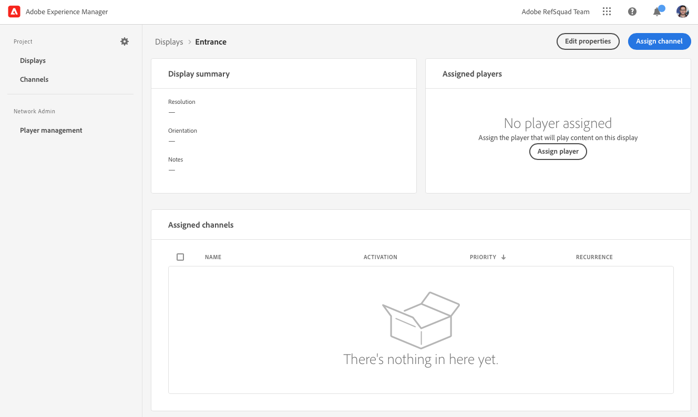

# Abilita AEM Screens per il tuo sito dimostrativo {#enable-screens}

Scopri i passaggi per abilitare l’esperienza completa AEM Screens as a Cloud Service sul tuo sito dimostrativo.

## La storia finora {#story-so-far}

Nel documento precedente del percorso aggiuntivo Demos di riferimento AEM, [Crea sito demo,](create-site.md) hai creato un nuovo sito demo basato sui modelli del componente aggiuntivo Demo di riferimento. Ora dovresti:

* Scopri come accedere all’ambiente di authoring AEM.
* Scopri come creare un sito basato su un modello.
* Scopri le nozioni di base per navigare nella struttura del sito e modificare una pagina.

Ora che disponi di un sito dimostrativo per esplorare e comprendere gli strumenti disponibili per gestire i siti demo, puoi ora abilitare l’esperienza completa as a Cloud Service di AEM Screens per i siti demo.

## Obiettivo {#objective}

Il componente aggiuntivo Demos di riferimento AEM contiene i contenuti AEM Screens per We.Cafe, un coffee shop business verticale. Questo documento spiega come eseguire la configurazione demo di We.Cafe nel contesto di AEM Screens. Dopo la lettura è necessario:

* Scopri le basi di AEM Screens.
* Comprendere il contenuto demo di We.Cafe .
* Scopri come configurare AEM Screens per We.Cafe.
   * Scopri come creare un progetto Screens per We.Cafe.
   * Puoi configurare un servizio meteo simulato utilizzando fogli Google e API.
   * Simula la modifica dinamica del contenuto di Screens in base al &quot;servizio meteo&quot;.
   * Installare e utilizzare il lettore dello schermo.

## Comprendere gli schermi {#understand-screens}

AEM Screens as a Cloud Service è una soluzione di digital signage che consente agli esperti di marketing di creare e gestire esperienze digitali dinamiche su larga scala. Con AEM Screens as a Cloud Service, puoi creare esperienze di digital signage coinvolgenti e dinamiche destinate a essere utilizzate in spazi pubblici.

>[!TIP]
>
>Per informazioni dettagliate su AEM Screens as a Cloud Service, consulta la sezione [Risorse aggiuntive](#additional-resources) alla fine del documento.

Installando il componente aggiuntivo Demos di riferimento AEM, il contenuto We.Cafe per AEM Screens è automaticamente disponibile nell’ambiente di authoring demo. I passaggi descritti in [Distribuzione di un progetto Demo Screens](#deploy-project) ti consente di abilitare l’esperienza AEM Screens completa pubblicando tali contenuti e distribuendoli ai lettori multimediali, ecc.

## Comprendere il contenuto della demo {#demo-content}

La caffetteria We.Cafe è composta da tre negozi in tre località negli Stati Uniti. I tre negozi hanno tre esperienze simili:

* Una scheda menu sopra il contatore con due o tre pannelli verticali
* Un&#39;area di ingresso affacciata sulla strada con un pannello orizzontale o verticale che invita i clienti nel negozio
* Una cabina chiosco di auto-ordine rapida per aggirare la coda con un tablet verticale

>[!NOTE]
>
>Solo il display di ingresso può essere testato nella versione corrente della demo. Altri display seguiranno in una versione futura.
>
>Il chiosco non è incluso nella versione corrente della demo. Sarà incluso in una versione futura.

La posizione di New York si presume essere in un negozio più piccolo che non ha molto spazio, e come tale:

* La scheda menu ha solo due pannelli verticali invece di tre per San Francisco e San Jose
* Il display di ingresso è posizionato verticalmente anziché orizzontalmente

>[!NOTE]
>
>Se decidi di connetterti a Screens Cloud Service nel [Connetti schermi as a Cloud Service](#connect-screens) creare le posizioni come cartelle sotto display. Consulta la sezione [Risorse aggiuntive](#additional-resources) sezione alla fine del presente documento per ulteriori informazioni sulle visualizzazioni.

### Layout caffè {#care-layouts}

Le posizioni We.Cafe hanno i seguenti layout.


>[!NOTE]
>
>Le misurazioni delle schermate sono in pollici.

### Ingresso {#entrance}

L&#39;ingresso è suddiviso in base al giorno e cambierà la prima immagine dal mattino al pomeriggio. Su ogni passaggio della sequenza pubblicizzerà anche una preparazione speciale del caffè diversa, utilizzando una sequenza incorporata misurata per riprodurre un elemento diverso ogni volta.

Anche l&#39;ultima immagine sui canali di ingresso viene mirata (cioè modificata dinamicamente) in base alla temperatura esterna, che può essere simulata come descritto nel [Crea origine dati simulata](#data-source) sezione .

## Distribuzione di un progetto Demo Screens {#deploy-project}

Per utilizzare il contenuto demo nella sandbox creata in [Crea programma](create-program.md) un sito deve essere creato in base a un modello.

Se non hai già creato un sito demo We.Cafe, segui semplicemente gli stessi passaggi di in [Crea sito demo](create-site.md) sezione . Quando selezioni il modello, scegli semplicemente la **Modello del sito web We.Cafe**.


Al termine della procedura guidata, troverai il contenuto distribuito in Sites e potrai navigare ed esplorare come qualsiasi altro contenuto.


Ora che disponi di contenuti dimostrativi We.Cafe, puoi scegliere come testare AEM Screens:

* Per esplorare solo i contenuti della console AEM Sites, è sufficiente iniziare a esplorare e scoprire di più nella [Risorse aggiuntive](#additional-resources) sezione! non è richiesta alcuna ulteriore azione.
* Se desideri utilizzare le funzioni dinamiche complete di AEM Screens, continua con la sezione successiva, [Modifica dinamica del contenuto di Screens.](#dynamically-change)

## Modifica dinamica del contenuto di Screens {#dynamically-change}

Proprio come AEM Sites, AEM Screens può modificare i contenuti in modo dinamico in base al contesto. La demo We.Cafe ha canali configurati per mostrare contenuti diversi a seconda della temperatura corrente. Per simulare questo, dovremo creare il nostro semplice servizio meteo.

### Crea origine dati simulata {#data-source}

Dato che è molto difficile cambiare il tempo durante una demo o durante la prova, i cambiamenti di temperatura devono essere simulati. Simuleremo un servizio meteo memorizzando un valore di temperatura in un foglio di calcolo di Google Sheet che AEM ContextHub chiamerà per recuperare la temperatura.

#### Creare una chiave API Google {#create-api-key}

Innanzitutto, dovremo creare una chiave API Google per facilitare lo scambio di dati.

1. Accedi a un account Google.
1. Apri la Cloud Console con questo collegamento `https://console.cloud.google.com`.
1. Crea un nuovo progetto facendo clic sul nome del progetto corrente in alto a sinistra nella barra degli strumenti, dopo la **Piattaforma Google Cloud** etichetta.

   

1. Nella finestra di dialogo del selettore del progetto, fai clic su **NUOVO PROGETTO**.

   

1. Assegna un nome al progetto e fai clic su **CREA**.

   

1. Accertati che il nuovo progetto sia selezionato, quindi seleziona dal menu hamburger del dashboard di Cloud Console , **API e servizi**.

   

1. Nel pannello a sinistra della finestra API e servizi, fai clic su **Credenziali** nella parte superiore della finestra, quindi fai clic su **CREDENZIALI** e **Chiave API**.

   

1. Nella finestra di dialogo , copia la nuova chiave API e salva per un utilizzo successivo. Fai clic su **CHIUDI** per chiudere la finestra di dialogo.

#### Abilita API dei fogli di Google {#enable-sheets}

Per consentire lo scambio di dati dei fogli Google utilizzando la chiave API, devi abilitare l’API Google Sheets.

1. Torna alla console Google Cloud all’indirizzo `https://console.cloud.google.com` per il progetto, quindi utilizzare il menu hamburger per selezionare **API e servizi -> Libreria**.

   

1. Nella schermata Libreria API , scorri per trovare la ricerca **API dei fogli di Google**. Fai clic su di esso.

   

1. In **API dei fogli di Google** clic finestra **ABILITA**.

   

#### Creare un foglio di calcolo Google {#create-spreadsheet}

Ora puoi creare un foglio di calcolo Google Sheets per memorizzare i dati meteo.

1. Vai a `https://docs.google.com` e crea un nuovo foglio di calcolo Google Sheets.
1. Definire la temperatura immettendo `32` nella cella A2.
1. Condividi il documento facendo clic su **Condividi** in alto a destra nella finestra e sotto **Ottieni collegamento** click **Modifica**.

   

1. Copia il collegamento per il passaggio successivo.

   

1. Individua l&#39;ID del foglio.

   * L&#39;ID foglio è la stringa casuale di caratteri nel collegamento foglio copiato dopo `d/` e prima `/edit`.
   * Ad esempio:
      * Se l&#39;URL è `https://docs.google.com/spreadsheets/d/1cNM7j1B52HgMdsjf8frCQrXpnypIb8NkJ98YcxqaEP30/edit#gid=0`
      * L&#39;ID del foglio è `1cNM7j1B52HgMdsjf8frCQrXpnypIb8NkJ98YcxqaEP30`.

1. Copia l&#39;ID del foglio per utilizzi futuri.

#### Test del servizio meteo {#test-weather-service}

Dopo aver creato l’origine dati come foglio di calcolo Google Sheets e aver abilitato l’accesso tramite API, testala per assicurarti che il tuo &quot;servizio meteo&quot; sia accessibile.

1. Apri un browser web.

1. Immetti la seguente richiesta, sostituendo l&#39;ID foglio e i valori chiave API salvati in precedenza.

   ```
   https://sheets.googleapis.com/v4/spreadsheets/<yourSheetID>/values/Sheet1?key=<yourAPIKey>
   ```

1. Se ricevi dati JSON simili ai seguenti, impostali correttamente.

   ```json
   {
     "range": "Sheet1!A1:Z1000",
     "majorDimension": "ROWS",
     "values": [
       [],
       [
         "32"
       ]
     ]
   }
   ```

AEM Screens può utilizzare lo stesso servizio per accedere ai dati meteo simulati. Questo verrà configurato nel passaggio successivo.

### Configurare ContextHub {#configure-contexthub}

AEM Screens può modificare il contenuto in modo dinamico in base al contesto. La demo We.Cafe dispone di canali configurati per mostrare contenuti diversi a seconda della temperatura corrente sfruttando AEM ContextHub.

>[!TIP]
>
>Per informazioni complete su ContextHub, consulta la sezione [Risorse aggiuntive](#additional-resources) alla fine del documento.

Quando viene visualizzato il contenuto dello schermo, ContextHub richiamerà il servizio meteo per trovare la temperatura corrente per determinare quale contenuto visualizzare.

A scopo dimostrativo, i valori nel foglio possono essere modificati. ContextHub lo riconoscerà e il contenuto verrà regolato nel canale in base alla temperatura aggiornata.

1. Nell’istanza di authoring di AEMaaCS, vai a **Navigazione globale -> Strumenti -> Siti -> ContextHub**.
1. Seleziona il contenitore di configurazione con lo stesso nome assegnato al progetto quando hai creato il progetto Screens dal **Modello del sito web We.Cafe**.
1. Seleziona **Configurazione -> Configurazione ContextHub -> Fogli Google** quindi fai clic su **Successivo** in alto a destra.
1. La configurazione deve avere già dati JSON preconfigurati. È necessario modificare due valori:
   1. Sostituisci `[your Google Sheets id]` con l&#39;ID foglio [hai salvato in precedenza.](#create-spreadsheet)
   1. Sostituisci `[your Google API Key]` con la chiave API [hai salvato in precedenza.](#create-api-key)
1. Fai clic su **Salva**.

Ora è possibile modificare il valore della temperatura nel foglio di calcolo di Google Sheet e ContextHub aggiornerà dinamicamente Screens in quanto &quot;vede il cambiamento del tempo&quot;.

### Verifica dati dinamici {#test-dynamic}

Ora che AEM Screens e ContextHub sono connessi al servizio meteo, puoi testarlo per vedere come gli schermi possono aggiornare i contenuti in modo dinamico.

1. Accedi all’istanza di authoring della sandbox.
1. Passa alla console Sites tramite **Navigazione globale -> Sites** e seleziona la pagina seguente **Schermi -> &lt;project-name> -> Canali -> Ingresso Mattina (Verticale)**.

   

1. Fare clic su Modifica nella barra degli strumenti o digitare il tasto di scelta rapida `e` per modificare la pagina.

1. Nell’editor, puoi visualizzare il contenuto. Tieni presente che un’immagine è evidenziata in blu con un’icona di targeting nell’angolo.

   

1. Modifica la temperatura immessa nel foglio di calcolo da 32 a 70 e osserva come cambia il contenuto.

   

In base alla temperatura che cambia da un congelatore 32°F (0°C) a un confortevole 70°F (21°C), l&#39;immagine in evidenza cambia da una tazza di tè calda a un caffè freddo.

>[!IMPORTANT]
>
>Utilizza solo la soluzione Google Sheets descritta a scopo dimostrativo. Adobe non supporta l’utilizzo di Google Sheets per ambienti di produzione.

## Connetti schermi as a Cloud Service {#connect-screens}

Se desideri anche configurare un&#39;esperienza di digital signage reale, incluso un lettore che viene eseguito su un dispositivo di digital signage o sul computer, segui i passaggi successivi.

In alternativa, è possibile visualizzare in anteprima la demo semplicemente nell’Editor canali su AEMaaCS.

>[!TIP]
>
>Per informazioni dettagliate sull&#39;editor canali, consulta la sezione [Risorse aggiuntive](#additional-resources) alla fine del documento.

### Configurare AEM Screens as a Cloud Service {#configure-screens}

Innanzitutto devi pubblicare il contenuto demo di Screens in AEM Screens as a Cloud Service e configurare il servizio.

1. Pubblica il contenuto del progetto delle schermate demo.
1. Passa a Screens as a Cloud Service in `https://experience.adobe.com/screens` e accedi.
1. In alto a destra nella schermata , accertati di essere nell’organizzazione corretta.

   

1. In alto a sinistra, fai clic sul pulsante **Modifica impostazioni** a forma di ingranaggio.

   

1. Fornisci gli URL delle istanze di authoring e pubblicazione di AEMaaCS in cui hai creato il tuo sito demo e fai clic su **Salva**.

   

1. Una volta connessi alle istanze demo, Screens estrae il contenuto del canale. Fai clic su **Canali** nel pannello a sinistra per visualizzare i canali pubblicati. Potrebbe essere necessario un momento per la compilazione delle informazioni. Puoi fare clic su blu **Sincronizzazione** in alto a destra dello schermo per aggiornare le informazioni.

   

1. Fai clic su **Display** nel pannello a sinistra. Non hai ancora creato nessuna per la tua demo. Simuleremo le posizioni di We.Cafe creando cartelle per ognuna di esse. Fai clic su **Crea** in alto a destra dello schermo e seleziona **Cartella**.

   

1. Nella finestra di dialogo, specifica un nome di cartella come **San Jose** e fai clic su **Crea**.

1. Apri la cartella facendo clic su di essa e quindi fai clic su **Crea** in alto a destra e seleziona **Visualizzazione**.

1. Specifica un nome visualizzato e fai clic su **Crea**.

   

1. Una volta creato il canale, fai clic su di esso per visualizzare i dettagli. Al display deve essere assegnato un canale sincronizzato dal sito demo. Fai clic su **Assegna canale** in alto a destra dello schermo.

   

1. Nella finestra di dialogo, seleziona il canale e fai clic su **Assegna**.

   

Puoi ripetere questi passaggi per le posizioni e le visualizzazioni aggiuntive. Una volta completato, hai collegato il tuo sito demo ad AEM Screens e hai completato la configurazione necessaria.

Puoi visualizzare l’anteprima della demo semplicemente nell’Editor canali su AEMaaCS.

### Utilizzo di Screens Player {#screens-player}

Per visualizzare il contenuto come su una schermata effettiva, puoi scaricare il lettore e configurarlo localmente. AEM Screens as a Cloud Service consegnerà quindi il contenuto al lettore

#### Genera un codice di registrazione {#registration-code}

Innanzitutto, devi creare un codice di registrazione per collegare in modo sicuro un lettore ad AEM Screens as a Cloud Service.

1. Passa a Screens as a Cloud Service in `https://experience.adobe.com/screens` e accedi.
1. In alto a destra nella schermata , accertati di essere nell’organizzazione corretta.

   

1. Nel pannello a sinistra, fai clic su **Gestione lettore -> Codici di registrazione** quindi fai clic su **Crea codice** in alto a destra dello schermo.


1. Immetti un nome per il codice e fai clic su **Crea**.

   

1. Una volta creato, il codice viene visualizzato nell’elenco. Fai clic su per copiare il codice.

   

#### Installazione e configurazione del lettore {#install-player}

1. Scarica il lettore per la piattaforma da `https://download.macromedia.com/screens/` e installalo.
1. Esegui il lettore e passa al **Configurazione** , scorri verso il basso per fare clic su e confermare entrambi **Reimposta su fabbrica** e poi **Cambia in modalità cloud**.

   

1. Il lettore passa automaticamente al **Registrazione lettore** scheda . Immetti il codice generato in precedenza e fai clic su **Registro**.

   

1. Passa alla **Informazioni di sistema** per confermare che il lettore è stato registrato.

   

#### Assegnare il lettore a un display {#assign-player}

1. Passa a Screens as a Cloud Service in `https://experience.adobe.com/screens` e accedi.
1. In alto a destra nella schermata , accertati di essere nell’organizzazione corretta.

   

1. Nel pannello a sinistra, fai clic su **Gestione lettore -> Lettori** e vedrai il lettore installato e registrato in precedenza.

   

1. Fai clic sul nome del lettore per aprirne i dettagli, quindi fai clic su **Assegna a visualizzazione** in alto a destra dello schermo.

   

1. Nella finestra di dialogo, seleziona la visualizzazione creata in precedenza e fai clic su **Seleziona**.

   

#### Riproduzione! {#playback}

Dopo aver assegnato una visualizzazione a un lettore, AEM Screens as a Cloud Service distribuisce il contenuto al lettore dove è visibile.


## Novità {#what-is-next}

Ora che hai completato questa parte del percorso aggiuntivo Demo di riferimento AEM , devi:

* Scopri le basi di AEM Screens.
* Comprendere il contenuto demo di We.Cafe .
* Scopri come configurare AEM Screens per We.Cafe.

Ora puoi esplorare le funzionalità di AEM Screens utilizzando i tuoi siti dimostrativi. Procedi alla sezione successiva del percorso, [Gestire i siti demo,](manage.md) informazioni sugli strumenti disponibili per gestire i siti demo e su come rimuoverli.

Puoi anche estrarre alcune delle risorse aggiuntive disponibili nella [Sezione Risorse aggiuntive](#additional-resources) per ulteriori informazioni sulle funzioni visualizzate in questo percorso.

## Risorse aggiuntive {#additional-resources}

* [Documentazione di ContextHub](/help/sites-cloud/authoring/personalization/contexthub.md) - Scopri come ContextHub può essere utilizzato per personalizzare i contenuti in base al contesto dell’utente oltre le condizioni meteo.
* [Utilizzo delle chiavi API - Documentazione di Google](https://developers.google.com/maps/documentation/javascript/get-api-key) - Riferimento utile per i dettagli sull’utilizzo delle chiavi API di Google.
* [Display](/help/screens-cloud/creating-content/creating-displays-screens-cloud.md) - Ulteriori informazioni su cosa è una visualizzazione in AEM Screens e cosa può fare.
* [Scarica lettore](/help/screens-cloud/managing-players-registration/installing-screens-cloud-player.md) - Scopri come accedere a Screens Player e come installarlo.
* [Registrare il lettore](/help/screens-cloud/managing-players-registration/registering-players-screens-cloud.md) - Scopri come configurare e registrare un lettore con il tuo progetto AEM Screens.
* [Assegnazione del lettore a un display](/help/screens-cloud/managing-players-registration/assigning-player-display.md) - Configura un lettore per visualizzare il contenuto.
