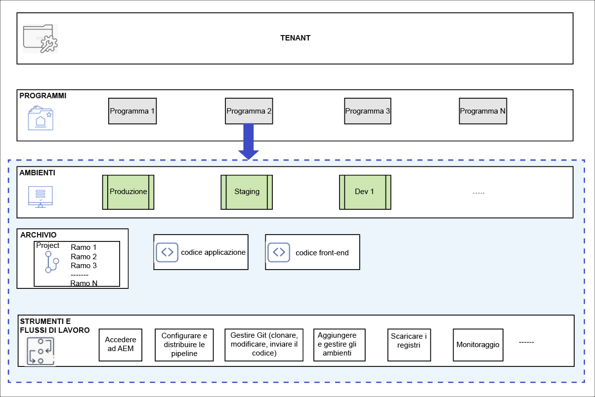
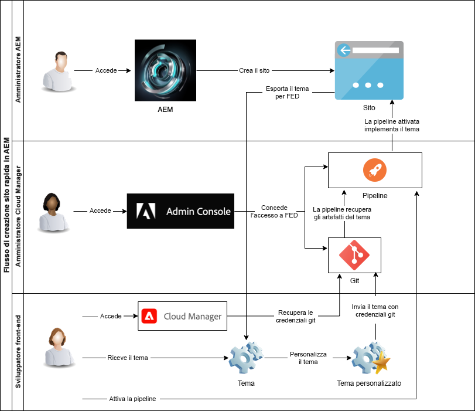

# Comprendere Cloud Manager e il flusso di lavoro per la Creazione Rapida dei Siti {#understand-cloud-manager}

{{traditional-aem}}

Scopri Cloud Manager e come assicura il nuovo processo di Creazione Rapida dei Siti.

>[!TIP]
>
>Se il tuo ruolo è esclusivamente sviluppo front-end, puoi passare all’articolo [Recuperare le informazioni di accesso all’archivio Git](retrieve-access.md) in questo percorso.
>
>Se sei un amministratore AEM, un amministratore di Cloud Manager, sei responsabile sia delle attività di sviluppo front-end che di quelle di amministrazione, oppure desideri semplicemente comprendere il processo end-to-end in AEM per lo sviluppo front-end, continua a leggere questo documento e continua su questo percorso.

## Obiettivo {#objective}

Questo documento consente di comprendere il funzionamento dello strumento di Creazione Rapida dei Siti in AEM e offre una panoramica del flusso end-to-end. Dopo la lettura dovresti:

* Scopri in che modo AEM Sites e Cloud Manager collaborano per facilitare lo sviluppo front-end
* Scopri come il passaggio di personalizzazione front-end è completamente scollegato da AEM e non richiede alcuna conoscenza di AEM.

Questo documento si concentra sulla comprensione di questi elementi fondamentali della soluzione di Creazione Rapida dei Siti prima di procedere al passaggio successivo del percorso in cui inizierai la configurazione.

Sebbene sia raccomandabile procedere passo dopo passo in questo percorso, se già conosci il funzionamento in collaborazione tra AEM Sites e Cloud Manager e desideri iniziare direttamente dalla configurazione, puoi [saltare al prossimo passaggio del percorso](create-site.md).

## Ruolo responsabile {#responsible-role}

Questa parte del percorso si applica sia all’amministratore di AEM che all’amministratore di Cloud Manager.

## Requisiti e prerequisiti {#requirements-prerequisites}

Devono essere soddisfatti diversi requisiti prima di iniziare a creare e personalizzare siti utilizzando lo strumento Creazione Rapida dei Siti.

Poiché questo percorso è destinato sia agli sviluppatori front-end che agli amministratori e alle combinazioni di tutti i ruoli, i requisiti per entrambi sono elencati qui.

È importante comprendere che per lo sviluppatore front-end non è necessario alcun accesso o conoscenza di AEM.

### Conoscenza {#knowledge}

| Conoscenza | Ruolo |
|---|---|
| Comprensione degli strumenti e dei processi standard di sviluppo front-end | Sviluppatore front-end |
| Conoscenza di base di come creare e gestire i siti in AEM | Amministratore AEM |
| Conoscenza di base di Cloud Manager | Amministratore di Cloud Manager |

Per lo sviluppatore front-end, non è necessaria alcuna conoscenza di AEM.

### Strumenti {#tools}

| Strumento  | Ruolo |
|---|---|
| Ambiente di sviluppo front-end preferito | Sviluppatore front-end |
| npm | Sviluppatore front-end |
| webpack | Sviluppatore front-end |
| Accesso a Cloud Manager | Amministratore di Cloud Manager |
| Essere membro con il ruolo di **Proprietario dell&#39;azienda** in Cloud Manager | Amministratore di Cloud Manager |
| Essere amministratore di sistema in Cloud Manager | Amministratore di Cloud Manager |
| Accesso all&#39;Admin Console Adobe | Amministratore di Cloud Manager |
| Essere membro con ruolo di **Gestore distribuzione** in Cloud Manager | Amministratore di Cloud Manager |
| Essere membro con ruolo di **Gestore distribuzione** in Cloud Manager | Sviluppatore front-end |

Per lo sviluppatore front-end, non è necessario utilizzare AEM.

>[!TIP]
>
>Se non hai familiarità con i ruoli e la gestione dei ruoli di Cloud Manager, consulta il documento relativo alle autorizzazioni basate sul ruolo, nella sezione [Risorse aggiuntive](#additional-resources).

## Cloud Manager {#cloud-manager}

Cloud Manager è un componente essenziale di AEM as a Cloud Service e funge da punto di ingresso singolo per la piattaforma.

Per supportare i clienti con configurazioni di sviluppo aziendali, AEM as a Cloud Service si integra completamente con Cloud Manager e le sue pipeline CI/CD appositamente progettate. Lo strumento di Creazione Rapida dei Siti estende queste funzioni per supportare pipeline di sviluppo front-end dedicate.

Ai fini del presente percorso, non è necessaria una comprensione completa di Cloud Manager. Ad alto livello, Cloud Manager è costituito da diversi livelli di struttura.

* **TENANT**: per ogni cliente viene eseguito il provisioning con un tenant.
* **PROGRAMMI**: ogni tenant dispone di uno o più programmi che spesso riflettono le soluzioni concesse in licenza dal cliente.
* **AMBIENTI**: ogni programma dispone di più ambienti, ad esempio la produzione di contenuti live, uno per la gestione temporanea e uno per lo sviluppo.
* **ARCHIVIO**: gli ambienti dispongono di archivi git in cui vengono mantenuti l’applicazione e il codice front-end.
* **STRUMENTI E FLUSSI DI LAVORO**: le pipeline gestiscono la distribuzione del codice dagli archivi agli ambienti.

Un esempio è spesso utile per contestualizzare questa gerarchia.

* WKND Travel and Adventure Enterprises potrebbe essere un **tenant** che si occupa di media legati ai viaggi.
* Il tenant WKND Travel and Adventure Enterprises potrebbe avere due **programmi**: un programma Sites per WKND Magazine e un programma Assets per WKND Media.
* I programmi WKND Magazine e WKND Media avrebbero sia **ambienti** di sviluppo che di stage e di produzione.

## Flusso di sviluppo front-end per la Creazione Rapida dei Siti {#flow}

Il flusso complessivo è semplice e intuitivo anche se non disponi ancora di un’esperienza completa con Cloud Manager.

1. L’amministratore AEM effettua l’accesso a un ambiente AEM e crea un nuovo sito utilizzando un modello del sito.
1. L’amministratore di Cloud Manager crea una pipeline front-end in Cloud Manager. La pipeline orchestra la distribuzione del codice da un archivio Git a un ambiente AEM.
1. L’amministratore AEM esporta il tema del sito dall’istanza AEM del programma e lo fornisce allo sviluppatore front-end.
1. L’amministratore di Cloud Manager concede agli sviluppatori front-end l’accesso all’archivio Git di AEM dove è possibile eseguire il commit delle personalizzazioni.
1. Lo sviluppatore front-end recupera le credenziali di accesso per accedere a Git e alla pipeline.
1. Lo sviluppatore front-end personalizza il tema, lo sottopone a test utilizzando il contenuto effettivo dal sito utilizzando un proxy e quindi invia le modifiche all’archivio git.
1. Lo sviluppatore front-end esegue la pipeline per distribuire le personalizzazioni dei temi nell’ambiente di produzione del programma.

Il vantaggio principale dell&#39;utilizzo dello strumento Creazione Rapida dei Siti è che lo sviluppatore front-end puro è responsabile solo della personalizzazione effettiva. Lo sviluppatore front-end non ha alcuna interazione con AEM e non ha bisogno di alcuna conoscenza di AEM.

{{add-cm-allowlist-frontend-pipeline}}

## Passaggio successivo {#what-is-next}

Dopo aver completato questa parte del percorso di creazione rapida sito di AEM, è necessario:

* Scopri in che modo AEM Sites e Cloud Manager collaborano per facilitare lo sviluppo front-end
* Come il passaggio di personalizzazione front-end è completamente scollegato da AEM e non richiede alcuna conoscenza di AEM.

Approfondisci questo argomento e continua il percorso di creazione rapida di un sito AEM consultando il documento [Crea sito da modello](create-site.md), dove verrà illustrato come creare rapidamente un nuovo sito AEM utilizzando un modello.

## Risorse aggiuntive {#additional-resources}

Sebbene sia consigliabile passare alla parte successiva del percorso di creazione rapida di un sito consultando il documento [Crea sito da modello,](create-site.md) le seguenti sono alcune risorse aggiuntive e opzionali che approfondiscono concetti menzionati in questo documento, ma che non sono necessarie per continuare il percorso.

* [Documentazione di Cloud Manager](https://experienceleague.adobe.com/docs/experience-manager-cloud-service/onboarding/onboarding-concepts/cloud-manager-introduction.html?lang=it): per ulteriori informazioni sulle funzioni di Cloud Manager, consulta i documenti tecnici approfonditi.
* [Autorizzazioni basate sul ruolo](https://experienceleague.adobe.com/docs/experience-manager-cloud-manager/using/requirements/role-based-permissions.html?lang=it): Cloud Manager dispone di ruoli preconfigurati con le autorizzazioni appropriate. Per informazioni dettagliate su questi ruoli e su come amministrarli, consulta questo documento.
* [npm](https://www.npmjs.com): i temi AEM utilizzati per costruire rapidamente i siti sono basati su npm.
* [webpack](https://webpack.js.org): i temi AEM utilizzati per costruire rapidamente i siti si basano su webpack.
