# Creare un sito da un modello {#create-site-from-template}

{{traditional-aem}}

Scopri come creare rapidamente un sito AEM utilizzando un modello di sito.

## Percorso affrontato finora {#story-so-far}

Nel documento precedente del percorso di creazione di siti AEM, [Comprendere Cloud Manager e il flusso di lavoro per la creazione rapida di un sito](cloud-manager.md), hai imparato Cloud Manager e il modo in cui unisce il nuovo processo di creazione rapida di un sito e ora dovresti aver appreso quanto segue:

* Come AEM Sites e Cloud Manager collaborano per facilitare lo sviluppo front-end
* Come il passaggio di personalizzazione front-end è completamente scollegato da AEM e non richiede alcuna conoscenza di AEM.

Questo articolo si basa su queste nozioni fondamentali, per permetterti di compiere il primo passaggio di configurazione e creare un sito per un modello che puoi personalizzare successivamente utilizzando gli strumenti front-end.

## Obiettivo {#objective}

Questo documento consente di comprendere come creare rapidamente un sito AEM utilizzando un modello di sito. Dopo la lettura dovresti:

* Ottenere i modelli di sito AEM.
* Creare un sito utilizzando un modello.
* Scopri come scaricare il modello dal tuo nuovo sito per fornirlo allo sviluppatore front-end.

## Ruolo responsabile {#responsible-role}

Questa parte del percorso vale per l’amministratore AEM.

## Modelli per siti {#site-templates}

I modelli di sito consentono di combinare i contenuti di base del sito in un pacchetto semplice e riutilizzabile. Per consentire un rapido avvio del nuovo sito, i modelli di sito generalmente contengono il contenuto e la struttura di base del sito e informazioni sul suo stile. La struttura effettiva è la seguente:

* `files`: cartella con il kit dell’interfaccia utente, file XD ed eventualmente altri file
* `previews`: cartella con le schermate del modello di sito
* `site`: pacchetto di contenuti del contenuto copiato per ogni sito creato da questo modello, ad esempio i modelli di pagina, le pagine e così via.
* `theme`: origini del tema del modello per modificare l’aspetto del sito, inclusi CSS, JavaScript e così via.

I modelli sono potenti perché possono essere riutilizzati in modo che gli autori dei contenuti possano creare rapidamente un sito. Inoltre, poiché nell’installazione AEM si può disporre di più modelli, è possibile soddisfare le diverse esigenze aziendali in modo flessibile.

>[!NOTE]
>
>Il modello di sito non deve essere confuso con i modelli di pagina. I modelli di sito qui descritti definiscono la struttura complessiva di un sito. Un modello di pagina definisce la struttura e il contenuto iniziale di una singola pagina.

## Acquisizione di un modello di sito {#obtaining-template}

Il modo più semplice per iniziare è quello di [scaricare l’ultima versione del modello di sito standard AEM dal relativo archivio GitHub](https://github.com/adobe/aem-site-template-standard/releases).

Una volta scaricato, puoi caricarlo nel tuo ambiente AEM come faresti con qualsiasi altro pacchetto. Consulta la [sezione Risorse aggiuntive](#additional-resources) per informazioni su come lavorare con i pacchetti, se hai bisogno di ulteriori informazioni su questo argomento.

>[!TIP]
>
>Il modello di sito standard AEM può essere personalizzato per soddisfare le esigenze del progetto ed evitare la necessità di ulteriori personalizzazioni. Tuttavia questo argomento esula dall’ambito del presente percorso. Per ulteriori informazioni, vedi la documentazione GitHub del modello di sito standard.

>[!TIP]
>
>Puoi anche scegliere di generare il modello dall’origine come parte del flusso di lavoro del progetto. Tuttavia questo argomento esula dall’ambito del presente percorso. Per ulteriori informazioni, vedi la documentazione GitHub del modello di sito standard.

## Installazione di un modello di sito {#installing-template}

L’utilizzo di un modello per creare un sito è semplice.

1. Accedi all’ambiente di authoring di AEM e passa alla console Sites

   * `https://<your-author-environment>.adobeaemcloud.com/sites.html/content`

1. Seleziona **Crea** in alto a destra dello schermo e, dal menu a discesa, seleziona **Sito da modello**.

   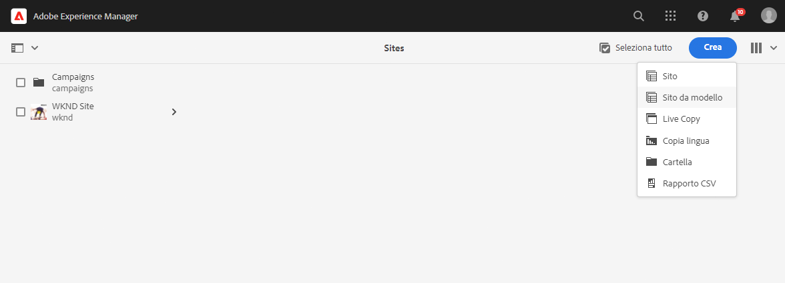

1. Nella procedura guidata Crea sito, seleziona **Importa** nella parte superiore della colonna a sinistra.

   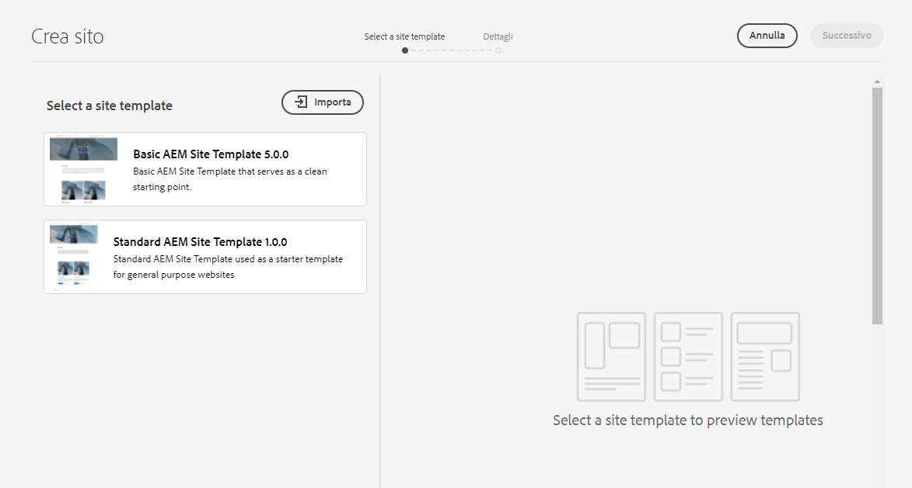

1. Nel browser dei file, individua il modello [scaricato in precedenza](#obtaining-template) e seleziona **Carica**.

1. Una volta caricato, il modello viene visualizzato nell’elenco dei modelli disponibili. Selezionalo per evidenziarlo (rivelando anche informazioni sul modello nella colonna di destra), quindi seleziona **Avanti**.

   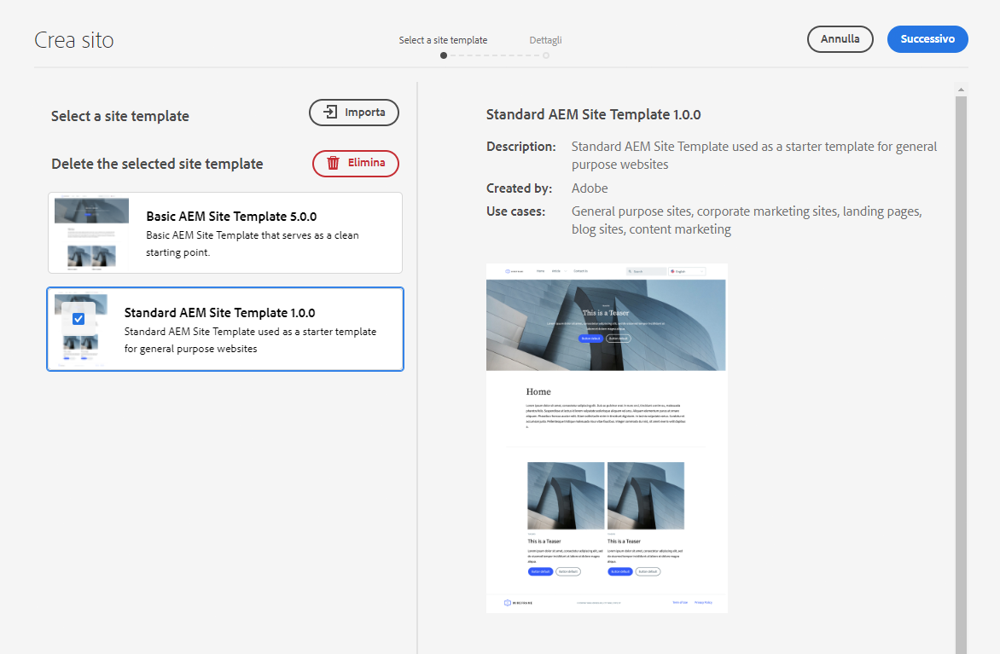

1. Immetti un titolo per il sito. Se omesso, puoi specificare un nome per il sito o generarlo dal titolo.

   * Il titolo del sito viene visualizzato nella barra del titolo del browser.
   * Il nome del sito diventa parte dell’URL.

1. Seleziona **Crea**: il nuovo sito viene creato dal modello di sito.

   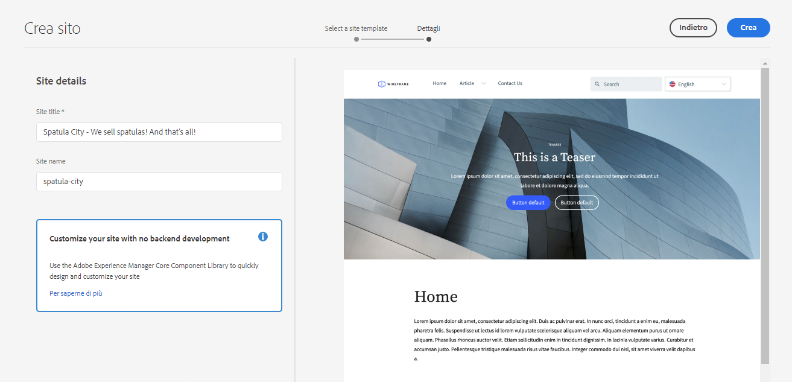

1. Nella finestra di dialogo di conferma, seleziona **Fine**.

   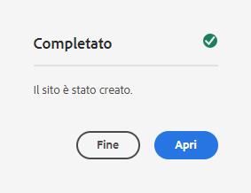

1. Nella console Sites, i nuovi siti sono visibili e possono essere spostati per esplorarne la struttura di base definita dal modello.

   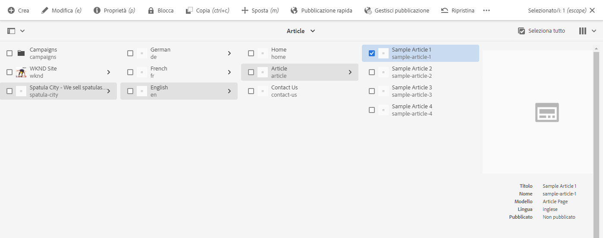

Gli autori dei contenuti adesso possono iniziare l’authoring.

## È richiesta un’ulteriore personalizzazione? {#customization-required}

I modelli di sito sono molto potenti e flessibili ed è possibile crearne qualsiasi numero per un progetto, consentendo di creare agevolmente varianti di sito. A seconda del livello di personalizzazione già eseguito sul modello di sito utilizzato, potrebbe non essere necessaria alcuna personalizzazione front-end aggiuntiva.

* Se il tuo sito non richiede una personalizzazione aggiuntiva, congratulazioni! Il tuo percorso termina qui!
* Se hai ancora bisogno di una personalizzazione front-end aggiuntiva, o se desideri semplicemente comprendere l’intero processo nel caso sia necessaria una personalizzazione futura, continua a leggere.

## Pagina di esempio {#example-page}

Se hai bisogno di ulteriori personalizzazioni front-end, ricorda che lo sviluppatore potrebbe non avere familiarità con i dettagli del contenuto. Pertanto, è consigliabile fornire allo sviluppatore un percorso dei contenuti tipici che possa essere utilizzato come base di riferimento in quanto il tema è personalizzato. Un esempio tipico è la home page della lingua master del sito.

1. Nel browser dei siti, individua la home page della lingua principale del sito, seleziona la pagina per evidenziarla, quindi seleziona **Modifica** nella barra dei menu.

   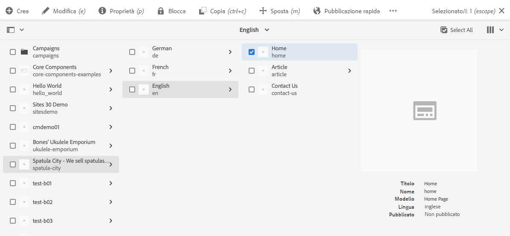

1. Nell’editor, seleziona il pulsante **Informazioni pagina** nella barra degli strumenti e quindi **Visualizza come pubblicato**.

   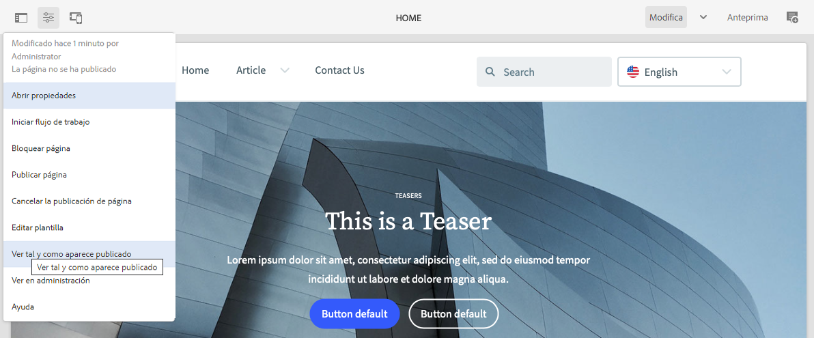

1. Nella scheda visualizzata, copia il percorso del contenuto dalla barra degli indirizzi. Avrà un aspetto simile a `/content/<your-site>/en/home.html?wcmmode=disabled`.

   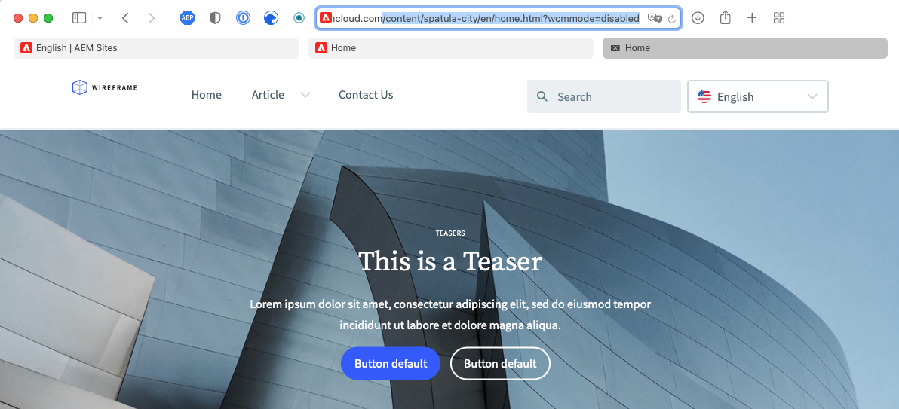

1. Salva il percorso da fornire successivamente allo sviluppatore front-end.

## Scarica il tema {#download-theme}

Ora che il sito è stato creato, il tema sito generato dal modello può essere scaricato e fornito allo sviluppatore front-end per la personalizzazione.

1. Nella console Sites, mostra la barra **Sito**.

   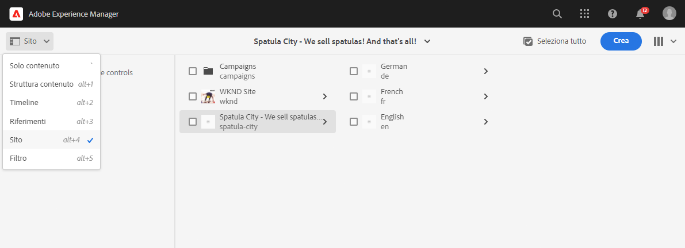

1. Seleziona la directory principale del nuovo sito, quindi seleziona **Scarica origini tema** nella barra del sito.

   

Ora disponi di una copia dei file sorgenti del tema nei file di download.

## Configurazione utente proxy {#proxy-user}

Affinché lo sviluppatore front-end possa visualizzare in anteprima le personalizzazioni utilizzando il contenuto effettivo AEM dal sito, devi impostare un utente proxy.

1. Dalla navigazione principale di AEM, passa a **Strumenti** > **Sicurezza** > **Utenti**.
1. Nella console per la gestione degli utenti, seleziona **Crea**.

   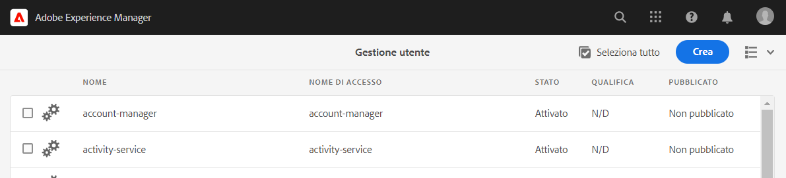
1. Nella finestra **Crea nuovo utente** devi fornire almeno:
   * **ID**: prendi nota di questo valore in quanto devi fornirlo allo sviluppatore front-end.
   * **Password**: salva questo valore in modo sicuro in un archivio password, in quanto devi fornirlo allo sviluppatore front-end.

   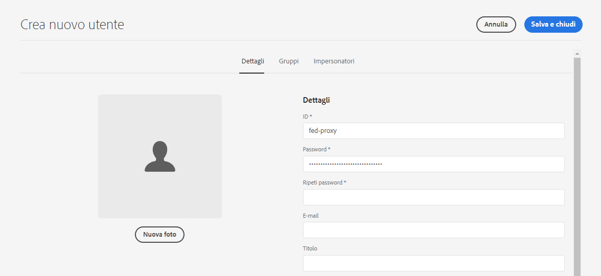

1. Nella scheda **Gruppi**, aggiungi l&#39;utente proxy al gruppo `contributors`.
   * Digitare il termine `contributors` attiva la funzione di completamento automatico di AEM per selezionare facilmente il gruppo.

   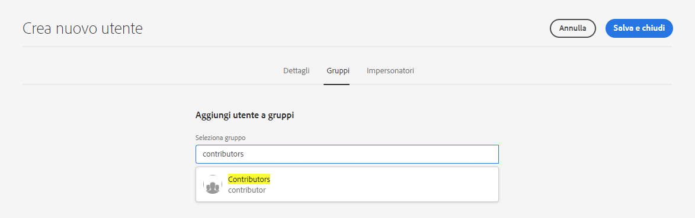

1. Seleziona **Salva e chiudi**.

La configurazione è stata completata. Gli autori dei contenuti ora possono iniziare a creare contenuti durante la preparazione del sito e iniziare la personalizzazione front-end nel passaggio successivo del percorso.

## Passaggio successivo {#what-is-next}

Dopo aver completato questa parte del percorso di creazione rapida sito di AEM, è necessario:

* Ottenere i modelli di sito AEM.
* Creare un sito utilizzando un modello.
* Scopri come scaricare il modello dal tuo nuovo sito per fornirlo allo sviluppatore front-end.

Per approfondire l’argomento e proseguire nel percorso di creazione rapida di siti AEM. consulta il documento [Configurare la pipeline](pipeline-setup.md), in cui creerai una pipeline front-end per gestire la personalizzazione del tema del sito.

## Risorse aggiuntive {#additional-resources}

Ti consigliamo di passare alla parte successiva del percorso di creazione rapida del sito, consultando il documento [Configurare la pipeline](pipeline-setup.md). Inoltre, di seguito trovi alcune risorse aggiuntive e opzionali: ti saranno utili per approfondire alcuni concetti menzionati in questo documento, ma non sono un requisito obbligatorio per procedere nel percorso.

* [Modello di sito standard AEM](https://github.com/adobe/aem-site-template-standard): questo è l’archivio GitHub del modello di sito standard AEM.
* [Organizzazione delle pagine](/help/sites-cloud/authoring/sites-console/organizing-pages.md): questa guida illustra come organizzare le pagine del sito AEM.
* [Creazione di pagine](/help/sites-cloud/authoring/sites-console/creating-pages.md): questa guida descrive come aggiungere nuove pagine al sito.
* [Gestione delle pagine](/help/sites-cloud/authoring/sites-console/managing-pages.md): questa guida descrive come gestire le pagine del sito, compresi lo spostamento, la copia e l’eliminazione.
* [Come lavorare con il pacchetto](/help/implementing/developing/tools/package-manager.md): i pacchetti consentono l&#39;importazione e l&#39;esportazione del contenuto dell&#39;archivio. Questo documento spiega come lavorare con i pacchetti in AEM 6.5, ed è applicabile anche ad AEMaaCS.
* [Documentazione sull’amministrazione del sito](/help/sites-cloud/administering/site-creation/create-site.md): per ulteriori informazioni sulle funzioni dello strumento Creazione Rapida dei Siti, consulta i documenti tecnici sulla creazione dei siti.
* [Crea o aggiungi moduli a una pagina di AEM Sites](/help/forms/create-or-add-an-adaptive-form-to-aem-sites-page.md): scopri tecniche e best practice passo passo per integrare i moduli nel tuo sito web, ottimizzando le tue esperienze digitali per il massimo impatto.
