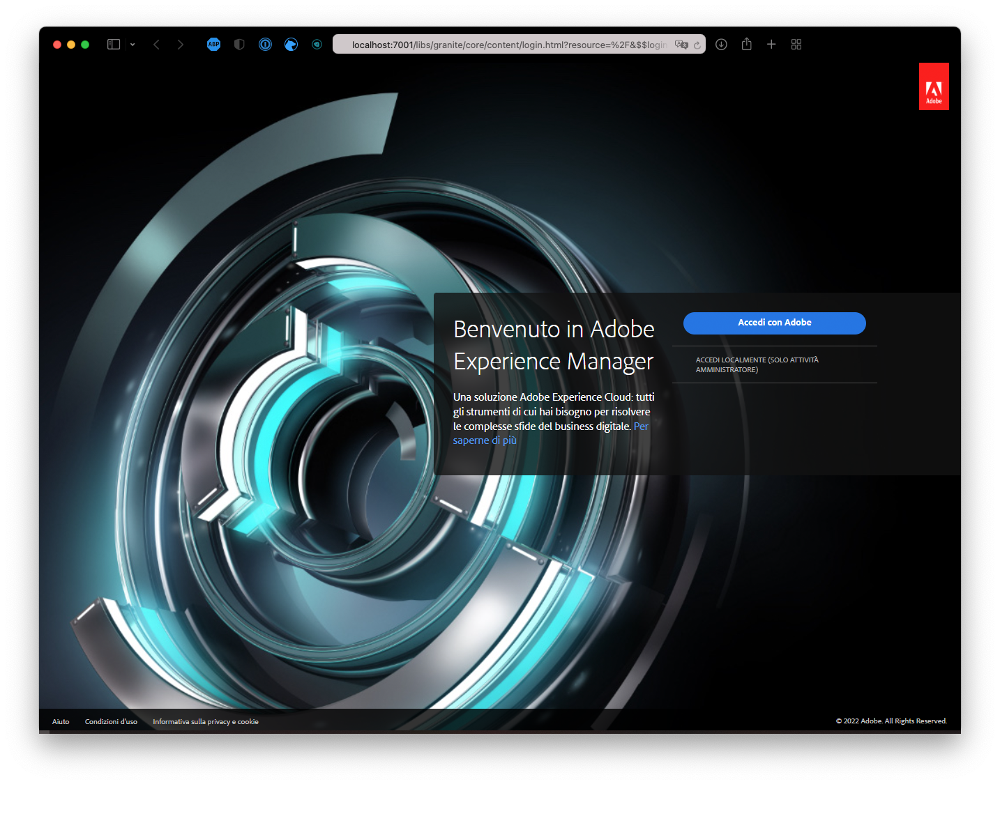
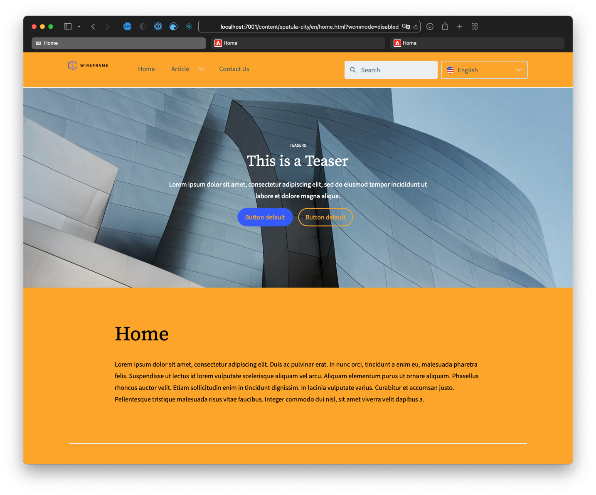

# Personalizza il tema del sito {#customize-the-site-theme}

{{traditional-aem}}

Scopri come è fatto il tema del sito, come personalizzarlo e come testarlo utilizzando contenuti live AEM.

## Percorso affrontato finora {#story-so-far}

Nel documento precedente del percorso di creazione rapida di un sito AEM, [Recuperare le informazioni di accesso all’archivio Git,](retrieve-access.md) hai imparato come gli sviluppatori front-end usano Cloud Manager per accedere alle informazioni dell’archivio Git, e ora dovresti aver appreso quanto segue:

* Una comprensione di alto livello di cosa è Cloud Manager.
* Come recuperare le credenziali per accedere al Git AEM in modo da poter eseguire il commit delle personalizzazioni.

Questa parte del percorso tratta il passaggio successivo, analizzando il tema del sito e mostrando come personalizzarlo e quindi eseguire il commit di tali personalizzazioni utilizzando le credenziali di accesso recuperate.

## Obiettivo {#objective}

Questo documento spiega come viene creato il tema del sito AEM, come personalizzarlo e come testarlo utilizzando il contenuto live AEM. Dopo la lettura dovresti:

* Comprendere la struttura di base del tema del sito e come modificarlo.
* Come testare le personalizzazioni dei temi utilizzando contenuti AEM reali tramite proxy locale.
* Scopri come eseguire il commit delle modifiche nell’archivio Git AEM.

## Ruolo responsabile {#responsible-role}

Questa parte del percorso è dedicata allo sviluppatore front-end.

## Comprendere la struttura del tema {#understand-theme}

Estrai il tema fornito dall’amministratore AEM nel punto in cui desideri modificarlo e aprilo nel tuo editor preferito.


Vedi che il tema è un tipico progetto front-end. Le parti più importanti della struttura sono:

* `src/main.ts`: il punto di ingresso principale del tema JS &amp; CSS
* `src/site`: file JS &amp; CSS applicabili all’intero sito
* `src/components`: file JS &amp; CSS specifici per i componenti AEM
* `src/resources`: file statici come icone, loghi e font

>[!TIP]
>
>Per ulteriori informazioni sul tema del sito AEM standard, consulta il collegamento GitHub nella sezione [Risorse aggiuntive](#additional-resources) alla fine del documento.

Una volta acquisita familiarità con la struttura del progetto tematico, avvia il proxy locale in modo da visualizzare tutte le personalizzazioni dei temi in tempo reale in base al contenuto AEM effettivo.

## Avvio del proxy locale {#starting-proxy}

1. Dalla riga di comando, passa alla root del tema nel computer locale.
1. Esegui `npm install` e npm recupera le dipendenze e installa il progetto.

   

1. Esegui `npm run live` e il server proxy viene avviato.

   

1. All&#39;avvio del server proxy, apre automaticamente un browser a `http://localhost:7001/`. Seleziona **ACCEDI LOCALMENTE (SOLO AMMINISTRATORE)** e accedi con le credenziali utente proxy fornite dall’amministratore di AEM.

   

   >[!TIP]
   >
   >Se non disponi di queste credenziali, contatta l’amministratore facendo riferimento alla [sezione Configurazione di un utente proxy dell’articolo Creare un sito da un modello](/help/journey-sites/quick-site/create-site.md#proxy-user) in questo percorso.

1. Una volta effettuato l’accesso, modifica l’URL nel browser in modo che indirizzi al percorso del contenuto di esempio fornito dall’amministratore AEM.

   * Ad esempio, se il percorso fornito è stato `/content/<your-site>/en/home.html?wcmmode=disabled`
   * L’URL viene modificato in `http://localhost:7001/content/<your-site>/en/home.html?wcmmode=disabled`

   

Puoi navigare nel sito per esplorare il contenuto. Il sito viene estratto in diretta dall’istanza AEM in tempo reale, in modo da poter effettuare le personalizzazioni del tema rispetto al contenuto reale.

## Personalizzare il tema {#customize-theme}

Ora puoi iniziare a personalizzare il tema. Di seguito è riportato un semplice esempio per illustrare come visualizzare le modifiche in tempo reale tramite il proxy.

1. Nell’editor, apri il file `<your-theme-sources>/src/site/_variables.scss`

   

1. Modifica la variabile `$color-background` e impostala su un valore diverso dal bianco. In questo esempio, viene utilizzato `orange`.

   

1. Quando salvi il file, puoi vedere che il server proxy riconosce la modifica tramite la riga `[Browsersync] File event [change]`.

   

1. Tornando al browser del server proxy, la modifica è immediatamente visibile.

   

Puoi continuare a personalizzare il tema in base ai requisiti forniti dall’amministratore AEM.

## Eseguire il commit delle modifiche {#committing-changes}

Una volta completate le personalizzazioni, puoi eseguirne il commit nell’archivio Git AEM. Innanzitutto devi clonare l’archivio sul computer locale.

1. Dalla riga di comando, individua il punto in cui desideri duplicare l’archivio.
1. Esegui il comando [precedentemente recuperato da Cloud Manager](retrieve-access.md). Dovrebbe essere simile a `git clone https://git.cloudmanager.adobe.com/<my-org>/<my-program>/`. Usa il nome utente e la password Git che [hai recuperato nella parte precedente di questo percorso](retrieve-access.md).

   

1. Sposta il progetto tema che stavi modificando nell’archivio clonato con un comando simile a `mv <site-theme-sources> <cloned-repo>`
1. Nella directory dell&#39;archivio clonato, esegui il commit dei file dei temi che hai appena spostato con i seguenti comandi.

   ```text
   git add .
   git commit -m "Adding theme sources"
   git push
   ```

1. Le personalizzazioni vengono inviate all’archivio Git AEM.

   

Le personalizzazioni ora vengono memorizzate in modo sicuro nell’archivio Git AEM.

## Passaggio successivo {#what-is-next}

Dopo aver completato questa parte del percorso di creazione rapida sito di AEM, è necessario:

* Comprendere la struttura di base del tema del sito e come modificarlo.
* Come testare le personalizzazioni dei temi utilizzando contenuti AEM reali tramite proxy locale.
* Come eseguire il commit delle modifiche nell’archivio Git AEM.

Approfondisci questo argomento e continua il percorso di creazione rapida di un sito AEM consultando il documento [Distribuire il tema personalizzato](deploy-theme.md), dove verrà illustrato come distribuire il tema utilizzando la pipeline front-end.

## Risorse aggiuntive {#additional-resources}

Sebbene sia raccomandato di passare alla parte successiva del percorso per la creazione rapida di un sito rivedendo il documento [Distribuire il tema personalizzato,](deploy-theme.md), di seguito sono riportate alcune risorse aggiuntive e facoltative che approfondiscono alcuni concetti menzionati in questo documento. Tuttavia, queste non sono necessarie per proseguire nel percorso.

* [Tema del sito AEM](https://github.com/adobe/aem-site-template-standard-theme-e2e): questo è l’archivio GitHub del tema del sito AEM.
* [npm](https://www.npmjs.com): i temi AEM utilizzati per costruire rapidamente i siti sono basati su npm.
* [webpack](https://webpack.js.org): i temi AEM utilizzati per costruire rapidamente i siti si basano su webpack.
