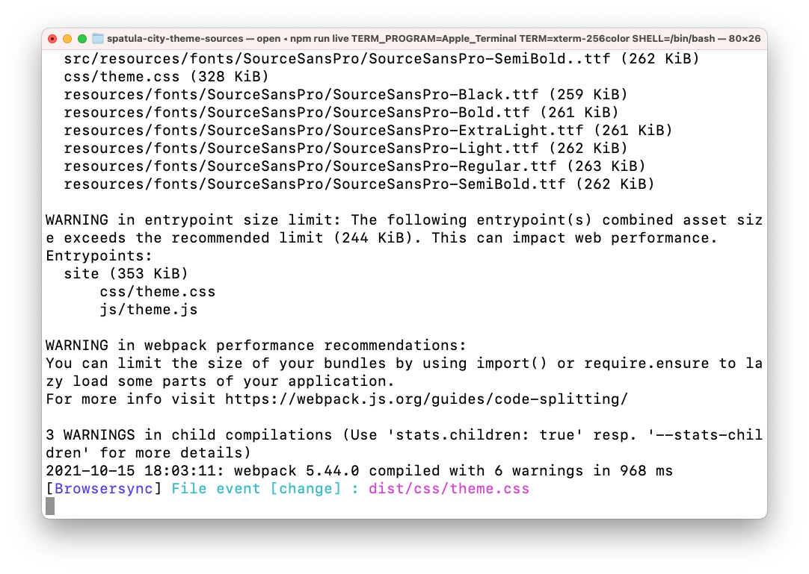

# Personalizzare il tema del sito {#customize-the-site-theme}

Scopri come è stato creato il tema del sito, come personalizzarlo e come eseguire il test utilizzando contenuti live AEM.

## La storia finora {#story-so-far}

Nel documento precedente del percorso di creazione di siti rapidi AEM, [Recuperare Le Informazioni Di Accesso All’Archivio Git,](retrieve-access.md) hai imparato come gli sviluppatori front-end utenti di Cloud Manager per accedere alle informazioni dell’archivio git, e ora dovresti:

* Comprendi ad alto livello cosa è Cloud Manager.
* Aver recuperato le credenziali per accedere all’Git AEM in modo da poter eseguire il commit delle personalizzazioni.

Questa parte del percorso esegue il passaggio successivo e analizza il tema del sito e mostra come personalizzarlo e quindi eseguire il commit di tali personalizzazioni utilizzando le credenziali di accesso recuperate.

## Obiettivo {#objective}

Questo documento spiega come viene creato il tema del sito AEM, come personalizzarlo e come testarlo utilizzando AEM contenuto live. Dopo la lettura è necessario:

* Comprendere la struttura di base del tema del sito e come modificarlo.
* Scopri come testare le personalizzazioni dei temi utilizzando contenuti AEM reali tramite proxy locale.
* Scopri come eseguire il commit delle modifiche nell’archivio Git AEM.

## Ruolo responsabile {#responsible-role}

Questa parte del percorso si applica allo sviluppatore front-end.

## Comprendere la struttura del tema {#understand-theme}

Estrai il tema fornito dall’amministratore AEM nel punto in cui desideri modificare il tema e aprilo nell’editor preferito.


Vedete che il tema è un tipico progetto front-end. Le parti più importanti della struttura sono:

* `src/main.ts`: Il punto di ingresso principale del tema JS e CSS
* `src/site`: File JS e CSS applicabili all’intero sito
* `src/components`: File JS e CSS specifici per i componenti AEM
* `src/resources`: File statici come icone, loghi e font

>[!TIP]
>
>Per ulteriori informazioni sul tema del sito AEM standard, consulta il collegamento GitHub nella sezione [Risorse aggiuntive](#additional-resources) alla fine del documento.

Una volta acquisita familiarità con la struttura del progetto tematico, avvia il proxy locale in modo da visualizzare tutte le personalizzazioni dei temi in tempo reale in base al contenuto AEM effettivo.

## Avvio del proxy locale {#starting-proxy}

1. Dalla riga di comando, passare alla directory principale del tema nel computer locale.
1. Esegui `npm install` e npm recupera le dipendenze e installa il progetto.

   

1. Esegui `npm run live` e il server proxy viene avviato.

   

1. All&#39;avvio del server proxy, apre automaticamente un browser a `http://localhost:7001/`. Tocca o fai clic su **ACCEDI LOCALMENTE (SOLO ATTIVITÀ AMMINISTRATORE)** e accedi con le credenziali utente proxy fornite dall&#39;amministratore AEM.

   

1. Una volta effettuato l’accesso, modifica l’URL nel browser in modo che indirizzi al percorso del contenuto di esempio fornito dall’amministratore AEM.

   * Ad esempio, se il percorso fornito è stato `/content/<your-site>/en/home.html?wcmmode=disabled`
   * L’URL viene modificato in `http://localhost:7001/content/<your-site>/en/home.html?wcmmode=disabled`

   

Puoi navigare nel sito per esplorare il contenuto. Il sito viene estratto in diretta dall’istanza AEM in tempo reale, in modo da poter effettuare le personalizzazioni del tema rispetto al contenuto reale.

## Personalizzare il tema {#customize-theme}

Ora puoi iniziare a personalizzare il tema. Di seguito è riportato un semplice esempio per illustrare come visualizzare le modifiche in tempo reale tramite il proxy.

1. Nell’editor, apri il file . `<your-theme-sources>/src/site/_variables.scss`

   

1. Modifica la variabile `$color-background` e impostarlo su un valore diverso dal bianco. In questo esempio, `orange` viene utilizzato.

   

1. Quando salvi il file, puoi vedere che il server proxy riconosce la modifica tramite la riga `[Browsersync] File event [change]`.

   

1. Tornando al browser del server proxy, la modifica è immediatamente visibile.

   

Puoi continuare a personalizzare il tema in base ai requisiti forniti dall’amministratore AEM.

## Impegnare le modifiche {#committing-changes}

Una volta completate le personalizzazioni, puoi eseguirne il commit nell’archivio Git AEM. Innanzitutto devi clonare l’archivio sul computer locale.

1. Dalla riga di comando, individua il punto in cui desideri duplicare l’archivio.
1. Esegui il comando [precedentemente recuperato da Cloud Manager.](retrieve-access.md) Dovrebbe essere simile a `git clone https://git.cloudmanager.adobe.com/<my-org>/<my-program>/`. Usa il nome utente e la password git che [è stato recuperato nella parte precedente di questo percorso.](retrieve-access.md)

   

1. Sposta il progetto tema che stavi modificando nell’archivio clonato con un comando simile a `mv <site-theme-sources> <cloned-repo>`
1. Nella directory del repository clonato, esegui il commit dei file dei temi che hai appena spostato con i seguenti comandi.

   ```text
   git add .
   git commit -m "Adding theme sources"
   git push
   ```

1. Le personalizzazioni vengono inviate all’archivio Git AEM.

   

Le personalizzazioni ora vengono memorizzate in modo sicuro nell’archivio Git AEM.

## Novità {#what-is-next}

Dopo aver completato questa parte del percorso di creazione siti rapidi AEM, è necessario:

* Comprendere la struttura di base del tema del sito e come modificarlo.
* Scopri come testare le personalizzazioni dei temi utilizzando contenuti AEM reali tramite proxy locale.
* Scopri come eseguire il commit delle modifiche nell’archivio Git AEM.

Sviluppare questa conoscenza e continuare il percorso di creazione siti rapida AEM revisione successiva del documento [Distribuire Il Tema Personalizzato,](deploy-theme.md) dove verrà illustrato come distribuire il tema utilizzando la pipeline front-end.

## Risorse aggiuntive {#additional-resources}

Mentre si consiglia di passare alla parte successiva del percorso Creazione rapida siti esaminando il documento [Distribuire Il Tema Personalizzato,](deploy-theme.md) di seguito sono riportate alcune risorse aggiuntive facoltative che approfondiscono alcuni concetti menzionati in questo documento, ma non è necessario che continuino sul percorso.

* [Tema sito AEM](https://github.com/adobe/aem-site-template-standard-theme-e2e) - Questo è l’archivio GitHub del tema del sito AEM.
* [npm](https://www.npmjs.com) - AEM temi utilizzati per costruire rapidamente i siti sono basati su npm.
* [webpack](https://webpack.js.org) - AEM temi utilizzati per costruire rapidamente i siti si basano su webpack.