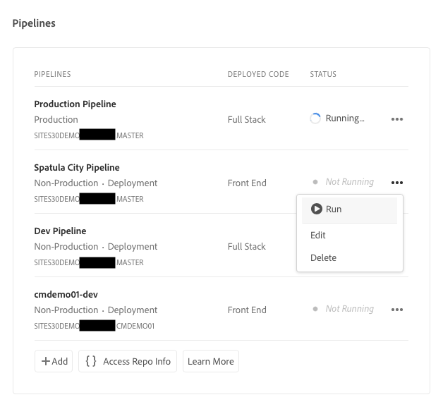
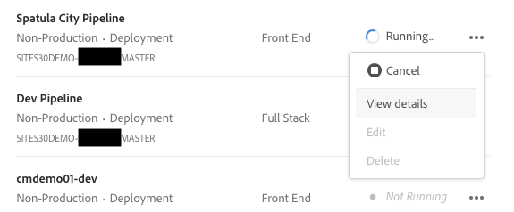

# Distribuire il tema personalizzato {#deploy-your-customized-theme}

{{traditional-aem}}

Scopri come distribuire il tema del sito utilizzando la pipeline.

## Percorso affrontato finora {#story-so-far}

Nel documento precedente del percorso di creazione rapida di siti AEM, [Personalizzare il tema del sito](customize-theme.md), hai imparato come è costruito il tema, come personalizzarlo e come testarlo utilizzando il contenuto live AEM, e ora dovresti aver appreso quanto segue:

* La struttura di base del tema del sito e come modificarlo.
* Come testare le personalizzazioni dei temi utilizzando contenuti AEM reali tramite proxy locale.
* Come eseguire il commit delle modifiche nell’archivio Git AEM.

Ora puoi effettuare il passaggio finale e utilizzare la pipeline per distribuirli.

## Obiettivo {#objective}

Questo documento spiega come distribuire il tema utilizzando la pipeline. Dopo la lettura dovresti:

* Scopri come attivare una distribuzione della pipeline.
* Scopri come verificare lo stato della distribuzione.

## Ruolo responsabile {#responsible-role}

Questa parte del percorso è dedicata allo sviluppatore front-end.

## Avvia la pipeline {#start-pipeline}

Dopo aver confermato le modifiche di personalizzazione del tema nell’archivio Git AEM, puoi eseguire [la pipeline creata dall’amministratore](pipeline-setup.md) per distribuire le modifiche.

1. Accedi a Cloud Manager [come hai fatto per recuperare le informazioni di accesso Git](retrieve-access.md) e accedi al tuo programma. Nella scheda **Panoramica** viene visualizzata una scheda per **Pipeline**.

   

1. Seleziona i puntini di sospensione accanto alla pipeline da avviare. Dal menu a discesa, seleziona **Esegui**.

   

1. Nella finestra di dialogo di conferma **Esegui pipeline**, seleziona **Sì**.

   

1. Nell’elenco delle pipeline, la colonna di stato indica che la pipeline è in esecuzione.

   

## Verificare lo stato della pipeline {#pipeline-status}

Puoi verificare lo stato della pipeline per visualizzarne i dettagli dell’avanzamento qualsiasi momento.

1. Seleziona i puntini di sospensione accanto alla pipeline.

   

1. La finestra dei dettagli della pipeline mostra il raggruppamento dell’avanzamento della pipeline.

   

>[!TIP]
>
>Nella finestra dei dettagli della pipeline, puoi selezionare **Registro di download** per qualsiasi passaggio della pipeline a scopo di debug, in caso di errore di un passaggio. Il debug della pipeline esula dall’ambito di questo percorso. Consulta i documenti tecnici per Cloud Manager nella sezione [Risorse aggiuntive](#additional-resources) di questa pagina.

## Convalidare le personalizzazioni distribuite {#view-customizations}

Una volta completata la pipeline, puoi informare l’amministratore per convalidare le modifiche. L’amministratore:

1. Aprirà l’ambiente di authoring AEM.
1. Passa al [sito creato in precedenza dall’amministratore](create-site.md).
1. Modificherà una delle pagine di contenuto.
1. Visualizzerà le modifiche applicate.

## Fine del percorso? {#end-of-journey}

Congratulazioni. Hai completato il percorso di creazione rapida di siti di AEM. Ora dovresti aver appreso quanto segue:

* Come Cloud Manager e la pipeline front-end funzionano per gestire e distribuire personalizzazioni front-end.
* Come creare un sito AEM basato su un modello e scaricare il tema del sito.
* Come introdurre uno sviluppatore front-end in modo che possa accedere all’archivio Git AEM.
* Come personalizzare e testare un tema utilizzando il contenuto AEM proxy e confermare tali modifiche in AEM git.
* Come distribuire la personalizzazione front-end utilizzando la pipeline.

Adesso puoi personalizzare i temi del tuo sito AEM. Tuttavia, prima di iniziare a creare diversi flussi di lavoro utilizzando più pipeline front-end, rivedi il documento [Sviluppo di siti con la pipeline front-end](/help/implementing/developing/introduction/developing-with-front-end-pipelines.md). Sarà utile per sfruttare al massimo lo sviluppo front-end:

* Mantenendo un’unica origine di verità.
* Mantenendo una separazione delle preoccupazioni.

AEM è uno strumento potente e sono disponibili molte opzioni aggiuntive. Consulta alcune delle risorse aggiuntive disponibili nella [sezione Risorse aggiuntive](#additional-resources) per ulteriori informazioni sulle funzioni visualizzate in questo percorso.

## Risorse aggiuntive {#additional-resources}

Di seguito sono riportate alcune risorse aggiuntive che approfondiscono alcuni concetti menzionati in questo documento.

* [Utilizzo della barra del sito per gestire il tema](/help/sites-cloud/administering/site-creation/site-rail.md): scopri le potenti funzioni della barra del sito per personalizzare e gestire facilmente il tema, tra cui il download delle sorgenti del tema e la gestione delle versioni del tema.
* [Documentazione tecnica di AEM as a Cloud Service](https://experienceleague.adobe.com/docs/experience-manager-cloud-service.html?lang=it): se hai già una conoscenza approfondita di AEM, potresti voler consultare direttamente i documenti tecnici approfonditi.
* [Documentazione di Cloud Manager](https://experienceleague.adobe.com/docs/experience-manager-cloud-service/onboarding/onboarding-concepts/cloud-manager-introduction.html?lang=it): per ulteriori informazioni sulle funzioni di Cloud Manager, consulta direttamente i documenti tecnici approfonditi.
* [Autorizzazioni basate sul ruolo](https://experienceleague.adobe.com/docs/experience-manager-cloud-manager/using/requirements/role-based-permissions.html?lang=it): Cloud Manager dispone di ruoli preconfigurati con le autorizzazioni appropriate. Per informazioni dettagliate su questi ruoli e su come amministrarli, consulta questo documento.
* [Archivi di Cloud Manager](/help/implementing/cloud-manager/managing-code/managing-repositories.md): per ulteriori informazioni su come impostare e gestire archivi Git per il progetto AEMaaCS, consulta questo documento.
* [Configurare la pipeline CI/CD - Cloud Services](/help/implementing/cloud-manager/configuring-pipelines/introduction-ci-cd-pipelines.md): ulteriori informazioni sulla configurazione delle pipeline, sia full stack che front end, in questo documento.
* [Modello del sito standard AEM](https://github.com/adobe/aem-site-template-standard): questo è l’archivio GitHub del modello del sito standard AEM.
* [Tema del sito AEM](https://github.com/adobe/aem-site-template-standard-theme-e2e): questo è l’archivio GitHub del tema del sito AEM.
* [npm](https://www.npmjs.com): i temi AEM utilizzati per costruire rapidamente i siti sono basati su npm.
* [webpack](https://webpack.js.org): i temi AEM utilizzati per costruire rapidamente i siti si basano su webpack.
* [Organizzazione delle pagine](/help/sites-cloud/authoring/sites-console/organizing-pages.md): questa guida descrive come organizzare le pagine del sito AEM.
* [Creazione di pagine](/help/sites-cloud/authoring/sites-console/creating-pages.md): questa guida descrive come aggiungere nuove pagine al sito.
* [Gestione delle pagine](/help/sites-cloud/authoring/sites-console/managing-pages.md): questa guida descrive come gestire le pagine del sito, compresi lo spostamento, la copia e l’eliminazione.
* [Come lavorare con il pacchetto](/help/implementing/developing/tools/package-manager.md): i pacchetti consentono l&#39;importazione e l&#39;esportazione del contenuto dell&#39;archivio. Questo documento spiega come lavorare con i pacchetti in AEM 6.5, ed è applicabile anche ad AEMaaCS.
* [Percorso di onboarding](/help/journey-onboarding/overview.md): questa guida funge da punto di partenza per garantire che i team siano configurati e abbiano accesso a AEM as a Cloud Service.
* [Documentazione Cloud Manager di Adobe Experience Manager](https://experienceleague.adobe.com/docs/experience-manager-cloud-manager/using/introduction-to-cloud-manager.html?lang=it): esplora la documentazione di Cloud Manager per informazioni dettagliate sulle sue funzioni.
* [Documentazione sull’amministrazione del sito](/help/sites-cloud/administering/site-creation/create-site.md): per ulteriori informazioni sulle funzioni dello strumento Creazione Rapida dei Siti, consulta i documenti tecnici sulla creazione del sito.
* [Sviluppo di siti con la pipeline front-end](/help/implementing/developing/introduction/developing-with-front-end-pipelines.md): questo documento descrive alcune considerazioni di cui tenere conto per sfruttare appieno il potenziale del processo di sviluppo utilizzando la pipeline front-end.
