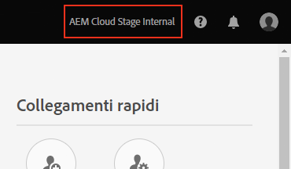
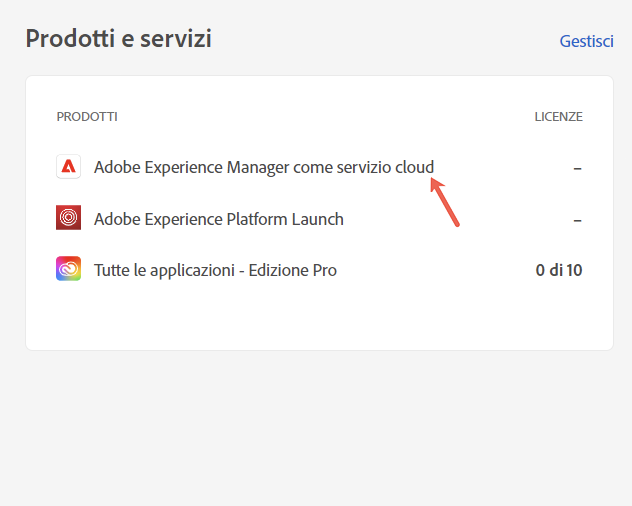
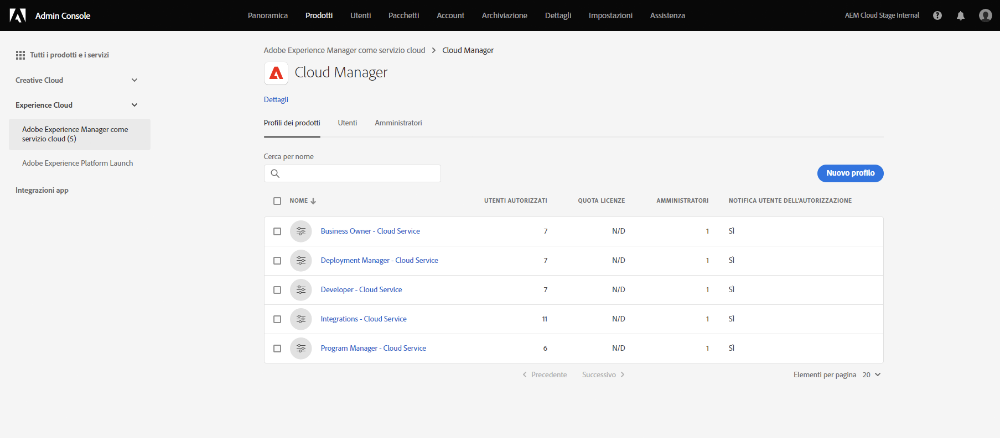
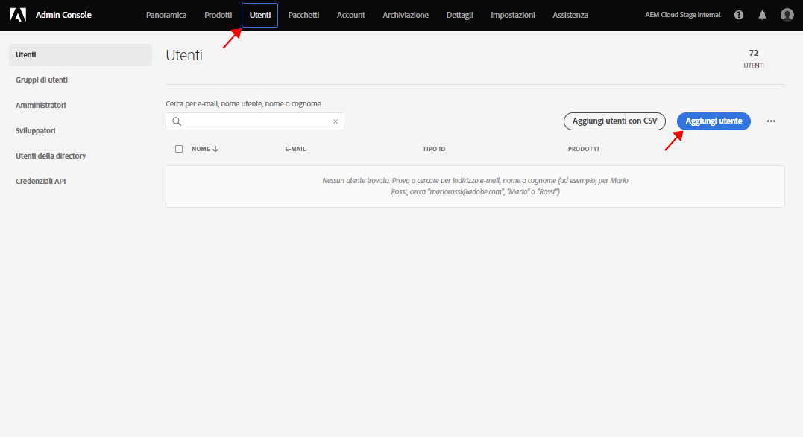
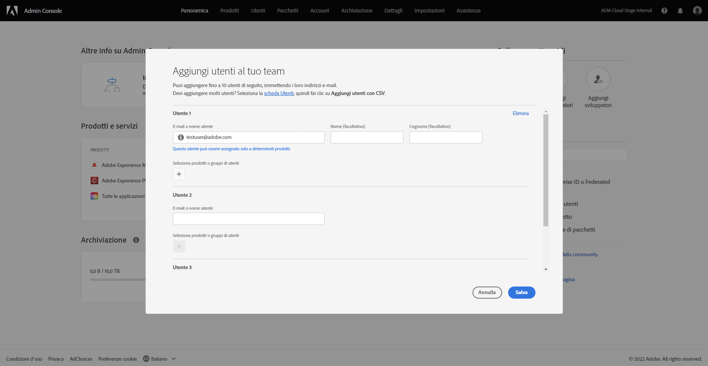
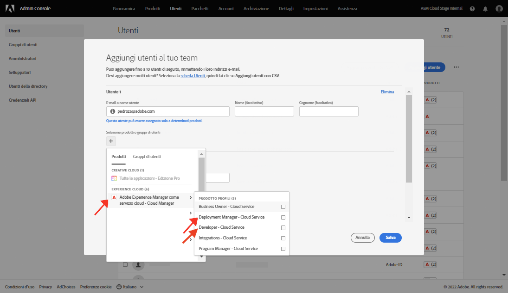

# Concedere l’accesso allo sviluppatore front-end {#grant-fed-access}

{{traditional-aem}}

Inserisci gli sviluppatori front-end in Cloud Manager in modo che abbiano accesso all&#39;archivio git del sito AEM e alla pipeline.

## Percorso affrontato finora {#story-so-far}

Nel documento precedente del percorso di creazione rapida di siti AEM, [Configurare la pipeline](pipeline-setup.md), hai imparato a creare una pipeline front-end per gestire la personalizzazione del tema del sito, e ora dovresti aver appreso quanto segue:

* Cos’è una pipeline front-end.
* Come impostare una pipeline front-end in Cloud Manager.

Ora devi concedere allo sviluppatore front-end l&#39;accesso a Cloud Manager attraverso il processo di onboarding, in modo che lo possa accedere all&#39;archivio git di AEM e alla pipeline creata.

## Obiettivo {#objective}

Il processo di concessione dell&#39;accesso a Cloud Manager e di assegnazione dei ruoli agli utenti si chiama onboarding. Questo documento fornisce una panoramica dei passaggi più importanti per l&#39;onboarding di uno sviluppatore front-end e dopo la lettura saprai:

* Come aggiungere uno sviluppatore front-end come utente.
* Come assegnare i ruoli richiesti allo sviluppatore front-end.

>[!TIP]
>
>È disponibile un intero percorso di documentazione dedicato all&#39;onboarding del team su AEM as a Cloud service, collegato alla [sezzione Risorse aggiuntive](#additional-resources) di questo documento, se necessiti di ulteriori dettagli sul processo.

## Ruolo responsabile {#responsible-role}

Questa parte del percorso si applica all’amministratore di Cloud Manager.

## Requisiti  {#requirements}

* Devi essere membro col ruolo di **Proprietario dell&#39;azienda** in Cloud Manager.
* Devi essere un **Amministratore di sistema** in Cloud Manager.
* Devi avere accesso all&#39;Admin Console.

## Aggiungere uno sviluppatore front-end come utente {#add-fed-user}

Innanzitutto devi aggiungere lo sviluppatore front-end come utente utilizzando l’Admin Console.

1. Accedi all’Admin Console in [https://adminconsole.adobe.com/](https://adminconsole.adobe.com/).

1. Una volta effettuato l’accesso, viene visualizzata una pagina di panoramica simile a quella riportata di seguito.

   

1. Accertati di essere nell’organizzazione appropriata, controllandone il nome nell’angolo in alto a destra dello schermo.

   

1. Seleziona **Adobe Experience Manager as a Cloud Service** dalla scheda **Prodotti e servizi**.

   

1. Vedrai l’elenco dei profili di prodotto Cloud Manager preconfigurati. Se questi profili non sono visualizzati, contatta l’amministratore di Cloud Manager in quanto potresti non disporre delle autorizzazioni corrette nell’organizzazione.

   

1. Per assegnare lo sviluppatore front-end ai profili corretti, seleziona la scheda **Utenti** e quindi il pulsante **Aggiungi utente**.

   

1. Nella finestra di dialogo **Aggiungi utenti al tuo team** digita l&#39;ID e-mail dell&#39;utente che desideri aggiungere. Per Tipo ID, seleziona Adobe ID se il Federated ID per i membri del team non è ancora stato configurato.

   

1. Nella selezione **Prodotto**, seleziona il segno più, quindi seleziona **Adobe Experience Manager as a Cloud Service** e assegna all’utente i profili di prodotto **Gestione distribuzione** e **Sviluppatore**.

   

1. Seleziona **Salva** per inviare un messaggio e-mail di benvenuto allo sviluppatore front-end aggiunto come utente.

Lo sviluppatore front-end invitato può accedere a Cloud Manager facendo clic sul collegamento nell’e-mail di benvenuto e accedendo utilizzando il proprio Adobe ID.

## Consegna allo sviluppatore Front-End {#handover}

Con un invito e-mail a Cloud Manager per lo sviluppatore front-end, tu e l’amministratore AEM potete fornirgli le informazioni necessarie rimanenti per iniziare la personalizzazione.

* Un [percorso del contenuto tipico](#example-page)
* Il sorgente del tema che [hai scaricato](#download-theme)
* Le [credenziali utente proxy](#proxy-user)
* Il nome del programma o l&#39;URL a esso associato [copiato da Cloud Manager](pipeline-setup.md#login)
* Requisiti di progettazione front-end

## Passaggio successivo {#what-is-next}

Dopo aver completato questa parte del percorso di Creazione Rapida dei Siti AEM, dovresti conoscere:

* Come aggiungere uno sviluppatore front-end come utente.
* Come assegnare i ruoli richiesti allo sviluppatore front-end.

Approfondisci questo argomento e continua il percorso di creazione rapida di un sito AEM consultando il documento [Recuperare le informazioni di accesso all’archivio Git](retrieve-access.md), che descrive la prospettiva dello sviluppatore front-end e spiega come utilizzare Cloud Manager per accedere alle informazioni dell’archivio Git.

## Risorse aggiuntive {#additional-resources}

Sebbene sia consigliabile passare alla parte successiva del percorso di creazione rapida del sito consultando il documento [Recupero delle credenziali dello sviluppatore front-end](retrieve-access.md), le seguenti sono alcune risorse aggiuntive e opzionali che approfondiscono alcuni concetti menzionati in questo documento, ma non sono necessarie per continuare il percorso.

* [Percorso di onboarding](/help/journey-onboarding/overview.md): questa guida funge da punto di partenza per garantire che i team siano configurati e abbiano accesso ad AEM as a Cloud Service.
