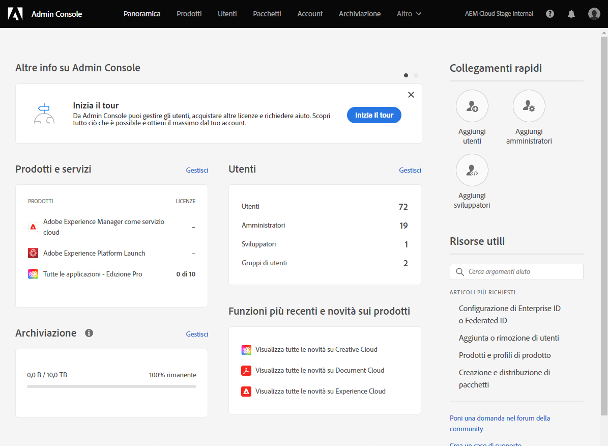

# Concedere l’accesso allo sviluppatore front-end {#grant-fed-access}

Adatta gli sviluppatori front-end a Cloud Manager in modo che possano accedere all’archivio Git del sito AEM e alla pipeline.

## La storia finora {#story-so-far}

Nel documento precedente del percorso di creazione di siti rapidi AEM, [Imposta La Pipeline,](pipeline-setup.md) hai imparato a creare una pipeline front-end per gestire la personalizzazione del tema del sito e ora dovresti:

* Comprendere cos’è una pipeline front-end.
* Scopri come impostare una pipeline front-end in Cloud Manager.

È ora necessario concedere agli sviluppatori front-end l’accesso a Cloud Manager tramite il processo di onboarding in modo che lo sviluppatore front-end possa accedere all’archivio Git AEM e alla pipeline creata.

## Obiettivo {#objective}

Il processo di concessione dell’accesso a Cloud Manager e di assegnazione di ruoli utente agli utenti si chiama onboarding. Questo documento fornisce una panoramica dei passaggi più importanti per l&#39;onboarding di uno sviluppatore front-end e dopo la lettura si saprà:

* Come aggiungere uno sviluppatore front-end come utente.
* Come assegnare i ruoli richiesti allo sviluppatore front-end.

>[!TIP]
>
>È disponibile un intero percorso di documentazione dedicato all’onboarding del team su AEM as a Cloud Service, collegato a in [Sezione Risorse aggiuntive](#additional-resources) di questo documento, se hai bisogno di ulteriori dettagli sul processo.

## Ruolo responsabile {#responsible-role}

Questa parte del percorso si applica all’amministratore di Cloud Manager.

## Requisiti {#requirements}

* Devi essere membro di **Proprietario business** in Cloud Manager.
* Devi essere un **Amministratore di sistema** in Cloud Manager.
* Devi avere accesso all&#39;Admin Console.

## Aggiungere uno sviluppatore front-end come utente {#add-fed-user}

Innanzitutto devi aggiungere lo sviluppatore front-end come utente utilizzando l’Admin Console .

1. Accedi all’Admin Console in [https://adminconsole.adobe.com/](https://adminconsole.adobe.com/).

1. Una volta effettuato l’accesso, viene visualizzata una pagina di panoramica simile a quella riportata di seguito.

   

1. Accertati di essere nell’organizzazione appropriata, controllando il nome dell’organizzazione nell’angolo in alto a destra dello schermo.

   

1. Seleziona **Adobe Experience Manager as a Cloud Service** dal **Prodotti e servizi** il Card.

   

1. Viene visualizzato l’elenco dei profili di prodotto Cloud Manager preconfigurati. Se tali profili non sono visualizzati, contatta l’amministratore di Cloud Manager in quanto potresti non disporre delle autorizzazioni corrette nell’organizzazione.

   

1. Per assegnare lo sviluppatore front-end ai profili corretti, tocca o fai clic sul pulsante **Utenti** e quindi la **Aggiungi utente** pulsante .

   

1. In **Aggiungi utenti al tuo team** digitare l&#39;ID e-mail dell&#39;utente che si desidera aggiungere. Per Tipo ID, seleziona Adobe ID se il Federated ID per i membri del team non è ancora stato configurato.

   

1. In **Prodotto** selezione, tocca o fai clic sul segno più , quindi seleziona **Adobe Experience Manager as a Cloud Service** e assegna le **Gestione distribuzione** e **Sviluppatore** profili di prodotto per l’utente.

   

1. Tocca o fai clic su **Salva** e un messaggio e-mail di benvenuto viene inviato allo sviluppatore front-end aggiunto come utente.

Lo sviluppatore front-end invitato può accedere a Cloud Manager facendo clic sul collegamento nell’e-mail di benvenuto e accedendo utilizzando il proprio Adobe ID.

## Passaggio a Front-End Developer {#handover}

Con un invito e-mail a Cloud Manager per lo sviluppatore front-end, tu e l’amministratore AEM ora potete fornire allo sviluppatore front-end le informazioni necessarie rimanenti per iniziare la personalizzazione.

* A [percorso del contenuto tipico](#example-page)
* La fonte del tema che [scaricato](#download-theme)
* La [credenziali utente proxy](#proxy-user)
* Nome del programma o URL a esso associato [copiato da Cloud Manager](pipeline-setup.md#login)
* Requisiti di progettazione front-end

## Novità {#what-is-next}

Dopo aver completato questa parte del percorso di creazione siti rapidi AEM, è necessario conoscere:

* Come aggiungere uno sviluppatore front-end come utente.
* Come assegnare i ruoli richiesti allo sviluppatore front-end.

Sviluppare questa conoscenza e continuare il percorso di creazione siti rapida AEM revisione successiva del documento [Recuperare Le Informazioni Di Accesso All’Archivio Git,](retrieve-access.md) che passa la prospettiva esclusivamente allo sviluppatore front-end e spiega come gli utenti sviluppatori front-end Cloud Manager accedono alle informazioni dell’archivio git.

## Risorse aggiuntive {#additional-resources}

Mentre si consiglia di passare alla parte successiva del percorso Creazione rapida siti esaminando il documento [Recuperare le credenziali per gli sviluppatori front-end,](retrieve-access.md) di seguito sono riportate alcune risorse aggiuntive facoltative che approfondiscono alcuni concetti menzionati in questo documento, ma non è necessario che continuino sul percorso.

* [Percorso di onboarding](/help/journey-onboarding/home.md) - Questa guida funge da punto di partenza per garantire che i team siano configurati e abbiano accesso a AEM as a Cloud Service.

