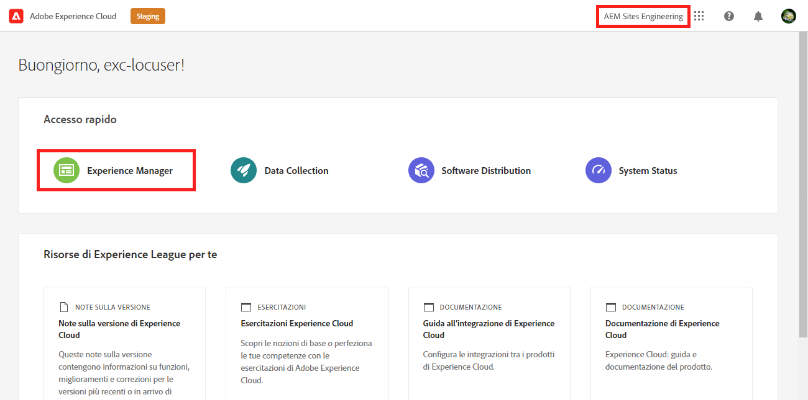
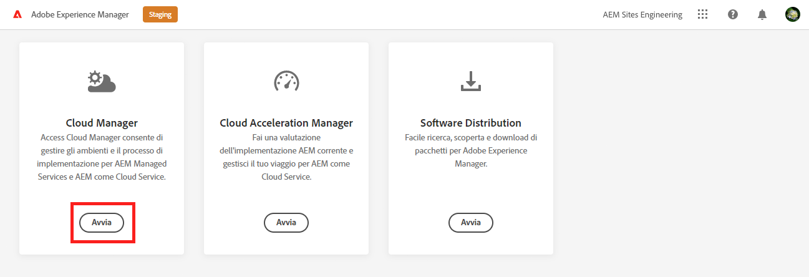

# Recupera informazioni di accesso all’archivio Git {#retrieve-access}

Scopri in che modo lo sviluppatore front-end utilizza Cloud Manager per accedere alle informazioni dell’archivio Git.

>[!CAUTION]
>
>Lo strumento di creazione rapida del sito è attualmente un&#39;anteprima tecnica. Esso è messo a disposizione a fini di prova e valutazione e non è destinato all&#39;uso della produzione se non concordato con il sostegno Adobe.

## La storia finora {#story-so-far}

Se sei uno sviluppatore front-end solo responsabile della personalizzazione del tema del sito, non è necessario sapere come è stato impostato AEM e può passare al [Obiettivo](#objective) sezione di questo documento.

Se utilizzi anche il ruolo di amministratore di Cloud Manager o AEM e di sviluppatore front-end, hai appreso nel documento precedente del percorso di creazione siti rapida AEM, [Concedere l’accesso allo sviluppatore front-end,](grant-access.md) come integrare lo sviluppatore front-end in modo che abbia accesso all’archivio Git, e dovresti ora sapere:

* Come aggiungere uno sviluppatore front-end come utente.
* Come assegnare i ruoli richiesti allo sviluppatore front-end.

Questo articolo fa il passo successivo per mostrare come lo sviluppatore front-end utilizza l’accesso a Cloud Manager per recuperare le credenziali per accedere all’archivio Git AEM.

Ora che esiste un sito creato in base a un modello, è presente una pipeline impostata, lo sviluppatore front-end è onboarding e dispone di tutte le informazioni necessarie, questo articolo sposta la prospettiva lontano dagli amministratori ed esclusivamente al ruolo di sviluppatore front-end.

## Obiettivo {#objective}

Questo documento spiega come, nel ruolo dello sviluppatore front-end, puoi accedere a Cloud Manager e recuperare le credenziali di accesso all’archivio Git AEM. Dopo aver letto sarà:

* Comprendi ad alto livello cosa è Cloud Manager.
* Aver recuperato le credenziali per accedere all’Git AEM in modo da poter eseguire il commit delle personalizzazioni.

## Ruolo responsabile {#responsible-role}

Questa parte del percorso si applica allo sviluppatore front-end.

## Requisiti {#requirements}

Lo strumento di creazione rapida del sito consente agli sviluppatori front-end di lavorare in modo indipendente senza conoscere AEM o come è configurato. Tuttavia, l’amministratore di Cloud Manager deve integrare lo sviluppatore front-end nel team di progetto e l’amministratore AEM deve fornire alcune informazioni richieste. Assicurati di disporre delle seguenti informazioni prima di continuare.

* Dall’amministratore AEM:
   * File di origine del tema da personalizzare
   * Percorso di una pagina di esempio da utilizzare come base di riferimento
   * Credenziali utente proxy per testare le personalizzazioni rispetto al contenuto live AEM
   * Requisiti di progettazione front-end
* Dall’amministratore di Cloud Manager:
   * Un’e-mail di benvenuto da Cloud Manager con informazioni sull’accesso
   * Nome del programma o URL all’interno di Cloud Manager

Se mancano questi elementi, contatta l’amministratore AEM o l’amministratore di Cloud Manager.

Si presume che lo sviluppatore front-end abbia un’ampia esperienza con i flussi di lavoro di sviluppo front-end e con gli strumenti comuni installati, tra cui:

* git
* npm
* webpack
* Un editor preferito

## Informazioni su Cloud Manager {#understanding-cloud-manager}

Cloud Manager consente alle organizzazioni di gestire autonomamente AEM nel cloud. Include un framework di integrazione continua e distribuzione continua (CI/CD, Continuous Integration/Continuous Delivery) che consente ai team IT e ai partner dell’implementazione di accelerare la distribuzione di personalizzazioni o aggiornamenti senza compromettere prestazioni o sicurezza.

Per lo sviluppatore front-end, è il gateway per:

* Accedi AEM informazioni sull’archivio Git per eseguire il commit delle personalizzazioni front-end.
* Avvia la pipeline di distribuzione per distribuire le personalizzazioni.

L’amministratore di Cloud Manager ti avrà effettuato l’accesso come utente di Cloud Manager. Dovresti aver ricevuto un&#39;e-mail di benvenuto simile alla seguente.

Se non hai ricevuto questa e-mail, contatta l’amministratore di Cloud Manager.

## Accesso a Cloud Manager {#access-cloud-manager}

1. Accedi a Adobe Experience Cloud all&#39;indirizzo [my.cloudmanager.adobe.com](https://my.cloudmanager.adobe.com/) oppure fai clic sul collegamento fornito nell’e-mail di benvenuto.

1. Una volta effettuato l’accesso, assicurati di essere nell’organizzazione corretta effettuando il controllo nell’angolo in alto a destra dello schermo. Se sei membro di una sola organizzazione, questo passaggio non è necessario. Quindi tocca o fai clic su **Experience Manager**.

   

1. Nella pagina successiva, tocca o fai clic sul pulsante **Launch** per avviare **Cloud Manager** app.

   

1. Nella pagina successiva sono elencati i vari programmi disponibili. Tocca o fai clic su quello a cui devi accedere come fornito dall’amministratore di Cloud Manager. Se si tratta del primo progetto front-end per AEMaaCS, probabilmente è disponibile un solo programma.

   

Viene visualizzata una panoramica di Cloud Manager. La pagina avrà un aspetto diverso ma simile a questo esempio.

## Recupera informazioni di accesso al repository {#repo-access}

1. In **Tubi** della pagina Cloud Manager, tocca o fai clic sul pulsante **Accesso alle informazioni sul repository** pulsante .

   

1. La **Informazioni archivio** viene visualizzata la finestra di dialogo .

   

1. Tocca o fai clic sul pulsante **Genera password** per creare una password.

1. Salva la password generata in un gestore di password sicuro. La password non verrà mai più visualizzata.

1. Copia anche il **username** e **Riga di comando Git** campi. In seguito utilizzerai queste informazioni per accedere al repository.

1. Tocca o fai clic su **Chiudi**.

## Novità {#what-is-next}

Dopo aver completato questa parte del percorso di creazione siti rapidi AEM, è necessario:

* Comprendi ad alto livello cosa è Cloud Manager.
* Aver recuperato le credenziali per accedere all’Git AEM in modo da poter eseguire il commit delle personalizzazioni.

Sviluppare questa conoscenza e continuare il percorso di creazione siti rapida AEM revisione successiva del documento [Personalizzare il tema del sito,](customize-theme.md) dove verrà illustrato come è stato creato il tema del sito, come personalizzarlo e come eseguire il test utilizzando contenuti live AEM.

## Risorse aggiuntive {#additional-resources}

Mentre si consiglia di passare alla parte successiva del percorso Creazione rapida siti esaminando il documento [Personalizzare il tema del sito,](customize-theme.md) di seguito sono riportate alcune risorse aggiuntive facoltative che approfondiscono alcuni concetti menzionati in questo documento, ma non è necessario che continuino sul percorso.

* [Documentazione di Adobe Experience Manager Cloud Manager](https://experienceleague.adobe.com/docs/experience-manager-cloud-manager/using/introduction-to-cloud-manager.html?lang=it) - Esplorate la documentazione di Cloud Manager per informazioni dettagliate sulle sue funzioni.
