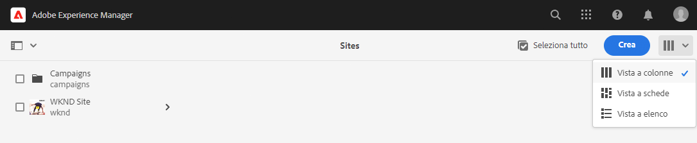
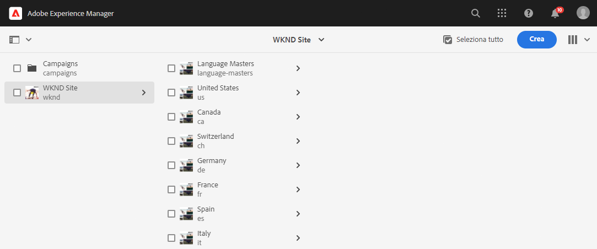
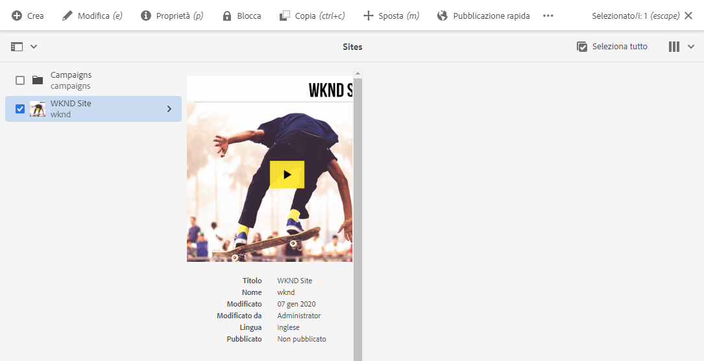
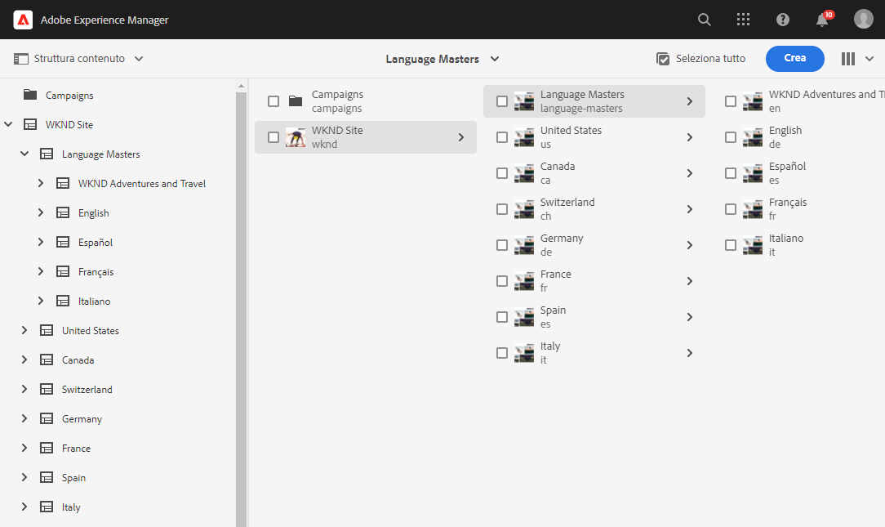
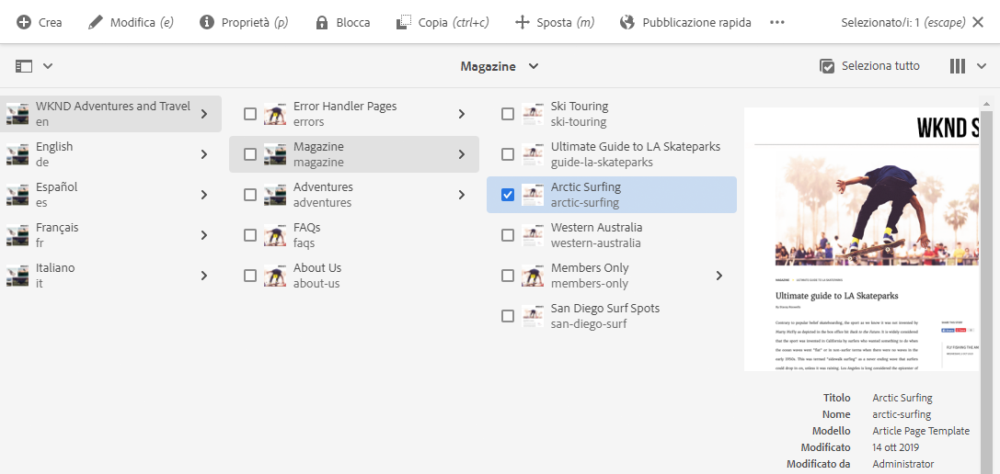
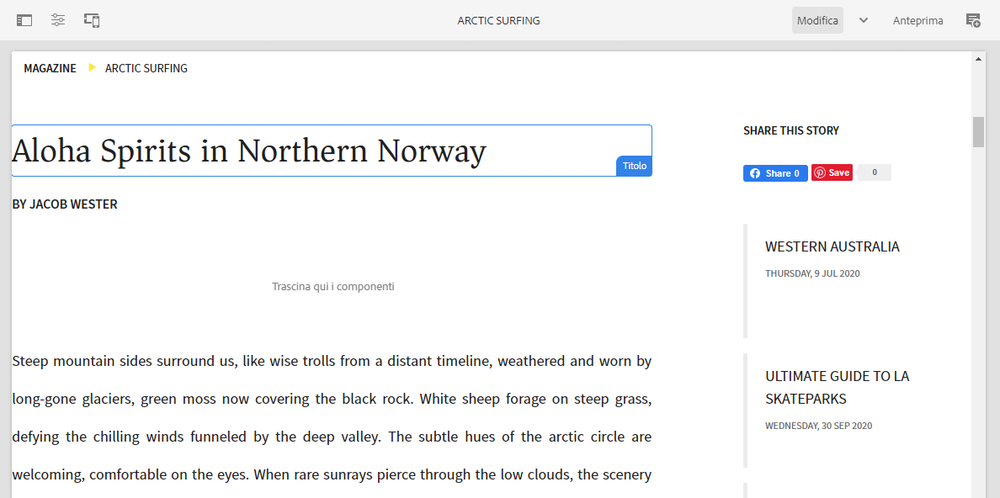

# Guida introduttiva alla traduzione in AEM Sites {#getting-started}

Scopri come organizzare i contenuti AEM Sites e come funzionano gli strumenti di traduzione AEM.

## La storia finora {#story-so-far}

Nel documento precedente del percorso di traduzione di AEM Sites, [Scopri i contenuti AEM Sites e come tradurli in AEM](learn-about.md) hai imparato la teoria di base di AEM Sites e ora devi:

* Concetti di base sulla creazione di contenuti AEM Sites.
* Sii familiare con come AEM supporta la traduzione.

Questo articolo si basa su questi elementi fondamentali per comprendere come AEM memorizza e gestisce i contenuti e come puoi utilizzare gli strumenti di traduzione AEM per tradurli.

## Obiettivo {#objective}

Questo documento illustra come iniziare a tradurre il contenuto dei siti in AEM. Dopo la lettura è necessario:

* Comprendere l’importanza della struttura dei contenuti per la traduzione.
* Comprendere come AEM il contenuto.
* Conoscere AEM strumenti di traduzione.

## Requisiti e prerequisiti {#requirements-prerequisites}

Ci sono diversi requisiti prima di iniziare a tradurre il tuo contenuto AEM.

### Conoscenza {#knowledge}

* Esperienza nella traduzione dei contenuti in un CMS
* Esperienza utilizzando le funzioni di base di un CMS su larga scala
* Avere una conoscenza operativa AEM manipolazione di base
* Informazioni sul servizio di traduzione utilizzato
* Comprensione di base del contenuto che si sta traducendo

>[!TIP]
>
>Se non hai familiarità con l&#39;utilizzo di un CMS su larga scala come AEM, prima di procedere è consigliabile rivedere la documentazione [Operazioni di base](/help/sites-cloud/authoring/getting-started/basic-handling.md). La documentazione di base sulla gestione non fa parte del percorso, quindi torna a questa pagina una volta completata.

### Strumenti {#tools}

* Accesso alla sandbox per testare la traduzione del contenuto
* Credenziali per la connessione al servizio di traduzione preferito
* È membro del gruppo `project-administrators` in AEM

## Come AEM archivia i contenuti {#content-in-aem}

Per lo specialista della traduzione, non è importante comprendere in modo approfondito come AEM gestire i contenuti. Tuttavia, conoscere i concetti e la terminologia di base sarà utile in seguito all’utilizzo di strumenti di traduzione AEM. È importante comprendere il proprio contenuto e la sua struttura per tradurlo in modo efficace.

### Console Sites {#sites-console}

La console Sites fornisce una panoramica della struttura dei contenuti, facilitando la navigazione e la gestione dei contenuti creando nuove pagine, spostando e copiando pagine e pubblicando contenuti.

Per accedere alla console Sites :

1. Nel menu di navigazione globale, tocca o fai clic su **Navigazione** -> **Siti**.
1. La console Sites si apre al livello superiore del contenuto.
1. Assicurati che la **Vista a colonne** sia selezionata utilizzando il selettore di visualizzazione in alto a destra nella finestra.

   

1. Toccando o facendo clic su un elemento in una colonna, il contenuto al di sotto di esso viene visualizzato nella gerarchia della colonna a destra.

   

1. Toccando o facendo clic sulla casella di controllo di un elemento in una colonna, l’elemento viene selezionato e vengono visualizzati a destra i dettagli dell’elemento selezionato nella colonna, oltre a svelare una serie di azioni disponibili per l’elemento selezionato nella barra degli strumenti precedente.

   

1. Toccando o facendo clic sul selettore della barra in alto a sinistra, puoi anche visualizzare la vista **Struttura contenuto** per una panoramica ad albero del contenuto.

   

Utilizzando questi semplici strumenti è possibile navigare intuitivamente nella struttura dei contenuti.

>[!NOTE]
>
>L’architettura dei contenuti definisce normalmente la struttura del contenuto, mentre gli autori creano il contenuto all’interno di tale struttura.
>
>In qualità di esperto di traduzione, è importante comprendere semplicemente come navigare in quella struttura e capire dove si trova il contenuto.

### Editor pagina {#page-editor}

La console Sites consente di navigare nel contenuto e fornisce una panoramica della sua struttura. Per visualizzare i dettagli di una singola pagina, devi utilizzare l’editor Sites .

Per modificare una pagina:

1. Utilizza la console Sites per individuare e selezionare una pagina. Per selezionarla, è necessario toccare o fare clic sulla casella di controllo di una singola pagina.

   

1. Tocca l’opzione **Modifica** nella barra degli strumenti.
1. Viene aperto l’editor Sites con la pagina selezionata caricata per la modifica in una nuova scheda del browser.
1. Quando si passa il mouse o si tocca un contenuto, vengono visualizzati i selettori per i singoli componenti. I componenti sono i blocchi predefiniti da trascinare e rilasciare che costituiscono la pagina.

   

Per tornare alla console Sites, torna a tale scheda nel browser in qualsiasi momento. Utilizzando l’editor Sites puoi visualizzare rapidamente il contenuto della pagina così come verrà visualizzato dagli autori dei contenuti e dal pubblico.

>[!NOTE]
>
>Gli autori dei contenuti creano il contenuto del sito utilizzando l’editor siti.
>
>In qualità di esperto di traduzione, è importante comprendere semplicemente come visualizzare i dettagli di quel contenuto utilizzando l&#39;editor siti.

## La struttura è la chiave {#content-structure}

AEM contenuto è guidato dalla sua struttura. AEM impone pochi requisiti alla struttura dei contenuti, ma un’attenta considerazione della gerarchia dei contenuti come parte della pianificazione del progetto può rendere la traduzione molto più semplice.

>[!TIP]
>
>Pianifica la traduzione all&#39;inizio del tuo progetto AEM. Collabora con il project manager e gli architetti di contenuti fin da subito.
>
>Un Project Manager per l&#39;internazionalizzazione può essere richiesto come persona separata la cui responsabilità è quella di definire quali contenuti tradurre e cosa no, e quali contenuti tradotti possono essere modificati dai produttori di contenuti regionali o locali.

## Struttura dei contenuti consigliata {#recommended-structure}

Come precedentemente consigliato, collabora con l’architettura dei contenuti per determinare la struttura del contenuto appropriata per il tuo progetto. Tuttavia il seguente è una struttura collaudata, semplice e intuitiva che è abbastanza efficace.

Definisci una cartella di base per il progetto in `/content`.

```text
/content/<your-project>
```

La lingua in cui viene creato il contenuto è denominata radice della lingua. Nel nostro esempio è inglese e dovrebbe essere sotto questo percorso.

```text
/content/<your-project>/en
```

Tutti i contenuti di progetto che possono essere necessari per essere localizzati devono essere posizionati sotto la directory principale della lingua.

```text
/content/<your-project>/en/<your-project-content>
```

Le traduzioni devono essere create come cartelle di pari livello accanto alla directory principale della lingua con il nome della cartella che rappresenta il codice della lingua ISO-2. Ad esempio, il percorso per il tedesco è il seguente.

```text
/content/<your-project>/de
```

>[!NOTE]
>
>L’architetto dei contenuti è generalmente responsabile della creazione di queste cartelle linguistiche. Se non vengono create, AEM non sarà in grado di creare successivamente lavori di traduzione.

La struttura finale può avere un aspetto simile al seguente.

```text
/content
    |- your-project
        |- en
            |- some
            |- exciting
            |- sites
            |- content
        |- de
        |- fr
        |- it
        |- ...
    |- another-project
    |- ...
```

È necessario prendere nota del percorso specifico del contenuto, in quanto sarà necessario in seguito per configurare la traduzione.

>[!NOTE]
>
>In genere è responsabilità dell&#39;architetto dei contenuti definire la struttura dei contenuti, spesso in collaborazione con lo specialista della traduzione.
>
>Qui è dettagliato per la completezza.

## Strumenti di traduzione AEM {#translation-tools}

Ora che conosci la console e l’editor dei siti e l’importanza della struttura dei contenuti, possiamo capire come tradurre i contenuti. Gli strumenti di traduzione in AEM sono abbastanza potenti, ma sono semplici da comprendere ad alto livello.

* **Connettore traduzione** : il connettore è il collegamento tra AEM e il servizio di traduzione utilizzato.
* **Regole**  di traduzione - Le regole definiscono quale contenuto in particolari percorsi deve essere tradotto.
* **Progetti di traduzione** : i progetti di traduzione raccolgono contenuti che devono essere affrontati come un unico sforzo di traduzione e tengono traccia dei progressi della traduzione, interfacciandosi con il connettore per trasmettere i contenuti da tradurre e riceverli nuovamente dal servizio di traduzione.

In genere si imposta il connettore una sola volta per l’istanza e le regole per progetto. Poi utilizzi i progetti di traduzione per tradurre i contenuti e tenerne aggiornate le traduzioni su base continua.

## Novità {#what-is-next}

Ora che hai completato questa parte del percorso di traduzione di AEM Sites, devi:

* Comprendere l’importanza della struttura dei contenuti per la traduzione.
* Comprendere come AEM il contenuto.
* Conoscere AEM strumenti di traduzione.

Sviluppa questa conoscenza e continua il tuo percorso di traduzione AEM Sites esaminando il documento [Configura il connettore di traduzione](configure-connector.md) in cui imparerai a connetterti AEM a un servizio di traduzione.|

## Risorse aggiuntive {#additional-resources}

Mentre si consiglia di passare alla parte successiva del percorso di traduzione esaminando il documento [Configura il connettore di traduzione](configure-connector.md), quanto segue contiene alcune risorse aggiuntive facoltative che approfondiscono alcuni concetti menzionati in questo documento, ma non è necessario che continuino sul percorso.

* [AEM Operazioni di base](/help/sites-cloud/authoring/getting-started/basic-handling.md)  - Scopri le nozioni di base dell’interfaccia utente AEM per navigare comodamente ed eseguire attività essenziali come la ricerca del contenuto.
* [Identificazione del contenuto da tradurre](/help/sites-cloud/administering/translation/rules.md)  - Scopri come le regole di traduzione identificano il contenuto da tradurre.
* [Configurazione del framework di integrazione della traduzione](/help/sites-cloud/administering/translation/integration-framework.md)  - Scopri come configurare il framework di integrazione della traduzione per l’integrazione con i servizi di traduzione di terze parti.
* [Gestione dei progetti di traduzione](/help/sites-cloud/administering/translation/managing-projects.md)  - Scopri come creare e gestire progetti di traduzione automatica e umana in AEM.
