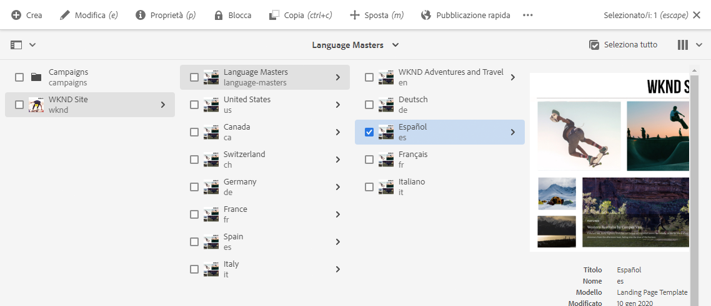
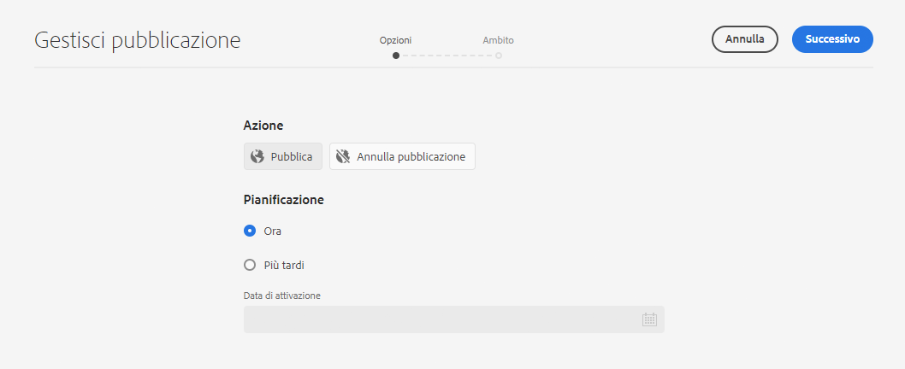
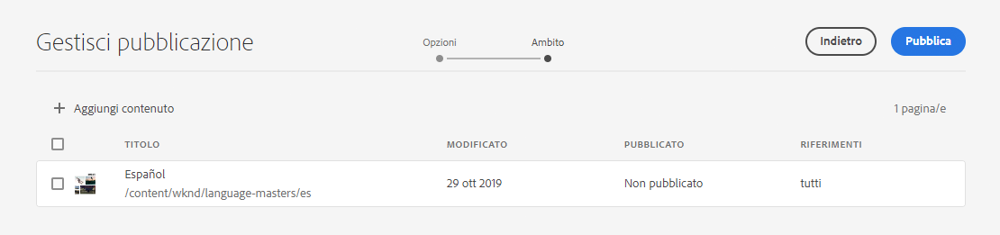
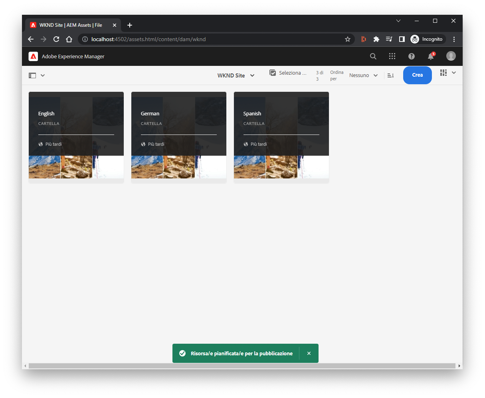
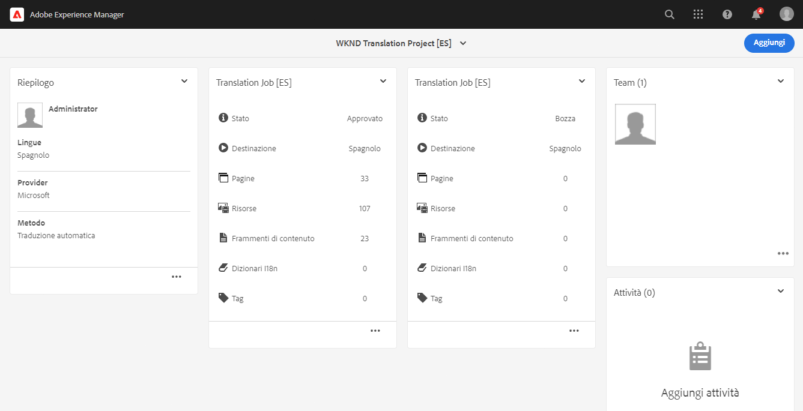
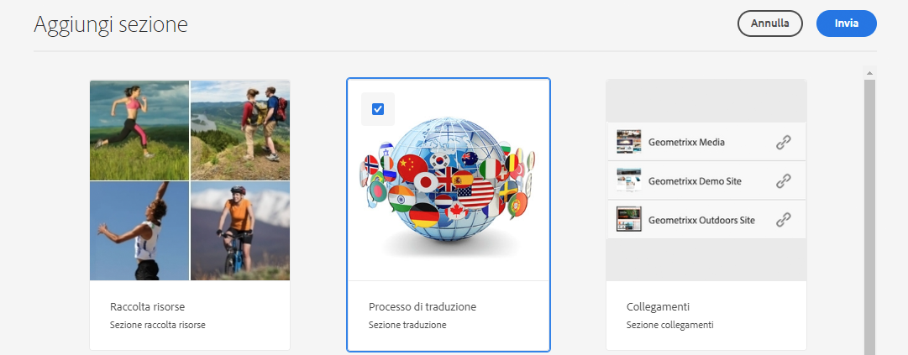
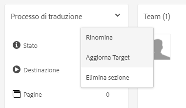
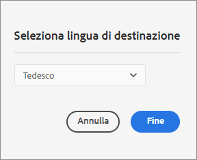

# Pubblicare contenuti tradotti {#publish-content}

Scopri come pubblicare i contenuti tradotti e aggiornare le traduzioni come aggiornamenti dei contenuti.

## La storia finora {#story-so-far}

Nel documento precedente del percorso di traduzione AEM Sites, [Traduci contenuto,](configure-connector.md) hai imparato a utilizzare AEM progetti di traduzione per tradurre i contenuti. Ora dovresti:

* Sapere cos’è un progetto di traduzione.
* Essere in grado di creare nuovi progetti di traduzione.
* Utilizzare i progetti di traduzione per tradurre i contenuti.

Una volta completata la traduzione iniziale, questo articolo illustra il passaggio successivo per la pubblicazione di tale contenuto e le operazioni da eseguire per aggiornare le traduzioni quando il contenuto sottostante nella directory principale della lingua cambia.

## Obiettivo {#objective}

Questo documento spiega come pubblicare contenuti in AEM e come creare un flusso di lavoro continuo per mantenere le traduzioni aggiornate. Dopo aver letto questo documento, dovresti:

* Comprendere il modello di pubblicazione dell’autore di AEM.
* Sapere come pubblicare i contenuti tradotti.
* Essere in grado di implementare un modello di aggiornamento continuo per i contenuti tradotti.

## Modello di pubblicazione dell’autore di AEM {#author-publish}

Prima di pubblicare i contenuti, è utile comprendere il modello di pubblicazione dell’autore di AEM. In parole povere, AEM divide gli utenti del sistema in due gruppi.

1. Coloro che creano e gestiscono il contenuto e il sistema
1. Coloro che utilizzano il contenuto del sistema

AEM è quindi fisicamente separato in due istanze.

1. L’istanza dell’**autore** è il sistema in cui autori e amministratori di contenuti lavorano per creare e gestire i contenuti.
1. L’istanza di **pubblicazione** è il sistema che consegna il contenuto ai consumatori.

Per essere disponibile per il consumo, dopo essere stato creato sull’istanza dell’autore, il contenuto deve essere trasferito nell’istanza di pubblicazione. Il processo di trasferimento dall’autore alla pubblicazione viene chiamato **pubblicazione**.

## Pubblicazione del contenuto tradotto {#publishing}

Quando sei soddisfatto del contenuto tradotto, è necessario pubblicarlo in modo che sia accessibile e utilizzabile. Questa attività di solito non è responsabilità dello specialista della traduzione, ma è documentata qui per illustrare il flusso di lavoro completo.

>[!NOTE]
>
>Generalmente, quando la traduzione è completa, lo specialista delle traduzioni informa i proprietari dei contenuti che le traduzioni sono pronte per la pubblicazione. Quindi i proprietari dei contenuti li pubblicano.
>
>Le seguenti fasi sono fornite per completezza.

Il modo più semplice per pubblicare le traduzioni è passare alla cartella del progetto.

```text
/content/<your-project>/
```

In questo percorso sono presenti sottocartelle per ogni lingua di traduzione e puoi scegliere quale pubblicare.

1. Passa a **Navigazione** > **Sites** > **File** e apri la cartella del progetto.
1. Qui puoi vedere la cartella principale della lingua e tutte le altre cartelle della lingua. Seleziona la lingua o le lingue localizzate da pubblicare.
   
1. Seleziona **Gestisci pubblicazione**.
1. Nella finestra **Gestisci pubblicazione**, assicurati che **Pubblica** sia selezionato automaticamente in **Azione** e che **Adesso** sia selezionato in **Pianificazione**. Seleziona **Avanti**.
   
1. Nella prossima finestra **Gestisci pubblicazione**, conferma che i percorsi corretti siano selezionati. Seleziona **Pubblica**.
   
1. AEM conferma l’azione di pubblicazione con un messaggio a comparsa nella parte inferiore dello schermo.
   

Il contenuto tradotto è ora pubblicato. Ora è possibile accedervi e utilizzarlo.

>[!TIP]
>
>Per pubblicare più traduzioni contemporaneamente, è possibile selezionare più elementi (ovvero cartelle multilingue) durante la pubblicazione.

Quando si pubblicano i contenuti, sono disponibili opzioni aggiuntive, ad esempio per pianificare un’ora di pubblicazione, che vanno oltre l’ambito di questo percorso. Per ulteriori informazioni, consulta la sezione [Risorse aggiuntive](#additional-resources) alla fine del documento.

## Aggiornamento del contenuto tradotto {#updating-translations}

La traduzione è raramente un esercizio occasionale. In genere, al termine della traduzione iniziale, gli autori dei contenuti continuano ad aggiungere e modificare il contenuto nella directory principale della lingua. Questo significa che devi aggiornare anche il contenuto tradotto.

I requisiti specifici del progetto definiscono la frequenza con cui devi aggiornare le traduzioni e quale processo decisionale viene seguito prima di eseguire un aggiornamento. Una volta che hai deciso di aggiornare le traduzioni, il processo in AEM è molto semplice. Poiché la traduzione iniziale era basata su un progetto di traduzione, lo sono anche gli aggiornamenti.

Tuttavia, come in precedenza, il processo varia leggermente se si sceglie di creare il progetto di traduzione automaticamente o manualmente.

### Aggiornamento di un progetto di traduzione creato automaticamente {#updating-automatic-project}

1. Passa a **Navigazione** > **Risorse** > **File**. Ricorda che il contenuto in AEM è memorizzato in `/content`.
1. Seleziona la directory principale della lingua del progetto. In questo caso abbiamo selezionato `/content/wknd/en`.
1. Seleziona il selettore della barra e mostra il pannello **Riferimenti**.
1. Seleziona **Copie per lingua**.
1. Seleziona la casella di spunta delle **Copie in lingua**.
1. Espandi la sezione **Aggiorna copie in lingua** nella parte inferiore del pannello dei riferimenti.
1. Nell’elenco a discesa **Progetto**, seleziona **Aggiungi a un progetto di traduzione esistente**.
1. Nell’elenco a discesa **Progetto di traduzione esistente**, seleziona il progetto creato per la traduzione iniziale.
1. Seleziona **Aggiorna**.


Il contenuto viene aggiunto al progetto di traduzione esistente. Per visualizzare il progetto di traduzione:

1. Passa a **Navigazione** > **Progetti**.
1. Seleziona il progetto appena aggiornato.
1. Seleziona la lingua o una delle lingue aggiornate.

Al progetto è stata aggiunta una nuova scheda di processo. In questo esempio è stata aggiunta un’altra traduzione di lingua spagnola.



Puoi notare che le statistiche elencate sulla nuova scheda sono diverse. Questo perché AEM riconosce ciò che è cambiato dopo l’ultima traduzione e include solo il contenuto che deve essere tradotto. Ciò include la ritraduzione dei contenuti aggiornati e la prima traduzione dei nuovi contenuti.

Da questo punto, [inizia e gestisci il tuo processo di traduzione proprio come hai fatto con l’originale.](translate-content.md#using-translation-project)

### Aggiornamento di un progetto di traduzione creato manualmente {#updating-manual-project}

Per aggiornare una traduzione è possibile aggiungere al progetto esistente un nuovo processo responsabile della traduzione del contenuto aggiornato.

1. Passa a **Navigazione** > **Progetti**.
1. Seleziona il progetto da aggiornare.
1. Seleziona il pulsante **Aggiungi** nella parte superiore della finestra.
1. Nella finestra **Aggiungi riquadro**, seleziona **Lavoro di traduzione** e poi **Invia**.

   

1. Sulla scheda del nuovo lavoro di traduzione, seleziona il pulsante con freccia in alto nella scheda e seleziona **Aggiorna destinazione** per definire la lingua di destinazione del nuovo lavoro.

   

1. Nella finestra di dialogo **Seleziona lingua di destinazione** utilizza l’elenco a discesa per selezionare la lingua e tocca o fai clic su **Fine**.

   

1. Una volta impostata la lingua di destinazione del nuovo processo di traduzione, seleziona il pulsante con i puntini di sospensione nella parte inferiore della scheda del processo per visualizzarne i dettagli.
1. Il processo è vuoto al momento della creazione. Aggiungi contenuto al processo toccando o facendo clic sul pulsante **Aggiungi** e utilizzando il browser del percorso [come in precedenza durante la creazione del progetto di traduzione.](translate-content.md##manually-creating)

>[!TIP]
>
>I potenti filtri del browser del percorso possono essere utili di nuovo per trovare solo il contenuto aggiornato.
>
>Per ulteriori informazioni sul browser percorsi, consulta la [sezione risorse aggiuntive.](#additional-resources)

Da questo punto, [inizia e gestisci il tuo processo di traduzione proprio come hai fatto con l’originale.](translate-content.md#using-translation-project)

## Fine del percorso? {#end-of-journey}

Congratulazioni! Hai completato il percorso di traduzione AEM Sites. Ora dovresti:

* Conoscere le funzioni di base di gestione dei contenuti di AEM.
* Comprendere le funzioni di traduzione di AEM e in che modo si relazionano al contenuto dei siti.
* Essere in grado di iniziare a tradurre i tuoi contenuti.

Ora puoi tradurre i contenuti in AEM. Tuttavia AEM è uno strumento potente e ci sono molte opzioni aggiuntive disponibili. Consulta alcune delle risorse aggiuntive disponibili nella [sezione Risorse aggiuntive](#additional-resources) per ulteriori informazioni sulle funzioni visualizzate in questo percorso.

## Risorse aggiuntive {#additional-resources}

* [Gestione dei progetti di traduzione](/help/sites-cloud/administering/translation/managing-projects.md) - Scopri i dettagli dei progetti di traduzione e le funzioni aggiuntive, come i flussi di lavoro di traduzione umana e i progetti multilingue.
* [Concetti di authoring](/help/sites-cloud/authoring/author-publish.md) - Scopri il modello dell’autore e di pubblicazione di AEM più dettagliatamente. Questo documento si concentra sull’authoring delle pagine anziché sui frammenti di contenuto, ma la teoria è ancora valida.
* [Pubblicazione delle pagine](/help/sites-cloud/authoring/sites-console/publishing-pages.md) - Scopri le funzioni aggiuntive disponibili per la pubblicazione dei contenuti. Questo documento si concentra sull’authoring delle pagine anziché sui frammenti di contenuto, ma la teoria è ancora valida.
* [Ambiente e strumenti di authoring](/help/sites-cloud/authoring/path-selection.md#path-selection) - AEM offre diversi meccanismi per organizzare e modificare i contenuti, tra cui un browser con percorso affidabile.
