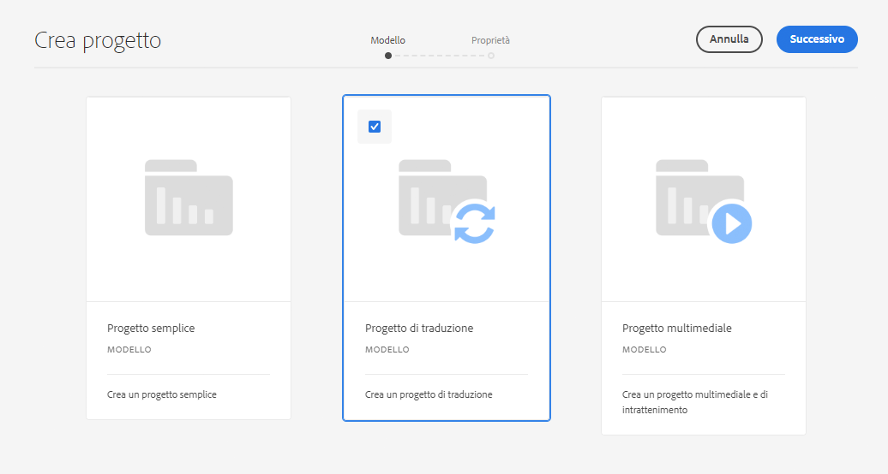

# Tradurre il contenuto {#translate-content}

Utilizza il connettore di traduzione e le regole per tradurre il contenuto.

## La storia finora {#story-so-far}

Nel documento precedente del percorso di traduzione AEM Sites, [Configurare le regole di traduzione](translation-rules.md) hai imparato a utilizzare le regole di traduzione AEM per identificare il contenuto da tradurre. Ora dovresti:

* Comprendere come funzionano le regole di traduzione.
* Essere in grado di definire le tue regole di traduzione.

Ora che le regole del connettore e delle traduzioni sono configurate, questo articolo illustra il passaggio successivo per la traduzione dei contenuti in AEM Sites.

## Obiettivo {#objective}

Questo documento ti aiuta a capire come utilizzare i progetti di traduzione AEM insieme al connettore e le regole di traduzione per tradurre il contenuto. Dopo aver letto questo documento, dovresti:

* Sapere cos’è un progetto di traduzione.
* Essere in grado di creare nuovi progetti di traduzione.
* Utilizza i progetti di traduzione per tradurre il tuo contenuto in AEM Sites.

## Creazione di un progetto di traduzione {#creating-translation-project}

I progetti di traduzione consentono di gestire la traduzione dei contenuti AEM. Un progetto di traduzione raccoglie i contenuti da tradurre in un unico luogo per una visione globale delle attività.

Quando il contenuto è aggiunto a un progetto di traduzione, viene creato un lavoro di traduzione. I processi forniscono i comandi e le informazioni sullo stato, utili per gestire i flussi di lavoro di traduzione umana e automatica che vengono eseguiti sulle risorse.

I progetti di traduzione possono essere creati in due modi:

1. Seleziona la lingua root del contenuto e fai creare automaticamente ad AEM il progetto di traduzione in base al percorso del contenuto.
1. Crea un progetto vuoto e seleziona manualmente il contenuto da aggiungere al progetto di traduzione

Entrambi gli approcci sono validi e di solito si differenziano solo in base alla persona che esegue la traduzione:

* Il TPM (Translation Project Manager) richiede spesso la flessibilità di selezionare manualmente il contenuto nel progetto di traduzione.
* Se il proprietario del contenuto è anche responsabile della traduzione, è spesso più semplice lasciare che AEM crei automaticamente il progetto in base al percorso del contenuto selezionato.

Entrambi gli approcci sono esaminati nelle sezioni seguenti.

### Creazione automatica di un progetto di traduzione in base al percorso del contenuto {#automatically-creating}

Per i proprietari di contenuti che sono anche responsabili della traduzione, spesso è più facile che AEM crei automaticamente il progetto. Per fare in modo che AEM crei automaticamente un progetto di traduzione basato sul percorso del contenuto:

1. Passa a **Navigazione** -> **Sites** quindi tocca o fai clic sul progetto.
1. Individua la lingua root del progetto. Ad esempio, se la lingua root è l&#39;inglese, `/content/<your-project>/en`
   * Tieni presente che prima della prima traduzione le cartelle delle altre lingue sono segnaposto vuoti. Queste vengono normalmente create dall’architetto dei contenuti.
1. Individua la lingua root del progetto.
1. Tocca o fai clic sul selettore della barra e mostra il pannello **Riferimenti**.
1. Tocca o fai clic su **Copie in lingua**.
1. Seleziona la casella di spunta delle **Copie in lingua**.
1. Espandi la sezione **Aggiorna copie in lingua** nella parte inferiore del pannello dei riferimenti.
1. Nel menu a discesa **Progetto**, seleziona **Crea progetto di traduzione**.
1. Fornisci un titolo appropriato per il progetto di traduzione.
1. Tocca o fai clic su **Aggiorna**.


Viene visualizzato un messaggio che informa che il progetto è stato creato.

>[!NOTE]
>
>Si presume che la struttura linguistica necessaria per le lingue di traduzione sia già stata creata come parte della [definizione della struttura del contenuto.](getting-started.md#content-structure) Questo dovrebbe essere fatto in collaborazione con l&#39;architetto dei contenuti.
>
>Se le cartelle della lingua non vengono create in anticipo, non sarà possibile creare copie in lingua come descritto nei passaggi precedenti.

### Creazione manuale di un progetto di traduzione selezionandone il contenuto {#manually-creating}

Per i translation project manager, spesso è necessario selezionare manualmente contenuti specifici da includere in un progetto di traduzione. Per creare un progetto di traduzione manuale di questo tipo, devi iniziare creando un progetto vuoto e quindi selezionare il contenuto da aggiungere.

1. Passa a **Navigazione** -> **Progetti**.
1. Tocca o fai clic su **Crea** -> **Cartella** per creare una cartella per i progetti.
   * Questo è facoltativo, ma utile per organizzare le attività di traduzione.
1. Nella finestra **Crea progetto** aggiungi un **Titolo** per la cartella, quindi tocca o fai clic su **Crea**.

   

1. Tocca o fai clic sulla cartella per aprirla.
1. Nella nuova cartella del progetto, tocca o fai clic su **Crea** -> **Progetto**.
1. I progetti si basano su modelli. Tocca o fai clic sul modello **Progetto di traduzione** per selezionarlo, quindi tocca o fai clic su **Successivo**.

   

1. Sulla scheda **Informazioni base**, immetti un nome per il nuovo progetto.

   

1. Nella scheda **Avanzate**, utilizza il menu a discesa **Lingua target** per selezionare le lingue in cui tradurre il contenuto. Tocca o fai clic su **Crea**.

   

1. Tocca o fai clic su **Apri** nella finestra di conferma.

   

Il progetto è stato creato, ma non contiene alcun contenuto da tradurre. Nella sezione successiva viene illustrato come è strutturato il progetto e come aggiungere contenuti.

## Utilizzo di un progetto di traduzione {#using-translation-project}

I progetti di traduzione sono progettati per raccogliere tutti i contenuti e le attività relativi a una traduzione in un unico luogo per rendere la traduzione semplice e facile da gestire.

Per visualizzare il progetto di traduzione:

1. Passa a **Navigazione** -> **Progetti**.
1. Tocca o fai clic sul progetto creato nella sezione precedente (o [Creazione automatica di un progetto di traduzione in base al percorso del contenuto](#automatically-creating) o [Creazione manuale di un progetto di traduzione selezionandone il contenuto](#manually-creating) a seconda della tua situazione).


Il progetto è diviso in più schede.

* **Riepilogo**: questa scheda mostra le informazioni di intestazione di base del progetto, inclusi il proprietario, la lingua e il provider di traduzione.
* **Lavoro di traduzione**: questa scheda o queste schede mostrano una panoramica del lavoro di traduzione effettivo, compreso lo stato, il numero di risorse, ecc. In genere esiste un lavoro per lingua con il codice della lingua ISO-2 aggiunto al nome del processo.
   * Tieni presente che quando [crea automaticamente i lavori di traduzione,](#automatically-creating) AEM lo fa in modo asincrono e potrebbero non essere visualizzati immediatamente all’interno del progetto.
* **Team**: questa scheda mostra gli utenti che stanno collaborando a questo progetto di traduzione. Questo percorso non tratta questo argomento.
* **Attività**: attività aggiuntive associate alla traduzione del contenuto, ad esempio per eseguire elementi o elementi del flusso di lavoro. Questo percorso non tratta questo argomento.

Per comprendere meglio il flusso di traduzione in AEM, è utile apportare una modifica alle impostazioni del progetto. Questo passaggio non è necessario per le traduzioni di produzione, ma aiuta a comprendere il processo.

1. Nella scheda **Riepilogo** tocca o fai clic sul pulsante con i puntini di sospensione nella parte inferiore della scheda.
1. Nellla scheda **Avanzate**, deseleziona l’opzione **Elimina lancio dopo la promozione**.

   

1. Tocca o fai clic su **Salva e chiudi**.

Ora puoi utilizzare il tuo progetto di traduzione. La modalità di utilizzo di un progetto di traduzione dipende da come è stato creato: automaticamente tramite AEM o manualmente.

### Utilizzo di un progetto di traduzione creato automaticamente {#using-automatic-project}

Quando crei automaticamente il progetto di traduzione, AEM valuta il contenuto nel percorso selezionato in base alle regole di traduzione definite in precedenza. Sulla base di tale valutazione, estrae il contenuto che richiede la traduzione in un nuovo progetto di traduzione.

Per visualizzare i dettagli del contenuto incluso in questo progetto:

1. Tocca o fai clic sul pulsante con i puntini di sospensione nella parte inferiore della scheda **Lavoro di traduzione**.
1. Nella finestra **Lavoro di traduzione** vengono elencati tutti gli elementi del lavoro.

   

1. Tocca o fai clic su una riga per visualizzarne i dettagli, tenendo presente che può rappresentare più elementi di contenuto da tradurre.
1. Tocca o fai clic sulla casella di spunta della selezione di un elemento per visualizzare ulteriori opzioni, ad esempio l’opzione per eliminarlo dal lavoro o visualizzarlo nella console Sites.

   

In genere il contenuto del lavoro di traduzione inizia nello stato **Bozza** come indicato dalla colonna **Stato** nella finestra **Lavoro di traduzione**.

Per avviare il lavoro di traduzione, torna alla panoramica del progetto di traduzione e tocca o fai clic sul pulsante con la freccia nella parte superiore della scheda **Processo di traduzione** e seleziona **Avvia**.


AEM ora comunica con la configurazione di traduzione e il connettore per inviare il contenuto al servizio di traduzione. Per visualizzare l’avanzamento della traduzione, torna alla finestra **Lavoro di traduzione** e controlla la colonna **Stato** delle voci.


Le traduzioni automatiche risultano automaticamente con lo stato **Approvato**. La traduzione umana consente una maggiore interazione, ma va oltre lo scopo di questo percorso.

>[!TIP]
>
>L&#39;elaborazione di un lavoro di traduzione può richiedere un po&#39; di tempo e potresti vedere gli elementi di traduzione spostarsi dallo stato di **Bozza** a **Traduzione in corso** a **Pronto per la revisione** prima che arrivino allo stato **Approvato**. Questo è normale.

>[!NOTE]
>
>Se non hai disattivato l’opzione di progetto **Elimina lancio dopo la promozione** come [descritto nella sezione precedente,](#using-translation-project) gli elementi tradotti verranno visualizzati con lo stato **Eliminato**. Questo è normale in quanto AEM scarta automaticamente i record di traduzione una volta che arrivano gli elementi tradotti. Gli elementi tradotti sono stati importati come copie in lingua, solo i record di traduzione sono stati cancellati in quanto non sono più necessari.
>
>Non preoccuparti se non ti è chiaro. Questi sono dettagli approfonditi sul funzionamento di AEM e non influiscono sulla tua comprensione del processo. Per informazioni più approfondite su come AEM elabora le traduzioni, consulta la sezione [Risorse aggiuntive](#additional-resources) alla fine di questo articolo.

### Utilizzo di un progetto di traduzione creato manualmente {#using-manual-project}

Quando crei manualmente un progetto di traduzione, AEM crea i lavori necessari, ma non seleziona automaticamente alcun contenuto da includervi. Questo consente al project manager di traduzione di scegliere il contenuto da tradurre.

Per aggiungere contenuto a un lavoro di traduzione:

1. Tocca o fai clic sul pulsante con i puntini di sospensione nella parte inferiore di una delle schede **Lavoro di traduzione**.
1. Vedi che il lavoro non presenta contenuto. Tocca o fai clic sul pulsante **Aggiungi** nella parte superiore della finestra e quindi **Risorse/Pagine** dal menu a discesa.

   

1. Viene visualizzato un browser del percorso che consente di selezionare in modo specifico quale contenuto aggiungere. Individua il contenuto e tocca o fai clic per selezionarlo.

   

1. Tocca o fai clic su **Seleziona** per aggiungere il contenuto al lavoro.
1. Nella finestra di dialogo **Traduci**, specifica **Crea copia in lingua**.

   

1. Il contenuto è ora incluso nel lavoro.

   

1. Tocca o fai clic sulla casella di spunta della selezione di un elemento per visualizzare ulteriori opzioni, ad esempio l’opzione per eliminarlo dal lavoro o visualizzarlo nella console Sites.

   

1. Ripeti questi passaggi per includere nel lavoro tutto il contenuto necessario.

>[!TIP]
>
>Il browser del percorso è un potente strumento che consente di cercare, filtrare e navigare nel contenuto. Tocca o fai clic sul pulsante **Solo contenuto/Filtri** per attivare/disattivare il pannello laterale e visualizzare filtri avanzati, ad esempio **Data di modifica** o **Stato della traduzione**.
>
>Scopri di più sul browser del percorso nella [sezione Risorse aggiuntive.](#additional-resources)

Puoi utilizzare i passaggi precedenti per aggiungere il contenuto necessario a tutte le lingue (lavori) per il progetto. Dopo aver selezionato tutti i contenuti, puoi avviare la traduzione.

In genere il contenuto del lavoro di traduzione inizia nello stato di **Bozza** come indicato dalla colonna **Stato** nella finestra **Lavoro di traduzione**.

Per avviare il lavoro di traduzione, torna alla panoramica del progetto di traduzione e tocca o fai clic sul pulsante con la freccia nella parte superiore della scheda **Processo di traduzione** e seleziona **Avvia**.


AEM ora comunica con la configurazione di traduzione e il connettore per inviare il contenuto al servizio di traduzione. Per visualizzare l’avanzamento della traduzione, torna alla finestra **Lavoro di traduzione** e controlla la colonna **Stato** delle voci.


Le traduzioni automatiche risultano automaticamente con lo stato **Approvato**. La traduzione umana consente una maggiore interazione, ma va oltre lo scopo di questo percorso.

>[!TIP]
>
>L&#39;elaborazione di un lavoro di traduzione può richiedere un po&#39; di tempo e potresti vedere gli elementi di traduzione spostarsi dallo stato di **Bozza** a **Traduzione in corso** a **Pronto per la revisione** prima che arrivino allo stato **Approvato**. Questo è normale.

>[!NOTE]
>
>Se non hai disattivato l’opzione di progetto **Elimina lancio dopo la promozione** come [descritto nella sezione precedente,](#using-translation-project) gli elementi tradotti verranno visualizzati con lo stato **Eliminato**. Questo è normale in quanto AEM scarta automaticamente i record di traduzione una volta che arrivano gli elementi tradotti. Gli elementi tradotti sono stati importati come copie in lingua, solo i record di traduzione sono stati cancellati in quanto non sono più necessari.
>
>Non preoccuparti se non ti è chiaro. Questi sono dettagli approfonditi sul funzionamento di AEM e non influiscono sulla tua comprensione del processo. Per informazioni più approfondite su come AEM elabora le traduzioni, consulta la sezione [Risorse aggiuntive](#additional-resources) alla fine di questo articolo.

## Revisione dei contenuti tradotti {#reviewing}

[Come visto in precedenza,](#using-translation-project) il contenuto tradotto automaticamente torna in AEM con lo stato **Approvato** poiché si presume che, poiché si utilizza la traduzione automatica, non sia necessario alcun intervento umano. Tuttavia è ancora possibile rivedere il contenuto tradotto.

Basta andare al lavoro di traduzione completato e selezionare una riga toccando o facendo clic sulla casella di spunta. L&#39;icona **Anteprima in Sites** è nella barra degli strumenti.


Tocca o fai clic su tale icona per aprire il contenuto tradotto nella console per visualizzarne i dettagli.


Puoi modificare ulteriormente il contenuto tradotto, purché tu disponga delle autorizzazioni necessarie, ma la modifica del contenuto va oltre lo scopo di questo percorso. Consulta la sezione [Risorse aggiuntive](#additional-resources) alla fine di questo documento per ulteriori informazioni su questo argomento.

Lo scopo del progetto è quello di raccogliere tutte le risorse relative a una traduzione in un unico luogo per un accesso facile e una panoramica chiara. Tuttavia, come puoi vedere visualizzando i dettagli di un elemento tradotto, le traduzioni stesse scorrono nuovamente nella cartella Sites della lingua di traduzione. In questo esempio la cartella è

```text
/content/<your-project>/es
```

Se passi a questa cartella tramite **Navigazione** -> **Sites**, vengono visualizzati i contenuti tradotti.


Il Translation Framework AEM riceve le traduzioni dal connettore e quindi crea automaticamente la struttura del contenuto in base alla lingua root, utilizzando le traduzioni fornite.

È importante comprendere che questo contenuto non è pubblicato e quindi non è disponibile per il consumo. Impareremo a conoscere questa struttura autore-pubblicazione e vedremo come pubblicare i nostri contenuti tradotti nel prossimo passaggio del percorso di traduzione.

## Traduzione manuale {#human-translation}

Se il servizio di traduzione fornisce una traduzione umana, il processo di revisione presenta più opzioni. Ad esempio, le traduzioni arrivano nuovamente nel progetto con lo stato **Bozza** e devono essere riviste e approvate o rifiutate manualmente.

La traduzione umana va oltre lo scopo di questo percorso di localizzazione. Consulta la sezione [Risorse aggiuntive](#additional-resources) alla fine di questo documento per ulteriori informazioni su questo argomento. Tuttavia, oltre alle opzioni di approvazione aggiuntive, il flusso di lavoro per le traduzioni umane è lo stesso delle traduzioni automatiche descritto in questo percorso.

## Novità {#what-is-next}

Ora che hai completato questa parte del percorso di traduzione di AEM Sites, dovresti:

* Sapere cos’è un progetto di traduzione.
* Essere in grado di creare nuovi progetti di traduzione.
* Utilizzare i progetti di traduzione per tradurre i contenuti.

Approfondisci questo argomento e continua il tuo percorso di traduzione in AEM Sites consultando il documento successivo [Pubblicare contenuti tradotti](publish-content.md) dove imparerai a pubblicare i contenuti tradotti e come aggiornare tali traduzioni man mano che il contenuto della lingua root cambia.

## Risorse aggiuntive {#additional-resources}

Sebbene sia consigliabile passare alla parte successiva del processo di traduzione consultando il documento [Pubblicare i contenuti tradotti,](publish-content.md) le seguenti sono alcune risorse aggiuntive e opzionali che approfondiscono alcuni concetti menzionati in questo documento, ma non sono necessarie per continuare il percorso.

* [Gestione dei progetti di traduzione](/help/sites-cloud/administering/translation/managing-projects.md): scopri i dettagli dei progetti di traduzione e le funzioni aggiuntive, come i flussi di lavoro di traduzione umana e i progetti multilingue.
* [Strumenti e ambiente di authoring](/help/sites-cloud/authoring/fundamentals/environment-tools.md##path-selection): AEM offre diversi meccanismi per organizzare e modificare i contenuti, tra cui un browser del percorso affidabile.
