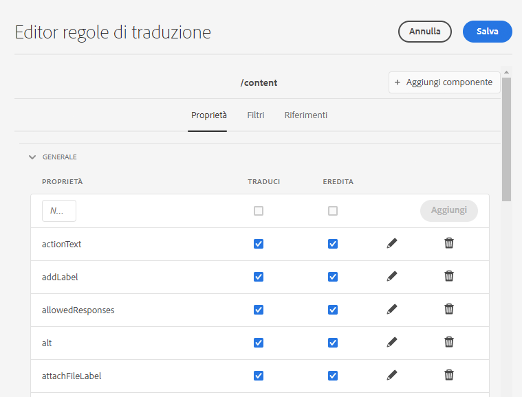

# Configurare le regole di traduzione {#configure-translation-rules}

Scopri come definire le regole di traduzione per identificare i contenuti per la traduzione.

## La storia finora {#story-so-far}

Nel documento precedente del percorso di traduzione AEM Sites, [Configurare il connettore di traduzione](configure-connector.md), hai imparato a installare e configurare il connettore di traduzione e ora dovresti:

* Comprendere i parametri importanti del framework di integrazione della traduzione in AEM.
* Essere in grado di impostare la propria connessione al servizio di traduzione.

Ora che il connettore è configurato, questo articolo illustra il passaggio successivo per identificare il contenuto da tradurre.

## Obiettivo {#objective}

Questo documento ti aiuta a capire come utilizzare le regole di traduzione di AEM per identificare il contenuto per la traduzione. Dopo aver letto questo documento, dovresti:

* Comprendere come funzionano le regole di traduzione.
* Essere in grado di definire le tue regole di traduzione.

## Regole di traduzione {#translation-rules}

Le pagine AEM Sites possono contenere molte informazioni. A seconda delle esigenze del progetto, è probabile che non tutte le informazioni all’interno di una pagina debbano essere tradotte.

Le regole di traduzione identificano il contenuto incluso o escluso nei progetti di traduzione. Quando il contenuto viene tradotto, AEM estrae o raccoglie il contenuto in base a queste regole. In questo modo solo il contenuto da tradurre viene inviato al servizio di traduzione.

Le regole di traduzione includono le seguenti informazioni:

* Percorso del contenuto a cui si applica la regola
   * La regola si applica anche ai discendenti del contenuto
* Nomi delle proprietà che contengono il contenuto da tradurre
   * La proprietà può essere specifica per un tipo di risorsa specifica o per tutti i tipi di risorsa

AEM crea automaticamente regole di traduzione per le pagine dei siti, ma poiché i requisiti di ciascun progetto sono diversi, è importante sapere come rivedere e adattare le regole in base alle esigenze del progetto.

## Creazione di regole di traduzione {#creating-rules}

È possibile creare più regole per supportare requisiti di traduzione complessi. Ad esempio, un progetto su cui si sta lavorando richiede la traduzione di tutte le informazioni di pagina, ma in un’altra pagina è necessario tradurre solo le descrizioni mentre i titoli non vengono tradotti.

Le regole di traduzione sono progettate per gestire tali scenari. Tuttavia, in questo esempio viene illustrato come creare regole concentrandosi su una configurazione semplice e singola.

Una console **Configurazione della traduzione** è disponibile per la configurazione delle regole di traduzione.

Per accedervi:

1. Passa a **Strumenti** -> **Generale**.
1. Tocca o fai clic su **Configurazione della traduzione**.

AEM crea automaticamente le regole di traduzione per tutto il contenuto. Per visualizzare queste regole:

1. Seleziona il contesto `/content` e quindi l’opzione **Modifica** dalla barra degli strumenti.
1. Si apre l’Editor regole di traduzione con le regole AEM create automaticamente per il percorso `/content`.

   

1. Le proprietà di pagina tradotte si trovano sotto **Generale** dell&#39;elenco. È possibile aggiungere o aggiornare i nomi di proprietà esistenti che si desidera includere esplicitamente nella traduzione.
   1. Immetti il nome della proprietà nel campo **Nuova proprietà**.
   1. Le opzioni **Traduci** e **Eredita** vengono controllate automaticamente.
   1. Tocca o fai clic su **Avanti**.
   1. Ripeti questi passaggi per tutti i campi da tradurre.
   1. Tocca o fai clic su **Salva**.

Hai configurato le regole di traduzione.

>[!NOTE]
>
>AEM crea automaticamente le regole di traduzione. Per una configurazione di traduzione semplice o per testare un flusso di lavoro di traduzione, non è necessario creare nuove regole né modificare le regole esistenti create automaticamente. I dettagli di questi passaggi vengono presentati per spiegare come funzionano le regole e per dare contesto al modo in cui AEM elabora le traduzioni.

>[!TIP]
>
>È inoltre possibile creare regole solo per il percorso o il progetto in questione toccando o facendo clic sul pulsante **Aggiungi contesto** nella console Configurazione di traduzione. Questo va oltre il campo di applicazione del percorso.

## Utilizzo avanzato {#advanced-usage}

È possibile configurare una serie di proprietà aggiuntive come parte delle regole di traduzione. Inoltre, è possibile specificare le regole manualmente come XML, il che consente maggiore specificità e flessibilità.

Tali funzioni generalmente non sono necessarie per iniziare a localizzare il contenuto ma, se sei interessato, puoi avere maggiori informazioni nella sezione [Risorse aggiuntive](#additional-resources).

## Novità {#what-is-next}

Ora che hai completato questa parte del percorso di traduzione di AEM Sites, dovresti:

* Comprendere come funzionano le regole di traduzione.
* Essere in grado di definire le tue regole di traduzione.

Sviluppa questa conoscenza e continua il tuo percorso di traduzione AEM Sites esaminando il documento successivo [Tradurre il contenuto](translate-content.md) dove scoprirai come il connettore e le regole lavorano insieme per tradurre i contenuti.

## Risorse aggiuntive {#additional-resources}

Sebbene sia raccomandato passare alla parte successiva del percorso di traduzione rivedendo il documento [Tradurre il contenuto,](translate-content.md) di seguito sono riportate alcune risorse aggiuntive facoltative che approfondiscono alcuni concetti menzionati in questo documento. Tali risorse non è necessario che continuino sul percorso.

* [Identificazione del contenuto da tradurre](/help/sites-cloud/administering/translation/rules.md) - Scopri come le regole di traduzione identificano i contenuti da tradurre.
