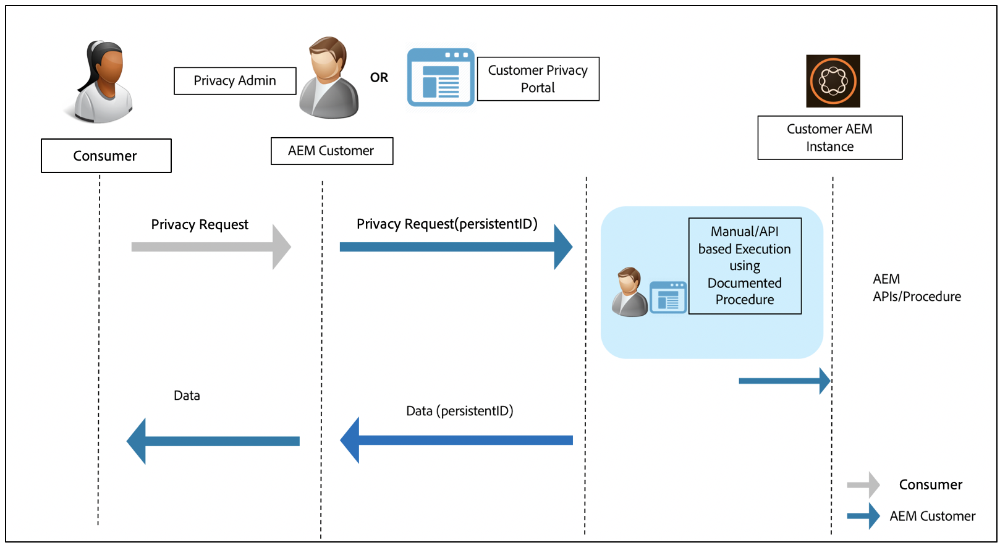

# Adobe Experience Manager come servizio cloud per la protezione dei dati e le normative sulla privacy {#aem-readiness-for-data-protection-and-data-privacy-regulations}

>[!WARNING]
>
>Il contenuto del presente documento non costituisce consulenza giuridica e non è inteso come sostituto della consulenza legale.
>
>Consulta l&#39;ufficio legale della tua azienda per consigli in merito alle normative sulla protezione dei dati e sulla privacy dei dati.

>[!NOTE]
>
>Per ulteriori informazioni sulla risposta di Adobe ai problemi di privacy e sul significato che questo comporta per voi in quanto clienti Adobe, consultate il Centro [per la privacy di](https://www.adobe.com/privacy.html)Adobe.

Adobe sta fornendo documentazione e procedure (con API quando disponibili), all&#39;amministratore della privacy del cliente o all&#39;amministratore AEM per gestire le richieste di protezione dei dati e privacy dei dati e aiutare i nostri clienti a conformarsi a queste normative. Le procedure documentate consentiranno ai clienti di eseguire le richieste normative manualmente o chiamando le API, se disponibili, da un portale o servizio esterno.

>[!CAUTION]
>
>I dettagli qui documentati sono limitati ad Adobe Experience Manager come servizio Cloud.
>
>I dati provenienti da un altro servizio Adobe On-demand, insieme a tutte le relative richieste di privacy, richiederanno l&#39;adozione di misure per tale servizio.
>
>Per ulteriori informazioni, vedere il Centro [per la privacy di](https://www.adobe.com/privacy.html)Adobe.

## Introduzione {#introduction}

Le istanze di Adobe Experience Manager come servizio Cloud e le applicazioni che le eseguono sono di proprietà e gestite dai nostri clienti.

Di conseguenza, le normative sulla protezione dei dati, come il GDPR, l&#39;CCPA e altri, sono in gran parte responsabilità dei clienti.

Per una breve introduzione, le norme sulla privacy e la protezione dei dati comprendono nuove regole da seguire per:

* Entità commerciali (CCPA) e/o controllori dati (GDPR)

* Fornitori di servizi (CCPA) e/o processori di dati (GDPR)

Le disposizioni principali di tali regolamenti sono:

1. Definizione estesa di dati personali per includere tutti gli ID univoci; come in dati direttamente e indirettamente identificabili.

2. Requisiti di consenso rafforzati.

3. Maggiore attenzione ai diritti di eliminazione (Data Erasure).

4. Rifiuto della vendita di dati.

Per Adobe Experience Manager come servizio Cloud:

* Le istanze e le applicazioni che vengono eseguite su di esse sono di proprietà e gestite dal cliente.

   * Ciò significa che il cliente gestisce i ruoli normativi, tra cui Business Entities e Service Provider, Data Controller e Data Processor, tra gli altri.

   * Il servizio Adobe Experience Platform Privacy Service non farà parte del flusso di lavoro per AEM, come illustrato nel diagramma seguente.

* AEM include la documentazione e le procedure che l&#39;amministratore della privacy del cliente e/o l&#39;amministratore AEM devono seguire per eseguire le richieste di informativa sulla privacy; manualmente o tramite API, se disponibili.

* Nessun nuovo servizio o interfaccia utente aggiunto.

   * Le procedure e le API sono invece documentate per l&#39;utilizzo da parte dell&#39;interfaccia utente/portali del cliente che gestisce le richieste di informativa sulla privacy.

* AEM non includerà alcuno strumento fornito per supportare il flusso di lavoro delle richieste di privacy.

   * Adobe fornirà la documentazione e le procedure per l&#39;amministratore della privacy del cliente e/o per l&#39;amministratore AEM, consentendo loro di eseguire manualmente le richieste relative alle normative sulla privacy.

Adobe sta fornendo procedure per la gestione delle richieste di privacy relative ad Accesso, Eliminazione e Rifiuto per Adobe Experience Manager come servizio Cloud. In alcuni casi, sono disponibili delle API che possono essere richiamate da un portale sviluppato dal cliente o da script per facilitare l&#39;automazione.

Nel diagramma seguente è illustrato l’aspetto di un flusso di lavoro per la richiesta di privacy (illustrato utilizzando Adobe Experience Manager 6.5):

## Adobe Experience Manager come servizio cloud e preparazione normativa {#aem-as-a-cloud-service-and-regulatory-readiness}

Consulta le sezioni seguenti per la documentazione di regolamentazione per le aree di prodotti di AEM come servizio cloud.

## Adobe Experience Manager come Cloud Service Foundation {#aem-foundation}

Consulta [AEM Foundation Ready for Data Protection and Data Privacy Regulations](/help/onboarding/data-privacy-and-protection-readiness/foundation-readiness.md).

## Adobe Experience Manager come sito di servizi cloud {#aem-sites}

Consulta [AEM Sites Readiness for Data Protection and Data Privacy Regulations (Preparazione dei siti AEM per la protezione dei dati e le normative sulla privacy dei dati).](/help/onboarding/data-privacy-and-protection-readiness/sites-readiness.md)

## Adobe Experience Manager come integrazione dei servizi cloud con Adobe Target e Adobe Analytics {#aem-integration-with-adobe-target-adobe-analytics}

Queste integrazioni di Adobe Experience Manager come servizio cloud si integrano con i servizi di protezione dei dati e privacy (ad esempio, GDPR). Nessun dato personale di Adobe Target o Adobe Analytics viene memorizzato in AEM in relazione alle integrazioni.
Per ulteriori informazioni, consulta:

* [Adobe Target - Panoramica sulla privacy](https://docs.adobe.com/content/help/en/target/using/implement-target/before-implement/privacy/privacy.html)

* [Flusso di lavoro sulla privacy dei dati di Adobe Analytics](https://docs.adobe.com/content/help/en/analytics/admin/data-governance/an-gdpr-workflow.html)
